# 如何在 TypeScript 中使用命名参数

> 原文：<https://betterprogramming.pub/named-parameters-in-typescript-e32c763d2b2e>

## 破解函数以获得命名参数

Max Kleinen 在 [Unsplash](https://unsplash.com/) 上拍摄的照片。

尽管从技术上讲，TypeScript(或 JavaScript)中没有命名参数这种东西，但这种语言提供了一种语法，使得使用非常相似的功能成为可能！

命名的争论使生活变得更加容易。它们允许你玩函数参数，就像你玩拼字游戏中的字母一样。只要指定参数的名称，就可以按任何顺序传递任何参数。

或者如果你喜欢更正式的定义:

> "[命名参数是]计算机语言对函数调用的支持，它清楚地说明了函数调用中每个**参数**的**名称**。"— [维基百科](https://en.wikipedia.org/wiki/Named_parameter)

一些编程语言(例如 Kotlin/Python/C#)支持这种现成的功能。在 TypeScript 中，我们可以模拟这种行为。在这篇文章中，你将学会如何做！

# 为什么我们需要命名参数？

想象我们有一个函数:

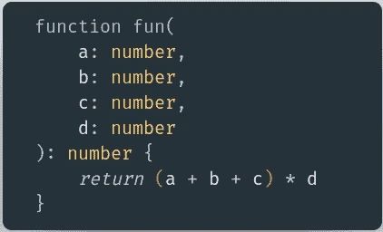

我们通过以下方式调用它:

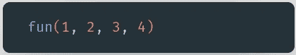

但是如果我们只想得到一个总数呢？我们必须用所有的参数来调用它，尽管最后两个参数无关紧要！

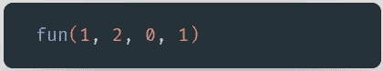

我们可以将参数`c`和`d`标记为可选参数:

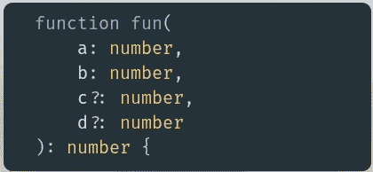

但是这个函数的实现需要一些修改才能正常工作(处理`undefined`值)。

不过，有一个更好的解决方案:我们可以使用默认参数:

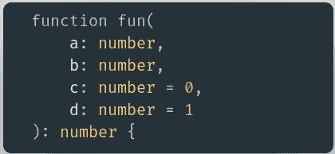

这样，即使我们不提供最后两个参数，该函数也能按预期工作:

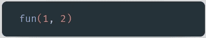

太好了！但是如果我们想把总和乘以 4 呢？同样，我们必须传递所有参数…

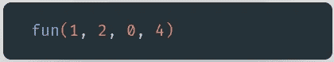

我们能做得更好吗？当然可以，在“命名参数”的帮助下。

# 如何使用它们

让我们修改最后一个函数签名的代码片段:

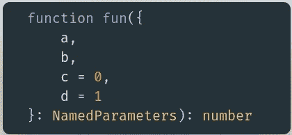

现在我们传递一个对象而不是四个参数。此外，我们用`c`和`d`作为可选值来指定对象的接口:

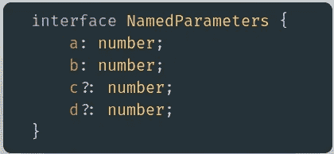

现在该函数的调用看起来更清晰了:

我们通过名称来指定参数。它使代码更加冗长，但是更加灵活。

让我们回忆一下乘以四的例子。现在真的很简单！

# **现实生活中的例子(React + Jest)**

您可能想知道这种功能在哪里有用。我经常用它来测试 React 组件。

库组件使用大量可选的`props`是很常见的。想象一下，我们有自己的一个`DatePicker`组件的实现，它需要四个`props`(比原来的`[react-datepicker](https://reactdatepicker.com/)`少十倍**，而原来的`[react-datepicker](https://reactdatepicker.com/)`有[超过 50 个道具](https://github.com/Hacker0x01/react-datepicker/blob/master/docs/datepicker.md))。**

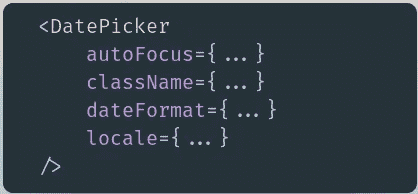

如果我们想测试它，我们必须在每一次测试中安装组件:

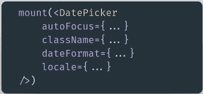

幸运的是，我们刚刚了解了命名参数是什么。

为了保持代码简洁，我们可以提取一个带有可选值的对象的函数:

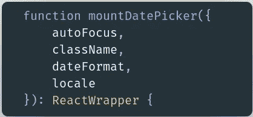

现在安装组件非常简单明了:

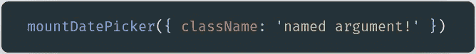

这正是 TypeScript 中的命名参数模式真正闪光的地方。

感谢阅读！