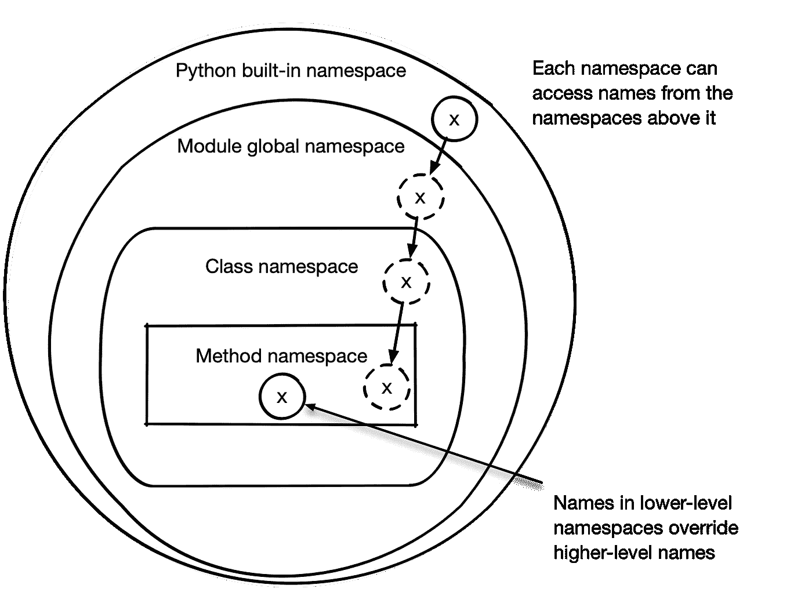

# Python 中的命名空间

> 原文：<https://betterprogramming.pub/namespacing-with-python-79574d125564>

## 探索名称空间以及 Python 如何使用它们来帮助改进代码


马库斯·斯皮斯克在 [Unsplash](https://unsplash.com/s/photos/name?utm_source=unsplash&utm_medium=referral&utm_content=creditCopyText) 上拍摄的照片

# **命名空间**

与许多编程语言一样，Python 通过*名称空间*的概念隔离代码。当程序运行时，它跟踪所有已知的名称空间以及这些名称空间中可用的信息。

名称空间在几个方面很有帮助:

*   随着软件的增长，多个概念需要相似或相同的名称。
*   名称空间有助于最小化冲突，使每个名称所指的概念变得清晰。
*   随着软件的增长，知道哪个代码已经在代码库中变得更加困难。名称空间帮助您对代码可能存在的位置做出有根据的猜测。
*   当向大型代码库添加新代码时，现有的名称空间可以指导新代码应该位于何处。如果没有明显的选择，一个新的名称空间可能是合适的。

名称空间非常重要，以至于它们被包含在 Python 的禅宗中(如果您不熟悉 Python 的禅宗，请尝试启动 Python 解释器并键入`import this`)。

> *“名称空间是一个非常棒的想法——让我们做更多这样的事情吧！”—*Python 的禅

你在 Python 中使用过的所有变量、函数和类都是这个或那个名称空间中的*名*。名字是类似于`x`或`total`或`EssentialBusinessDomainObject`的东西，它们是对某事物的引用。

当你的 Python 代码说`x = 3`时，它的意思是，“将值 3 赋给名字`x`，然后你可以在你的代码中引用`x`。

“变量”一词可以与表示值的名称互换使用，尽管在 Python 中名称可以表示函数、类等等。

# **命名空间和 I** `mport` **语句**

当您第一次打开 Python 解释器时，内置名称空间中会填充 Python 内置的所有内容。Python 内置名称空间包含内置函数，如`print()`和`open()`。

这些内置的没有前缀，你不需要做任何特殊的事情来使用它们。Python 让您可以在代码中的任何地方使用它们。这就是为什么 Python 中著名的简单`print('Hello world!')` Just Works。

与某些语言不同，您不会在 Python 代码中显式地创建名称空间，但是您的代码结构会影响创建什么名称空间以及它们如何交互。

例如，创建一个 Python *模块*会自动为该模块创建一个额外的名称空间。最简单地说，Python 模块是一个包含一些代码的`.py`文件。

例如，一个名为`sales_tax.py`的文件就是“这个`sales_tax`模块”:

```
# sales_tax.py

 **def add_sales_tax**(total, tax_rate):
     **return** total * tax_rate
```

每个模块都有一个全局名称空间，模块中的代码可以自由访问。没有嵌套的函数、类和变量位于模块的全局名称空间中:

❶ `TAX_RATES_BY_STATE`在模块的全局名称空间中。

模块中的❷代码可以毫不费力地使用`TAX_RATES_BY_STATE`。

模块中的函数和类也有一个只有它们可以访问的*本地*名称空间:

❶ `tax_rate`只在`add_sales_tax()`的局部范围内。

`add_sales_tax()`中的❷代码可以毫不费力地使用`tax_rate`。

想要使用另一个模块的变量、函数或类的模块必须*将它导入*到它的全局名称空间中。导入是一种将名称从其他地方拉入所需名称空间的方式。

❶`add_sales_tax`函数被添加到`receipt`全局名称空间中。

❷ `add_sales_tax`仍然从它自己的名称空间知道`TAX_RATES_BY_STATE`和`tax_rate`。

要引用 Python 中的变量、函数或类，必须满足以下条件之一:

1.  该名称位于 Python 内置名称空间中。
2.  该名称是当前模块的全局名称空间。
3.  该名称位于代码的本地命名空间的当前行中。

冲突名称的优先级以相反的顺序工作；本地名称覆盖全局名称，全局名称覆盖内置名称。

您可以记住这一点，因为一般来说，最特定于当前代码的定义是被使用的定义。这如图 1 所示。



**图一。**名称空间的特异性

在您使用 Python 的冒险经历中，您可能曾经见过一个`NameError: name 'my_var' is not defined`。这意味着在该代码已知的任何名称空间中都找不到名称`my_var`。

这通常意味着你从未给`my_var`赋值，或者你在别的地方赋值了，需要导入它。

模块是开始分解代码的好方法；如果你有一个长的`script.py`包含一堆不相关的函数，考虑将这些函数分解成模块。

# 进口的许多面具

Python 中的导入语法初看起来很简单，但是有几种方法可以实现，每种方法都会导致引入名称空间的信息有细微的差别。

之前，您将`add_sales_tax()`功能从`sales_tax`模块导入到`receipt`模块:

```
# receipt.py

 from sales_tax import add_sales_tax
```

这将把`add_sales_tax()`函数添加到`receipt`模块的全局名称空间中。

这一切都很好，但是假设您给`sales_tax`增加了十个函数，并且想在`receipt`中使用它们。如果你继续沿着同一条路走下去，你会得到这样的结果:

```
# receipt.py

 **from** sales_tax **import** add_sales_tax, add_state_tax, add_city_tax, add_local_millage_tax, ...
```

这是一个替代语法，对其进行了一点改进:

还是不太好。当您需要另一个模块的大量功能时，您可以完全导入该模块:

```
# receipt.py

 **import** sales_tax
```

这将整个`sales_tax`模块添加到当前名称空间，并且可以用前缀`sales_tax.`引用它的函数:

这有利于避免长的`import`语句，前缀有助于避免名称空间冲突。

# **通配符导入**

Python 允许您使用`from themodule import *`以速记方式从模块中导入所有名称。在你的代码中用这个代替前缀`themodule.`很诱人，但是*请不要*！

通配符导入会导致更多的名称冲突，因为您看不到被导入的显式名称，这使得问题难以调试。坚持显式导入！

本文到此为止。如果你想了解更多关于这本书的内容，可以在 [liveBook](https://livebook.manning.com/book/practices-of-the-python-pro/?utm_source=freecontentcenter&utm_medium=website&utm_campaign=book_practicesofthepythonpro&utm_content=article_01) 上查看，还可以看看这个[幻灯片](https://www.slideshare.net/ManningBooks/practices-of-the-python-pro-coding-best-practices?utm_source=freecontentcenter&utm_medium=website&utm_campaign=book_practicesofthepythonpro&utm_content=article_01)。

*摘自戴恩·希拉德的《Python Pro* *的做法》。*