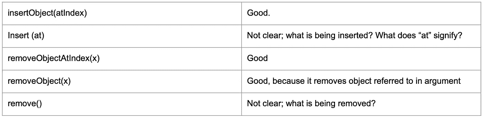
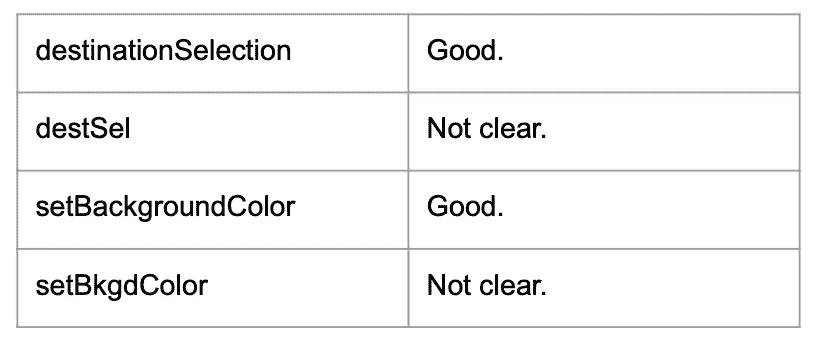
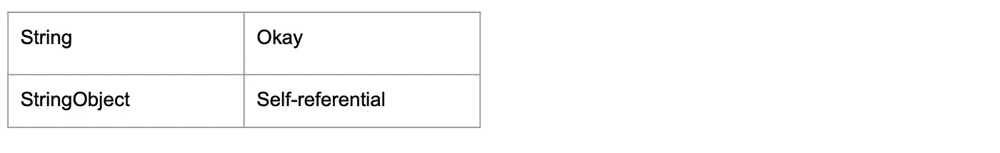
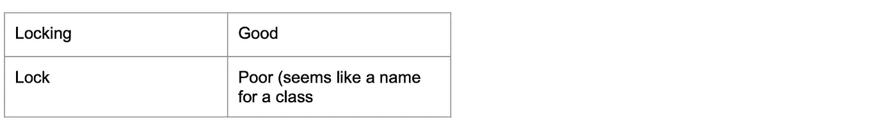
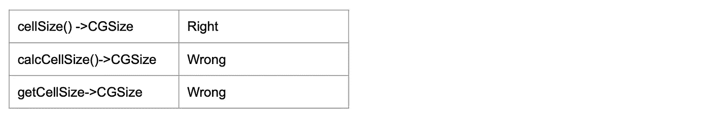
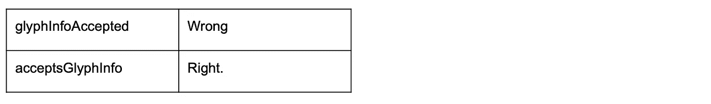
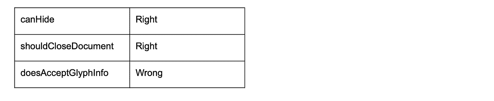

# Swift 中的命名惯例

> 原文：<https://betterprogramming.pub/naming-conventions-in-swift-4b7ca5eed4d2>

## 在 Swift 中命名所有功能和对象的完整指南


您可能会觉得命名变量、常量、类或方法似乎是编码工作中最容易的部分，但事实证明这是最令人沮丧的事情之一。

正确的命名是编写高质量代码的关键部分，它对你和其他阅读你的代码的人都有意义。

记住所有这些，让我们开始吧！

# 基本面

## **清晰度**

使用时的清晰是最重要的目标。尽可能的清晰和简洁，但是记住不要因为简洁而牺牲清晰。像方法和属性这样的实体只声明一次，但会重复使用。

总是检查一个用例，以确保它在给定的上下文中清晰易读。例如:



## ***清晰比简洁更重要***

一般来说，不要缩写事物的名称。把它们拼出来，即使它们很长。例如:



省略不必要的词语。名称中的每个单词都应该在使用地点传达突出的信息。例如:

`allViews.removeElement(cancelButton)` =不清楚

`allViews.remove(cancelButton)` =更清晰

## 一致性

尝试在整个项目中使用一致的名称。

当有一个类的方法应该利用多态性时，一致性尤其重要。在不同的类中做相同事情的方法应该有相同的名字。例如:

**错误方式**

```
class Arithmetic {func add(x: Float, y: Float)}class Integer: Arithmetic {func addInt(x: Int, y: Int)}Class MyClass: Integer {//this class will get two different names for functions both performing addition}
```

**正确的方法**

```
class Arithmetic {func add(x: Float, y: Float)}class Integer: Arithmetic {func add(x: Int, y: Int)}Class MyClass: Integer {add(x: 23, y: 33)add(x: 3.3, y: 23.3)}
```

## 没有自我参考

名字不应该是自我参照的。例如:



# 印刷惯例

命名元素时，请遵循以下印刷惯例:

对于由多个单词组成的名称，不要使用标点符号作为名称的一部分或分隔符(下划线、破折号等)；相反，将每个单词的第一个字母大写，并将单词连在一起(例如，`nameOfSomeMethod`)——这就是所谓的 *camel case。*但是，请注意以下限定条件:

*   对于方法名，以小写字母开始，嵌入单词的第一个字母大写。

# 类别和协议名称

一个类的名字应该包含一个名词，清楚地表明这个类(或者这个类的对象)代表什么或者做什么。

协议应该根据它们如何对行为进行分组来命名:

大多数协议将与任何特定类都不相关的方法组合在一起。这种类型的协议应该被命名，这样协议就不会与类混淆。一个常见的惯例是使用动名词(“…ing”)形式。例如:



一些协议将许多不相关的方法组合在一起(而不是创建几个独立的小协议)。这些协议倾向于与一个类相关联，这个类是协议的主要表达式。在这些情况下，约定是给协议取与类相同的名称。

这种协议的一个例子是`NSObject`协议。该协议对方法进行分组，您可以使用这些方法来查询任何对象在类层次结构中的位置，以使其调用特定的方法，并增加或减少其引用计数。因为`NSObject`类提供了这些方法的主要表达式，所以该协议以该类命名。

# 命名方法

## 通则

*   名称以小写字母开头，嵌入单词的第一个字母大写
*   对于表示一个对象所采取的动作的方法，以动词开头——例如，`calculateSomeValue`，`displayItem`
*   不要使用 *do* 或 *does* 作为名称的一部分，因为这些助动词很少添加意义。此外，不要在动词前使用副词或形容词。
*   如果该方法返回调用方的属性，则以该属性命名该方法。避免使用 *get* ，除非间接返回一个或多个值。



*   补偿弱类型信息以阐明参数的作用

特别是当参数类型为`NSObject`、`Any`、`AnyObject`或`Int`或`String`等基本类型时，类型信息和使用时的上下文可能无法完全传达意图。在这个例子中，声明可能是清楚的，但是使用地点是模糊的:

`func add(_ observer: NSObject, for keyPath: String)`

`grid.add(self, for: graphics)` =含糊不清

为了清楚起见，在每个弱类型参数前面加上一个描述其作用的名词:

`func add**Observer**(_ observer: NSObject, for**KeyPath** path: String)`

`grid.addObserver(self, forKeyPath: graphics)` =清除

*   首选方法和函数名称，使使用网站形成语法英语短语。例如:

`x.insert(y, at: z) “x, insert y at z”`

`x.subViews(havingColor: y) “x’s subviews having color y”`

`x.capitalizingNouns() “x, capitalizing nouns”`

`x.insert(y, position: z)`

`x.subViews(color: y)`

`x.nounCapitalize()`

*   以 *make 开始工厂方法的名称。*例如:

`x.makeIterator()`

*   当第一个论元构成一个[介词短语](https://en.wikipedia.org/wiki/Adpositional_phrase#Prepositional_phrases)的一部分时，给它一个论元标签。论元标签通常应该从[介词](https://en.wikipedia.org/wiki/Preposition)开始，例如`x.removeBoxes(havingLength: 12)`。

当前两个参数代表一个抽象的部分时，会出现一个例外。例如:

`a.move(**toX:** b, **y:** c)`

`a.fade(**fromRed:** b, **green:** c, **blue:** d)`

在这种情况下，在介词之后开始论元标签，以保持抽象清晰。

`a.moveTo(**x:** b, **y:** c)`

`a.fadeFrom(**red:** b, **green:** c, **blue:** d)`

*   否则，如果第一个参数构成语法短语的一部分，则省略其标签，将任何前面的单词附加到基本名称上，例如`x.addSubview(y)`。

这条准则意味着，如果第一个参数不构成语法短语的一部分，它应该有一个标签。

`view.dismiss(**animated:** false)`

`let text = words.split(**maxSplits:** 12)`

`let studentsByName = students.sorted(**isOrderedBefore:** Student.namePrecedes)`

请注意，短语传达正确的意思很重要。以下内容符合语法，但表达了错误的意思:

`view.dismiss(false) Don’t dismiss? Dismiss a Bool?`

`words.split(12) Split the number 12?`

还要注意，可以省略带有默认值的参数。在这种情况下，它们不构成语法短语的一部分，所以它们应该总是有标签。

# 命名属性

根据变量、参数和关联类型的角色来命名它们，而不是根据它们的类型约束来命名。例如:

## **走错了路**

```
var **string** = “Hello”protocol ViewController {associatedtype **View**Type : View}class ProductionLine {func restock(from **widgetFactory**: WidgetFactory)}
```

## ***正确的方式***

```
var **greeting** = “Hello”protocol ViewController {associatedtype **ContentView** : View}class ProductionLine {func restock(from **supplier**: WidgetFactory)}
```

*   如果属性表示为名词，则格式为:

`(*type*)*noun;*`

示例:`title`

*   如果属性表示为形容词，则格式为:

`is*Adjective;*`

示例:`isHidden`

*   如果属性表示为动词，则格式为:

`*verbObject;*`

示例:`showsPopup`

*   这个动词应该是一般现在时
*   不要用分词把动词变成形容词



*   用情态动词(前面带 *can、should、will、*等动词)来阐明意思，但不要用 *do* 或 *does。*



# 结论

遵循这些约定，让你的生活变得更容易(更不用说阅读你代码的其他人的生活了)。

希望你能从这篇文章中学到一些东西！

## 参考

*   [“命名约定”](https://developer.apple.com/library/archive/documentation/Cocoa/Conceptual/CodingGuidelines/Articles/NamingMethods.html)通过苹果文档
*   [“API 设计指南:特殊说明”](https://swift.org/documentation/api-design-guidelines/#special-instructions)通过 Swift 文档