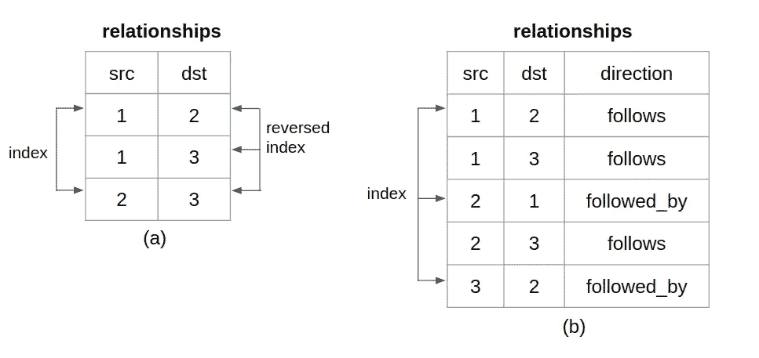
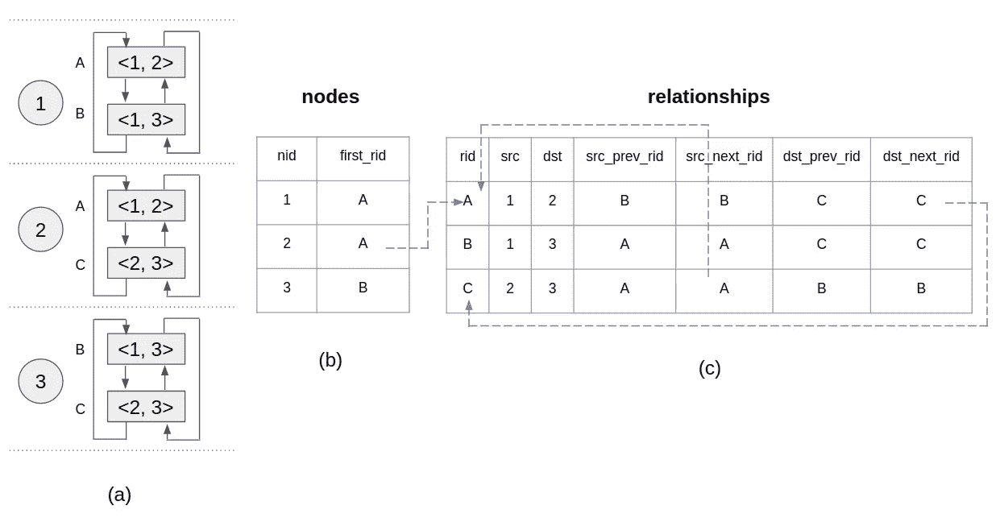
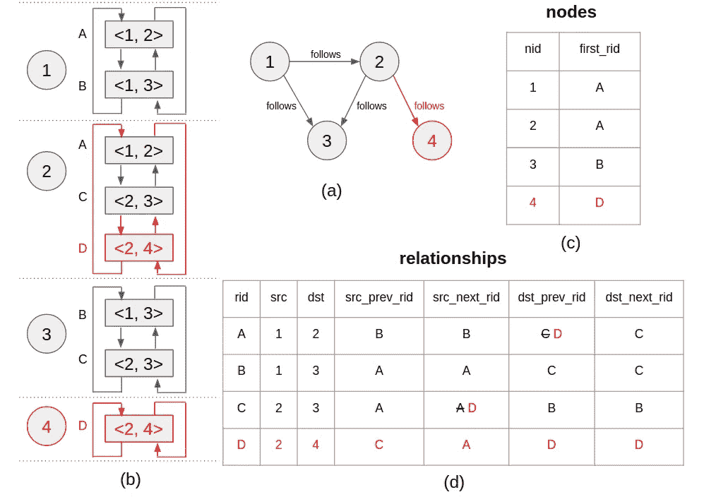

# 本地图形数据库存储

> 原文：<https://betterprogramming.pub/native-graph-database-storage-7ed8ebabe6d8>

## Neo4j 和图形数据库与关系数据库的比较

由[威廉·卡尔森伯格](https://unsplash.com/@trendmatcher?utm_source=medium&utm_medium=referral)在 [Unsplash](https://unsplash.com?utm_source=medium&utm_medium=referral) 拍摄的照片

# **背景**

虽然数据库技术在过去二十年中的发展一直被 NoSQL 和关系的争论所主导，但在同一时期，有一股安静的力量一直在稳步发展。那是本地图形数据库。通过 Neo4j [1]的推广，原生图数据库现在已经被许多行业广泛采用，并被许多现实世界的用例所利用。

在本文中，我想谈谈原生图数据库中的存储层，因为与 NoSQL 或关系数据库相比，它上面的在线资源少得多。你能找到的最有用的资料可能是 Neo4j 人写的书[2]，它掩盖了许多重要的细节。直到我读了源代码，我才终于明白了字节级的东西。

我还应该提到，理论上，原生图数据库应该有多种形式。只要图的节点和它们的连接是存储设计中的一级原语，它就被认为是图原生的。但到目前为止，Neo4j 的设计似乎是最被证明的方法。所以我将坚持把它作为原生图形数据库存储的典型例子。

# **关系存储模型中的图形**

首先，让我们看看如何在关系数据库世界中建模一个图。考虑一个非常简单的图，如图 1 所示。想象一下，它代表了 Twitter 用户的关系。节点 1 跟随节点 2 和 3。节点 2 跟随节点 3。

图 1

在关系模型中，您会有一个包含用户配置文件的表，也可能有一个包含用户操作的表——就像他们什么时候开始互相关注一样。但是最重要的是，在图的上下文中，您需要一个关系表来存储用户之间的联系。

通常有两种方法可以做到这一点。您可以像图 2 (a)那样做:将一条边(关系)的源和目的地存储为一行，并对所有的边都这样做。当您需要查找出站边缘(特定用户跟随的边缘)时，您可以使用索引来“查找”该用户出站关系的起点。

此外，您通常还需要查找传入的边(跟随特定用户的边)，因此您需要一个反向索引来扫描所有用户的入站关系。这两个索引在查找中都导致了`O(log(n))`时间复杂度。

反向索引更糟糕，因为不能有一个稀疏索引只指向用户入站关系的起点。入站关系没有排序——假设您在表中有一行`<2,1>`。因此您的反向索引必须完全指定到叶级别。

你可以选择像图 2 (b)那样做。在这种情况下，您将存储一条边两次，并有一个额外的列来指示方向。您可以去掉反向索引，但是仍然需要正向索引——并且您将在应用程序层担心更多的数据一致性问题(对称重复边)。

图 2

一般来说，拥有索引不仅会降低写入速度，还会增加数据大小。而且，归根结底，它只提供了`O(log(n))`效率。

# **本地图形存储模型**

让我们看看原生图模型如何解决这些问题。图 3 总结了本地图形存储模型，它基于图 1 中的图形。让我带你走一遍。

图 3

图 3 (a)是一个概念模型。它列出了与每个节点相关的所有边，并将它们组织成双向链表。注意，如果节点是边的源或目的地，则该边与该节点相关联。例如，边`A <1,2>`与节点`1`和节点`2`都相关联。

图 3 (b)是实际的节点存储。每个记录存储一个节点的第一个关系 ID ( `first_rid`)。例如，节点`1`和`2`的第一关系是`A`。

图 3 (c)是实际的关系存储。每个记录存储关系的源(`src`)和目的(`dst`)。此外，它还存储源节点和目的节点的上一个和下一个关系 id(`src_prev_rid`、`src_next_rid`、`dst_prev_rid`、`dst_next_rid`)。这实质上为源和目的地保留了概念上的双向链表，但是只存储一次给定的边。

假设您想要检索节点`2`的所有出站关系。如图 3 中的蓝色箭头所示。您首先进入节点存储器，看到节点`2`的`first_rid`是`A`。然后你去关系库查找`A`。`A`不是`2`的出库关系，因为`2`是`A`的`dst`。但是没关系。您跟随`A`中的`dst_next_rid`(因为`2`是关系`A`中的目的地)。那就指向`C`。`C`是`2`的出库关系(`2`是`C`中的来源)。你继续到`src_next_rid`，它循环回到`A`。那么你知道你已经穷尽了节点`2`的所有关系。

现在假设您想要添加一个新节点`4`并使`2`跟随`4`。请参见图 4 了解这一变化的概况。再一次，让我们走一遍。

图 4

图 4 (a)展示了你想要达到的最终结果。图 4 (b)显示了更新的概念模型。

一条新记录被添加到节点存储器中以存储节点`4`的`first_rid`，即`D`[图 4 (c)]。在关系存储器中，新记录`D`被插入【图 4 (d)】。其`src`和`dst`分别为`2`和`4`。

它的`dst_prev_rid`和`dst_next_rid`之所以琐碎，是因为它的`dst`节点`4`只有一个关系，就是`D`本身。稍微棘手的部分是更新节点`2`的双向链表。我用红色突出显示了它们。很容易看出图 4 (b)中节点`2`的红色部分是如何反映在图 4 (d)中的。

这是原生图形存储模型的要点。我故意省略了节点/关系标签和属性的部分，只关注图形结构。但是给定节点/关系 id，这些可以很容易地构建为查找存储。

还有其他实际的考虑。例如，一个特定节点的所有关系都在一个双向链表中。您可以将入站安排在列表的开头，出站安排在列表的末尾，以便快速浏览有向关系。

另一个例子是确定两个节点之间是否存在关系。您可以迭代源的出站或目标的入站。然而，这两个节点中的一个可能是丰富连接的(例如，Twitter 上的名人用户)。在节点存储中记录一个密度位可能是有意义的，这样可以告诉您遍历其他节点的关系。

# **原生图形物理存储**

在上面的例子中，我可能给你留下了节点和关系是作为关系表存储的印象。他们不是。这是原生图形数据库存储的另一项重大创新。

您可能已经注意到节点和关系记录有固定的大小——它们只包含固定大小的 id。因此，诀窍是将同类记录连续存储在一个连续的存储 blob 中，例如，一个文件(或一组文件)。

对于任何给定的 ID，您可以直接在连续的 blob 中寻找`ID * record_size`来读/写记录。这就是启用`O(1)`查找的原因。可以为存储的连续二进制大对象中的每个记录槽引入一个`in_use`位，以便在擦除记录时可以预分配和回收空间。

我已经在 GitHub [3]上写了一个 Golang 快速演示程序来说明整个想法。程序使用`mmap`来获得一个 blob 存储，它分别反映了节点和关系文件，并将节点/关系记录读取/写入这些内存区域。

`mmap`是一个有用的工具，因为它避免了从磁盘到操作系统和从操作系统到应用程序的双重复制。读写要快得多，也简单得多。请随意查看回购，如果发现问题，请务必提交问题。

# **说几句 Neo4j 的存储布局**

Neo4j 的节点记录包含`in_use`信息、`first_rid`、第一属性 ID、第一标签 ID 和一些额外的位(例如，我们谈到的密度信息)。属性 ID 和标签 ID 指向节点的属性和标签。Neo4j 的关系记录中包含了`in_use`的信息；`src`；`dst`；分别为`src`和`dst`的上一个和下一个链接；第一类型 ID；第一属性 ID；和一些额外的位。类型 ID 和属性 ID 指向关系的类型和属性。

Neo4j 标准格式的节点记录是 15 个字节。互联网上有一种常见的误解，认为节点记录使用一个字节表示`in_use`，四个字节表示`first_rid`和第一个属性 ID，五个字节表示第一个标签 ID，一个字节表示额外的。

在该布局中，关系和属性的限制都是 2。这与 Neo4j 标准格式中关系的限制是 2 个⁵，属性的限制是 2 个⁶的事实不符[4]。

断开的是第一个字节没有全部用于`in_use`。只有第一个字节的最后一位用于`in_use`。前三位实际上用于`first_rid`的高位，接下来的四位用于第一个属性 ID 的高位。数学结果是这样的:3+32=35，4+32=36。你需要阅读源代码来发现这一点[5]。

Neo4j 标准格式的关系记录是 34 字节。类似的技术被用来最大化每个比特的效用。

# **参考文献**

[1] [Neo4j 图形平台](https://neo4j.com/)

[2]伊恩·罗宾逊等人，2015，“图形数据库”，第二版

[3][NativeGraphDBStorage](https://github.com/eileen-code4fun/NativeGraphDBStorage)

[4] [Neo4j 文档](https://neo4j.com/docs/operations-manual/current/tools/store-info)

[5][GitHub 上的 Neo4j](https://github.com/neo4j/neo4j/tree/4.2/community/record-storage-engine/src/main/java/org/neo4j/kernel/impl/store/format/standard)