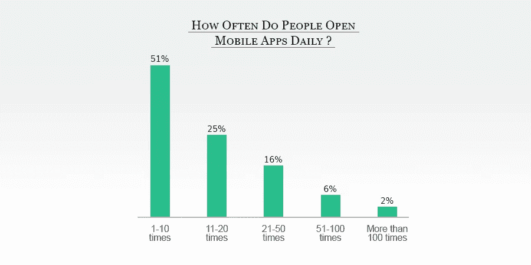
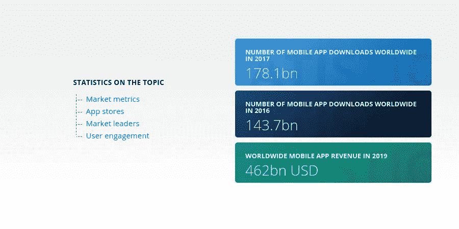
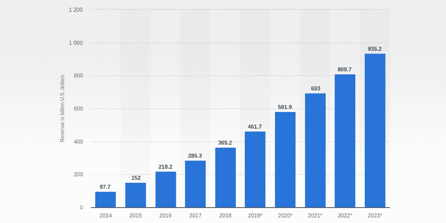
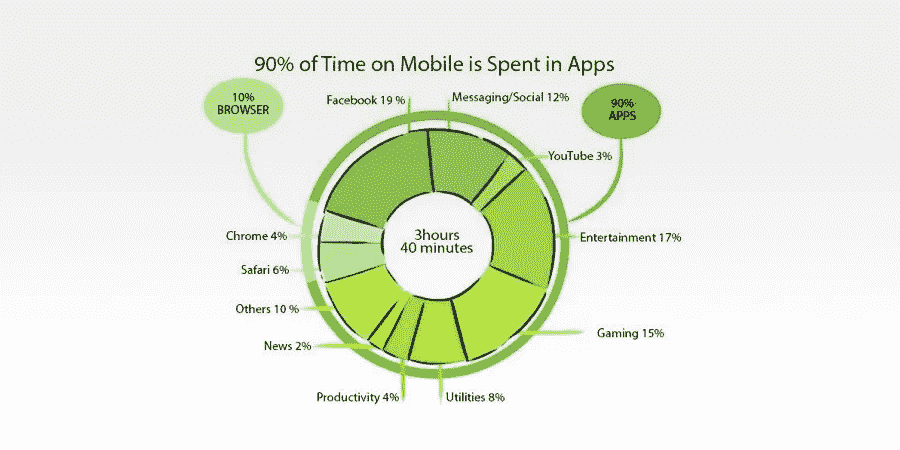
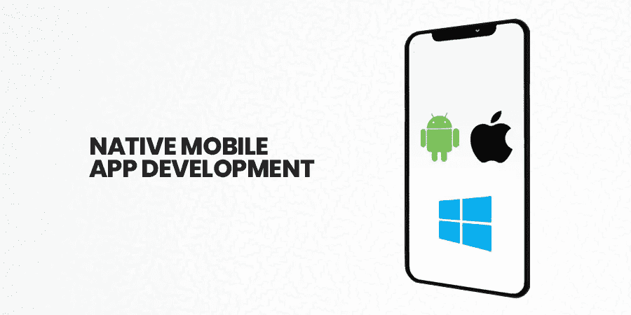
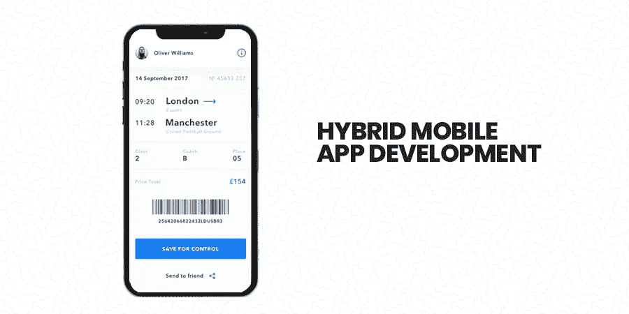
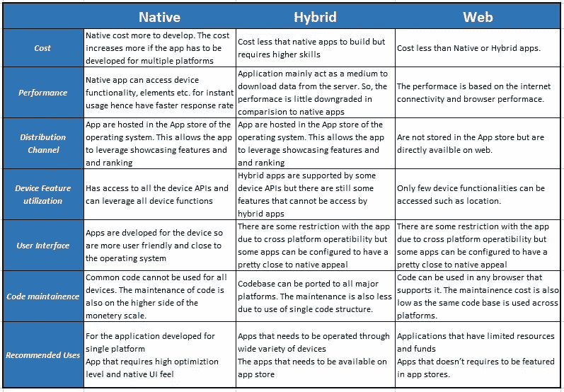

# 本地、混合或网络应用:获得持久成功的最佳途径是什么？

> 原文：<https://betterprogramming.pub/native-hybrid-or-web-apps-what-is-the-best-approach-for-lasting-success-91afbb872d89>

## 本机、混合和 web 应用程序的差异、优点和缺点

毫不奇怪，营销趋势、策略和技术在过去五年中比过去 50 年发生了更大的变化。

你想知道是什么驱使人们疯狂使用他们的智能手机吗？简单的答案是:“吸引移动应用”。

现在下一个任务。你脑海中大概蹦出的是:“用户更喜欢访问什么样的移动应用？”或者:“他们在这些移动应用和下载上花了多少时间？”看看这个图表！

不要困惑…我们已经研究并收集了各种事实、统计数据和预测，帮助您了解移动应用程序的当前趋势。你应该选择的应用类型以及原因。

> 根据玛丽·米克尔的数据，今天，美国人在智能手机上花费的时间比 2008 年多了 3 个多小时(是现在的 10 倍)。

据 [Statista](https://www.statista.com/statistics/271644/worldwide-free-and-paid-mobile-app-store-downloads/) 称，“目前的统计数据预测，2018 年，消费者下载了 1940 亿个移动应用”，这比“2016 年(1437 亿)”高出不少。

> [**Statista**](https://www.statista.com/statistics/269025/worldwide-mobile-app-revenue-forecast/) **透露“移动应用预计在 2023 年达到 9352 亿美元”。**

> **根据** [**康姆斯克统计**](https://www.comscore.com/Insights/Presentations-and-Whitepapers/2017/The-2017-US-Mobile-App-Report) **，“90%的移动用户把时间花在访问应用上，剩下的 10%花在网络上。”**

多年来，移动应用已经成为习惯的力量。技术和应用的快速创新没有显示出任何放缓的迹象。

此外，随着近年来智能手机的迅猛增长，这让企业和公司陷入了两难境地:应该采用哪种应用程序来确保长期成功？

2019 年，涵盖从本机、混合到移动 web 应用程序的各种应用程序的营销格局有时会让企业陷入困境，无法预测最佳应用程序来取得成功。

在当前的高科技和互联网时代，多种技术正在发展，找到最适合您业务的应用程序是一项艰巨的任务，因为去年对您有效的应用程序今年可能不是一个好的选择。

虽然移动和 web 应用程序已经成为公司和企业增强业务线索和用户体验的主要手段，但与此同时，关于您是开发原生、web 还是混合应用程序的辩论也在激烈进行。

应用程序下载和应用程序使用的增长速度正在迅速征服互联网的下一个前沿。

来源:[https://www . tigren . com/WP-content/uploads/2017/11/magento-2-mobile-app-magento-hybrid-app-native-app-we B- app . png](https://www.tigren.com/wp-content/uploads/2017/11/magento-2-mobile-app-magento-hybrid-app-native-app-web-app.png)

这些辩论的共同结论总是相同的；如果你有时间和金钱，就开发本地应用。如果你预算不多，可以选择网络或者混合应用。但是，这是错误的做法！

如果你花一点时间环顾四周，我敢肯定你会发现 90%的人的眼睛都盯着移动设备。你有没有注意到到底是什么让他们如此专注于他们的设备？那当然是移动应用！

这个百万美元的问题仍然摆在你的面前:“为了持久的商业成功，你需要开发什么样的应用程序？”

首先要记住的是，要超出预算选择最适合您业务需求的应用程序。但是，您如何得出本机、混合或 web 应用程序开发的最终结论呢？

不要烦恼！在做出任何最终决定之前，这个博客将解释关于领先应用程序(本机、混合或 web 应用程序)的一切。

这篇博客讨论了本地、混合和 web 应用程序的方法差异，以及混合与本地应用程序的优缺点。它还包括关于哪种应用程序最能确保持久成功的某些要点。

# 我们将在这个博客中讨论什么

1.  选择应用类型的基本标准。
2.  原生应用和利弊。
3.  什么是混合应用程序？
4.  跨平台应用和优势。
5.  在本机、web 和混合应用程序之间进行选择的最佳方法。

在我们深入讨论选择应用程序时需要考虑的事项以及它们之间的不同之处之前，让我们先来理解为什么谨慎选择合适的技术来开发移动应用程序非常重要。

改变对平台、技术或应用类型的想法可以减少数百个工作时间，但会成倍增加总体成本。

一个严峻而黯淡的事实是，十个创业公司中有九个会失败！原因是多种多样的，但是你用来管理业务的技术选择可能是主要原因之一。

经过对数据的分析，我们发现 42%的创业公司失败是因为他们的产品缺乏市场需求。然而，这并不意味着你的公司不会成功。

已故的苹果联合创始人史蒂夫·乔布斯为此树立了一个完美的现代榜样。

> 他说:“很多时候，人们不知道他们想要什么，直到你给他们看”。

在这种情况下，你需要把你的产品带到他们的心里。如果你配对了，你会很快成功！

让我们回到我们的主题…

如何找到最适合您业务需求的应用程序？当企业决定进行品牌推广时，在有限的预算下获得最好的操作系统的压力是最麻烦的问题。

所以你不得不面对这样一个问题:构建什么样的应用程序才能产生持久的效果:原生的、网络的还是混合的？两者有什么区别？

# 选择应用程序类型时要记住的因素

如果没有一个有效的网站，你的电子商务商店是不完整的，不成功的应用程序会极大地影响你的商业成功。选择合适的应用程序类型是企业应该考虑的首要步骤，因为这将直接影响用户体验。

在讨论每种平台和探索每种类型的应用程序及其优缺点之前，让我们来解开在选择移动应用程序类型时需要考虑的因素。

1.  编程语言:它们基于哪些编程语言？虽然原生应用支持 Swift 和 Java，但基于网络的技术支持 HTML、CSS 和 JavaScript，原生 [**移动应用开发**](https://www.xicom.ae/services/mobile-app-development/) 可以支持这两者。
2.  分发方法:这将定义应用程序将通过的渠道:应用程序商店或网络。
3.  多平台支持:不同的应用类型有不同的能力在 iOS 和 Android 上运行，所以建立一个满足你的目标受众需求的应用是一个明智的决定。

在您根据这些具体因素匆忙选择应用程序之前，请确保您知道以下问题的答案:

1.开发一个 app 需要多快？

2.你的预算是多少？

3.你想通过这款应用达到什么目的？

4.要做到这一点，你需要什么功能？

5.你想用你的 app 传达什么体验？

这些问题的答案是根据独特的功能和优势选择应用类型的完美指南。

> **“没有持续的应用，知识是无用的。”—** 朱利安音乐厅

在过去的几年里，我们都看到了移动应用历史上的许多成功案例。从 Angrybirds 到 Instagram 再到 Pokemon Go，都有让它们的主人创下百万美元年收入的应用。

根据 [Buildfire stats](https://buildfire.com/app-statistics/) 的数据，毫无疑问，移动应用行业正在蓬勃发展，全球智能手机用户超过 27 亿 ***。应用程序的使用和智能手机的渗透率仍在稳步增长，没有任何放缓的迹象。***

虽然一个移动应用程序可以毁掉或成就一个企业，但对于希望开发移动应用程序的企业来说，最重要的问题是他们可以采用什么样的移动应用程序开发方法来获得持久的成功。

这篇博客详细介绍了三个类别:本地、混合和 web 应用程序开发。

在你 [**雇佣应用开发者**](https://www.xicom.ae/services/mobile-app-developers/) 之前，我们旨在帮助你详细权衡每种方法的利弊。

# **原生手机应用开发**

原生应用是为特定操作系统(iOS、Android 和 Windows 手机)开发、设计和编码的软件应用。

你可以与本地应用开发公司一起设计应用，这些公司能够为各个平台编写语言，包括 iOS 应用的 Swift 和 Objective-C，Android 应用的 Java、C++、 [Kotlin](https://kotlinlang.org/) ，以及。用于 Mac 设备的. net。

本地应用的流行例子:口袋妖怪 Go、脸书和 Twitter。

原生应用程序开发人员可以构建一个能够利用设备所有功能的原生应用程序。然而，原生应用程序开发的唯一缺点是创建时间和不断的维护。

让我们深入了解一下利弊:

## **原生应用的优点**

1.  增强的应用性能
2.  快速、简单且安全
3.  反应灵敏且强健
4.  灵活多变
5.  UX/用户界面支持

## **原生应用的缺点**

1.  需要更多时间来开发应用程序
2.  经常需要应用程序更新
3.  很难在不同的代码上提供相同的功能
4.  对不同的平台使用不同的编码。
5.  发展是昂贵的

# **移动网络应用开发**

与术语 *web app* 混淆？

Web 应用程序是运行在浏览器中的程序，如 Safari、Mozilla Firefox 或 Google Chrome。与本地应用不同，web 应用可以通过 web 浏览器直接访问。

不需要下载，因为它们是使用 CSS、HTML 或 JavaScript 语言构建的。如果你雇佣一个精通 CSS、HTML 或 JavaScript 编程语言的 android 应用开发者，那么 Web 应用开发会变得容易得多。

虽然 web 应用程序可以在任何具有 web 浏览器的移动设备上使用，无论是 iOS、Android 还是 Windows，但这并不意味着需要为每个平台编写代码。

## 网络应用的优势

1.  无忧维护
2.  跨平台运行应用程序只需要一个代码库
3.  不需要经常更新
4.  应用程序开发成本更低

## **web 应用开发的缺点**

1.  复杂相互作用
2.  在 App Store 中不可用
3.  慢速操作系统
4.  不能提供推送通知、离线工作、主屏幕加载等功能，这些都是不支持的。

# **混合移动应用开发**

顾名思义，它位于本地应用和网络应用之间。它们感觉像是本地应用，因为它们可以从应用商店下载，像网络应用一样工作，因为它们也很容易浏览。

混合应用是 web 和本地应用的结合，建立在包括 HTML、CSS 和 JavaScript 在内的 web 技术之上，例如 Yelp 和 Instagram。

简而言之，它们是嵌入了 web 技术的本地应用代码，并通过相关的本地应用商店 ***发布。***

与混合型 [**手机 app 开发公司**](https://www.xicom.ae/services/mobile-app-development/) 分享你的想法，设计出最符合你需求的 app。雇用移动应用程序开发人员，因为他们总是乐于构建混合应用程序，因为他们需要编写一个单一的 web 技术代码库来跨平台运行应用程序。

## **混合应用的优点**

1.  跨平台支持
2.  接触全球受众
3.  比原生应用需要更少的应用开发者
4.  可以脱机工作

## **混合应用的缺点**

1.  UX 通常是妥协的
2.  响应速度慢，性能差

# **原生、混合还是 Web 应用开发？**

图片来源:[https://tools QA . com/WP-content/gallery/mobile-testing/mobileApplicationType。JPG](https://toolsqa.com/wp-content/gallery/mobile-testing/mobileApplicationType.JPG)

除了上面的图片，其中包含了本机、混合和 web 应用程序之间的基本比较，我们希望你超越这一点，深入了解事情。

在对移动应用开发**做出任何最终决定之前，让我们回到我们在本博客开始时提出的最关键的问题。**

**下面是一些问题和答案，可以帮助你选择最适合你的应用。**

## ****多快需要一个手机 app？****

**你赶时间吗？被指派在有限的时间内开发一个应用程序？**

**构建一个原生应用比一个混合应用更快，但是，如果你需要 iOS 和 Android 两个版本，那么终点线将大约在同一点。**

## **你想用这个应用程序完成什么？**

**一般来说，开发一个 app 的基本原因是为了创收。移动应用中的广告每千分之一成本(CPM)通常高于网络应用。**

**然而，如果你想依靠广告来推广，那就去找网络应用，如果你想通过广告赚钱，原生应用是一个完美的选择。**

## **你的目标是谁？**

**应用程序的选择因目标受众而异。**

**例如，如果你计划开发一个 Android 和 iOS 用户都可以随时使用的应用程序，最好的解决方案是一个本机应用程序，因为它可以无缝地在线和离线工作。**

**选择操作系统是一个常见的难题。据统计，iOS 用户在移动应用上花费的时间越多，这类应用的收入可能就越高。**

## **你想在你的应用中添加哪些功能？**

**你的应用包含的功能越多，开发过程就越困难。如果你想使用设备的最大功能，原生应用是最好的选择。**

## ****你的预算****

**根据 [mrc-Productivity](https://www.mrc-productivity.com/) 的一项调查，本地应用程序的开发非常昂贵，而网络应用程序的预算很低。根据应用程序的不同，应用程序开发的成本会有很大差异。通常从 5 万美元到超过 100 万美元不等。**

## ****有哪些维护成本？****

**这是你不能忽视的。Forrester 的一项调查发现，本地应用的平均维护费用比 web 或混合应用高 35%。**

# ****结论****

**没有人有时间和金钱去体验糟糕的应用程序。这就是为什么最成功和最受欢迎的应用程序看起来与他们五年前使用的完全不同。**

**总结这篇博客，大部分的标准已经被本地应用所满足，这些本地应用是当今最受欢迎的移动应用。**

**你可以 [**雇佣一个 iOS 开发者**](https://www.xicom.ae/services/iphone-app-developers/) 来构建你的原生应用，或者雇佣最好的移动应用开发公司来为你完成这项工作。**