# 本机模块:导出 C++函数以反应本机

> 原文：<https://betterprogramming.pub/native-modules-export-c-function-to-react-native-for-beginners-77e89934b210>

## 从 React Native 和 more 调用 Swift


今天，我继续分享我在原生模块和 C++方面的经验。

由于我们将会看到很多为移动平台编写的 C/C++库，我们需要将它们实现到我们的 iOS 或 React 本地应用程序中。这也是为什么我要写一篇关于如何从 C++导出一个函数到 React Native 的文章，对于初学者来说简单易懂，节省时间。我将从一个新的 react 本机应用程序开始

## **1。创建一个新的 react 本地应用，打开你的终端并运行**

```
npx react-native init NativeModules
```

## **2。打开 Xcode 并导航至 native modules/IOs/native module . xc workspace**


## **3。在 C++端工作**

创建一个新的 C++文件，并将其命名为`Cpp_to_RN.cpp`

当我们创建一个新的 C++文件时，Xcode 会为我们创建一个头文件`Cpp_to_RN.hpp`

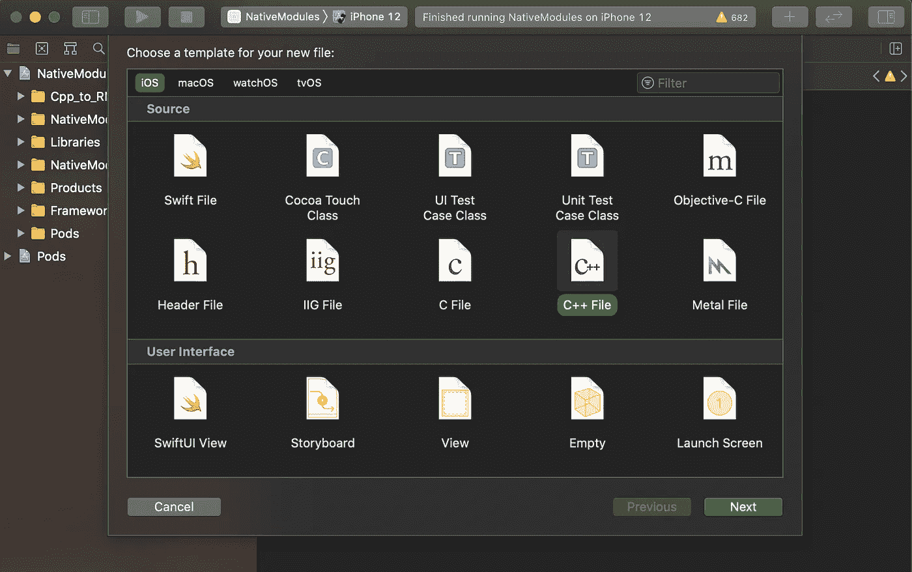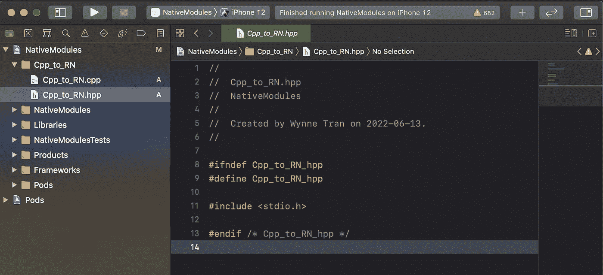

首先，打开“`Cpp_to_RN.hpp`”**”**文件，创建一个包含函数而没有主体的类。

```
#ifndef Cpp_to_RN_hpp
#define Cpp_to_RN_hpp#include <stdio.h>
#include <string>class Cpp_to_RN {
public:
    std::string sayHello();
};#endif /* Cpp_to_RN_hpp */
```

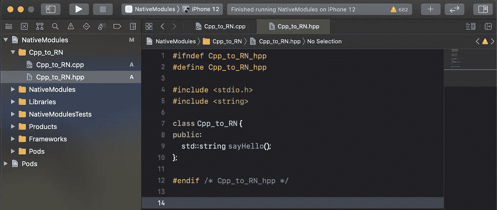

然后打开`Cpp_to_RN.cpp`文件，写一个简单的函数`sayHello()`

```
#include "Cpp_to_RN.hpp"
std::string Cpp_to_RN::sayHello(){
    return "Hello from CPP";
}
```

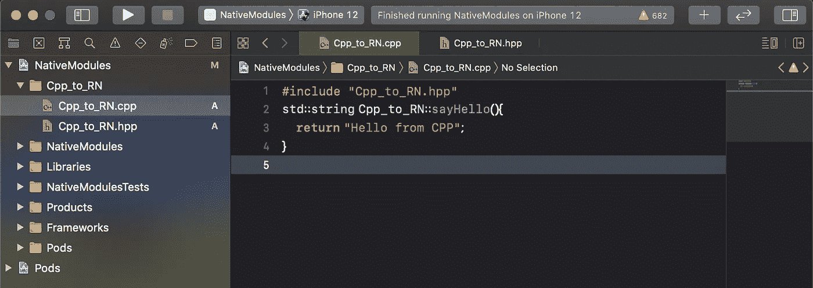

## **4。正在包装 C++文件。**

将 C++文件打包并导出到 IOS (swift)端

a.创建一个目标 C 文件，并将其命名为`Cpp_to_RN.m`

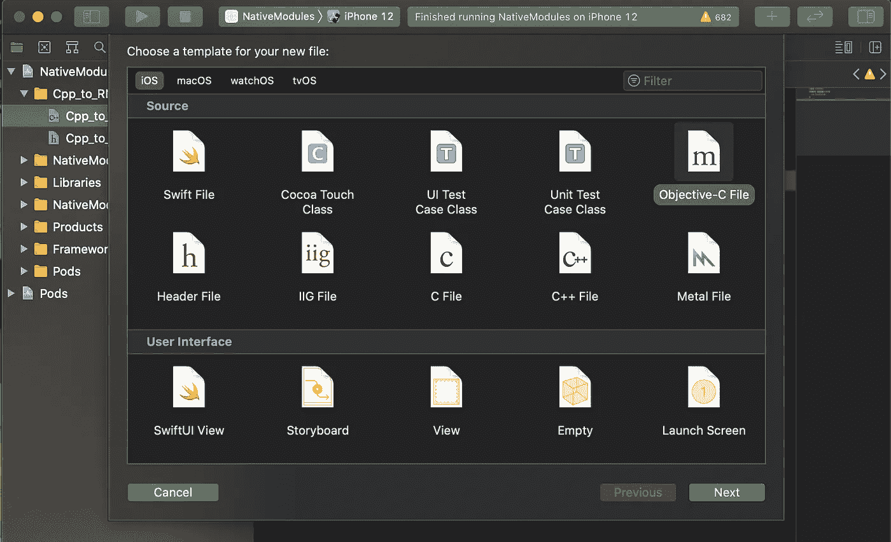

将`Cpp_to_RN.m` *重命名为* `Cpp_to_RN.mm`

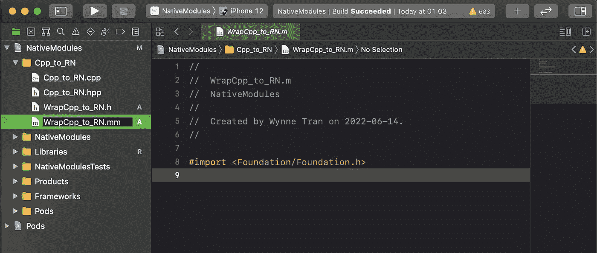

b.打开`WrapCpp_to_RN.mm` 文件，编写将从 C++文件中包装函数`sayHello`的主体内容。

```
#import <Foundation/Foundation.h>
#import "WrapCpp_to_RN.h"
#import "Cpp_to_RN.hpp"[@implementation](http://twitter.com/implementation) WrapCpp_to_RN- (NSString *) sayHello {
  Cpp_to_RN fromCPP;
    std::string helloWorldMessage = fromCPP.sayHello();
    return [NSString
            stringWithCString:helloWorldMessage.c_str()
            encoding:NSUTF8StringEncoding];
}
[@end](http://twitter.com/end)
```

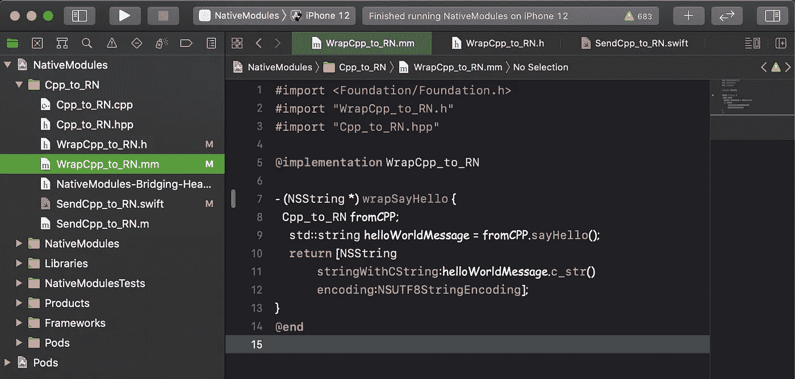

c.创建一个头文件，命名为`WrapCpp_to_RN.h`

将`wrapSayHello`函数导出到 Swift 文件中

```
#import <Foundation/Foundation.h>
[@interface](http://twitter.com/interface) WrapCpp_to_RN : NSObject
- (NSString *) wrapSayHello;
[@end](http://twitter.com/end)
```

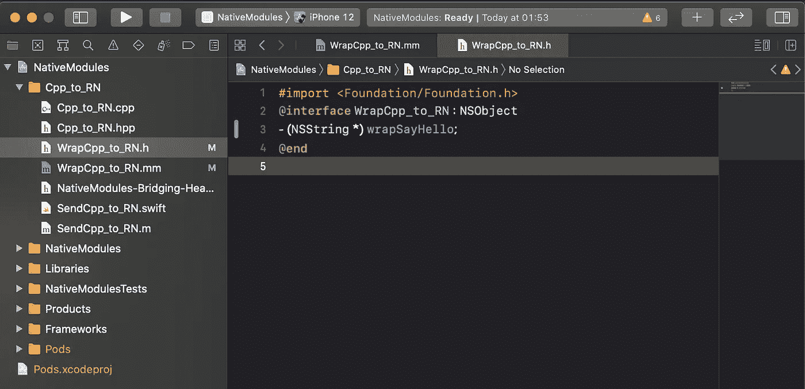

## **5。在 iOS (Swift)端工作**

要导出 C++函数以本机反应

a.创建一个 Swift 文件，并将其命名为`SendCpp_to_RN.swift`

注意:Xcode 会要求我们为我们创建一个`NativeModules-Bridging-Header.h`文件。

创建一个类`SendCpp_to_RN`并将其声明为`NSObject`

```
#import <Foundation/Foundation.h>
[@interface](http://twitter.com/interface) WrapCpp_to_RN : NSObject
- (NSString *) wrapSayHello;
[@end](http://twitter.com/end)
```

编写一个函数`requiresMainQueueSetup()`来防止我们运行应用程序时出现警告

```
#import <Foundation/Foundation.h>
[@interface](http://twitter.com/interface) WrapCpp_to_RN : NSObject
- (NSString *) wrapSayHello;
[@end](http://twitter.com/end)
```

编写一个函数来包装来自`WrapCpp_to_RN.mm`的`WrapCpp_to_RN()`

```
import Foundation[@objc](http://twitter.com/objc)(SendCpp_to_RN)
class SendCpp_to_RN : NSObject {

  [@objc](http://twitter.com/objc) static func requiresMainQueueSetup() -> Bool {
        return false
    }

  [@objc](http://twitter.com/objc) func fromCpp(_ successCallback: RCTResponseSenderBlock) -> Void {
    successCallback([NSNull(), WrapCpp_to_RN().wrapSayHello() as Any])
    }}
```

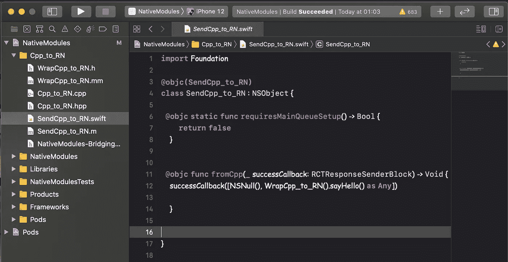

b.在 Swift 文件中导出一个 wrap 函数以反应本机

使用`Callback`创建一个目标 C 文件来导出 Swift 类及其函数

```
#import <React/RCTBridgeModule.h>
#import <Foundation/Foundation.h>
#import "UIKit/UIKit.h"
[@interface](http://twitter.com/interface) RCT_EXTERN_MODULE(SendCpp_to_RN, NSObject)RCT_EXTERN_METHOD(fromCpp:(RCTResponseSenderBlock)successCallback)[@end](http://twitter.com/end)
```

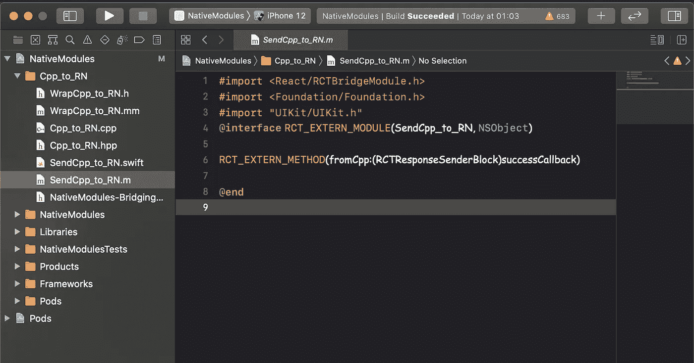

c.反应过来的原生连接 Swift，打开`NativeModules-Bridging-Header.h` 文件

```
#import <React/RCTBridgeModule.h>#import <React/RCTViewManager.h>#import "WrapCpp_to_RN.h"
```

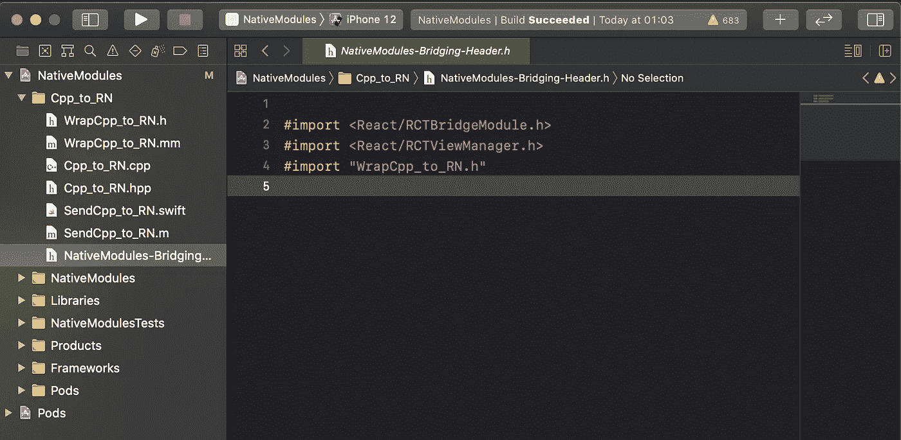

## **6。在 React 本机侧工作**

调用 Swift 类及其函数

```
import React from 'react';
import {StyleSheet, Text, View, NativeModules, Button} from 'react-native';const App = () => {
  const onPress = () => {
    const {SendCpp_to_RN} = NativeModules;
    SendCpp_to_RN.fromCpp((_err, res) => console.log(res));
  };
  return (
    <View style={styles.container}>
      <Text> Practice !</Text>
      <Button title="C++ to React Native" color="#841584" onPress={onPress} />
    </View>
  );
};
const styles = StyleSheet.create({
  container: {
    flex: 1,
    justifyContent: 'center',
    alignItems: 'center',
  },
});
export default App;
```

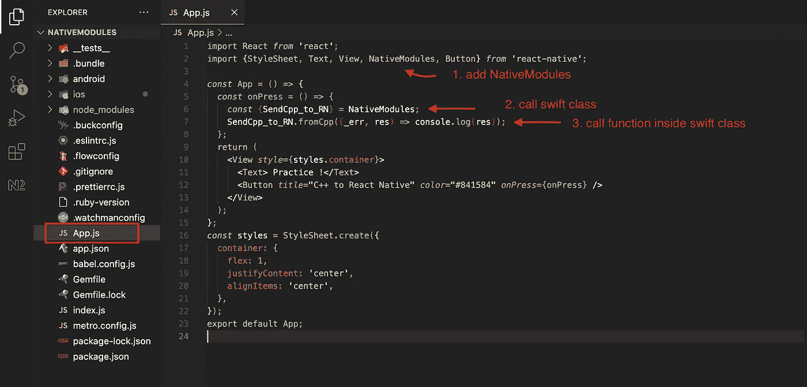

我们完成了，只需运行应用程序

```
react-native run-ios
```

或者只需点击 Xcode 上的“运行”按钮，看看我们做了什么。

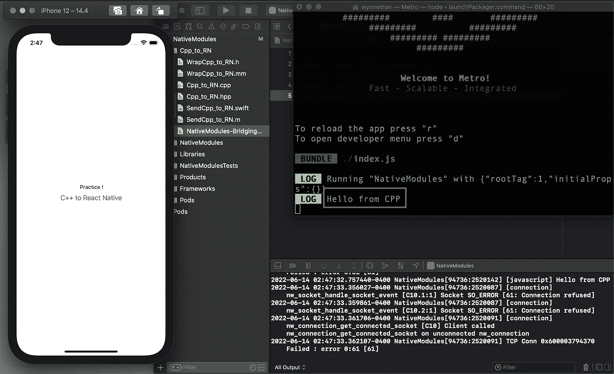

希望我的文章对你有帮助，感谢你的阅读时间。

这里有一个 GitHub 链接，里面有关于本机模块的所有提示，请到达你想要克隆它的分支。

[](https://github.com/Wynne-Tran/NativeModules) [## GitHub-Wynne-Tran/native modules

### 此时您不能执行该操作。您已使用另一个标签页或窗口登录。您已在另一个选项卡中注销，或者…

github.com](https://github.com/Wynne-Tran/NativeModules)