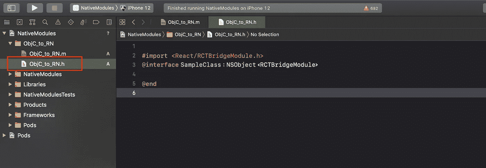
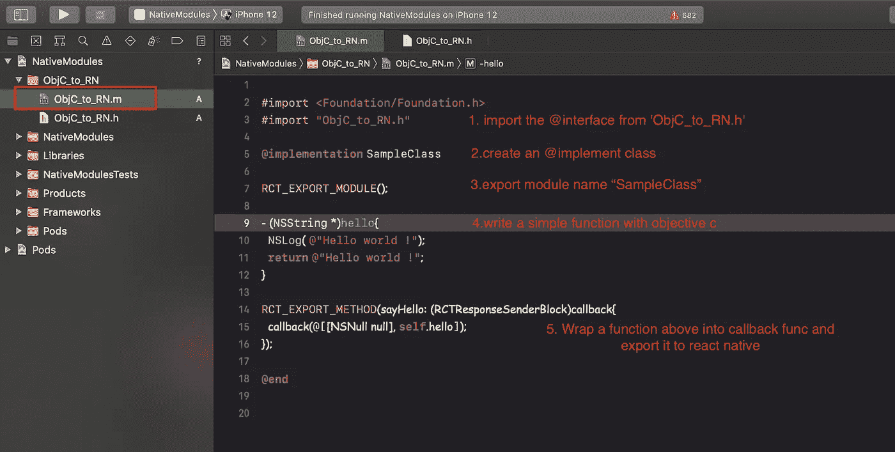
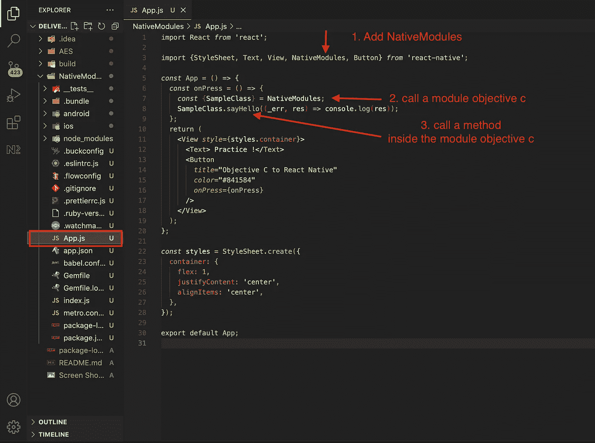
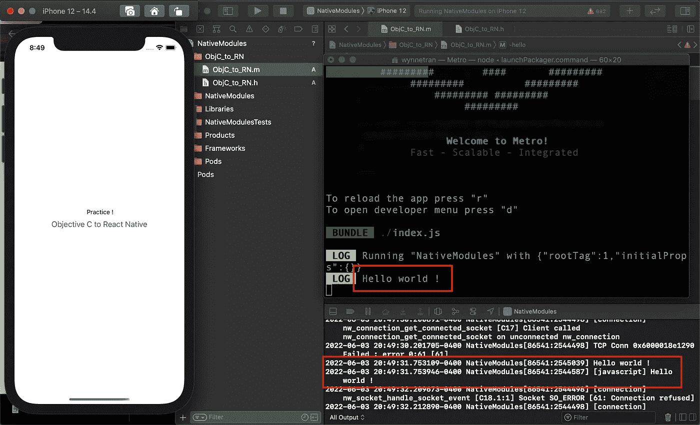

# 本机模块:导出目标 C 模块以本机反应

> 原文：<https://betterprogramming.pub/native-modules-objective-c-to-react-native-for-beginners-9ec49ac5ca65>

## 连接 Objective-C 以反应本机


为了继续与从事移动开发的初学者分享我关于本机模块的知识，本文展示了一个简单的例子，说明如何使用 objective C 编写应用程序并将其导出到 React Native。我们从一个新的 React 原生应用开始:

# **1。创建一个新的 React 原生应用**

```
npx react-native init NativeModules
```

# **2。打开 Xcode**

```
NativeModules/ios/NativeModule.xcworkspace
```


# **3。创建一个头文件，并将其命名为 *'ObjC_to_RN.h'***

现在，我们需要将我们的`@interface`类声明为`NSObject`，它将被导出到 React Native 端:

```
// ***ObjC_to_RN.h***#import <React/RCTBridgeModule.h>**@interface** SampleClass : NSObject <RCTBridgeModule>**@end**
```



# **4。创建一个 Objective-C 文件，并将其命名为 *'ObjC_to_RN.m'***

*   我们从`ObjC_to_RN.h`导入`@interface`类
*   我们创建了一个`@implement`类，它包含了我们想要导出来本地反应的模块和方法
*   写一个简单的函数
*   包装上面的函数并将其导出到 react-native

```
//***ObjC_to_RN.m***
#import <Foundation/Foundation.h>
#import "ObjC_to_RN.h"[@implementation](http://twitter.com/implementation) SampleClassRCT_EXPORT_MODULE();- (NSString *)hello{
NSLog( @"Hello world !");
return @"Hello world !";
}RCT_EXPORT_METHOD(sayHello: (RCTResponseSenderBlock)callback{
callback(@[[NSNull null], self.hello]);
});[@end](http://twitter.com/end)
```



# **4。导出目标 C 模块以反应本机**

回到我们的 react 本地文件夹，打开`App.js`:

```
import React from 'react';
import {StyleSheet, Text, View, NativeModules, Button} from 'react-native';const App = () => {
  const onPress = () => {
    const {SampleClass} = NativeModules;
    SampleClass.sayHello((_err, res) => console.log(res));
  };
  return (
    <View style={styles.container}>
      <Text> Practice !</Text>
      <Button
        title="Objective C to React Native"
        color="#841584"
        onPress={onPress}
      />
    </View>
  );
};
const styles = StyleSheet.create({
  container: {
    flex: 1,
    justifyContent: 'center',
    alignItems: 'center',
  },
});
export default App;
```



我们结束了。

我希望我的文章能帮助人们容易理解如何连接 objective C 并通过 Native 模块反应 Native。



感谢你阅读这篇文章，如果你认为它有帮助，别忘了给我一个掌声。