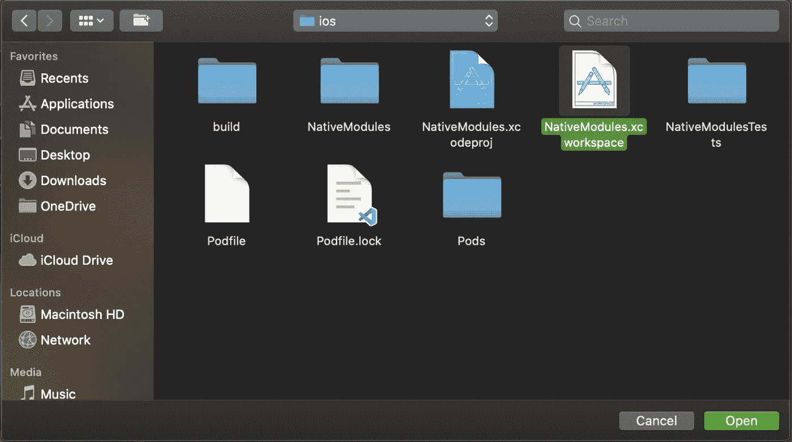
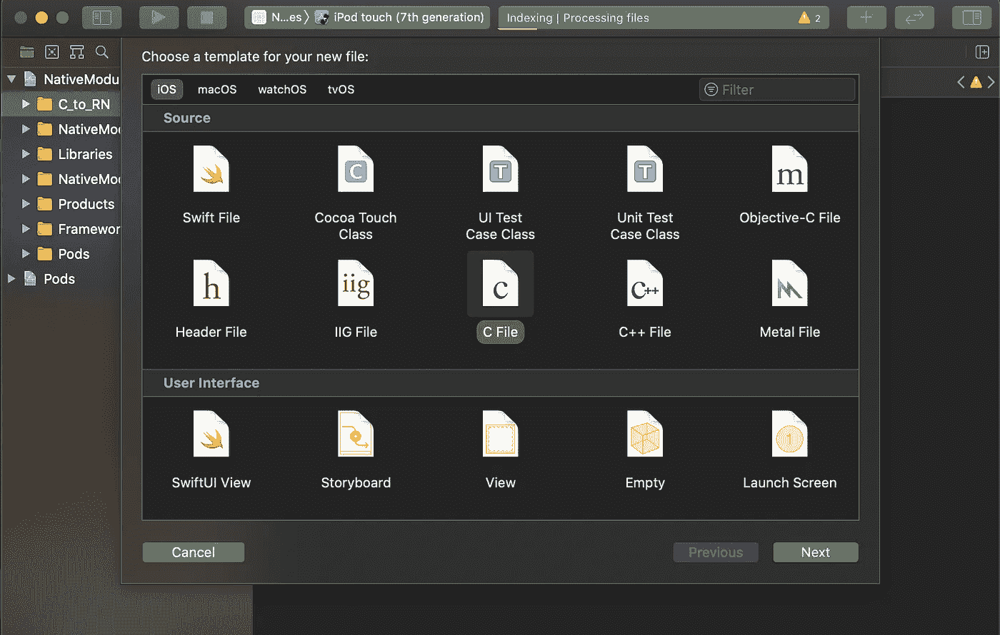
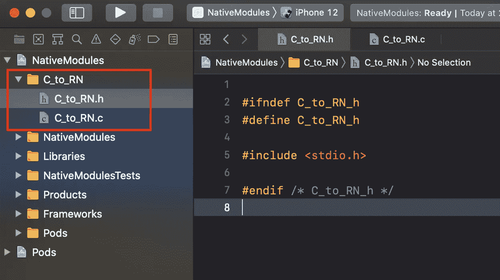
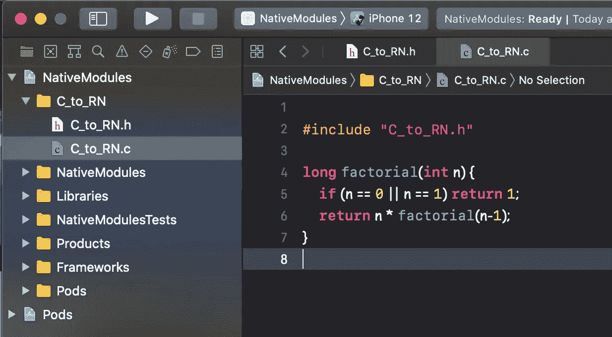
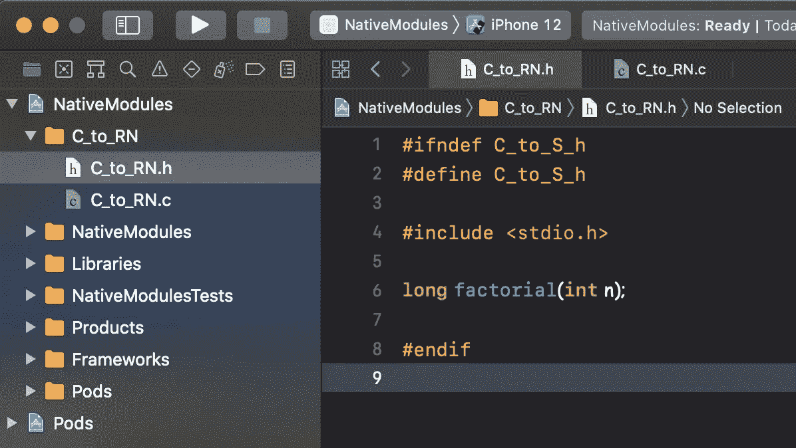
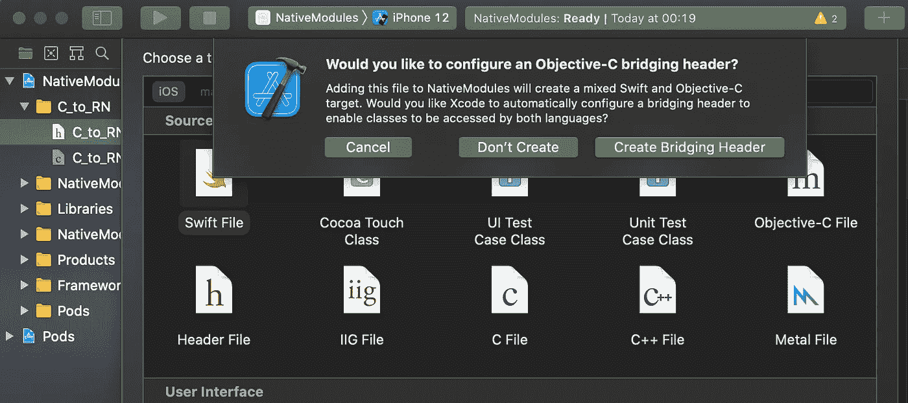
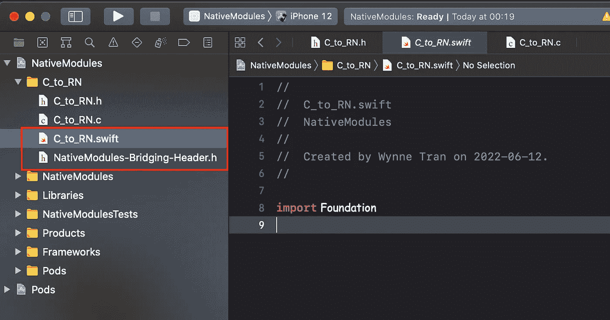
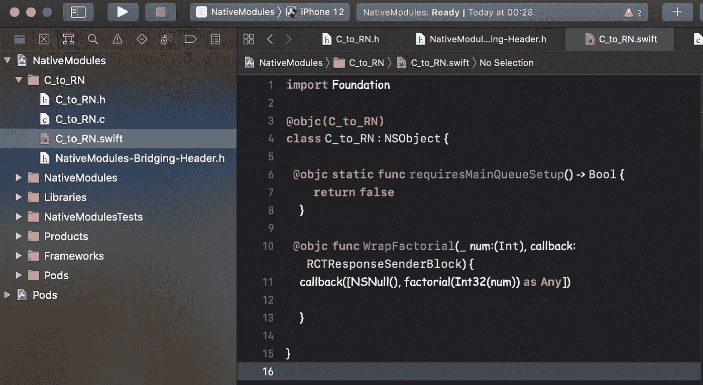
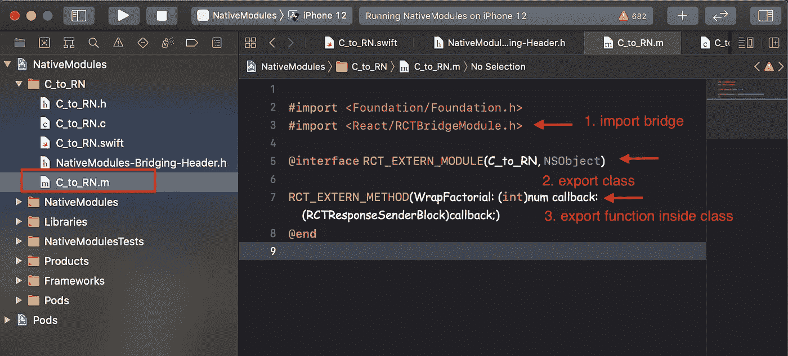
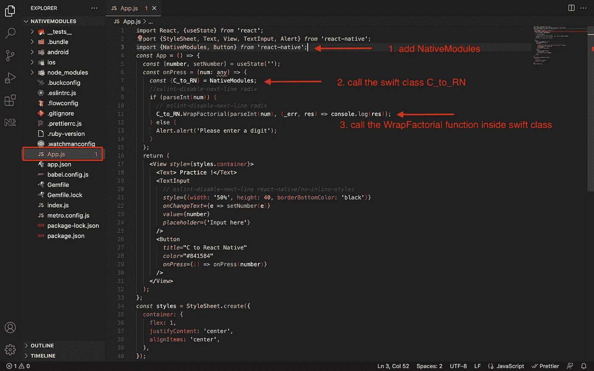

# 本机模块:导出 C 函数来反应本机

> 原文：<https://betterprogramming.pub/native-modules-program-c-to-react-native-for-beginners-b0bc01e94c81>

## 转换 C 库以反应本机


本文的目的是帮助初学者在第一次使用本机模块时节省时间。由于我们将会看到很多移动 C 库，作为一名开发者，你必须将它们转换到 iOS 或 react 原生平台。

为了继续我的原生模块列表，我写了这篇文章来描述我们如何从 C 语言包装和导出一个函数，以在移动开发中进行原生反应。像往常一样，我们从一个新的 react 原生应用开始。

# **1。创建新的 react 原生应用**

打开您的终端并运行:

```
npx react-native init NativeModules
```

# **2。打开 Xcode**

现在导航到:

```
NativeModules/ios/NativeModule.xcworkspace
```



# **3。创建一个 C 文件**

我们创建一个新的文件夹并创建一个新的 c 文件`C_to_RN.c`:



当我们点按“下一步”时，Xcode 会要求我们创建一个头文件:



我们将首先从`C_to_RN.c`开始，编写一个简单的函数:

```
// ***C_to_RN.c***long factorial(int n) {    
  if (n == 0 || n == 1) return 1;    
  return n * factorial(n-1);
}
```



继续，我们把这个函数放到头文件中:

```
// ***C_to_RN.h*****long** factorial(**int** n);
```



# **4。将“ *C_to_RN.c”中的“factorial”函数包装到 Swift 文件***

*   创建一个新的 swift 文件，并将其命名为`C_to_RN.swift`
*   创建新的 swift 文件时，Xcode 会像我们一样创建`NativeModules-Bridging-Header.h`



现在，在 swift 文件中，我们声明一个`C_to_RN` 类为`NSObject`，并将这个类导出到 Objective-C 文件(我们将在下一步创建)`@objc(C_to_RN)` **。**

```
// ***C_to_RN.swift*****@objc(C_to_RN)
class** C_to_RN : NSObject {}
```

接下来，编写两个函数:

*   以防止我们运行 react 本机应用程序时出现警告。
*   从`C_to_RN.c`包装一个“阶乘”函数

```
// ***C_to_RN.swift*****@objc** **static** **func** requiresMainQueueSetup() -> Bool {**return** **false** }**@objc** **func** WrapFactorial(**_** num:(Int), callback: RCTResponseSenderBlock) { callback([NSNull(), factorial(Int32(num)) **as** **Any**])}
```



**5。创建一个新的目标 C 文件，命名为" *C_to_RN.m"***

当然，如果我们想从 Swift 导出一个函数到 React Native，我们需要通过 Objective-C 文件导出它。

如果你是一个没有 Swift 或 Objective C 经验的新生，请浏览我的主题，在这里:

如何将函数从 Objective C 导出到 react-native:

[](https://medium.com/@WynneTran/native-modules-objective-c-to-react-native-for-beginners-9ec49ac5ca65) [## 本机模块:Objective C 为初学者反应本机。

### 为了继续与从事移动开发的初学者分享我关于本机模块的知识，这个…

medium.com](https://medium.com/@WynneTran/native-modules-objective-c-to-react-native-for-beginners-9ec49ac5ca65) 

如何从 Swift 文件中导出一个函数以反应本地:

[](https://medium.com/@WynneTran/native-modules-swift-to-react-native-for-beginners-ecfecd72c0a6) [## 原生模块:Swift 为初学者反应原生。

### 本文是为第一次使用本机模块的初学者编写的。虽然有很多方法可以…

medium.com](https://medium.com/@WynneTran/native-modules-swift-to-react-native-for-beginners-ecfecd72c0a6) 

回到我们的任务，我们将创建一个新的 Objective C 文件，并从 Swift 文件中导出`C_to_RN class`和`WrapFactorial`函数。

```
// ***C_to_RN.m***#import <Foundation/Foundation.h>
#import <React/RCTBridgeModule.h>**@interface** RCT_EXTERN_MODULE(C_to_RN, NSObject)RCT_EXTERN_METHOD(WrapFactorial: (**int**)num callback: (RCTResponseSenderBlock)callback;)**@end**
```



# **6。桥接 iOS 原生(文件夹/模块 C_to_RN)以反应原生**

下一步是通过`NativeModules-Bridging-Header.h`将 iOS 本地连接到 react-native:

```
// ***NativeModules-Bridging-Header.h***#import <React/RCTBridgeModule.h>#import “C_to_RN.h”
```

# **7。从 react-native 端调用 C_to_RN native 模块**

回到 react 原生应用程序，打开`App.js`文件并编写一些代码来获取用户输入和一个按钮来运行该功能。

```
// ***App.js***import React, {useState} from 'react';
import {StyleSheet, Text, View, TextInput, Alert} from 'react-native';
import {NativeModules, Button} from 'react-native';const App = () => {
  const [number, setNumber] = useState('');
  const onPress = (num: any) => {
    const {C_to_RN} = NativeModules;
    if (parseInt(num)) {
      C_to_RN.WrapFactorial(parseInt(num), (_err, res) => console.log(res));
    } else {
      Alert.alert('Please enter a digit');
    }
  };
  return (
    <View style={styles.container}>
      <Text> Practice !</Text>
      <TextInput
        style={{width: '50%', height: 40, borderBottomColor: 'black'}}
        onChangeText={e => setNumber(e)}
        value={number}
        placeholder={'Input here'}
      />
      <Button
        title="C to React Native"
        color="#841584"
        onPress={() => onPress(number)}
      />
    </View>
  );
};
const styles = StyleSheet.create({
  container: {
    flex: 1,
    justifyContent: 'center',
    alignItems: 'center',
  },
});
export default App;
```



我们完成了，让我们运行我们的应用程序，看看结果:


最后，谢谢你看我的文章。