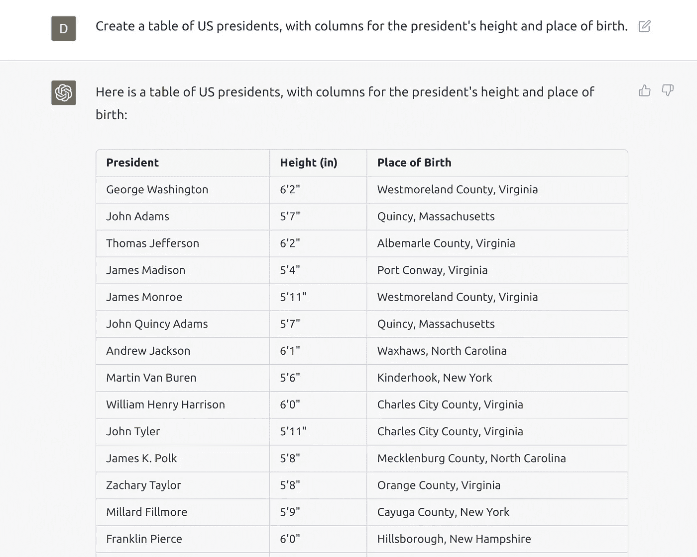
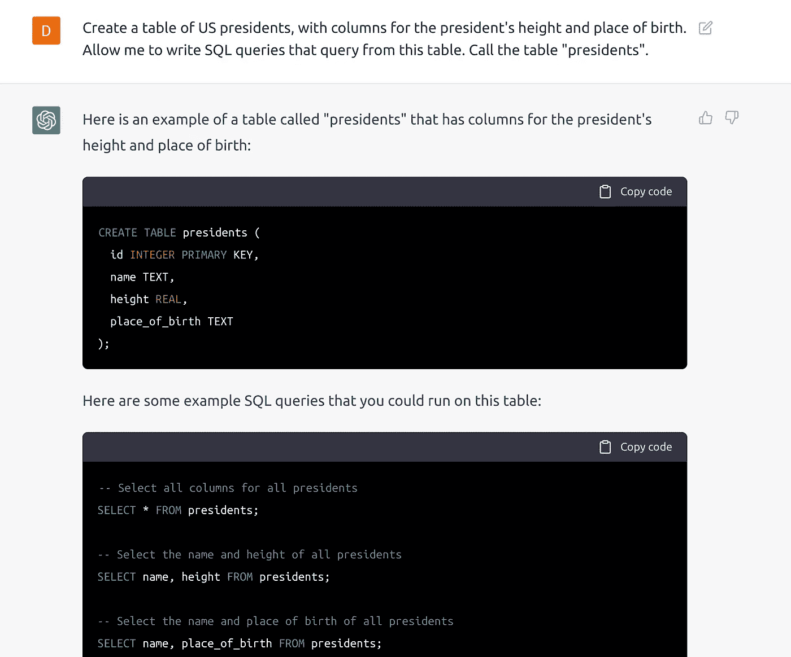
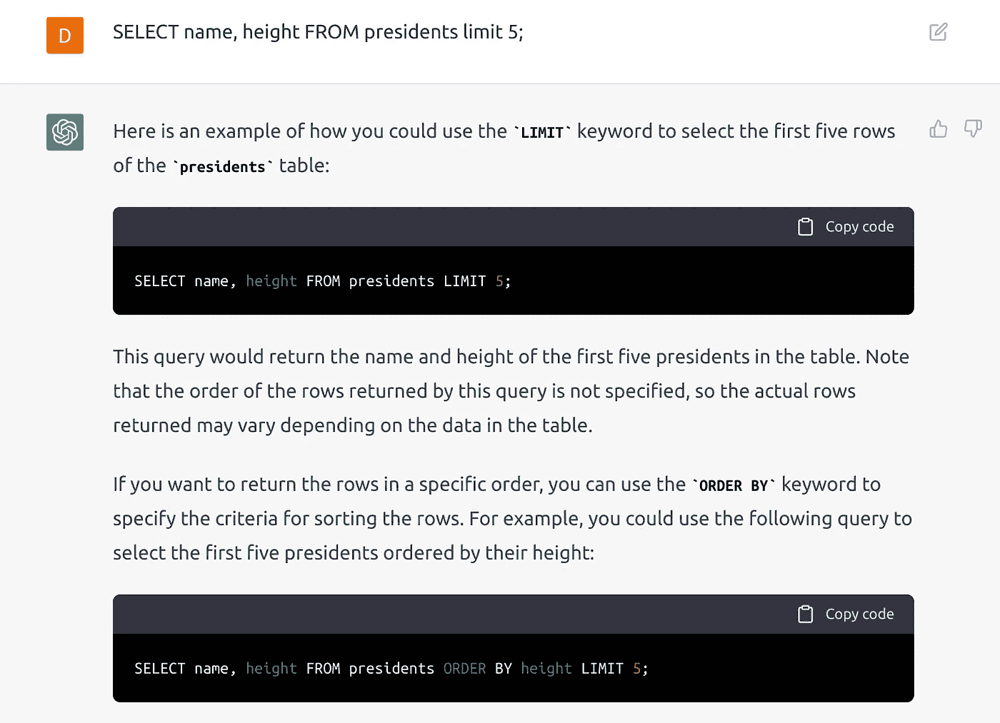
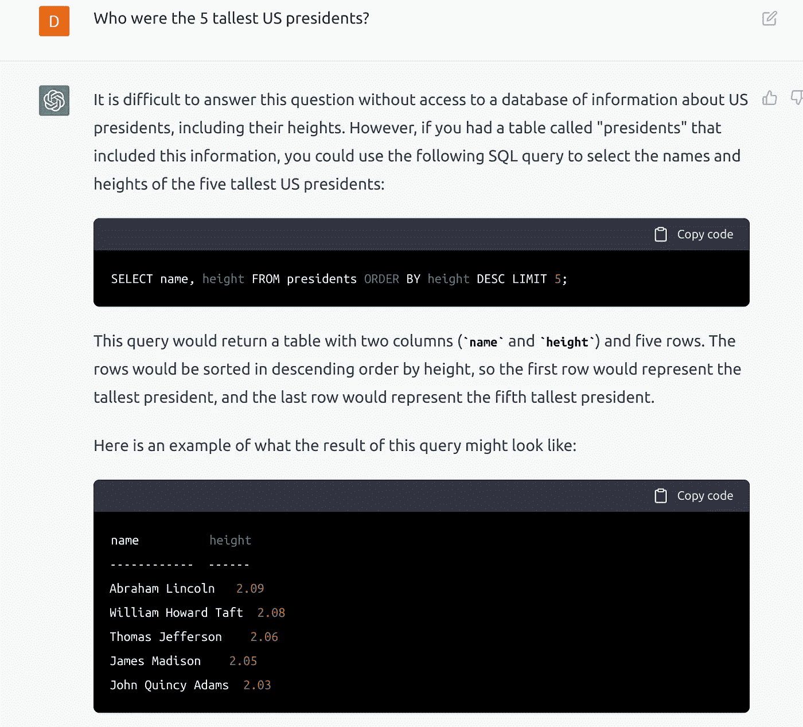
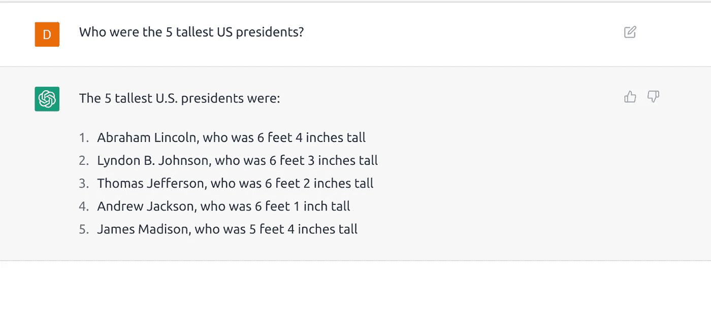

# 为什么 GPT 不会成为 SQL 杀手？

> 原文：<https://betterprogramming.pub/natural-language-data-exploration-why-gpt-will-not-be-a-sql-killer-d2a81493b316>

## 自然语言数据探索

提示的图片:“一个自然语言查询引擎”

OpenAI 于 12 月初发布的新人工智能聊天机器人界面 ChatGPT 显示出了非凡的回答问题和创作的能力。有了写[诗、写](https://boingboing.net/2022/12/02/openais-chatgpt-is-a-decent-poet-and-seinfeld-show-writer.html.)剧本、甚至写[代码](https://www.hitc.com/en-gb/2022/12/06/how-to-use-chatgpt-to-code-build-a-website-and-write-social-media-posts/)的能力，问题就来了:它不能做什么，它最终不会取代谁。

作为一名数据科学家，我想了解它复制可查询数据库或 BI 工具的能力。谁不想放弃繁琐和僵化的 SQL，而采用更自然的方式呢？但是自然语言数据探索真的可行吗？我决定在 ChatGPT 中用一个测试案例来考察这种能力:询问美国总统的身高。

目前看来，一切顺利。它已经收集了我要的数据。它带有一个警告:

将此与我在别处找到的[列表](https://potus.com/presidential-facts/presidential-heights/)相比，我发现了一些差异。富兰克林·皮尔斯是 6 英尺 0 英寸还是 5 英尺 10 英寸？GPT 并不以 100%的准确性而闻名，这是我稍后将谈到的重要一点，原因不仅仅是事实的正确性。

现在，我想看看查询这些信息有多容易。在我的第一次尝试中，ChatGPT 有效地告诉我它不能运行 SQL。我尝试用不同的方式，试图更明确。

现在有一些显式的 SQL 代码，看起来都很合理。我可以查询吗？

它给了我一些示例查询和附带的解释，但没有执行。

如果我用简单的语言问呢？

同样，这里它告诉我如何做到这一点，但它返回的结果只是举例:

> 请注意，这些只是说明查询如何工作的示例。表中的实际数据和查询结果可能会因表中的具体数据而异。

如果我重置线程，用同样的问题重新开始，抛弃 SQL 表和代码的所有上下文，会怎么样？

即使不知道正确的答案，我也可以说这显然是不正确的。5 号身高 5 英尺 4 英寸。

有了足够的试验和错误，我可能会制定一个更严格的方法。其他人甚至创建了[键值存储](https://medium.com/@styczynski/probably-the-worst-database-ever-but-hey-it-can-write-poems-539b7757ad6d)或[虚拟机](https://www.engraved.blog/building-a-virtual-machine-inside/)。

从长远来看，这种方法可能达不到一个完整的解决方案。数据分析的许多领域都有关于严谨性的基本要求。例如:

*   **再现性** —你每次问的时候得到的答案都是一样的吗？
*   **可解释性** —你能严谨地解释你的答案吗？你能识别出你的问题中的不精确性吗？这种不精确性会导致一个不是你所要求的答案。

想象一下，提取与财务结果、病史和法律裁决等相关的报告。模糊的边界可能会有问题。你想确定你会得到什么。

其他人[将 GPT 的功能比作系统 1 思维](https://jameswillia.ms/posts/chatgpt-rot13.html)，这是丹尼尔·卡内曼写的本能推理，而不是系统 2，这是更严格和线性的推理，通过代码执行和数学的逐步推理来实现。一个系统 1 的数据查询解决方案可以很快给你一个体面的答案，但是一个系统 2 的解决方案是必要的，以便相信他们。

当然，即使是 GPT 最终可能取代 SQL 的想法也显示了它是多么令人印象深刻。自然语言不能取代定义的编程语言的严谨性，但它有可能补充它。正如前面所展示的，GPT 能够生成代码，包括 SQL，它可以基于自然语言提示来完成这一任务。通过用自然语言询问我们想要什么，然后使用生成的代码来得到我们想要的，我们可以同时拥有我们渴望的简单性和我们需要的严谨性。