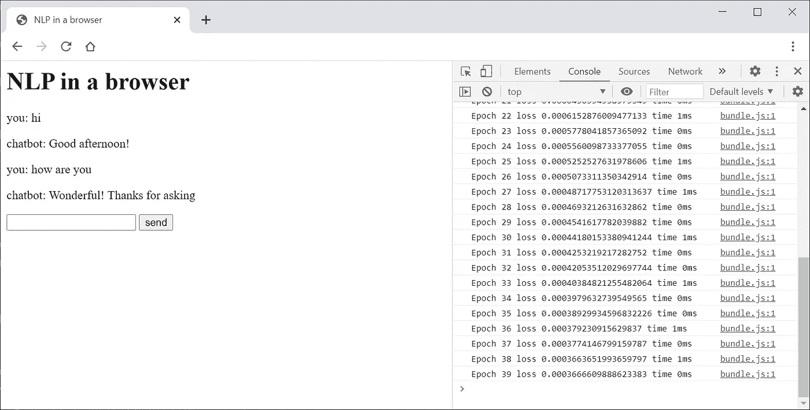
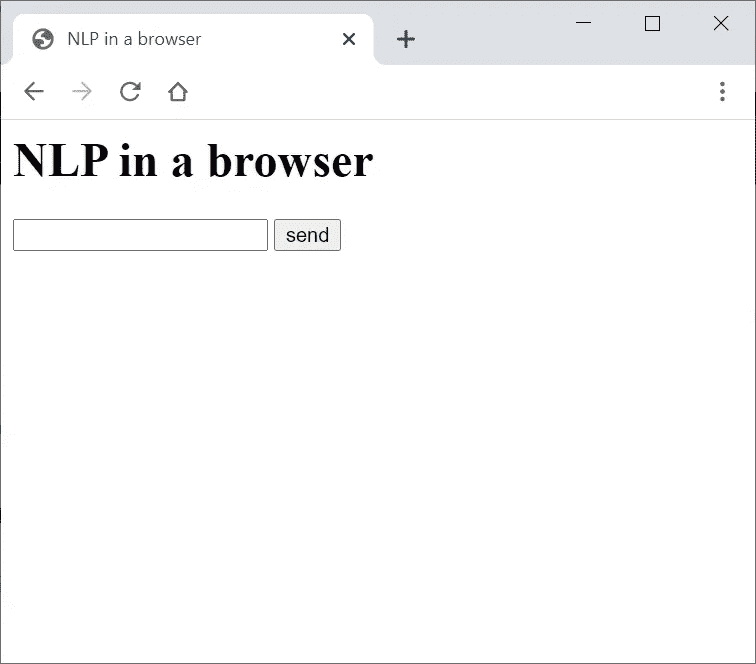
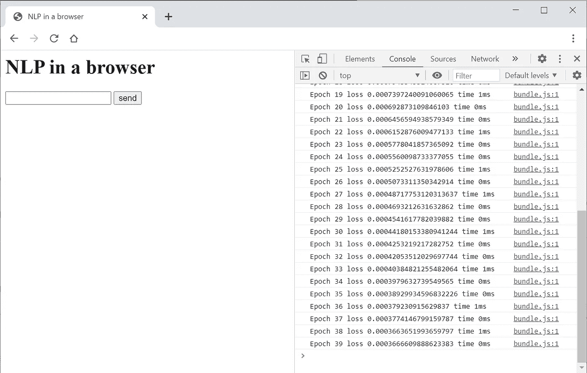
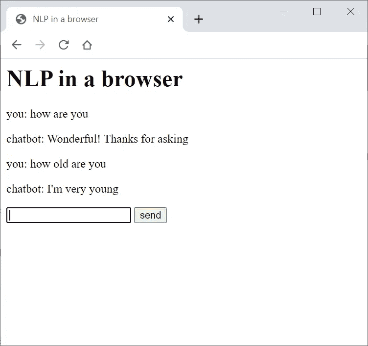
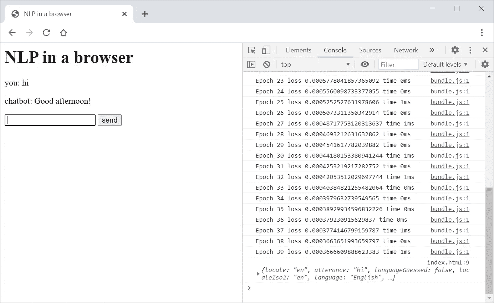

# 浏览器中的自然语言处理

> 原文：<https://betterprogramming.pub/natural-language-processing-in-the-browser-8ca5fdf2488b>

## 如何为你的网站建立一个无服务器的 NLP 聊天机器人



图片来源:作者

你可以为自己的网站建立一个聊天机器人，而不依赖于第三方服务，如 [Dialogflow](https://cloud.google.com/dialogflow/docs) 或 [Watson](https://www.ibm.com/watson) ，也不需要服务器。我将向你展示如何建立一个聊天机器人，将完全运行在浏览器中。

我将假设您对 JavaScript 有所了解，并对自然语言处理的工作原理有所了解。不需要高深的知识或者机器学习经验。

如果有人告诉你，在使用 JavaScript 的浏览器中进行机器学习是疯狂的，那么不要听那个，因为很快你自己就会更清楚。

我们的代码将基于 [NLP.js](https://github.com/axa-group/nlp.js) 版本 4。 [NLP](https://github.com/axa-group/nlp.js) 是一个用 JavaScript 编写的自然语言处理开源库。该项目将允许您直接在浏览器中从语料库中训练 NLP，并添加一个挂钩到任何意图，以编程方式改变答案。

最终的项目可以在我的 GitHub 资源库中找到:[https://github.com/MeetMartin/nlpjs-web](https://github.com/MeetMartin/nlpjs-web)。你可以下载它，打开 index.html，然后玩最后的聊天机器人。

现在每个真正的开发者都应该有一些人工智能的经验，还有什么比用你自己开发的东西和你的计算机说话更科幻的呢？

# 安装软件包

在任何文件夹中创建新的 npm 项目并安装 NLP 包:

```
npm i -D @nlpjs/core @nlpjs/lang-en-min @nlpjs/nlp @nlpjs/request-rn@nlpjs/request-rn
```

我们还需要[browser verify](https://github.com/browserify/browserify#usage)和 [terser](https://terser.org/docs/cli-usage) 来构建供浏览器使用的 NLP:

```
npm i -D browserify terser
```

享受新项目和新安装的软件包的味道。你应得的。

# 构建 NLP

第一步是使用 browserify 和 terser 构建 NLP。为此，我们只需要在 buildable.js 中创建一个基本的设置:

我们只使用了 NLP 的核心和一个小的英语包。要构建所有东西，只需在您的`package.json`中添加一个构建命令:

现在运行构建:

```
npm run build
```

您最终应该得到只有大约 137 KB 的`./dist/bundle.js`。值得注意的是，NLP 有一个令人印象深刻的支持语言列表。然而，只有英语有针对浏览器的优化版本。

# 在浏览器中训练 NLP

现在我们已经创建了我们的包，我们可以在浏览器中训练我们的 NLP。创建此`index.html`:

我们的功能`setupNLP`负责图书馆的设置和培训。语料库是一个 JSON 文件，它以这种格式为我们的聊天机器人定义对话:

*intent* 是一个会话节点的唯一标识符，它的名字应该代表聊天机器人所反应的用户的意图。*话语*是用户可以说什么来触发意图的一组训练示例。*答案*是聊天机器人将从中随机选择的一组回答。

为了训练我们的聊天机器人，我们从图书馆的示例中借用了更大的语料库:[https://raw . githubusercontent . com/Jesus-seijas-sp/nlpjs-examples/master/01 . quick start/02 . file corpus/corpus-en . JSON](https://raw.githubusercontent.com/jesus-seijas-sp/nlpjs-examples/master/01.quickstart/02.filecorpus/corpus-en.json)。但是对于您的用例，请随意创建您自己的语料库。请记住，库期望从某个 URL 读取语料库。

当您在浏览器中打开`index.html`时，您应该会看到一个简单的聊天表单，它还没有做任何事情。



但是，如果您打开浏览器控制台，您已经可以看到成功的培训输出:



训练速度非常快，可以让你的聊天机器人在浏览器中使用训练好的模型。这是一种更有效的方法，因为语料库文件比生成的模型小得多。

训练你的第一个机器学习代码感觉很棒。你刚刚成为一个传奇，成为这个星球上少数几个可以说:“是的，我曾经训练过一个人工智能，这没什么大不了的。”

# 聊天机器人 HTML

现在，我们将使聊天机器人的形式工作。通过添加`onChatSubmit`功能扩展您的`index.html`:

现在您可以玩您的新聊天机器人了:



浏览您的语料库或[https://raw . githubusercontent . com/Jesus-seijas-sp/nlpjs-examples/master/01 . quick start/02 . file corpus/corpus-en . JSON](https://raw.githubusercontent.com/jesus-seijas-sp/nlpjs-examples/master/01.quickstart/02.filecorpus/corpus-en.json)上的语料库，了解支持哪些对话主题。

现在，你可以在酒吧里向你的朋友展示这个东西，很容易获得他们的赞赏，因为现在你是一个真正的黑客了。

# 向意图添加挂钩

您可能希望您的聊天机器人能够为每个意图调用一些额外的代码，或者用一些 API 调用替换一些意图的答案。让我们将`index.html`扩展到它的最终版本。

在我们的`setupNLP`中，我们添加了一行:

```
nlp.onIntent = onIntent;
```

我们创建了`onIntent`函数。请注意，`onIntent`将响应对象记录到您的控制台中，用于每个意图。它还通过用基于用户当前时间的答案替换其输出，为`greetings.hello`的意图增加了逻辑。对我来说，现在是下午:



这不是很棒吗？如果你觉得已经准备好创建自己的人工智能创业公司，击掌吧。

# 已知限制

请注意，NLP.js 的浏览器版本不支持一些常见的自然语言处理功能，例如完整库中可用的命名实体或实体提取。

作为一个库，NLP.js 目前也不支持故事或后续意图。这些是当前 chatbot 编排开发的一部分，但在撰写本文时，该功能仍处于试验阶段。

# 安全和隐私考虑

当使用这个解决方案时，请记住，所有访问您网站的人都可以在浏览器中看到整个语料库及其功能。这也让任何人都能够简单地下载你的语料库，操纵它，或者使用它。确保你的机器人不会暴露任何私人信息。

使用纯浏览器解决方案有一定的优势，但也失去了一些机会，因为您仍然需要一些后端解决方案，以便能够记录用户使用您的聊天机器人谈论的内容。同时，如果你记录整个对话，请考虑隐私问题，尤其是在 GDPR 这样的立法环境下。


# 关于作者

**马丁·诺瓦克**T7[www.meet-martin.com](https://www.meet-martin.com/)

马丁是一位经验丰富的管理者，拥有领导国际团队的丰富经验，也是 [@7urtle/lambda](https://www.7urtle.com/) 函数式编程库的创始人。