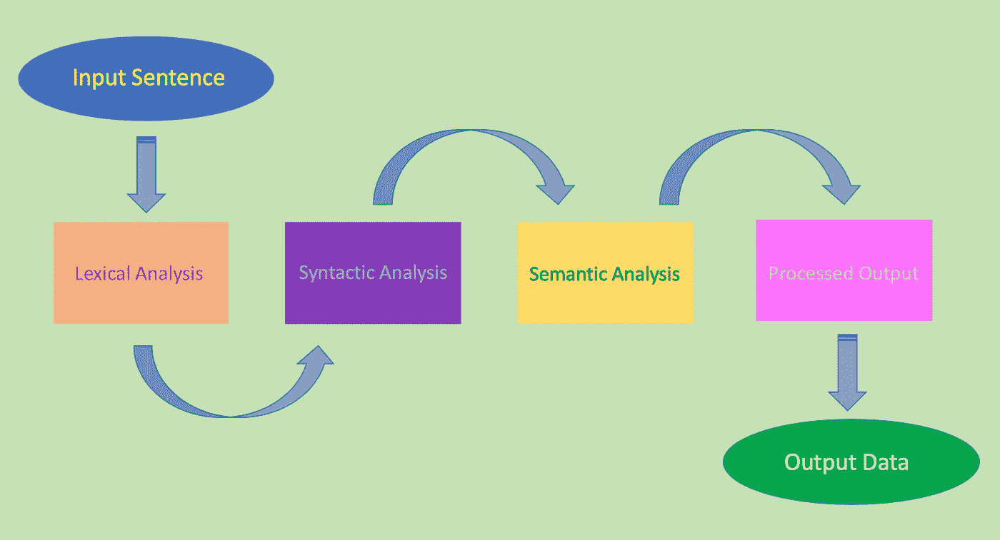
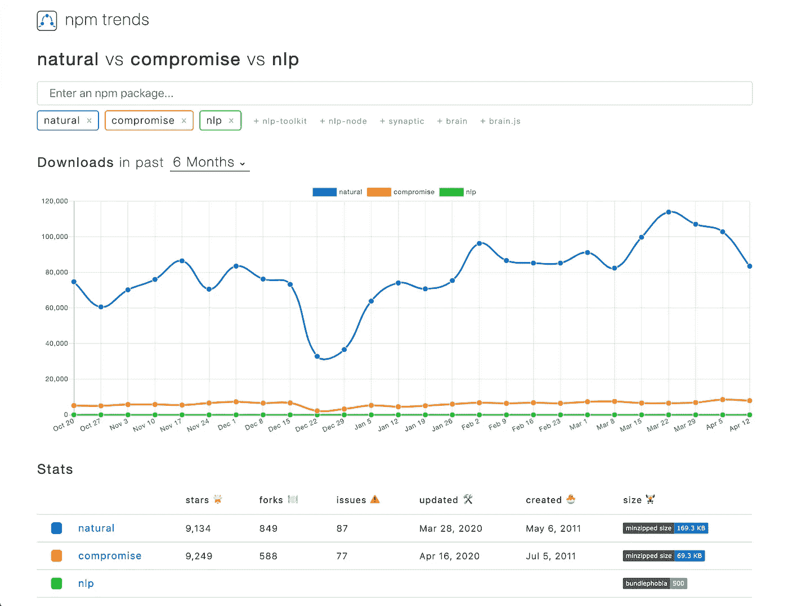
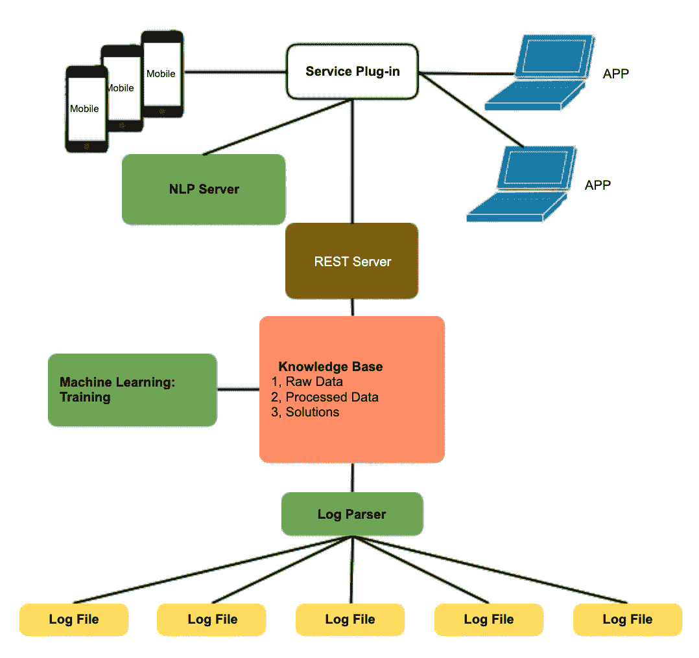
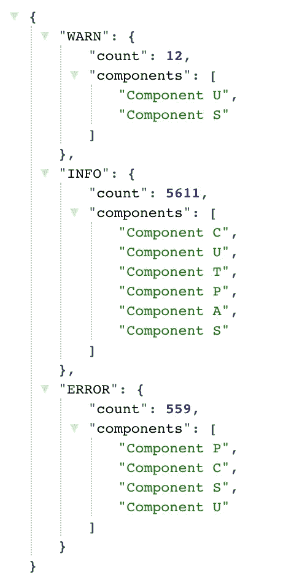
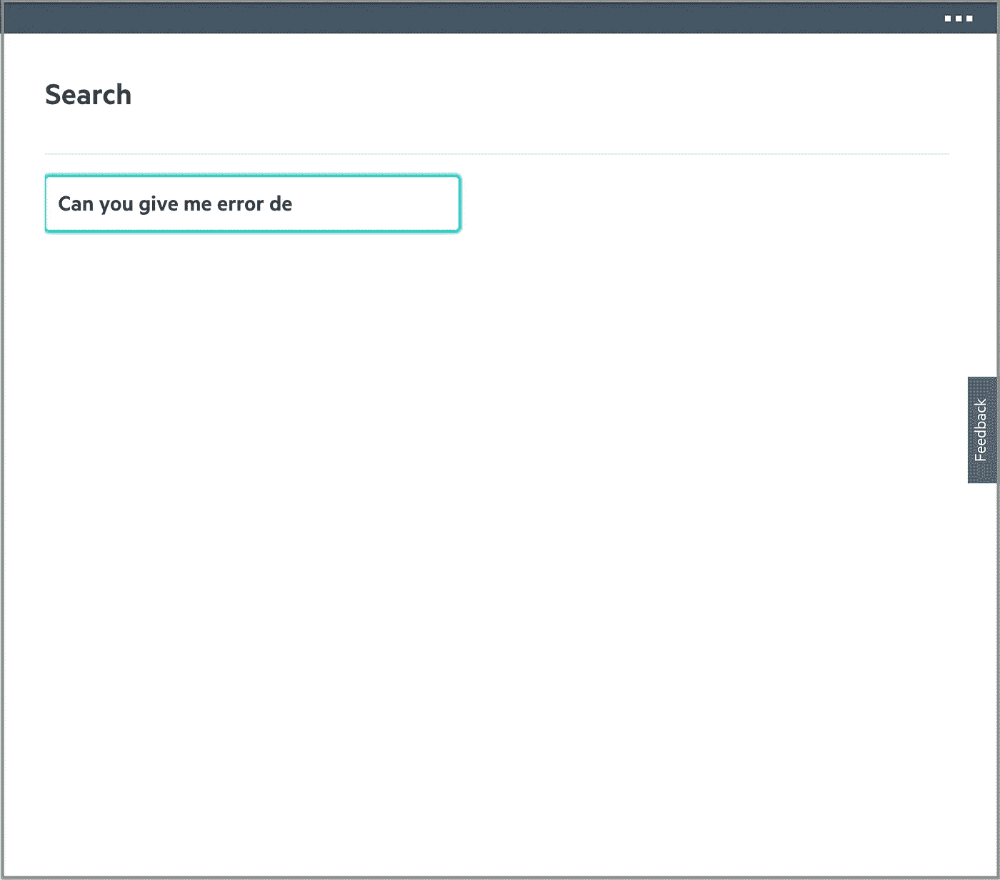

# 用 Node.js 进行自然语言处理

> 原文：<https://betterprogramming.pub/natural-language-processing-with-node-js-afb62729c1a2>

## 让我们构建一个基于 GUI 的服务，使用基于知识的人工智能和自然语言处理来分析日志


[万花筒](https://unsplash.com/@kaleidico?utm_source=unsplash&utm_medium=referral&utm_content=creditCopyText)在 [Unsplash](https://unsplash.com/collections/1196532/people-%2B-work?utm_source=unsplash&utm_medium=referral&utm_content=creditCopyText) 上拍摄的照片

自然语言处理(NLP)是[基于知识的人工智能](https://www.mkbergman.com/1816/knowledge-based-artificial-intelligence/)的一个分支。它旨在帮助计算机接收自然语言并破译其含义，以提供适当的响应。

下面是 NLP 工作流程:



根据 Darren Wong、Winnie Tseng Mueller、Judy Wu 和 Astha Sirohi 的研究报告，我们可以在四个主要领域应用 NLP。

## 发现信息

通过语音或文本帮助提供餐饮信息，并通过基于知识的人工智能支持为客户提供方便的帮助。

## 让搜索变得智能

搜索是万维网以及任何软件系统的一个重要特征。有许多方法可以提高搜索效率:

*   **搜索自动更正:**自动更正或建议更正键入时出现的拼写或语法错误
*   **搜索自动完成:**为用户提供了一个选项，在之前输入的基础上，通过速记方法来完成单词或表格
*   **智能搜索:**根据用户的历史和客户拥有的相关服务或产品准备建议

## 内容分类

分析来自非结构化数据的信息。通常，机器学习被用于识别和分类数据，此外，还用于生成有用的见解。

## 预测/诊断辅助

跟踪客户拥有的产品更新/服务，并建议相关的基于知识的帮助，以帮助他们预测和诊断。

在本文中，我们将重点放在使用自然语言进行搜索。

# 机器学习最流行的前 5 种编程语言是什么？

以下是 2020 年机器学习的[前 5 名编程语言列表](https://becominghuman.ai/best-languages-for-machine-learning-in-2020-6034732dd242):

```
1\. Python
2\. Java
3\. R
4\. JavaScript
5\. Scala
```

JavaScript 是流行的编程语言之一。随着 Node.js 的使用越来越多，越来越多的开发者选择 JavaScript 进行人工智能和机器学习项目。

# 什么是 JavaScript NLP 开源？

有许多 JavaScript NLP 开放源代码:

*   `[natural](https://github.com/NaturalNode/natural)`:这是一个通用的自然语言工具，支持分词、词干、分类、语音、[TF–IDF](https://en.wikipedia.org/wiki/Tf%E2%80%93idf)、 [WordNet](https://en.wikipedia.org/wiki/WordNet) 、字符串相似性和一些变形
*   `[compromise](https://github.com/spencermountain/compromise)`:这是一个基于规则的、与 [Brill tagger](https://en.wikipedia.org/wiki/Brill_tagger) 相关的 NLP 库，它倾向于用最小的、最不花哨的解决方案将文本转换成可管理的形式。这个库不是最精确的，但是它是一个简单的，小型的，可以在任何地方运行的库。
*   `[nlp](https://www.npmjs.com/advisories/report?package=node-nlp)`:这是一个通用的自然语言工具，支持分词、词干、分类、字符串相似性、猜测语言等。

下图测量了基于 npm 下载的三个 NLP 包:



# 自然的能力是什么？

我们选择了`natural`来探索 NLP 的能力。首先，安装软件包:`npm install natural`。

`natural`是 Node.js 包，不是浏览器包。令人惊讶的是，我们设法在 React 组件中执行它，几乎没有警告。

为了使用该套件，需要包括`natural`模块:

```
const natural = require('natural');
```

## 标记化者

一个*记号赋予器*将文本分解成一个记号数组。除了字母字符、数字和下划线之外，它可以对任何内容进行拆分。提供了许多记号赋予器，它们在文本拆分方式上有所不同。

```
const tokenizer = new natural.WordTokenizer();
tokenizer.tokenize('Machine learning is awesome!'));
// ["Machine", "learning", "is", "awesome"]
```

## 字符串距离

*字符串距离*测量两个字符串之间的距离。提供了许多算法，用不同的方法计算字符串距离。

[*汉明距离*](https://en.wikipedia.org/wiki/Hamming_distance) 通过统计不同字符的个数来度量两个等长字符串之间的距离。第三个参数指示是否应该忽略大小写。默认情况下，该算法区分大小写。

```
natural.HammingDistance('AI', 'ai', false); 
// 2natural.HammingDistance('AI', 'ai', true); 
// 0natural.HammingDistance('AI', 'artificial intelligence', true); 
// -1
```

## 茎干工

*词干化*是将词干、词根或词根形式的词形变化或衍生词简化的过程。支持许多词干分析器。

波特词干分析器(Porter stemmer)是一种从英语单词中去除常见的词形和词尾变化的过程。

```
natural.PorterStemmer.attach();
const sentence = 'A process for removing the commoner morphological and inflexional endings from words in English.';
sentence.tokenizeAndStem();
// ["process", "remov", "common", "morpholog", "inflexion", "end", "word", "english"]
```

## 分类器

分类器根据包含已知类别成员的观察值的训练数据集，预测新输入所属的可能类别。支持许多分类器。

[贝叶斯分类器](https://en.wikipedia.org/wiki/Naive_Bayes_classifier)是基于应用[贝叶斯定理](https://en.wikipedia.org/wiki/Bayes%27_theorem)和特征之间的强独立性假设。

```
// create a BayesClassifier
const dayAndNightClassifier = new natural.BayesClassifier();// supply a training set of data for two membership: night and day
dayAndNightClassifier.addDocument('Moon is in the sky', 'night');
dayAndNightClassifier.addDocument('I see starts', 'night');
dayAndNightClassifier.addDocument('It is dark', 'night');
dayAndNightClassifier.addDocument('Sun is in the sky', 'day');
dayAndNightClassifier.addDocument('It is bright', 'day');// training
dayAndNightClassifier.train();dayAndNightClassifier.classify("I see a bright Sun");
// new input is classified as day
```

训练结果可以保存到 JSON 文件中:

```
dayAndNightClassifier.save('dayAndNightClassifier.json', (err, classifier) => {
  if (err) {
    throw new Exception(err);
  }
  console.log(classifier);
});
```

可以加载保存的 JSON 文件以供重用:

```
natural.BayesClassifier.load('dayAndNightClassifier.json', null, (err, classifier) => {
  if (err) {
    throw new Exception(err);
  }
  console.log(classifier);
});
```

下面是保存的内容`dayAndNightClassifier.json`。

```
{
  "classifier":{
    "classFeatures":{
      "night":{
        "0":2,"1":2,"2":2,"3":2
      },
      "day":{
        "1":2,"4":2,"5":2}
      },
    "classTotals:{
      "night":4,"day":3
    },
    "totalExamples":6,
    "smoothing":1
  },
  "docs":[
    {
      "label":"night","text":["moon","sky"]
    },
    {
      "label":"night","text":["start"]
    },
    {
      "label":"night","text":["dark"]
    },
    {
      "label":"day","text":["sun","sky"]
    },
    {
      "label":"day","text":["bright"]
    }
  ],
  "features":{
    "moon":1,"sky":2,"start":1,"dark":1,"sun":1,"bright":1
  },
  "stemmer":{},
  "lastAdded":5,
  "events":{
    "_events":{},"_eventsCount":0
  }
}
```

# 该项目

我们的项目提供了一个基于 GUI 的服务来分析日志文件，使用基于知识的 AI 和 NLP 来提取和形成智能，以更好地支持客户和增加销售。



该系统提供多种服务:

*   将原始日志文件解析成结构化的 JSON 对象
*   通过机器学习训练模型构建包含原始数据、处理过的数据和解决方案的知识库
*   通过 REST 服务器提供对知识库的访问
*   提供由 NLP 引擎和 REST 服务器提供服务的 GUI 前端

本文描述了工作的第一部分:由 NLP 引擎和 REST 服务器提供的基于 GUI 的服务。

## 日志文件

*日志文件*是记录信息系统运行时发生的事件和/或警报的文件。

通常，有多个日志文件从不同方面追踪原始数据。日志文件是知识库的来源。

## 知识库

知识库是这个项目的核心。这是一种集中的数据服务，用于传播信息和数据。

通过收集、组织、检索和共享知识，它形成了预测/诊断辅助的基础。

## REST 服务器

REST 服务器从 GUI 的服务模块获取 API 调用，并用知识库中的分析结果进行响应。

这是简化的 JSON 表示:



## NLP 服务器

NLP 服务器从 GUI 的服务模块中获取自然语言句子，并用格式化的 REST 调用进行响应，以检索和构造答案。

`nature`的分类器可以用记号、字符串或者两者的任意混合来训练。我们使用令牌训练根据两个特征对输入进行分类:

*   **日志级别:** `info`、`warn`或`error`
*   **展示格式:**简单计数或带详细信息

```
const logLevel = new natural.LogisticRegressionClassifier();
logLevel.addDocument('info', 'info');
logLevel.addDocument('information', 'info');
logLevel.addDocument('warn', 'warn');
logLevel.addDocument('warning', 'warn');
logLevel.addDocument('error', 'error');logLevel.train();const presentationFormat = new natural.LogisticRegressionClassifier();
presentationFormat.addDocument('How many', 'count');
presentationFormat.addDocument('number', 'count');
presentationFormat.addDocument('describe', 'detail');
presentationFormat.addDocument('description', 'detail');
presentationFormat.addDocument('detail', 'detail');presentationFormat.train();
```

## 图形用户界面

这是用户提问随机问题的用户界面:


用户可以键入自然语言风格的问题:



最初的工作仅限于一个关于日志级别的问题，无论是`info`、`warn`还是`error`。支持两种响应格式:简单计数或包含详细信息的计数。

对于这个问题——“你能给我错误的细节吗？”— NLP 确定这是在询问有关错误消息的详细信息。然后，GUI 会做出相应的响应。


对于这个问题——“有多少条信息消息？”— NLP 确定这是在询问有关 info 消息的计数信息。然后，GUI 会做出相应的响应。


在有限的范围内，自然语言搜索非常智能。

# 结论

1950 年，艾伦·图灵出版了《计算机械与智能》，他在书中提出了*模仿游戏*，后来被称为*图灵测试。*

七十年过去了。AI 已经取得了巨大的进步，Alexa 在家庭房间里说话，iPhone 通过面部识别解锁，自动驾驶汽车在路上行驶。

在小范围内，你可以从 GitHub 下载一个 NLP 包，`natural`，`compromise`，`nlp`，或者别的什么。AI 几分钟就在你的指尖。你的下一件大事可能从这里开始。你想试一试吗？

本项目由 Jennifer Fu、Astha Sirohi、Darren Wong、、Victor Zhang、Jonathan Ma 和共同完成。

感谢阅读。我希望这有所帮助。你可以在这里看到我的其他媒体出版物。