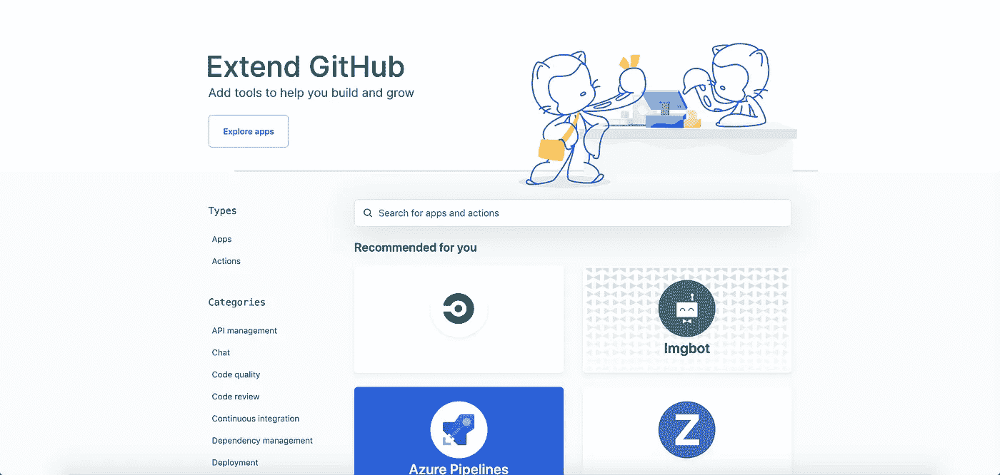
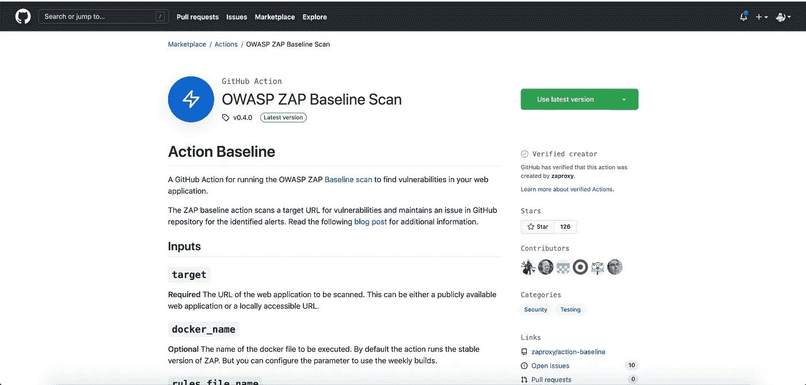
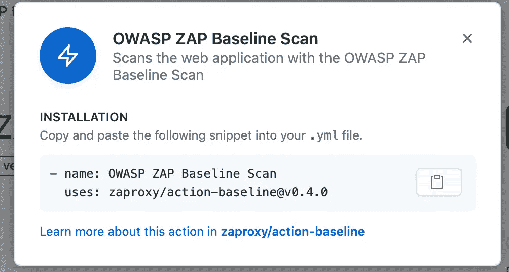
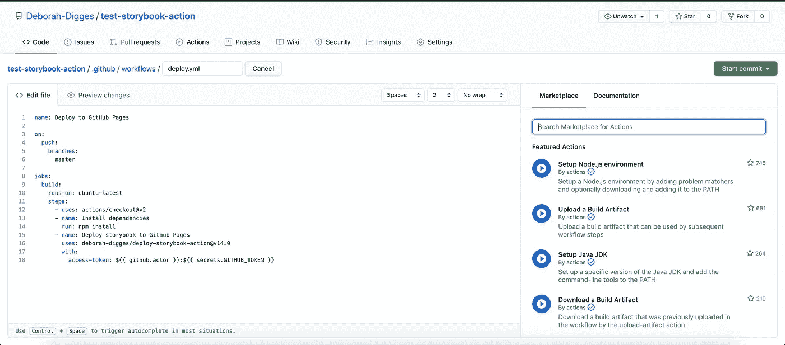
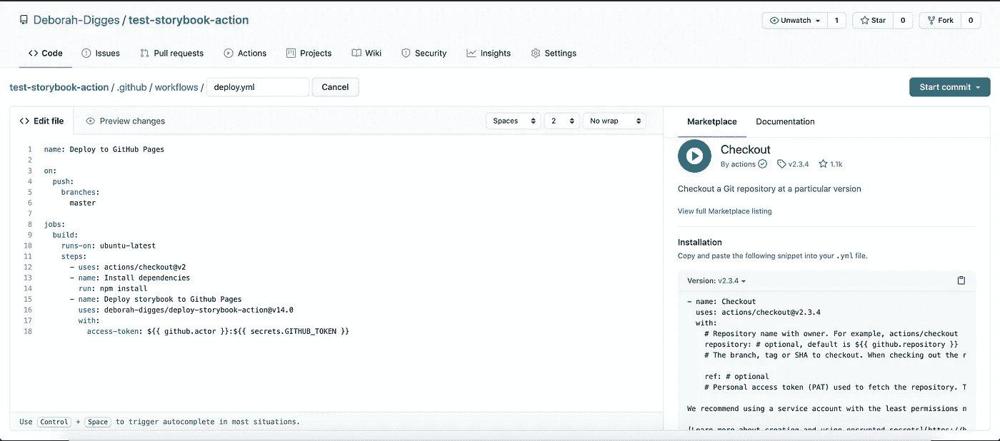
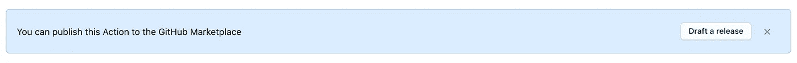
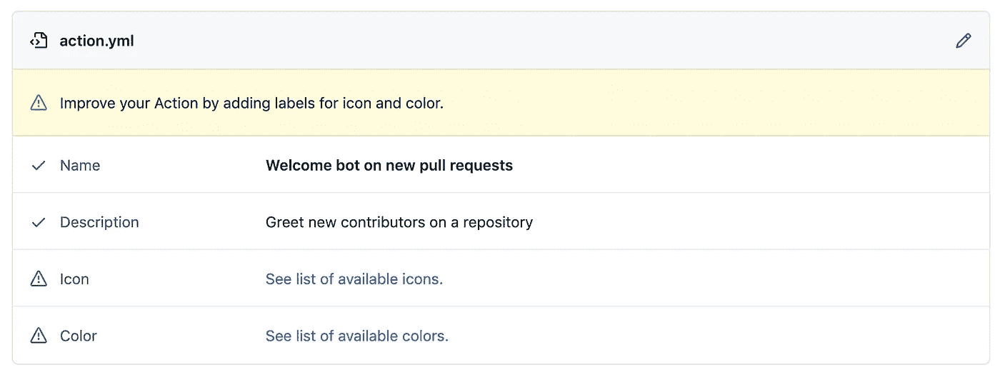
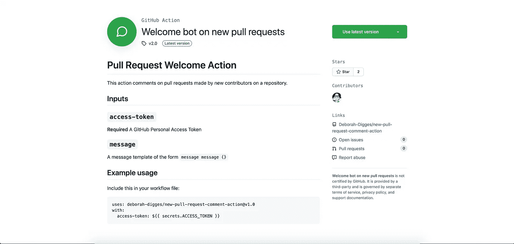
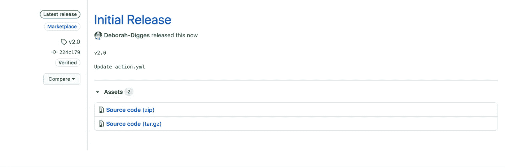

# 浏览 GitHub 市场

> 原文：<https://betterprogramming.pub/navigating-the-github-marketplace-95e20899adde>

## 如何搜索动作，让你依赖的动作保持最新，发布自己的动作


GitHub 市场— [来源](https://github.githubassets.com/images/modules/site/social-cards/marketplace.png)

在我之前探索 GitHub 动作的文章中，我深入研究了如何在 [GitHub 市场](https://github.com/marketplace)上使用公共动作。在这篇文章中，我想回顾一下作为一名开发人员如何有效地在市场中导航。

# 搜索操作

有两种方法可以搜索公共 GitHub 操作。

## 直接在 GitHub 市场

GitHub 市场是两种扩展 GitHub 核心功能的工具的家园:

1.  应用程序
2.  行动

要直接在 GitHub Martketplace 中搜索动作，可以通过侧边栏中的`Actions`类型进行过滤。



GitHub 市场

一旦找到感兴趣的动作，就可以通过点击`Use latest version`按钮在 GitHub 工作流中使用它。



市场上的 GitHub 行动

然后，您可以将 YAML 片段复制到工作流文件中。



在您的工作流程中包含 GitHub 操作的 YAML 片段。

当我开始使用 GitHub Actions 时，我对这个工作流并不感到兴奋，我希望像一个单击选项一样将一个操作加入到我的工作流中。我最近发现，这可能以一种不同于我所希望的方式实现。

## 在 GitHub 工作流编辑器中搜索动作的更好方式

在 GitHub 编辑器中打开一个 GitHub 工作流文件，会在右侧弹出一个搜索栏，允许您搜索 GitHub 操作以添加到您的工作流中，而无需离开您的工作流编辑器！



在 GitHub 中直接编辑工作流文件时的 GitHub Marketplace 搜索栏

这为您提供了添加操作所需的代码片段。



搜索栏中特定操作的详细信息

这仍然涉及到从一个地方复制 YAML 到另一个地方，但这比以前必须从市场上一路复制 YAML 的工作流程要好得多。

# 利用来自 GitHub 市场的公共行动

在我们上面复制的 YAML 代码片段中，使用以下语法指定了一个公共操作:

`{org/username}/{repository-name}@version`

# 使用动作的特定版本

以上格式的版本可以是:

1.  **提交散列**:提交散列是版本控制最健壮的形式，因为与可以删除的标签或可以更新的分支不同，它是存储库历史中的一个冻结点(除非有人做了一些愚蠢的事情，比如强制推送至主节点)。然而，使用这种方法也有缺点；首先，你不能依赖任何类型的动作自动版本升级(稍后会有更多的介绍)。
2.  **标签**:虽然标签比分支更稳定，但是标签仍然可能被删除，导致工作流中断。然而，使用标签允许像语义版本控制这样美妙的事情以及随之而来的所有乐趣。这使得标签成为动作最常用的版本选项之一。
3.  **分支**:这是最不稳定的选项，无论您的工作流何时运行，您都可以获得某个操作的特定分支的最新变更。你既不能获得提交散列的持久性，也不能享受语义版本控制的乐趣。

您选择的选项取决于您的用例，但标记似乎是我见过的用于版本控制操作的最常见的选项。

# 用 Dependabot 保持动作最新

如果您使用公共操作，您可能希望留意市场上的新版本，尤其是可能修补关键安全漏洞的版本。手动做这件事相当无聊；使用像 dependabot 这样的工具可以让你自动扫描动作的新版本。

[dependent bot](https://dependabot.com/)是一个能够自动更新各种依赖关系的工具。GitHub 动作是您的 GitHub 工作流的依赖处理的特例，dependabot 也支持它。

Dependabot 将扫描您的 GitHub 工作流所依赖的所有操作，并在有新版本可用时，向您的存储库创建一个 pull 请求，更新您工作流中使用的操作版本。

要在您的工作流程或操作中启用 dependabot，请向存储库添加一个`.github/dependabot.yml`文件:

dependent bot . yml

*   将`package-ecosystem`设置为`github-actions`来告诉 dependabot 监控 GitHub 动作的新版本。
*   `schedule`允许您设置扫描频率。

# 向市场发布自定义操作

在之前的博文中，我讲述了[如何构建 Javascript GitHub 动作](https://medium.com/better-programming/a-deep-dive-into-github-actions-51e234da0c50)和[如何构建 Docker GitHub 动作](https://medium.com/better-programming/delving-into-docker-container-actions-588332af5869)。一旦创建了 GitHub 动作，就可以将其发布到 GitHub Marketplace，这样其他开发人员就可以在 GitHub Marketplace 或工作流编辑器中找到它。

将操作发布到市场要求您具有:

1.  包含您的 GitHub 操作代码的公共 GitHub 存储库
2.  存储库根目录下的一个`action.yml`文件

然后，您应该会在顶部看到一个横幅，提示您将您的操作发布到 GitHub Marketplace。



发布到 GitHub 存储库中的 GitHub 市场横幅

然后，系统会提示您输入一些基本信息，然后您才能向市场提交您的操作。



向市场提交行动前的清单

如果您想添加一些品牌，可以通过将下面的代码片段添加到您的`action.yml`文件中来实现。

```
branding:
  icon: 'message-circle'
  color: 'green'
```

之后，选择一个类别，提供一个发布标签，瞧！你在市场上直播。



一个新发布的 GitHub 动作

# 向市场发布您的自定义操作的新版本

每当你想发布一个新版本的 GitHub 动作时，就去你的仓库点击**标签**按钮。

点击 **Releases** 和 **Draft a New Release** 按钮，您现在应该能够像以前一样填写相同的信息，以向 GitHub marketplace 发布您的操作的新版本。



GitHub 上 GitHub 操作的版本

# 想了解更多关于 GitHub 动作的信息吗？

如果你想学习 GitHub 动作的基础知识，以及如何使用自定义和公共动作来运行工作流，请查看我以前的一些博客帖子:

1.  [深入了解 GitHub 动作](https://medium.com/better-programming/a-deep-dive-into-github-actions-51e234da0c50) —了解什么是 GitHub 动作，为什么它们很重要，以及如何从头开始构建 Javascript GitHub 动作。
2.  [钻研 Docker 容器动作](https://medium.com/better-programming/delving-into-docker-container-actions-588332af5869) —了解如何构建 Docker 容器动作，以及何时构建新动作以及在工作流中执行代码。
3.  [使用 GitHub 操作部署您的 Gatsby 站点](https://medium.com/better-programming/deploy-your-gatsby-site-with-github-actions-e761ea93813f)——了解如何使用公共 GitHub 操作创建 CD 管道。

感谢阅读！

*原载于 2020 年 11 月 16 日*[*Deborah-digges . github . io*](http://deborah-digges.github.io/2015/06/30/Remember-the-intern/)*。*