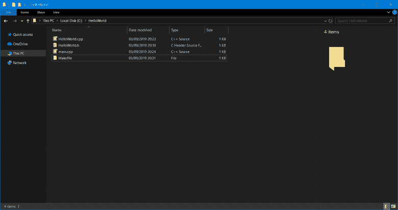
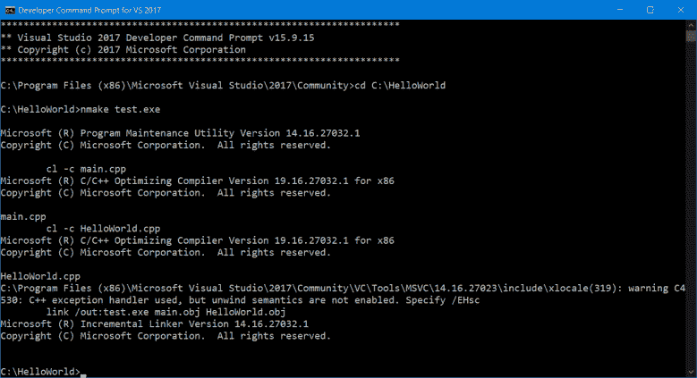
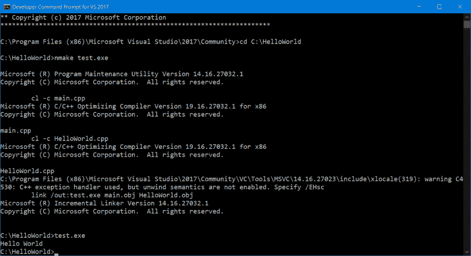
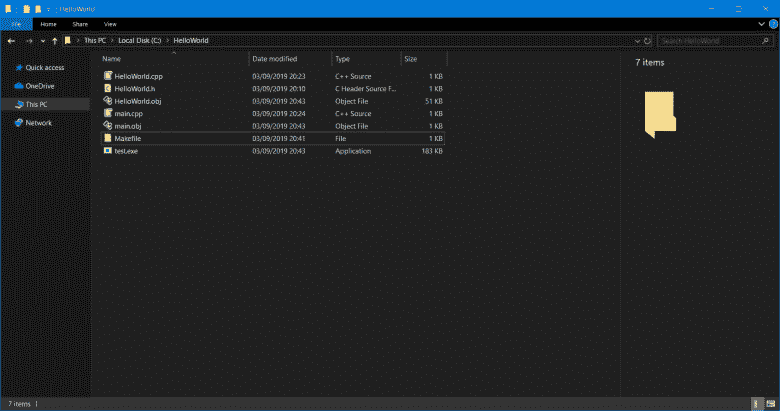

# 浏览分布式 C++代码的世界

> 原文：<https://betterprogramming.pub/navigating-the-world-of-distributed-c-code-e439406f3e42>

## 减少担心如何下载、编译和链接外部库的时间


由[沙恩·朗斯](https://unsplash.com/@shanerounce?utm_source=unsplash&utm_medium=referral&utm_content=creditCopyText)在 [Unsplash](https://unsplash.com/search/photos/distribute?utm_source=unsplash&utm_medium=referral&utm_content=creditCopyText) 上拍摄的照片

在我的上一篇[文章](https://medium.com/better-programming/learn-how-to-compile-a-c-program-382c4c690bdc)**中，我讨论了在我们自己的 C++程序中尝试使用第三方库所带来的一些困难。许多这些困难是由于缺乏对一些与 C++开发相关的简单概念的理解。**

**我首先查看了编译 C++程序的每个阶段，并展示了如何使用 MSVC 工具集编译 C++程序。**

**在本文中，我想看看如何在分布式 C++代码的世界中导航。**

**在互联网上发布代码的一种常见方式是使用库。一个库可以有多种形式:*仅头文件*、*静态*或*动态*，可以是预编译的，也可以不是。**

**共享库的一种常见方法是使用 *tarball* 或 *TAR 文件*，这可能不是您可以识别的文件格式。正如你所看到的，有许多方法来分发 C++代码，这种变化会使在你的游戏中使用库变得困难。**

**这就是为什么我希望解释上面描述的所有分发方法，这样你就可以把你的时间花在制作游戏上，而不用担心如何下载、编译和链接外部库。**

# **在开始之前**

**为了充分利用本文，我建议您至少在熟悉 C++程序是如何编译的之前，不要开始阅读本文。**

**本文的目标读者是那些正在努力在自己的代码中使用第三方库的人，或者只是对 C++在互联网上的构建和发布方式感兴趣的人。**

# **什么是 TAR 文件？**

**TAR 文件或 tarball 是一种文件格式，它将文件集合存储在自身中，将这些文件视为单个文件，这样更易于共享，因为只需要下载一个文件。**

**这似乎有点令人困惑，因为我们看起来像是在压缩文件，但创建一个集合(存档)和压缩(减小大小)文件是有区别的。**

**创建 TAR 文件后，可以使用 gzip 之类的工具压缩这个文件，这样会产生一个`.tar.gz`文件。这是一个存档的文件集合，存储在一个使用 gzip 压缩的`.tar`文件中。**

**注意:我提到 gzip 是因为你经常会看到库或源代码以`.tar.gz`文件的形式发布。**

**TAR 文件只是共享文件的另一种方式，当压缩时，它类似于共享一个`.zip`文件，尽管选择一个而不是另一个是有原因的，我不会在这里深入讨论。**

**你只需要知道代码可以作为一个`.tar.gz`文件共享，这是一个压缩的文件集合。**

# **C++库**

**术语库描述了代码的集合。库的主要目的是在多个项目中重用常用代码。**

**例如，我们可能有一个数学库，里面有帮助我们解决矩阵和向量问题的类和函数，这对任何游戏项目都很有用。

有三种类型的库:仅头文件库、静态库和动态库，您可以在本文[的](https://www.learncpp.com/cpp-tutorial/a1-static-and-dynamic-libraries/)中找到关于这些差异的更多细节。**

**我们在链接和编译库时所关心的是能够识别静态库和动态库之间的区别，这可以基于它们的扩展来完成。**

**windows 上的静态库有`.lib`扩展名，动态库有`.dll`。**

**当将一个库包含到我们的项目中时，我们需要为库文件本身和与该文件相关联的头文件提供一个路径。头文件向我们的程序公开了库的功能。**

**最后，一个只有头文件的库，比如数学库 [GLM](https://glm.g-truc.net/0.9.9/index.html) ，是一个不需要编译的库。相反，这个库是和我们自己的一起编译的，这通常会增加编译时间和代码膨胀，正如这篇维基百科文章所描述的。**

**一个优点是它们更容易使用，因为我们只需要将我们的程序指向头文件的位置，而不是像通常情况那样必须构建和链接一个库。**

# **预编译与非预编译**

**我们的库有可能是我们正在使用的操作系统的预编译包。**

**预编译一个库意味着它只能在某个平台上工作，比如说 Windows，我们只需要包含库文件的位置(。lib 或者。dll)和关联的头文件。**

**正如在上一篇文章中所讨论的，编译库是这样一种库，其中构建并链接该库的源代码，以生成包含特定平台的机器代码的文件。**

**预编译库的一个问题是，我们可能会被无法在我们想要开发的平台上运行的代码所困扰。**

**因此，拥有源代码和自己编译代码的能力是有益的，但是在我们开始使用这个库之前，这增加了额外的工作。**

**编译源代码的方法有很多种，但常见的是将代码与一个 *Makefile* 捆绑在一起，这个 Makefile 与一个名为 [*Make*](https://www.gnu.org/software/make/) 的工具一起使用。**

# **了解 Make 和 Makefiles**

**要理解 Make 背后的原因，我们需要理解 Make 和 Makefiles 解决的问题。**

**如果你回顾上一篇[文章](https://medium.com/better-programming/learn-how-to-compile-a-c-program-382c4c690bdc)，在那里我们学习了如何使用 MSVC 工具集编译一个简单的 C++程序，你可能已经注意到构建我们的程序既不困难也不耗时。**

**不幸的是，随着程序大小和复杂性的增加，包含 1000 个文件，并链接到许多外部库，我们程序的复杂性和编译时间也会增加。**

**减少程序编译时间的一个方法是不编译没有改变的代码。没有改变的代码不需要编译，因为我们已经有了以前构建的源文件的目标文件。**

**但是，如果我们的某个代码文件发生了变化，那么该文件以及依赖于它的任何文件都必须重新编译。如果我们有一个大的代码库，并且一个特定的文件，比如一个 vector 类，最终会在很多文件中使用，这肯定会变得复杂。**

**因此，我们不仅要为一个大的代码库编译一个程序，而且如果我们想让我们的程序尽可能快地编译，我们现在还必须跟踪我们已经改变的任何文件的所有依赖关系。**

**现在您可能已经猜到了， [Make](https://www.gnu.org/software/make/) 和 Makefiles 解决了所描述的问题。**

**Make 是一个构建生成工具，它使用 Makefile 来编译和链接源代码，以生成可执行文件或库。Makefile 是一个包含指令的文件，它告诉 Make 我们希望如何构建代码。**

# **为什么使用 Make**

**正如您所看到的，Makefiles 使开发人员能够以最少的工作量和更短的编译时间更容易地构建和重新编译他们的代码。正是由于这个原因，许多开发人员在分发他们的代码时都附带了 Makefile。**

**这样，我们不需要理解代码是如何编译和链接的。相反，我们所要做的就是在指定的 Makefile 上调用 Make 命令，让 Make 完成剩下的工作。**

**一旦我们编译了代码，它仍然需要通过链接库和头文件来链接到我们的项目。**

**如果你坐在那里想知道为什么你不能在互联网上发布你的 Visual Studio 项目，让任何想用它的人加载项目并点击 build…**

**嗯，是因为不是所有人都用 Visual Studio。人们喜欢使用不同的 ide，在 Windows 之外，Visual Studio 是不存在的。嗯，现在 macOS 上有，但是不支持 C++。**

**随着软件新版本的发布，Visual Studio 项目和基于其他 ide 的项目可能会过时。例如，您的 Visual Studio 2013 项目甚至可能无法在 Visual Studio 2017 中打开。**

**C++代码本身可能会变得“过时”，因为随着新标准的发布，该语言会不断发展，但这不会阻止 C++编译器理解您的代码，即使它必须编译用该语言的旧版本编写的代码。**

**因此，将 C++程序作为源代码与 Makefiles 一起分发不仅使用户更容易构建代码，而且还使用户不再需要在特定的 IDE(如 Visual Studio)中运行代码。**

# **使用 Make 的示例**

**在上一篇[文章](https://medium.com/better-programming/learn-how-to-compile-a-c-program-382c4c690bdc)的例子中，我们从命令行使用 MSVC 工具集来构建我们的程序。**

**我们现在知道这并不理想，因为如果我们想要避免重新编译我们代码库中的每个文件，不管它是否已经改变，它需要我们跟踪所有改变的文件。**

**相反，让我们看看如何使用 NMAKE(相当于 Windows 的 MAKE)和开发人员命令提示符来构建基于 Makefile 的程序。**

****

***添加了 Makefile 的目录的当前状态***

```
main.obj: main.cpp HelloWorld.h
    cl -c main.cpphelloworld.obj: HelloWorld.cpp HelloWorld.h
    cl -c HelloWorld.cpptest.exe: main.obj HelloWorld.obj
    link /out:test.exe main.obj HelloWorld.obj
```

**上面的代码显示了一个简单的 Makefile。Makefile 通过创建三个描述块来工作，每个描述块包括:**

```
target : dependents
   Commands
```

**仅仅是一个文件或一组命令，在我们的例子中，就是文件。**

**`Dependents`目标文件所依赖创建的文件。例如，一个目标文件依赖于一个`.cpp`和该文件包含的头文件。**

**最后，`commands`指的是我们希望对目标文件执行的命令，在我们的例子中，我们试图编译一个 C++程序，所以我们希望编译生成目标文件，然后使用微软的 C++编译器链接这些目标文件以生成可执行文件。**

**在上面的 Makefile 示例中，顶部的描述块指定了依赖于`main.cpp`和`HelloWorld.h`的目标文件`main.obj`的创建，其中运行`cl -c`命令来编译目标文件，而无需链接。**

**第二个描述块指定了依赖于`HelloWorld.cpp`和`HelloWorld.h`的目标文件`helloworld.obj`的创建，其中运行`cl -c` 命令来编译目标文件而无需链接。**

**最后，第三个描述块指定了目标文件，一个可执行文件`test.exe`，它依赖于`main.obj`和`helloworld.obj`，其中 link `/out`命令用于链接目标文件以生成可执行文件，同时也允许我们用`/out`指定生成的可执行文件的名称。**

****

***运行 NMAKE test.exe 时开发者命令提示符的输出***

****

***在开发人员命令提示符下运行 test.exe 的示例***

****

**运行 NMAKE 命令后 HelloWorld 文件夹的状态**

**如您所见，除了调用 NMAKE 之外，在开发人员命令提示符中不执行任何命令。**

**相反，我们通常使用的命令嵌入在 Makefile 中。**

**我们指定了要创建的文件以及这些文件的依赖项，因此，如果我们试图在不更改代码的情况下再次运行 NMAKE，NMAKE 不会尝试重新编译我们的代码，因为没有必要。**

# **关于 CMake 的一句话**

**本文中我想讨论的最后一件事是软件工具 [CMake](https://cmake.org/) ，因为您可能在某个时候遇到过它，或者您可能已经遇到过它。**

**CMake 代表跨平台 Make，考虑到它的名字，你可能会认为它是某种扩展，但它比这要复杂一些。**

**CMake 和 Make 一样，可以在指令文件的帮助下从源代码构建可执行文件或库。对于 CMake 来说，这是一个`CMakeList`。**

**与 Make 不同，CMake 不仅仅是一个构建自动化工具。CMake 可以生成用于在不同平台上进行本机构建的文件。它可以使用 Make 从 Makefiles 生成并构建可执行文件，或者为其他构建系统生成文件，如 [Ninja](https://ninja-build.org/manual.html) 。**

**它还可以在 Windows 和 macOS 上创建原生 Visual Studio 或 Xcode 项目。它可以以独立于编译器的方式构建程序。**

**实质上，CMake 让您可以自由地编写代码，并在各种不同的平台上构建和运行代码。**

**学习 CMake 和类似的工具通常是比学习 Make 这样的工具更好的选择，因为使用该工具可以获得额外的好处，例如能够生成可以在多种平台上构建的代码。**

# **摘要**

**总的来说，我们已经看到了在互联网上浏览分布式 C++代码的世界。开发人员通常将代码作为一个库来共享，这个库可以是只有头文件的、静态的或动态的，通常作为一个称为 TAR 文件或 tarball 的压缩文件存档来共享。**

**库可以针对我们工作的平台进行预编译，所以我们只需要告诉我们的程序库和相关头文件的位置，就可以让它们在我们的代码中工作。**

**最后，如果库不是预编译的，我们可以用源代码和指令文件(如 Makefile)来编译它们。**

**有时，源代码与 CMake 列表共享，CMake 列表与名为 CMake 的工具一起工作，允许我们生成 Makefiles 之类的构建文件和 Visual Studio 之类的本地项目。**

# **参考**

*   **[https://www . how togeek . com/362203/what-is-a-tar . gz-file-and-how-do-I-open-it/](https://www.howtogeek.com/362203/what-is-a-tar.gz-file-and-how-do-i-open-it/)**
*   **[https://www . top tal . com/c-plus-plus/c-plus-plus-understanding-compilation](https://www.toptal.com/c-plus-plus/c-plus-plus-understanding-compilation)**
*   **[https://docs . Microsoft . com/en-us/CPP/preprocessor/preprocessor-directives？view=vs-2019](https://docs.microsoft.com/en-us/cpp/preprocessor/preprocessor-directives?view=vs-2019)**
*   **[https://www.cs.bu.edu/teaching/cpp/writing-makefiles/](https://www.cs.bu.edu/teaching/cpp/writing-makefiles/)**
*   **[https://www . quora . com/What-is-the-difference-CMake-and-make](https://www.quora.com/What-is-the-difference-between-CMake-and-make)**