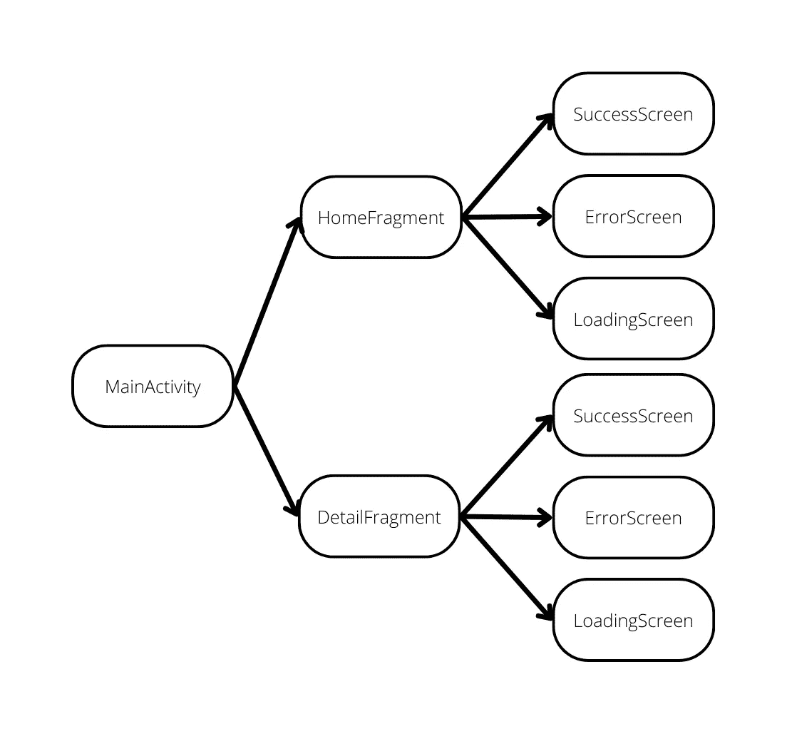
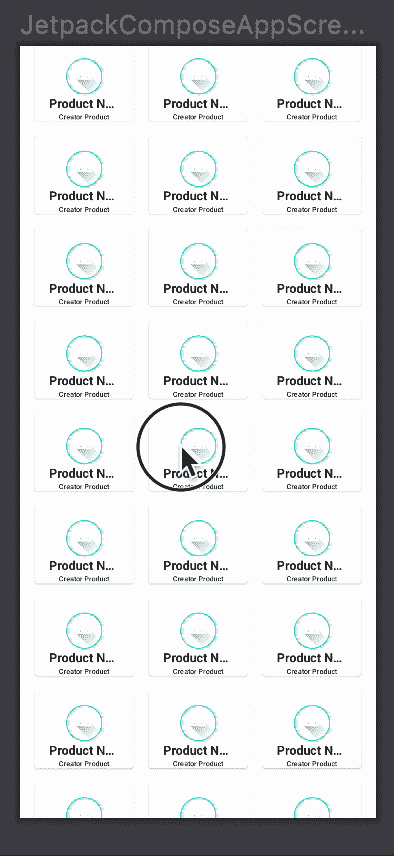

# Jetpack 中的导航路线构成

> 原文：<https://betterprogramming.pub/navigation-routes-in-jetpack-compose-ce2e0337ed28>

## 如何在您的 Android 应用程序中找到目标片段

照片由[乔丹马德里](https://unsplash.com/es/@jordanmadrid?utm_source=medium&utm_medium=referral)在 [Unsplash](https://unsplash.com?utm_source=medium&utm_medium=referral) 上拍摄

在 Jetpack Compose 时代之前，我们总是使用 XML 来在 Android 应用程序中执行导航。然而现在，由于有了 Jetpack Compose 库，这变得更加容易了。那么我们如何在 Jetpack Compose 中应用导航呢？

这是我们的 Jetpack Compose 教程的第三部分，在这里我们将学习 Jetpack Compose 中的导航。

您可以在此找到列表:

*   [通过构建应用程序一瞥 Jetpack Compose](/a-glimse-into-jetpack-compose-by-building-an-app-a7869723d4e8)
*   [在 Jetpack 组合中布局](/layouting-in-jetpack-compose-8c16e687bfe5)

在本文中，我们将学习如何使用 Jetpack Compose 将导航应用于 Android 应用程序。

# 开始

在我的上一篇文章中，我解释了我们的架构，其中`MainActivity`可以到达`HomeFragment`或`DetailFragment`。

从图中可以看出，能够将用户引导到其他页面的源类是`MainActivity`。因此，我们将在那里处理导航。

在开始之前，我们必须从 Jetpack Compose 导入导航库。打开`app`文件夹中的`build.gradle`，将这行代码添加到`implementation`部分。

打开`MainActivity.kt`。我们的代码应该是这样的:

将我们的代码更改为以下内容:

这样，现在我们可以在`JetpackComposeAppScreen()`中放置我们的导航

现在，我们想让`MainActivity`有一些目的地片段，以便执行导航。

我们必须将`JetpackComposeAppScreen()`中的代码修改如下:

所以现在在`NavHost`里，有`HomeFragment`和`DetailFragment`。它们每个都有`route`，所以我们可以使用`route`来导航到哪个片段。

比如在`Navhost`中有一个参数叫做`startDestination`。当`NavHost`被创建时，该参数将导航到哪个可组合函数具有特定的名称。

别忘了加上`val navController = *rememberNavController*()`，因为那个控制器会帮你在`Navhost`里面导航。

现在`“Home”`和`“Detail”`分散在`Navhost`里。为了确保它们不会再次散开，我们将创建一个包含`route`名称的类。

创建一个名为`Route.kt`的类。复制下面的代码:

现在`route`名称包含在`Route.kt`中，使用的是密封类。这类似于枚举。关于密封类的更多信息，你可以参考这里的。

将`JetpackComposeAppScreen()`代码更改如下:

以后，如果您想添加或编辑路线名称，只需打开`Route.kt`即可。那么你可以在任何地方使用它。

现在，我们只需要弄清楚如何从`HomeFragment`导航到`DetailFragment`。我们将为此使用`navController`，因为`navController`具有导航能力。

从上面的 GIF 中，我们从`HomeFragment`中的`ProductCard`点击到`DetailFragment`，所以我们需要打开`ProductCard.kt`并将这段代码放在这里:

现在我们必须弄清楚如何将`navController`从`MainActivity.kt`变成`ProductCard.kt`。

通常，这可以通过解析从`MainActivity.kt`到`ProductCard.kt`的参数来完成。

但是这个动作会使我们的代码变得紧耦合，因为`ProductCard.kt`将依赖来自`MainActivity.kt`的`navController`来使它工作——并且`MainActivity.kt`将知道`ProductCard.kt`需要`navController`来使它工作。

有一种方法可以避免它的发生。打开`ProductCard.kt`并将下面的代码复制到那里:

这样，我们可以选择是否将功能赋予`ProductCard.kt`，因为`onClickProduct`中的默认值是`{}`。

所以现在`ProductCard.kt`不会依赖来自`MainActivity.kt`的`navController`来让它工作，`MainActivity.kt`也不会知道`ProductCard.kt`和`navController`做什么。

现在我们必须弄清楚如何使用`navController`导航到`DetailFragment`，打开`HomeScreen.kt`和`HomeFragment.kt`，并复制以下代码:

现在在`MainActivity.kt`中为`HomeFragment()`中的`onClickToDetailScreen`参数添加以下代码:

现在我们可以将它从`HomeFragment`导航到`DetailFragment`。在`MainActivity.kt`中添加以下代码，在该类中进行预览:

现在我们可以看一下`MainActivity.kt`中的预告:

现在，我们已经成功实现了从`HomeFragment`到`DetailFragment`的简单导航。

`HomeFragment`有一个无限的`ProductCard`列表，每张卡都有一个唯一的`ProductId`。

从这里开始，假设我们在`DetailFragment`中有一个用例基于卡的`ProductId`获取数据，我们如何实现这一点？幸运的是，Jetpack Compose 提供了一个 API 来在导航时发送参数。

打开`MainActivity.kt`，复制如下代码:

为了让`DetailFragment`在导航时接收到一些东西，我们必须知道我们期望接收到哪些数据。例如，我们想要类型为`Integer`的`gamesId`。我们必须在`Navhost`中声明它。

为此，我们将信息传递给名为`arguments`的参数，该参数接收`DetailFragment`的可组合函数中`navArguments`的列表。之后，我们将检查`gamesId`是否存在于`arguments`中。如果存在，我们将把它传递给`DetailFragment`，如果不存在，我们将抛出一个异常。

现在，我们必须从`HomeFragment.kt`到`DetailFragment.kt`解析`gamesId`。打开`Route.kt`并将该代码复制到`Detail`。

在`MainActivity.kt`中，复制这段代码:

现在`HomeFragment`有能力解析`gamesId`到`DetailFragment`，并且`DetailFragment`在它们的`arguments`中获得。

现在最后一步，打开`HomeFragment.kt`和`HomeScreen.kt`。

现在，我们可以将它指向`DetailFragment`和`gamesId`。

注意，我们可能不会在代码中解析从`gamesId`到`ProductCard`，因为`ProductCard`可能并不总是必须导航到`DetailFragment`。这就是我们在`HomeScreen.kt`中使用`invoke`的原因。

关于科特林`invoke`的细节可以在这里[查看。](https://proandroiddev.com/kotlin-pearls-3-its-an-object-it-s-a-function-it-s-an-invokable-bc4bfed2e63f)

# 结论

到目前为止，我们已经了解了很多关于在 Jetpack Compose 中导航的知识。

你可以在我的 [GitHub](https://github.com/SkyairOnline/Jetpack-Compose) 上查看我的代码的完整版本。

在下一篇文章中，我将讲述如何将最常用的架构移动应用程序应用到我们的应用程序中。著名的 MVVM 建筑。

你可以在这里看到我的下一篇文章

 [## 在 Jetpack Compose 中开始使用 MVVM

### 我们将学习如何将 MVVM 应用于 Jetpack Compose

better 编程. pub](/mvvm-in-jetpack-compose-part-4-fe757a1a1b84)