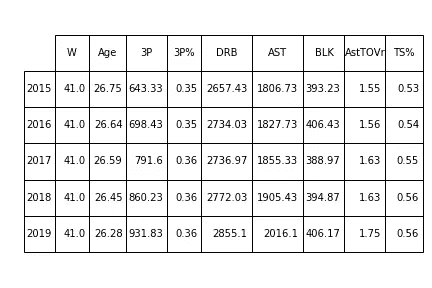
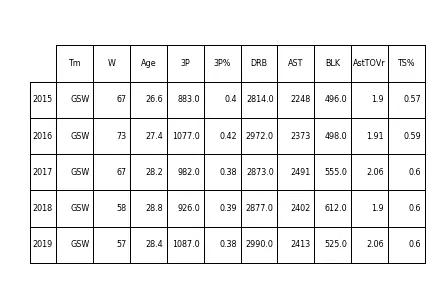
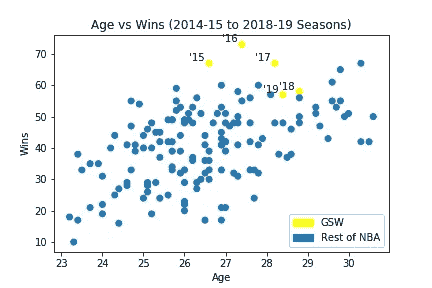
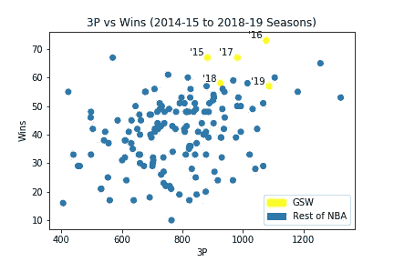
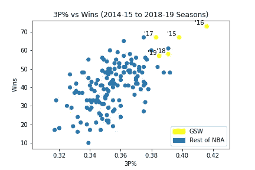
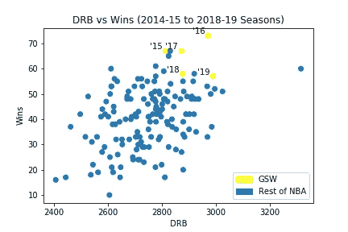
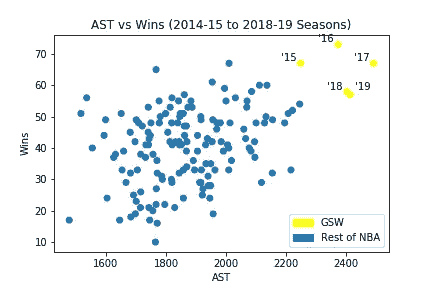
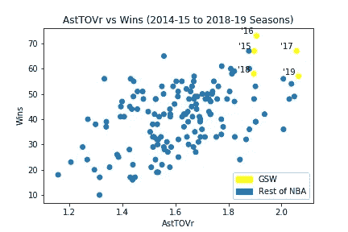
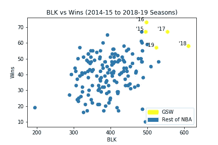
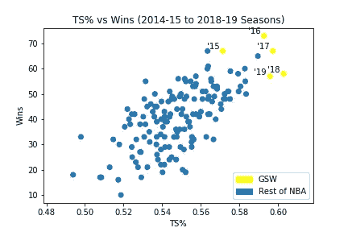

# NBA 统计和金州勇士队:第二部分

> 原文：<https://betterprogramming.pub/nba-statistics-and-the-golden-state-warriors-during-their-championship-runs-part-2-bf7240ddbbd4>

## Python 中的探索性分析

马库斯·斯皮斯克在 [Unsplash](https://unsplash.com/search/photos/basketball?utm_source=unsplash&utm_medium=referral&utm_content=creditCopyText) 上的照片

为了开始我的探索性分析，我首先导入库和模块— [Pandas](https://pandas.pydata.org/) 、 [NumPy](https://www.numpy.org/) 、 [Matplotli](https://matplotlib.org/) b、 [Seaborn](https://seaborn.pydata.org) 、copy 和 table —然后读入更新后的 CSV 文件。

提醒一下，我正在探索 2014-15 到 2018-19 NBA 赛季期间的球队统计数据，赛季数据元素将被视为该单个赛季的结束年份(例如，2018-19 将是 2019)。这是 NBA 的最后五个赛季，也是金州勇士队作为一支球队取得巨大成功的时期，形成了许多人认为的王朝。我将分析哪些球队的统计数据与常规赛的成功表现(以胜利衡量)相关，从而进入季后赛，同时密切关注勇士队。

# 统计数据的选择

在开始研究这些数据之前，我需要添加两个新的数据:助攻失误率和投篮命中率。

现在我已经添加了新的统计数据，我想看看哪些团队统计数据与胜利有很高的相关性。对于这个项目，我使用大于0.3 的相关值作为满意的相关值。

满足这个参数的统计数据有:年龄，投篮命中率(FG)，投篮命中率(FG%)，3 分(3P)，3 分命中率(3P)，2 分命中率(2P%)，防守篮板(DRB)，助攻(AST)，盖帽(BLK)，得分(PTS)，助攻失误率(AstTOVr)，投篮命中率(TS%)。这些统计数据是我最初列出的与胜利相关的变量。但是，要记住的一个问题是共线性的可能性，其中一个 stats 变量可以通过其他变量进行线性预测。

为了检查可能的共线性问题，我查看了新统计列表的相关值，以查看是否有任何变量彼此高度相关。我使用大于 0.75 的相关值来确定一对统计数据是否可能存在共线性问题。

可能存在共线性问题的统计数据有 FG、FG%、2P%、PTS 和 TS%。这些变量对之间的共线性问题可能是由于它们都是得分的度量标准。

在这五个统计数据中，TS%与成功的相关性最高，为 0.675。我将保留 TS%并删除其他高度相关的统计数据。作为一个复习，TS%是一个投篮效率的衡量标准，考虑了投篮命中率，三分球命中率和罚球命中率。

我更新了统计数据列表——年龄、3P、3P%、DRB、AST、BLK、AstTOVr 和 TS%——我现在将使用这些数据来分析过去五个 NBA 赛季的数据。

# 五季总体统计

在仔细研究每个指标之前，我们先来看看五个赛季的统计数据。看下面的表格，我们可以看到在过去的五个赛季中每个属性都有最大值的球队。请注意，我也包括了这些团队的胜利。不出所料，下面显示的所有球队都有获胜记录(总共 82 场比赛)。

每个指标在所有季节中的最大值

在过去的五个赛季中，金州勇士队(GSW)保持了八个统计数据中五个的最大值——3P %，ast，BLK，AstTOVr 和 TS%。为了便于比较，下面是每个赛季每个数据的平均值表。请注意，与最高值的球队相比，联盟的平均胜场数为 41 场。

每个赛季每个数据的平均值

# 个体统计

下面是勇士队每个赛季的统计数据。勇士队在每个类别中都有高于平均水平的记录。然而，一个值得注意的数据是，勇士队也在变老。对比勇士的数据和联盟平均水平，他们在过去五个赛季取得如此多的成功就不足为奇了。

GSW 每个赛季的统计数据

为了更深入地了解每项指标，我们来看一下每项统计数据与成功的关系。下面是一个关联热图。

## 年龄

年龄是一个有趣的统计数据，显示了与 wins 值 0.51 的相关性，这将使其在八个具有显著相关性的统计数据中排名前三。想想这个统计数据，年龄是一个与其他指标非常不同的指标。年龄衡量一个团队的身体特征，而其他统计数据衡量游戏的表现结果。那么，与其他一些统计数据相比，为什么年龄与胜率的关系如此密切呢？

在分析年龄时，球员越年轻，他们越有运动天赋和爆发力。然而，运动员年龄越大，他们在各自的运动中获得的经验和知识就越多。

在过去的五个赛季中，总共有六支球队进入了该赛季最年轻的五支球队，并获得了季后赛席位。在年龄谱的另一端，共有 23 次球队在那个赛季进入了最老的五支球队，并获得了季后赛席位。

从下面的图表中，我们可以看到年龄与胜率的关系。似乎经验丰富的球队在整个赛季中往往比年轻的对手表现得更好，从而带来积极的赛季表现。

对于勇士队来说，他们似乎一直在利用球队的经验，继续深入季后赛。球队保持了核心球员群体连续五年进入 NBA 总决赛，但代价是年龄。随着勇士队年龄的增长，他们的胜利记录越来越少。

## 3P 和 3P%

自 2014-15 NBA 赛季以来，三分球命中率激增了 44%以上。随着这种增长，你可能会认为 3P 和胜利有很强的相关性；但是，3P%与胜的关系更密切。3P 的相关值为 0.35，而 3P%的相关值为 0.59。

从下图中，我们可以看到 3P 获胜的数据点分布很广。一支球队的 3 分比平均水平多并不一定意味着这支球队会比平均水平赢得更多的比赛，反之亦然。

然而，对于 3P%来说，数据点更加接近，显示了 3P%和成功之间更强的线性关系。三分球投得更准的球队，从而增加了他们的 3P%，似乎赢得了更多的胜利。质量重于数量！

勇士队拥有非凡的 3P 射手，即斯蒂芬·库里和克莱·汤普森。球队作为一个整体在平衡 3P 的音量和准确射击相对较高的 3P%方面做得很好。在过去的五个赛季中，球队有能力拍摄大量 3P 的照片，同时又有很高的准确率，这似乎已经转化为大量的胜利。

## DRB

在过去的五个赛季中，平均防守篮板总数一直呈上升趋势，从大约 2600 个上升到大约 2800 个。DRB 的增加可能是由于 NBA 比赛“节奏”的增加，球队试图通过尝试更多的投篮来增加得分的机会。DRB 与胜利的相关系数为 0.4，略高于 3P。

如下图所示，与 3P 图相比，该图显示了与成功的关系略强。一个队保护 DRB 的能力允许该队有一个进攻控球和得分机会，以及防止对方球队有另一个得分机会。知道了 DRB 给了一个球队进攻的机会，就更容易理解为什么 DRB 和胜利之间有一个稍微强的线性关系了。然而，仅仅因为一支球队能够获得更多的 DRB 并不一定意味着他们会赢得更多的比赛；他们只是给球队提供了得分的机会。

令人惊讶的是，在过去的五个赛季中，金州勇士队在 DRB 的表现高于平均水平。他们并不是真正意义上的“大球队”,过去在低位与拥有更大球员的球队比赛时也很艰难，但看起来他们在 DRB 的努力中做得很好。DRB 的努力为他们提供了得分机会，他们似乎已经从赛季表现中得到了回报。

## AST 和 AstTOVr

助攻和助攻失误率是相关的数据。当投篮得分来自控球时，进攻球员将球传给得分队友，从而“协助”投篮得分，则记录 AST。AstTOVr 通过 AST 中测量的积极结果与 TOV 中测量的消极结果的比率来测量控球。AST 与 wins 的相关值为 0.41，而 AstTOVr 与 wins 的相关值为 0.49。

我们可以想象 AST 与下面的 wins 之间的线性关系。一个移动和分享球的团队允许空位球员有高质量的投篮，从而导致积极的进攻结果。在过去的五个赛季中，总平均助攻数一直呈上升趋势，从大约 1，800 次上升到大约 2，000 次。虽然 AST 有上升趋势，但下面的数据点显示，助攻和胜场之间存在一些价差。这可能是因为有如此伟大的篮球运动员能够单枪匹马为他们的球队赢得比赛。

下面，AstTOVr 图显示了它与 wins 的线性关系。然而，总的来说，数据中也存在一些差异。线性关系似乎表明，能够在控球期间保护篮球的球队给自己带来了机会，从而产生积极的结果和更好的赛季表现。

在过去的五个赛季中，勇士队在团队 AST 方面做得非常好，因为他们每个赛季都在这个数据上名列前茅。这表明他们已经能够通过球和球员的移动创造得分机会来有效地执行他们的进攻体系。但是球队的目标是进攻移动和分享球，这种类型的比赛也滋生了负面结果的可能性，如 TOV 所测量的。勇士队似乎在控球方面做得很好，因为他们能够记录高于平均水平的 AstTOVr。作为一个团队，他们能够尽可能地最小化负面结果和最大化正面结果，从而带来成功的赛季。

## 良性苔癣样角化病

在篮球运动中，篮圈保护是一个巨大的预防措施，可以防止对手在靠近篮筐的地方获得得分机会。拦网是指防守队员挡住进攻队员的射门。还有一些额外的规则来定义什么是合法的或非法的方块游戏，但这是方块的要点。

查看下图，我们可以看到数据块和获胜之间的关系。Blocks 与 wins 的相关值为 0.35，与 3P 相似。数据点明显分散，中间显示一个巨大的斑点，有一些异常值。一个球队在篮筐上阻挡对手进攻得分机会的能力不一定转化为胜利，因为还有其他进攻得分的方式，例如在离篮筐更远的地方投篮。

勇士队似乎已经能够在一定程度上很好地将自己与 BLK 的其他球队区分开来，这与胜利有关。他们记录了相当多的 BLK，并且似乎在利用这些防守成果将控球转化为进攻势头方面做得很好。这种能够保护篮筐的成分似乎对勇士队的胜利很有帮助。

## TS%

TS%是衡量投篮效率的一个指标，与胜率有很强的线性关系，如下图所示。TS%与成功的相关值是 0.68，这是本分析中讨论的八个统计数据中最高的。毫不奇怪，能够有效得分的球队在比赛中取得了巨大的成功，因为他们充分利用了控球机会，将这些机会转化为积极的结果，以投篮得分来衡量。

特别是勇士队，他们最大限度地利用了这个属性，因为他们在过去的五个赛季中都保持着最高的 TS%比率。这是球队进攻体系的功劳，这种进攻体系为高命中率创造了进攻机会。他们如此高效地得分的能力是他们与大多数 NBA 球队的区别，你可以看到这种能力如何影响以胜利衡量的赛季表现的最终结果。

如前所述，在史蒂夫·科尔时代，勇士队的进攻体系一直是移动进攻，球队努力让球和球员移动，以获得高质量的投篮机会。事实上，勇士队在过去五个赛季的每一个赛季中都保持了 AST 和 TS%的最高值，这表明球队一直在执行他们进攻体系的核心目标。球队在最大化控球机会，高效投篮，这符合他们的进攻目标。然而，这两个数据仅仅是他们成功的一部分。

勇士队在剩下的六个数据上表现出色，年龄，3P，3P%，DRB，阿斯特托夫尔和 BLK。就统计数据而言，他们即使不是前五名，也是前十名。然而，一个相当重要的注意事项是，在上述统计中做得好并不能保证获胜，但是可以为一个团队提供更好的获胜机会。总之，根据这些数据，勇士队已经在每一个与胜利相关的统计数据中最大化了他们的机会。

在 GitHub 上查看我的[代码](https://github.com/ant-L/Portfolio_Projects/blob/master/NBA_stats_and_GSW_during_championship_run/Basketball_Ref_EDA-v2.ipynb)进行探索性数据分析。

在[第三部分](https://medium.com/@aliu415/nba-statistics-and-the-golden-state-warriors-part-3-model-prediction-in-python-9893f55f28d1)中，我将利用与胜场相关的统计数据建立一个模型，看看这些统计数据能在多大程度上预测赛季表现，衡量球队进入季后赛的能力。

您可以在[第 1 部分](https://medium.com/@aliu415/nba-statistics-and-the-golden-state-warriors-during-their-championship-runs-part-1-cafc5d8042a8)中了解数据资源、信息和数据争论。