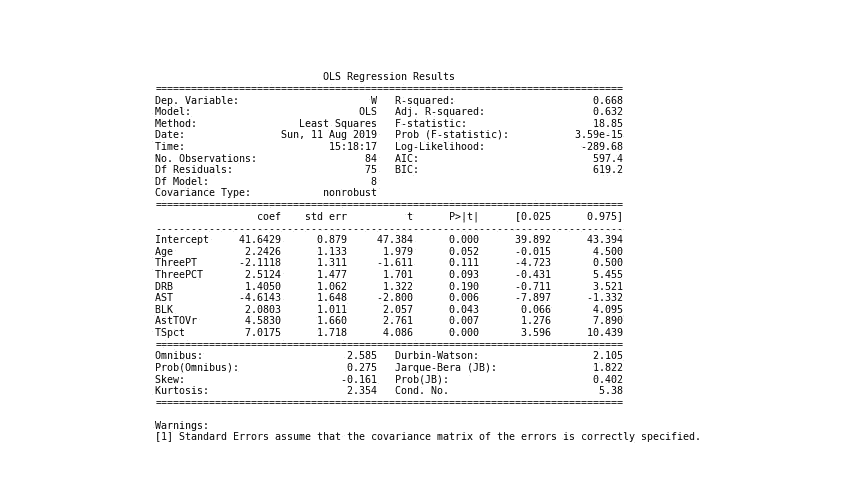
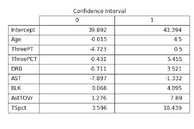
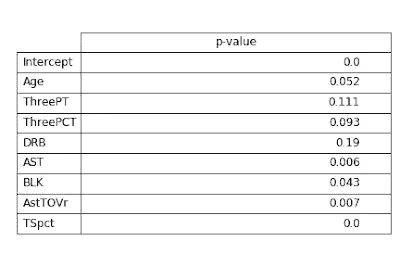
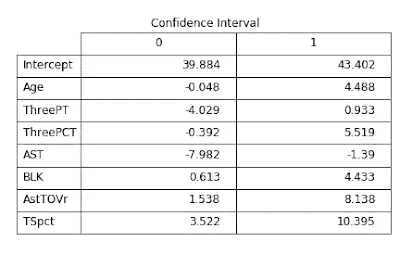
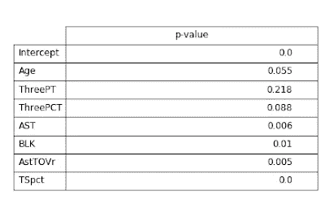
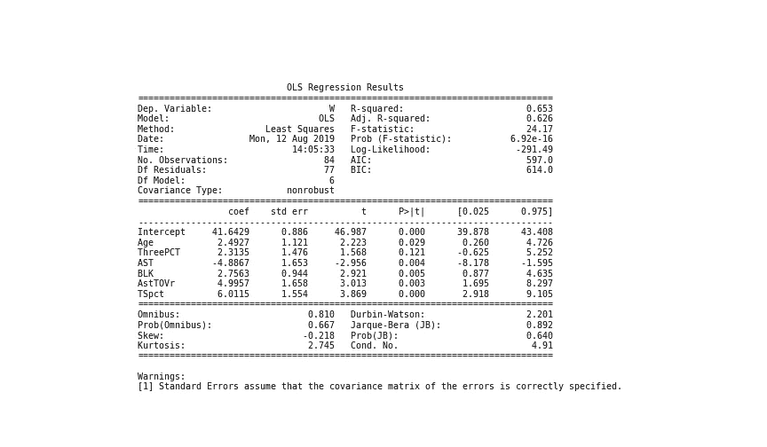
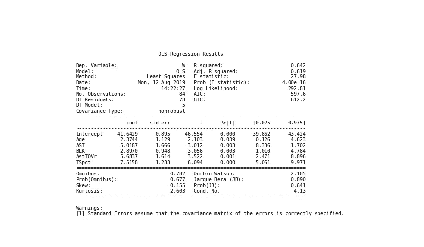
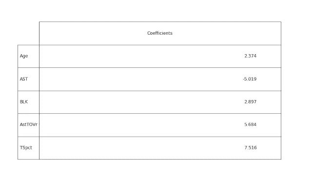
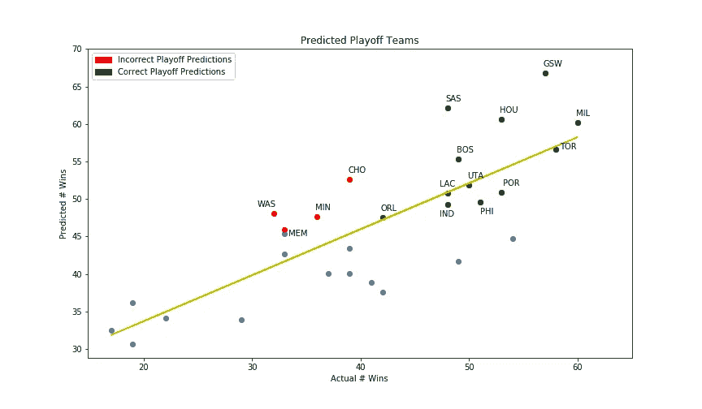

# NBA 统计和金州勇士队:第三部分

> 原文：<https://betterprogramming.pub/nba-statistics-and-the-golden-state-warriors-part-3-model-prediction-in-python-9893f55f28d1>

## Python 中的模型预测

马库斯·斯皮斯克在 [Unsplash](https://unsplash.com/search/photos/basketball?utm_source=unsplash&utm_medium=referral&utm_content=creditCopyText) 上的照片

在这最后一部分中，我首先导入库和模块— [Pandas](https://pandas.pydata.org/) 、 [NumPy](https://www.numpy.org/) 、 [Matplotli](https://matplotlib.org/) b、Seaborn、 [Scikit-Learn](https://scikit-learn.org/stable/) 、 [Statsmodels](https://www.statsmodels.org/stable/index.html) 、copy 和 plotting —然后读取包含相关统计信息的更新后的 CSV 文件。我将利用年龄、3P、3P%、DRB、AST、BLK、AstTOVr 和 TS%这些被发现与胜利显著相关的统计数据来建立一个预测模型，并看看该模型可以预测赛季表现的程度，衡量球队进入季后赛的能力。然而，在构建预测模型时，我们必须确定和选择哪些统计特征最适合用于预测季节表现的模型。

项目的这一部分使用的两个主要库包是 Scikit-Learn 和 Statsmodels。Scikit-Learn 是一个 Python 的机器学习库，具有各种机器学习算法。根据 [Statsmodels 网站](https://www.statsmodels.org/stable/index.html)，“Statsmodels 是一个 Python 模块，它为许多不同的统计模型的估计以及进行统计测试和统计数据探索提供了类和函数。”此外，Statsmodels 提供了“使用 R-style 公式和 pandas 数据框”来拟合模型的能力。在该项目中，Statsmodels 用于帮助确定哪些统计特征最适合该模型。

# 模型一

首先，我首先通过将数据框拆分为两个独立的数据框来准备模型的数据:一个包含 2014-15 至 2017-18 NBA 赛季的数据，另一个包含 2018-19 NBA 赛季的数据。我将利用前一个数据框来训练和测试模型，并利用后一个数据框来查看定义的模型对最近的 2018-19 赛季的预测有多好。然后，利用 Scikit-Learn 的 train_test_split 算法，我将 2014 年 15 月至 2017 年 18 月的数据分成训练集和测试集。

请注意，我通过为“测试规模”参数传入 0.3，将数据分成了 70/30 的比例。“随机状态”参数(设置为 101)有助于确保在多次运行代码时获得相同的分割。

如果您想按照项目的这一部分中的步骤和结果进行操作，请确保将“随机状态”值设置为 101。

此外，由于每个特色 NBA 统计数据都是以不同的尺度衡量的(例如，1，000 个三分对 0.350 个三分百分比)，我们必须将训练和测试数据标准化，以确保我们的模型适当地符合数据，并且不会由于数据尺度的问题而产生任何错误。谢天谢地，Scikit-Learn 有一个工具来解决这个问题:`StandardScaler()`。

从上面的代码中可以看出，我首先将缩放器与训练数据相匹配，以便缩放器可以为每个特性 stat 适当地定义参数。然后，拟合的定标器现在用于将训练和测试数据转换成模型的适当比例。定标器用于训练和测试数据集。您希望确保用于标准化测试数据的参数与用于标准化定型数据的参数相同，因为这是用于定型模型的标准化。

既然数据已经标准化，我们可以开始解决特征选择问题，以确定八个统计特征中的哪一个最适合我们的模型。Statsmodels 普通最小二乘(OLS)算法将用于解决特征选择，并提供模型的良好统计摘要。

请注意，Statsmodels 不能正确解释包含特殊字符或以数字开头的列名，因此请根据需要调整列名。

在这里，我通过一些方法评估结果——假设检验和 p 值。在假设检验中，我们有一个零假设和一个替代假设。

零假设是统计数据和 wins 之间没有**关系，95%置信区间包含一个零，表示βn 系数等于零。与零假设相反，另一个假设是**是**一个统计量和 wins 之间的关系，其中 95%置信区间不包括零，表示βn 系数不等于零。在这种情况下，置信区间有助于我们评估真实系数的范围，因此我们通过评估值可能在其中的范围来估计可用的系数数据。**

既然我们已经了解了这两个假设，我们就可以检查数据是支持拒绝零假设还是未能拒绝零假设。

查看上面的置信区间，我们可以看到年龄、三分之二、三分之三和 DRB 在它们各自的置信区间中都包含了一个零。

现在来看看每个要素的 p 值；p 值< 0.05 is significant while a p-value > 0.05 不重要。如果 p 值< 0.05, then we can reject为原假设，我们可以相信，这里的**是**特征和结果变量之间的一种关系。然而，如果 p 值>为 0.05，那么我们可以相信数据未能拒绝零假设，并且**在特征和结果变量之间没有**关系。

我们可以从该年龄以上的 p 值表中看到，ThreePT、ThreePCT 和 DRB 的 p 值都大于 0.05，DRB 的 p 值最大，为 0.19。

除了评估模型中的特性之外，让我们看看这个当前的模型使用“看不见的*”*测试数据预测得有多好。使用模型的预测值，我们可以看看其他几个指标-R 平方(R2)和均方根误差(RMSE)-来帮助评估模型。为了计算 R2 和 RMSE，我们首先需要计算残差、误差平方和(SSE)和总平方和(SST)。

现在我们可以计算 R2 和 RMSE，如下所示。 [R2](https://en.wikipedia.org/wiki/Coefficient_of_determination) 代表模型中由自变量解释或可预测的因变量方差的比例。 [RMSE](https://en.wikipedia.org/wiki/Root-mean-square_deviation) 是预测值和观察值之间差异的度量。

R2 为 0.46 或约 46%，RMSE 为 7.94 或约 8。R2 值表明因变量(即 wins)中大约 46%的方差是由自变量解释的——年龄、三点百分比、三点百分比、DRB、AST、BLK、AstTOVr 和 TSpct。RMSE 值表示在预测值和观察值(即，实际获胜)之间存在八次获胜的近似偏差。

根据之前对置信区间和 p 值表的观察(表明年龄、三点百分比、三点百分比和 DRB 在模型中不显著，并且无法拒绝空值)，让我们看看是否可以通过移除某个要素来改进模型。

# 模式二

使用与构建第一个 OLS 模型相似的步骤，我构建了第二个 OLS 模型，但删除了 DRB 统计数据。如上面的置信区间和 p 值表所示，DRB 统计数据的置信区间为零，最高 p 值为 0.19。看看下面更新模型的置信区间和 p 值表。

从上表和下表中我们可以看出，Age、ThreePT 和 ThreePCT 在各自的置信区间中仍然为零，p 值> 0.05。

根据上面两个表中的数据，年龄、三个百分比和三个百分比未能拒绝零假设，在模型中不显著。让我们继续去除 OLS 模型中的每一个特征，直到剩下的特征显示出重要性。我将使用 OLS 汇总函数来显示 OLS 模型的结果。

# 模型三

在第三个 OLS 模型中，我删除了 ThreePT，因为它显示其置信区间为零，并且 p 值最高，为 0.218。下面的 OLS 汇总表显示了[0.025 和 0.975]栏之间的置信区间和 P>|t|栏下的 P 值。如前所述，OLS 汇总表提供了该模型的一个很好的统计概览。

移除 ThreePT 后，我们现在可以看到，ThreePCT 是置信区间为零且 p 值> 0.05 的剩余特征。该结果还提供了模型(及其特征)如何受到逐个移除特征而不是一次移除多个特征的影响的可视化表示。

# 模式四

让我们来看看第四个模型的总结——去掉了 3%。

其余的统计数据——年龄、AST、BLK、AstTOVr、ts pct——在它们各自的置信区间中没有零，并且具有 p 值< 0.05\. With these features, we can reject the null hypothesis and believe that there **is** 每个特征和结果变量(wins)之间的关系。既然剩下的特性很重要，我将使用这个模型，看看它在测试数据上的表现如何，以预测获胜的结果。

如前所述，我们可以使用类似的方法，利用第四 OLS 模型对试验数据进行预测，并计算 R2 和 RMSE 值。

R2 是 0.4497 或大约 45%，RMSE 是 8.016 或大约 8。同样，这表明该模型解释了观测数据中大约 45%的方差，并且在预测值和观测值之间具有大约八倍的偏差。从第一个模型的 46%和八个胜利的值来看，这在 R2 或 RMSE 值上的调整并不太坏，因为我们删除了三个特征。现在我们已经有了我们模型的功能，我想看看它在全新的数据(即 2018-19 NBA 赛季)上的表现如何。

# 回归模型

对于这最后一部分，我使用了 Scikit-Learn 的线性回归算法和相关的统计特征——年龄、ast、BLK、AstTOVr、ts pct——来建立一个回归模型，该模型将预测 2018-19 赛季的表现。建立线性回归模型时，请确保标准化的训练数据符合模型。

我们可以从下表中看到，系数值与第四个 OLS 模型中建立的系数值相同——参见第四个 OLS 模型汇总表——因此我们现在可以继续预测 2018-19 赛季的胜利。

在对 2018-19 NBA 赛季数据运行线性模型之前，我必须确保准备好数据(根据需要)，并对数据进行适当的缩放。现在使用 Scikit-Learn 线性回归模型，我们可以将模型拟合到标准化的 2018-19 数据，以查看它预测赛季表现的程度。

让我们通过查看 R2 和 RMSE 值来评估该模型在全新的未知数据上的表现。

基于约 41%的 R2 值和约 9 的 RMSE 值，与 OLS 模型相比，R2 值下降了约 4 %, RMSE 值增加了约 1 个偏差。下面是预测结果的可视化表示，显示了预测进入季后赛的 NBA 球队。

在上图中，我们有一个显示实际值与预测值的线性图，其中一条最佳拟合线贯穿各点。我们可以看到被正确预测(绿色)进入季后赛的球队和被错误预测(红色)进入季后赛的球队。我们可以看到，线性模型错误地预测了四支球队进入季后赛——明尼苏达森林狼队(MIN)，孟菲斯灰熊队(MEM)，夏洛特黄蜂队(CHO)和华盛顿奇才队(WAS)。

提醒一下，根据他们的胜利记录，每个 NBA 联盟只有八支球队——西部和东部——有资格进入季后赛。让我们仔细看看模型的结果，将实际值与预测值进行比较，这样我们就可以看到该模型如何将球队带入季后赛。红色的球队是预测不正确的季后赛球队，橙色的球队是实际的季后赛球队，应该取代不正确的预测。

从上表中我们可以看出，该模型并没有像根据 RMSE 值所预期的那样很好地预测出赢值。此外，该模型只能准确预测四支球队的季后赛排名(即季后赛排名——见表格左侧的指数)——金州勇士队(GSW)、休斯顿火箭队(HOU)、密尔沃基雄鹿队(MIL)和多伦多猛龙队(TOR)。然而，尽管在获胜值和球队的季后赛排名方面存在明显的差异，但如果我们要看模型预测球队进入季后赛的能力，该模型正确预测了 16 支季后赛球队中的 12 支。这不是很好，但也不算太坏，因为这占了季后赛球队的 75%。

正如所讨论的，结果显示在赢值上有相当大的差异。例如，圣安东尼奥马刺队(SAS)以大约 62 胜被预测为西部第二。然而，他们实际上以 48 胜排名第八。这种巨大的差异可能是因为马刺队在年龄和 AstTOVr 这两个特征上排名前五，同时在 TSpct 上也排名前十。马刺队是一支经验丰富、高效的球队，他们最大限度地减少失误，最大限度地增加机会，正如他们在五个特征中的三个中的排名所示。然而，赢得一场比赛还有其他因素，例如一支球队需要比他们的对手得分更多才能获胜。对于马刺队来说，他们获得足够分数的能力是低于标准的，因为他们的总得分排名第 18 位。

在整个赛季中，从一个赛季到另一个赛季，还有其他因素也可能影响篮球比赛的胜利——如防守无形资产、伤病、球员交易或人员变动等因素，所有这些都没有在这次分析中得到考虑。除此之外，尽管篮球是一项团队运动，但单个球员组成了团队，并最终可能决定或破坏团队赢得比赛的机会，因为球员可能有机会在篮球比赛的进攻和防守两方面影响比赛。

# 结论

该项目分析了与金州勇士队在相关统计数据中的胜利和表现相关的基本 NBA 统计数据。勇士队被分析是因为他们连续五年都是总冠军的争夺者。他们在 AST，BLK，AstTOVr 和 TSpct 的表现非常出色，显示了这些特征统计和胜利之间的强相关性，证明了他们不仅有能力进入季后赛，而且有能力争夺 NBA 总冠军。利用这些重要的数据，我试图建立一个预测模型来模拟勇士队的成功。该模型在评估以胜利衡量的赛季表现方面总体上有所欠缺，应该在未来的迭代中进行调整。

为了在未来的模型中考虑，更多的数据，对进攻统计的更深入分析和防守统计的分析，包括可能的单个球员分析和高级统计，应该被审查和评估以纳入。

请随时留下您的评论或发送带有建议/问题的消息。

在 GitHub 上查看我的[代码](https://github.com/ant-L/Portfolio_Projects/blob/master/NBA_stats_and_GSW_during_championship_run/Basketball_Ref_Model_Prediction-v2.ipynb)进行模型预测。

这个项目的前几篇文章涵盖了数据资源和数据争论。)和探索性分析([第二部分](https://medium.com/p/bf7240ddbbd4/))。