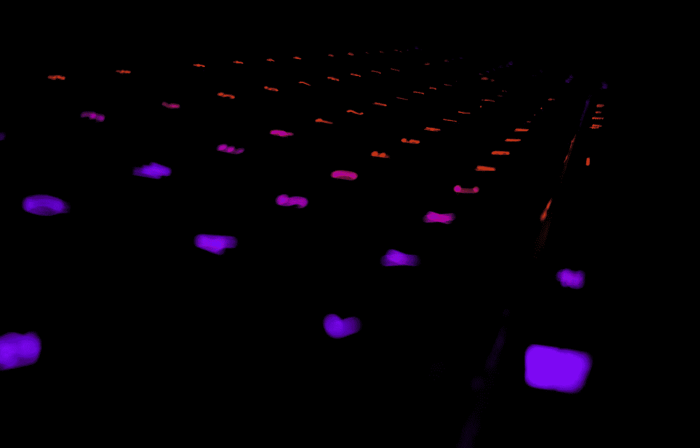
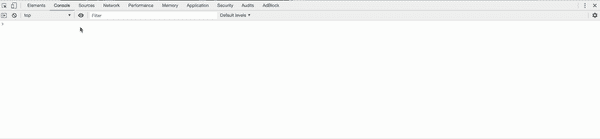
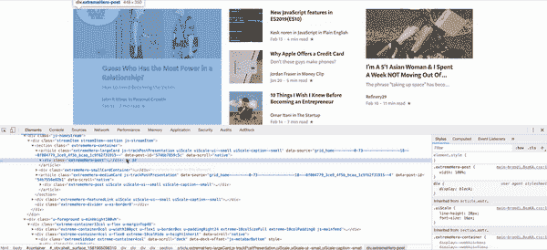
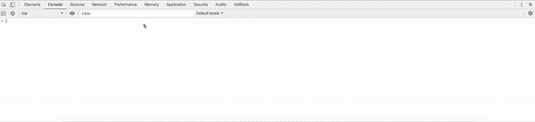
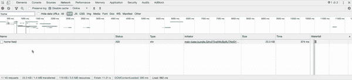
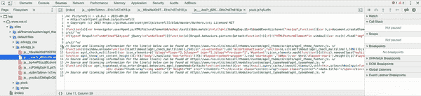
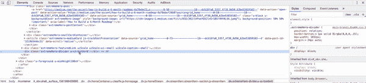
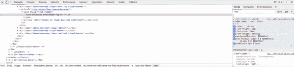
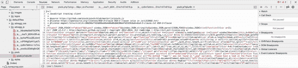
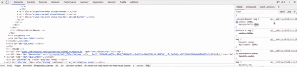

# 你可以在 Chrome DevTools 中实现的巧妙小技巧

> 原文：<https://betterprogramming.pub/neat-little-tricks-that-you-can-pull-off-in-chrome-devtools-2bf75bb3c5b6>

## 充分利用你的 Chrome 开发工具

照片由[马里乌斯·尼维利](https://unsplash.com/@m4r1vs?utm_source=medium&utm_medium=referral)在 [Unsplash](https://unsplash.com?utm_source=medium&utm_medium=referral) 拍摄。

Chrome DevTools 是一款工具，它让每个 web 开发人员的生活变得更加轻松。真的，如果没有这样一个工具，你的生活就不一样了。它提供的有用信息之多令人震惊，尽管并不是每个开发人员都足够了解 Chrome DevTools 必须提供的所有产品。

Chrome DevTools 有各种 web 创作和调试工具。最棒的是，它内置在 Chrome 浏览器中。它让开发人员对他们的 web 应用程序有了更深入的了解。从在移动设备上测试视窗到动态编辑网站，这一切都可以在这个工具中完成。

了解这个工具所提供的所有可能性可以让一个 web 开发人员的生活变得更好。这就是为什么我们将在这篇文章中讨论一系列技巧和窍门。

# 使用快捷方式打开 DevTools

让我们从使用 Chrome DevTools 的最基础开始，也就是如何用快捷方式打开它。当然，你也可以用鼠标打开 Chrome DevTools。为此，右键单击任何页面元素，然后单击 *Inspect* (或 *Inspect Element* )。但是使用捷径要快得多。

在 Mac 上:Cmd + Opt + I

在 Windows 上:F12 或 Ctrl + Shift + I

# 看现场表情

你知道你可以观看一个现场表情(例如`document.activeElement`)吗？然后，您可以将这个实时表达式固定在控制台的顶部，以便可以实时监控它的值。这在调试时会非常方便。例如，当我想知道哪个元素有焦点时，我使用`document.activeElement` live 表达式。有些元素有`outline: none;`，所以如果你在你的 web 应用程序中跳转，你看不到这个元素有焦点。这只是实时表达式的一个用例，但是我经常使用它。

以下是设置实时表达式的简单方法:

# 截屏 DOM 中的元素

在 DOM 中选择一个元素，然后按下 Cmd + Shift + P(如果使用 Windows，则按下 Ctrl + Shift + P)打开命令菜单。在命令菜单中，选择*捕获节点截图*。

请注意，还有一些选项可用于制作全尺寸截图或网页上特定区域的截图。

# 使用控制台中最后一次操作的值

你知道在控制台中有一个引用上一次操作返回值的快捷方式吗？我最近才发现这个把戏。使用`$_`引用控制台上一次执行操作的返回值。如果您正在编写或调试一些 JavaScript 代码，并且需要引用以前的返回值，这将非常方便。

# 覆盖地理位置

由于显而易见的原因，能够覆盖您的地理位置是一个很方便的特性。你需要做的就是找到想要的位置的经度和纬度坐标。你可以用像这个工具这样的工具来做。

要覆盖地理定位，您可以打开控制台并按 Cmd + Shift + P(如果您使用的是 Windows，则按 Ctrl + Shift + P)来打开命令菜单。在命令菜单中，选择*显示传感器*。将 *no override* 选项更改为可用选项之一，或使用 *Other 提供您自己的纬度和经度...*选项。

# 重播 XHR 请求

如果您正在实现一个新的 XHR 请求，并且想要调试处理 XHR 请求的后端，能够重放一个 XHR 请求是其中一个非常有用的特性。

请注意，您将请求列表中的过滤器设置为 XHR，因此只列出了 XHR 的请求。

# 调试 JavaScript

你可以在 Chrome DevTools 中调试你的 JavaScript 文件。您所需要做的就是通过双击一个行号来添加一个或多个断点。一旦遇到断点，就可以通过一步一步地调试代码。您可能需要在断点命中之前刷新页面。

# 对元素强制状态

作为一名前端开发人员，在元素上强制某种状态真的很有帮助。一个例子是，如果您试图设计 DOM 中某个元素的悬停或活动状态的样式。您可以对一个元素施加五种状态:`hover`、`active`、`visited`、`focus`、`focus-within`。

请注意，在元素上设置状态后，元素上会出现一个黄点。这为您提供了一个非常快速的视觉指示器，表明这个元素有一个状态集。

# 对比率

随着越来越多的网站需要遵循 [WCAG](https://www.w3.org/WAI/standards-guidelines/wcag/) ，前景和背景颜色之间的正确对比变得越来越重要。有很多工具可以帮助你确定你是否有足够的对比度。但是，这也可以在 Chrome DevTools 中完成。

如果单击向下箭头展开对比度信息，您可以获得更多信息。这样，您可以看到对比度是否符合 WCAG 的 AA 和 AAA 级。

# 转到行号

知道如何转到特定的行号是可以节省您大量时间和在文件中搜索正确位置的麻烦的特性之一。当您知道在特定的行号上有错误时，这尤其方便。

此功能的快捷键是 Ctrl + G (Mac 和 Windows)。

# 向 CSS 属性添加像素

将像素添加到特定的 CSS 属性中比逐个添加要高效得多。Chrome DevTools 中有一个快捷方式可以帮你做到这一点。您可以一次添加 10 或 100 个像素。

要添加 10 个像素，请按 Shift +上箭头键(Mac 和 Windows)。

要添加 100 个像素，请按 Cmd +上箭头键(Mac)或 Ctrl +上箭头键(Windows)。

也可以减去像素。用向下箭头代替向上箭头。

