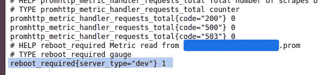

# 需要重启吗？了解如何使用 Node_exporter 进行检查！

> 原文：<https://betterprogramming.pub/need-to-reboot-learn-how-to-check-with-node-exporter-7ea6e9f0b21e>

## 利用 Prometheus 和 node_exporter 轻松捕获任意指标


照片由 [Jay Heike](https://unsplash.com/@jayrheike?utm_source=unsplash&utm_medium=referral&utm_content=creditCopyText) 在 [Unsplash](https://unsplash.com/s/photos/gauge?utm_source=unsplash&utm_medium=referral&utm_content=creditCopyText) 上拍摄

您可以使用 node_exporter 及其 textfile 收集器来跟踪来自您的机器的任意指标。

它可能是 cron 作业的结果、登录次数或者任何可以归结为一个数字的东西。他们已经内置了大量的指标，所以先查看一下[文档](https://github.com/prometheus/node_exporter#collectors)。

对于其他一切，您使用文本文件收集器。我告诉你怎么做。

我假设您已经有了一个正在运行的 Prometheus 实例。如果不是这样，请阅读官方文档或查看我关于这个主题的文章系列。

# 普罗米修斯度量格式

普罗米修斯公制格式是一种简单的文本格式。它包括指标名称、可选标签、数值和可选时间戳。指标上方的注释描述了指标类型。请看这个计数器指标的例子:

```
# HELP http_requests_total The total number of HTTP requests.
# TYPE http_requests_total counter
http_requests_total{method="post",code="200"} 1027 1395066363000
```

第一行只是一个可读的描述，而第二行是对 Prometheus 的一个提示，这个度量是一个计数器。计数器是普罗米修斯[公制类型](https://prometheus.io/docs/concepts/metric_types/)之一。您只能递增计数器。如果你减少一个计数器，普罗米修斯将会发现一个问题。

第三行是带有标签`method`和`code`的公制单位`http_requests_total`。计数器的当前值为`1027`。

你必须把你的度量写在一个叫做`your_metric.prom`的文件里。textfile 收集器将收集所有的指标，并将它们暴露给 Prometheus。

虽然您可以将多个指标写入一个文件，但我建议将每个指标写入一个文件。这样，您可以更容易地进行概述。

# 普罗米修斯度量格式

我们从一个简单的规范度量开始。如果需要重新启动，它的值为 1，否则为零。我在 LTS 的 Ubuntu 22.04 上测试过。它应该可以在所有基于 Debian 的系统上运行。

我们需要检查文件`/var/run/reboot-required`是否存在。创建一个名为`reboot-check.sh`的新文件，内容如下:

用`chmod +x reboot-check.sh`使其可执行。如果运行它，您会得到以下输出:

```
#TYPE reboot_required gauge
reboot_required{server_type="dev"} 0
```

该指标是一个标尺，这意味着它可以上升和下降。正是我们需要的。

我们创建一个 cron 作业来定期运行和编写脚本。用`crontab -e`打开你的 crontab 并把它附加到底部:

```
* * * * * sh path_to_your_script/reboot_check.sh > path_to_your_metric_folder/foo.prom
```

这将每分钟执行一次脚本。如果您需要 cron 语法方面的帮助，请访问 [crontab。](/crontab.gu)咕噜。

我们现在有了度量标准。是时候安装 node_exporter 了！

# 使用 Node_exporter 收集指标

您只需要下载 node_exporter，解压并运行它:

```
wget [https://github.com/prometheus/node_exporter/releases/download/v1.3.1/node_exporter-1.3.1.linux-amd64.tar.gz](https://github.com/prometheus/node_exporter/releases/download/v1.3.1/node_exporter-1.3.1.linux-amd64.tar.gz)tar xvfz node_exporter-1.3.1.linux-amd64.tar.gzcd node_exporter-1.3.1.linux-amd64./node_exporter
```

在撰写本文时，1.3.1 是最新版本。前往 [GitHub](https://github.com/prometheus/node_exporter/releases) 查看更新版本。

在浏览器中打开`your_server:9100/metrics`,查看所有导出的指标。你会看到很多！

```
[...]
# HELP node_vmstat_oom_kill /proc/vmstat information field oom_kill.
# TYPE node_vmstat_oom_kill untyped
node_vmstat_oom_kill 0
# HELP node_vmstat_pgfault /proc/vmstat information field pgfault.
# TYPE node_vmstat_pgfault untyped
node_vmstat_pgfault 3.16685474e+08
# HELP node_vmstat_pgmajfault /proc/vmstat information field pgmajfault.
# TYPE node_vmstat_pgmajfault untyped
node_vmstat_pgmajfault 24606
# HELP node_vmstat_pgpgin /proc/vmstat information field pgpgin.
# TYPE node_vmstat_pgpgin untyped
node_vmstat_pgpgin 8.334653e+06
# HELP node_vmstat_pgpgout /proc/vmstat information field pgpgout.
# TYPE node_vmstat_pgpgout untyped
node_vmstat_pgpgout 3.1538757e+07
# HELP node_vmstat_pswpin /proc/vmstat information field pswpin.
# TYPE node_vmstat_pswpin untyped
node_vmstat_pswpin 0
# HELP node_vmstat_pswpout /proc/vmstat information field pswpout.
# TYPE node_vmstat_pswpout untyped
node_vmstat_pswpout 0
# HELP process_cpu_seconds_total Total user and system CPU time spent in seconds.
# TYPE process_cpu_seconds_total counter
process_cpu_seconds_total 0
# HELP process_max_fds Maximum number of open file descriptors.
# TYPE process_max_fds gauge
process_max_fds 1024
# HELP process_open_fds Number of open file descriptors.
# TYPE process_open_fds gauge
process_open_fds 9
[...]
```

但是我们的自定义指标丢失了。我们必须告诉 node_exporter 它可以在哪里收集我们的度量。停止 node_exporter，并使用以下命令再次运行它:

```
./node_exporter \
--collector.textfile.directory=/absolut_path_to_your_metric_folder
```

您必须输入绝对路径。用`~`也不行。

就在那里！



reboot_required 指标。

现在，创建(或删除)受监控的文件并刷新页面:


更新了 reboot_required 指标。

按预期工作！现在，你可以用 Prometheus 和[https://github.com/prometheus/node_exporter](https://medium.com/javarevisited/monitoring-setup-with-docker-compose-part-3-alertmanager-5d0a2d4a5612#collectors)

*   普罗米修斯文档:[https://Prometheus . io/docs/Prometheus/latest/getting _ started/](https://prometheus.io/docs/prometheus/latest/getting_started/)*   找出你需要的 cron:[https://crontab . guru](https://crontab.guru)

感谢您的宝贵时间！

```
**Want to Connect?**Subscribe to my newsletter so you never miss a new post:[https://verbosemode.dev/subscribe](https://verbosemode.dev/subscribe)
```