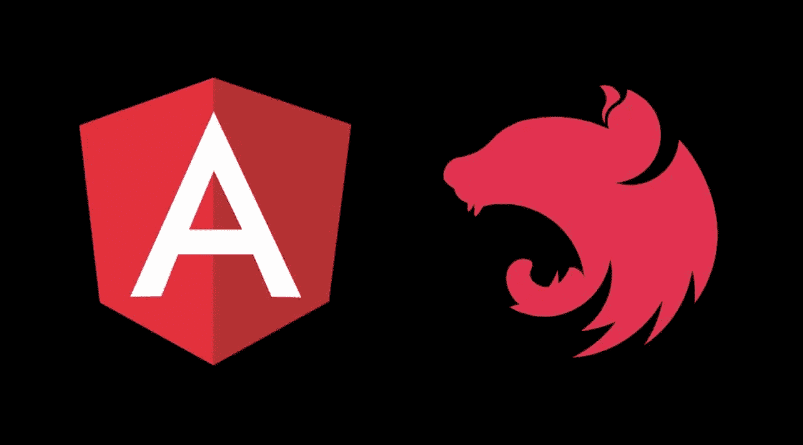
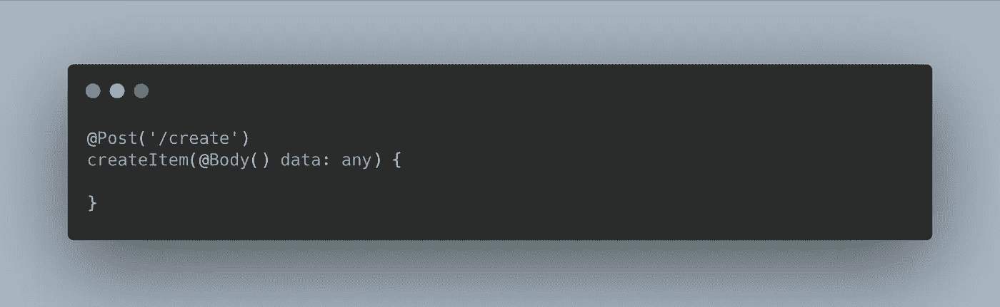
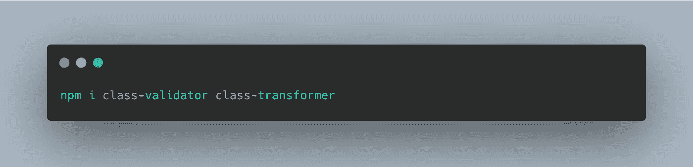
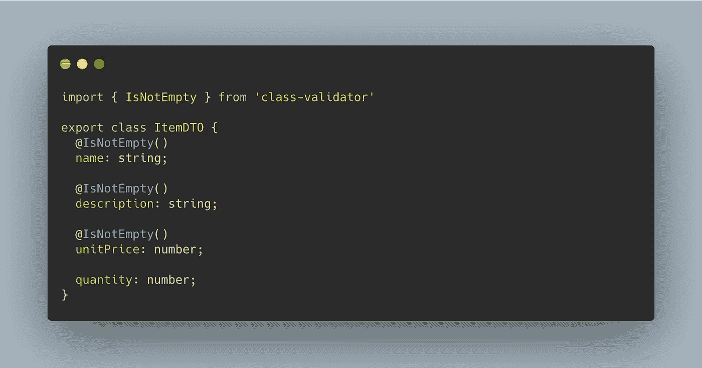
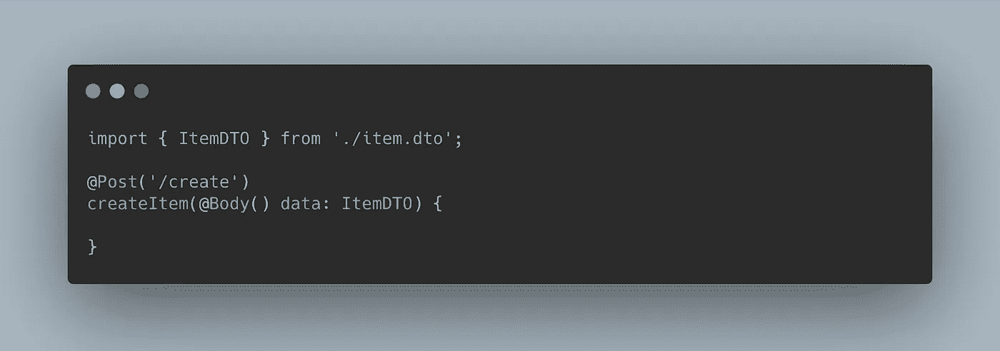
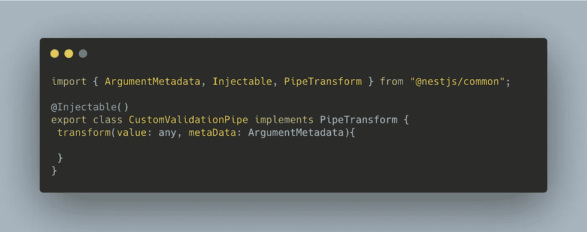
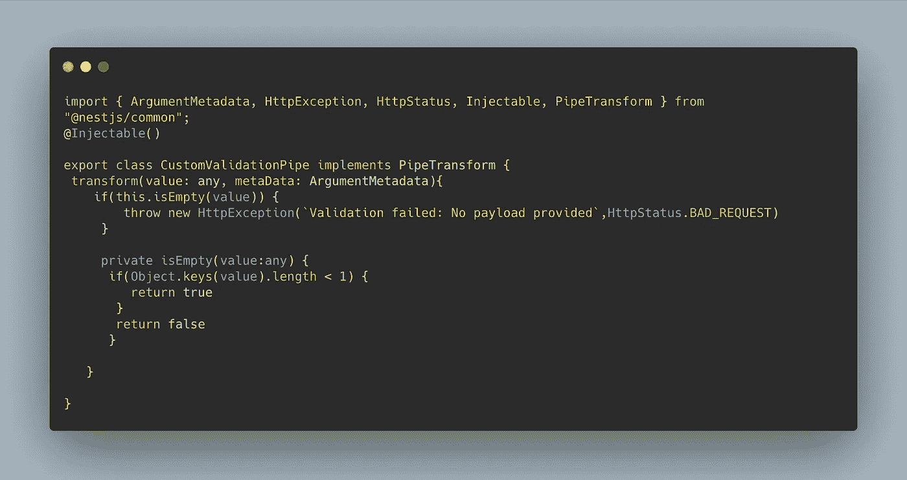
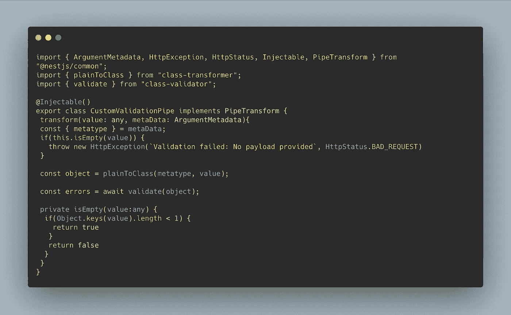
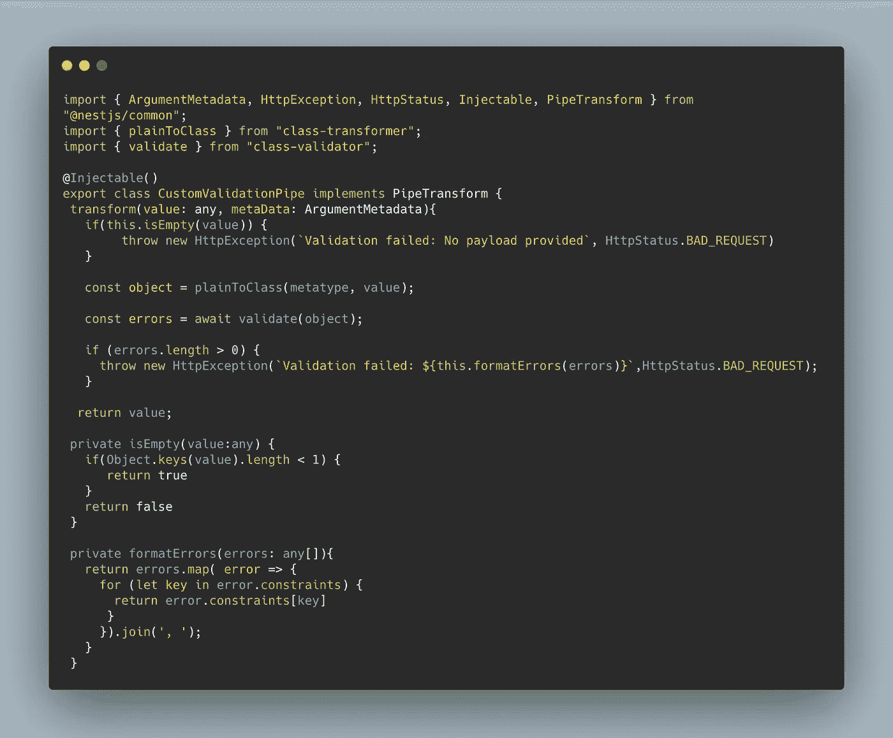
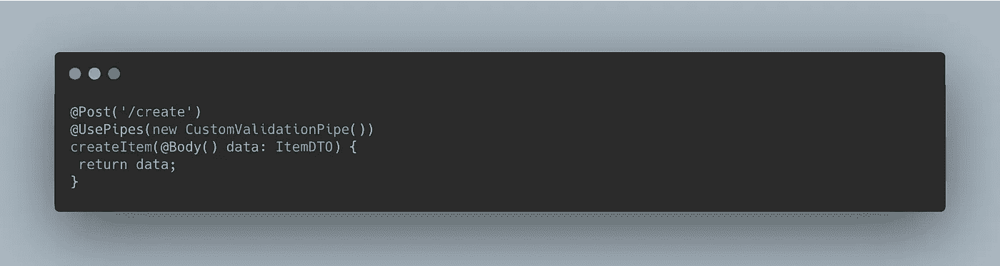

# Nest.js 和自定义验证管道

> 原文：<https://betterprogramming.pub/nest-js-and-the-custom-validation-pipe-231130fda040>

## 更好的验证

照片来自 [Morioh](https://morioh.com/p/f42cae11dbd4) 。

[Nest.js](https://docs.nestjs.com/) 是一个用于构建服务器端应用的渐进式 Node.js 框架。在引擎盖下，它使用 [Express](https://expressjs.com/) 框架，也可以配置为使用 [Fastify](https://github.com/fastify/fastify) 。它是用 TypeScript 构建的，并且完全支持 TypeScript(这也是我喜欢这个框架的原因之一)。

和 Angular 一样，Nest 为我们提供了管道。管道基本上是可以接受输入数据、转换数据并输出转换后的数据的类或函数。

Nest 中的管道用`@injectable()`装饰器进行了注释。通常，在所有应用程序中，管道都可以用于转换和验证。在本文中，我将写关于管道的验证用例。

假设我们正在构建一个应用程序，该应用程序公开一个 POST 端点来在购物列表上创建一个新项目，您需要用户向端点提供以下内容作为有效负载:

*   名称(必填)
*   描述(必填)
*   数量(可选)
*   单价(必填)

首先，我们需要创建一个处理请求的控制器，并且我们需要指定控制器应该期望一个 body 对象作为来自请求的数据。数据类型为`any`(暂时):

接下来，我们需要验证有效负载，以确保它符合端点的期望。为此，我们需要安装这两个包——类验证器和类转换器:

现在我们需要创建一个 d to(数据传输对象)，它更像是一个描述数据应该是什么样子的模型。我们称它为`ItemDTO`。创建一个名为`item.dto.ts`的新文件:

class-validator 库为我们提供了几个可以用来描述数据类型的装饰器。从上面的片段来看:

1.`name`被声明为字符串。`IsNotEmpty()`装饰器确保它是必填字段。

2.`description` **也是如此。**

3.`unitPrice`预计是一个数字，也是必需的。

4.注意`quantity`没有装饰器。但是，它被声明为一个数字。

现在我们需要将控制器上的有效负载类型改为`ItemDTO`类型，如下所示:

因此，到目前为止，我们所做的是通知我们的控制器，希望用户发送类型为`itemDTO`的有效载荷。但是，如果端点没有获得任何有效负载或者有效负载不符合预期的数据类型，会发生什么呢？我们不希望我们的应用程序崩溃，是吗？作为指导，我们还必须告知用户正确的数据类型。这就是我们的定制验证器的用武之地。Nest 为我们提供了内置的验证器管道。你可以在文档中读到它[。](https://docs.nestjs.com/techniques/validation#using-the-built-in-validationpipe)

我们需要创建一个名为`validation.pipe.ts`的新文件。我们应该创造一个新的阶级叫做`CustomValidationPipe`。这个类应该实现`PipeTransform`接口，这将使我们提供一个`transform`方法。`transform`方法接受像`value`(我们的有效负载)和`metaData`(显示更多关于我们的有效负载的元数据)这样的参数。将下面的代码粘贴到文件中:

1.我们需要检查我们的有效载荷不为空:

注意`HttpStatus`是如何使用的。Nest 有一个可以利用的不同 HTTP 状态的枚举，因此您不必自己设置状态代码。在这一点上，我们确信我们将有一个有效载荷。

2.我们需要根据注册的 d to 来验证有效载荷:

在这里，我们使用了 class-transformer 中的`plainToClass`方法。这将普通(文字)对象转换为类(构造函数)对象。这是必要的，因为我们需要验证我们的有效载荷是一个类对象。这就是为什么我们必须使用来自类验证器库的`validate`方法。它返回一个错误数组的承诺(`Promise<ValidationError[]>`)。这将确保我们的有效负载根据提供的 DTO 类进行验证。

3.我们需要格式化`errors`数组，使其更加用户友好:

4.我们需要将验证管道的类添加到控制器中。我们通过将它放入`@UsePipes()`装饰器中来实现，如下所示:

所以你有它。管道在 Nest 中是一个非常有用的概念。使用我们创建的验证类，我们可以验证应用程序中的所有控制器。这是非常可重用的，并且可以很容易地在单元测试中测试。这就是管道在应用程序中的用处。

感谢您的阅读。请随时在下面发表评论。