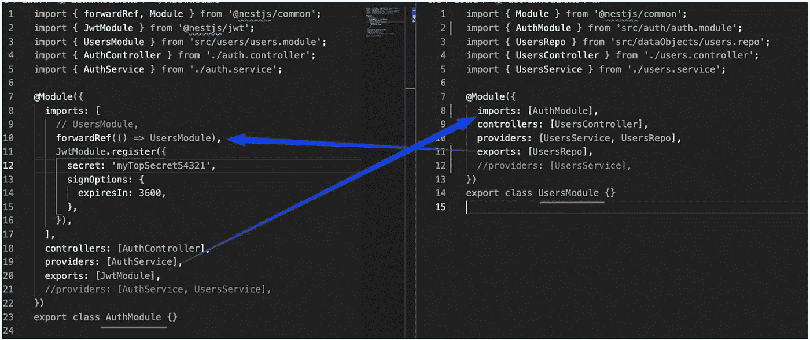
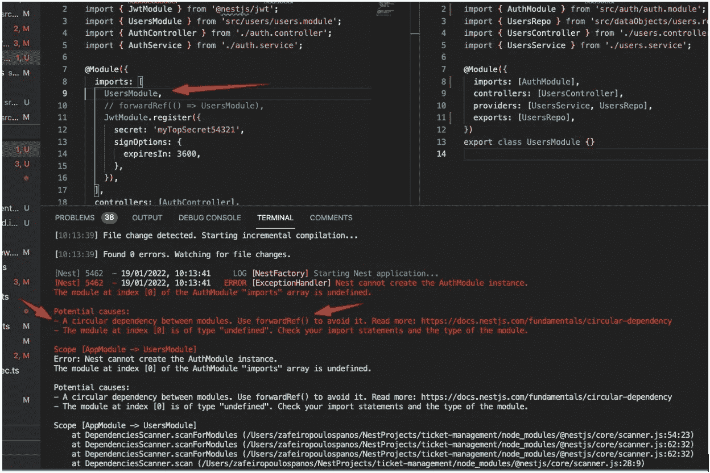

# 避免 Nest.js 中的循环依赖问题

> 原文：<https://betterprogramming.pub/nest-js-avoid-circular-dependency-issues-4f7577377acc>

## 快速浏览 progressive Node.js 框架的循环依赖问题


照片由[Tine ivani](https://unsplash.com/@tine999?utm_source=medium&utm_medium=referral)在 [Unsplash](https://unsplash.com?utm_source=medium&utm_medium=referral) 上拍摄

当两个类相互依赖时，就会出现循环依赖。

比如 A 类需要 B 类，B 类也需要 A 类，模块之间，提供者之间的嵌套会产生循环依赖。虽然应该尽可能避免循环依赖，但你不能总是这样做。

在这种情况下，Nest 支持以两种方式解决提供者之间的循环依赖。在本章中，我们描述了使用前向引用作为一种技术，使用`ModuleRef`类从 DI 容器中检索提供者实例作为另一种技术。

# 我们的示例案例

我们有两个班`UsersRepo`(在`UsersModule`)和`JwtService`(在`AuthModule`申报的`JwtModule`提供的`AuthModule`)。两者相互依赖。

`UsersModule`的`UsersRepo`需要`JwtService` ( `JwtModule`)进行 JWT 验证和解码。在`AuthModule`中对`JwtModule`进行声明、配置和导出。因此，在`UsersModule`中，我们可以(我们必须)以“正常”的方式导入它。

下面是`UsersModule`的代码:

我们可以在`UsersRepo`构造函数中以‘正常’的方式注入`JwtService`:

```
import { JwtService } from ‘@nestjs/jwt’;
. . .
export class UsersRepo {
constructor(private jwtService: JwtService), …)
```

另一方面，`AuthModule`的`AuthService`需要 UsersRepo 进行用户登录/注册。`UsersRepo`是`UsersModule`导出的一个类(服务提供者)。我们可以(我们必须)使用`forwardRef()`在`AuthModule`进口它。

`AuthModule`

同样，我们也可以在`AuthService`中注入`UsersRepo`，通过使用‘正常’的方式(注意这里的`JwtService`用于创建和返回一个新的 JWT):

```
import { UsersRepo } from ‘src/dataObjects/users.repo’;
import { JwtService } from ‘@nestjs/jwt’;
. . .
@Injectable()
export class AuthService {
constructor(private usersRepo: UsersRepo, private jwtService: JwtService) {}
```



# 再现循环相关性错误

如果我们试图以“正常”的方式(`imports: [UsersModule, …]`)导入它，我们将会得到循环依赖错误:



循环依赖错误

就是这样！感谢阅读和快乐编码！