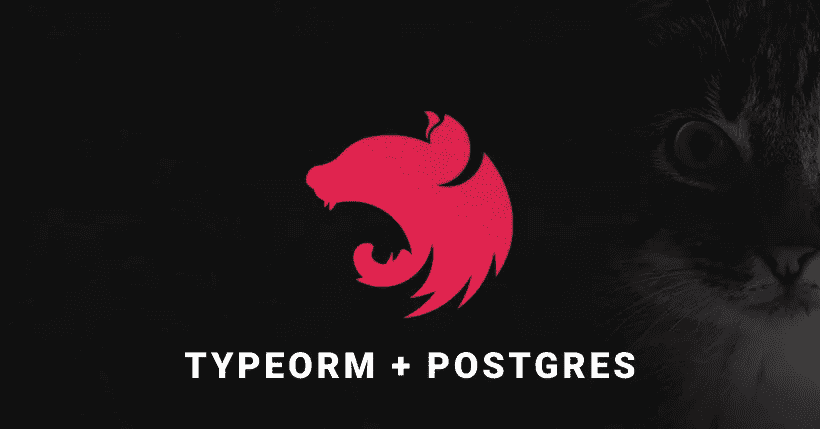
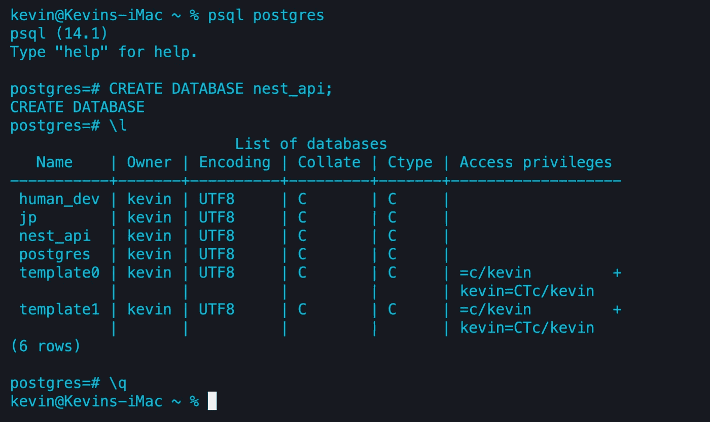
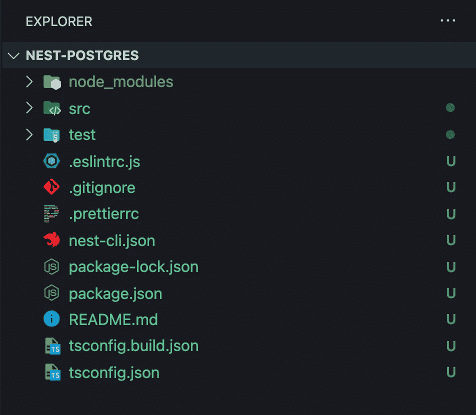
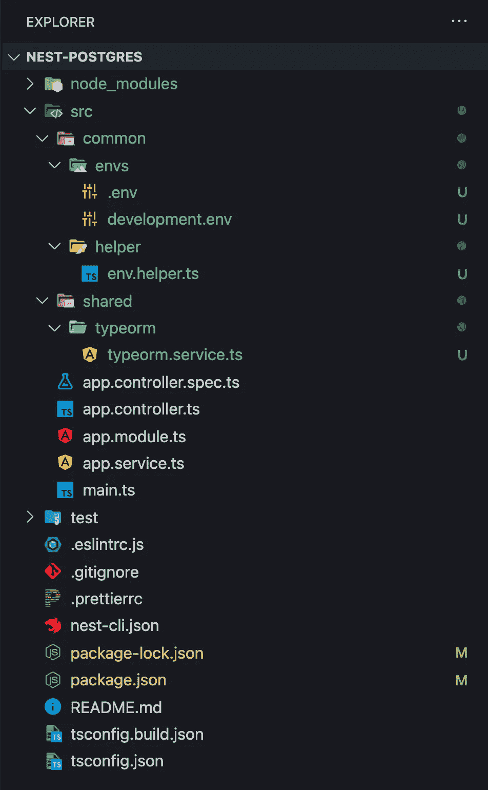
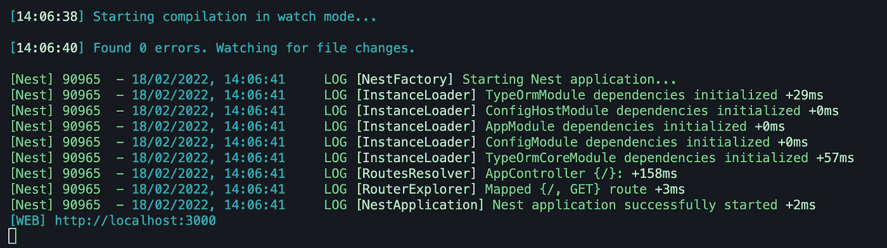
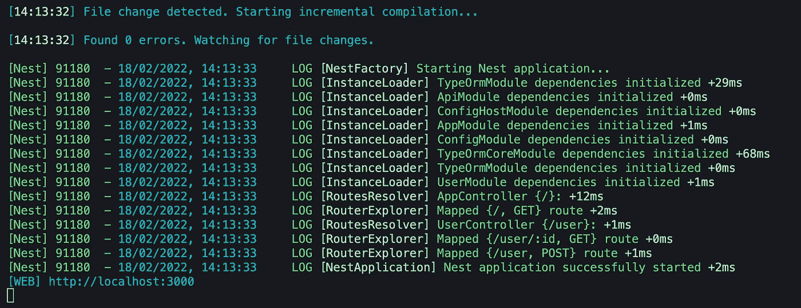
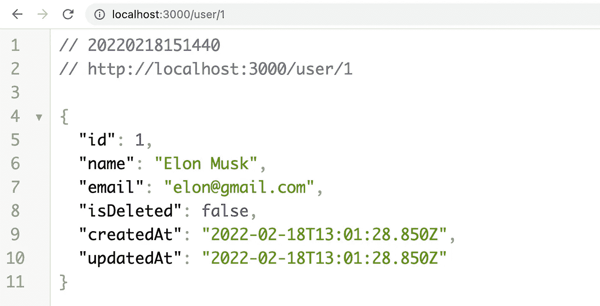

# 具有 TypeORM 和 Postgres 的 NestJS

> 原文：<https://betterprogramming.pub/nest-js-project-with-typeorm-and-postgres-ce6b5afac3be>

## 使用 NestJS & TypeORM 创建可伸缩的应用程序



在今天的文章中，出于简单的原因，我想开发一个基于 NestJS、TypeORM 和 Postgres 的小项目，而不使用 Docker。

请注意，我已经在 [Github](https://github.com/hellokvn/medium-nest-typeorm-postgres-sample) 上部署了这个项目。现在，我们开始吧！

# 先决条件

需要对 Node.js、TypeScript 和 PostgreSQL 有一个基本的了解，它们已经安装在您的机器上。我会选择 [Visual Studio 代码](https://code.visualstudio.com/)作为我的代码编辑器。你可以用你喜欢的任何东西。

# 我们开始吧

首先，我们需要创建 PostgreSQL 数据库。我知道，每个人都有不同的处理方式，有些人使用 GUI，但我们将使用我们的终端。同样，您需要在您的机器上安装 PostgreSQL。如果您安装了 PostgreSQL，以下四个命令将在 Linux、Mac 和 Windows 机器上运行。

```
$ psql postgres
$ CREATE DATABASE nest_api;
$ \l
$ \q
```

*   使用用户`postgres`打开`psql` CLI
*   `CREATE DATABASE nest_api;`创建我们需要的数据库
*   `\l`列出所有数据库
*   CLI 退出

在我们成功地执行了所有四个命令之后，我的终端看起来应该是这样的。正如我们所见，数据库`nest_api`被创建了。



# NestJS 应用程序

还是继续 NestJS 吧！我们将安装 NestJS CLI，因此打开您选择的终端并键入:

```
$ npm i -g @nestjs/cli
```

我们用它的 CLI 初始化一个新的 NestJS 项目。这可能需要一分钟。

```
$ nest new nest-postgres -p npm
```

完成该命令后，您可以在代码编辑器中打开您的项目。由于我使用 Visual Studio 代码，我将通过键入以下命令打开项目:

```
$ cd nest-postgres
$ code .
```

我的项目在 VSCode (Visual Studio 代码)中是这样的:



下一步是可选的，但通常我会提交初始初始化，所以我要键入:

```
$ git add .
$ git commit -m "chore(): init nestjs"
```

让我们安装一些我们需要的依赖项。

```
$ npm i @nestjs/config @nestjs/typeorm typeorm pg class-validator class-transformer
$ npm i -D @types/node
```

现在，让我们开始编码。为了有一个清晰的项目结构，我们将创建一些文件夹。对于诸如环境文件或一般帮助文件之类的杂项文件，我通常会创建一个名为 common 的新文件夹。

```
$ mkdir src/shared && mkdir src/shared/typeorm
$ mkdir src/common && mkdir src/common/envs && mkdir src/common/helper
```

此外，让我们创建一些文件。

```
$ touch src/shared/typeorm/typeorm.service.ts
$ touch src/common/envs/.env
$ touch src/common/envs/development.env
$ touch src/common/helper/env.helper.ts
```

我们的项目树现在应该是这样的:



为了将环境文件放在我们的`dist/`文件夹中，我们需要向我们的`nest-cli.json`添加一个编译器规则。

所以请将`nest-cli.json`从

nest-cli.json

到

nest-cli.json

现在让我们修改我们的`src/common/helper/env.helper.ts`文件，以便在稍后导入我们的 ConfigModule 时加载我们的环境文件。

src/common/helper/env . helper . ts

这个函数根据我们的`NODE_ENV`返回环境文件的绝对路径。它基本上有两个回落。首先，如果没有设置`NODE_ENV`，我们尝试获取`development.env`文件的绝对路径，如果该文件不存在，它将返回`.env`文件的绝对路径。

让我们继续给我们的环境文件添加一些生命。您可以在每个代码片段下面看到文件路径。

src/comon/envs/。包封/包围（动词 envelop 的简写）

src/comon/envs/development.env

> ***注意:*** *通常，出于安全原因，您不会将任何环境文件推送到您的 Git 存储库，除了一个示例。env 文件，它向其他贡献者显示我们的环境文件的结构。这就是为什么我创建了一个. env 文件。*

我们创建了环境文件和助手文件。现在我们可以在实际代码中实现它们。为此，我们需要添加我们在项目开始时安装的 ConfigModule。

请将`src/app.module.ts`从:

src/app.module.ts

到

src/app.module.ts

> ***注意:*** *我们全局添加了* `*ConfigModule*` *。这意味着我们不必在每次需要访问* `*ConfigService*` *时都导入它。*

`ConfigModule`现在和环境文件都搞定了。让我们继续我们的 TypeORM 集成。记住，我们在`src/shared/typeorm/`内部创建了一个名为`typeorm.service.ts`的文件，让我们添加一些内容:

src/shared/type ORM/type ORM . service . ts

> *警告:如果属性 synchronize 为真，TypeORM 将自动更新实体的任何更改。这是你永远不应该在生产中使用的东西！*

这里发生的是，我们注入我们的`ConfigService`，然后基于那个`ConfigService`，我们从我们的环境变量中提取数据库信息。

让我们再次修改我们的`src/app.module.ts`文件，将`TypeOrmModule`和我们刚刚创建的`typeorm.service.ts`文件添加在一起。

请将`src/app.module.ts`从:

src/app.module.ts

到

src/app.module.ts

接下来，我们将简要修改我们的`src/main.ts`文件。我们要做的是，在我们的引导函数中获取`ConfigService`，在这里我们从活动环境文件中获取`PORT`和`BASE_URL`信息。此外，我们添加了一个[全局管道](https://docs.nestjs.com/pipes#global-scoped-pipes)来进行更好的验证。

请将`src/main.ts`从:

到

现在，我们应该能够毫无问题地运行我们的 NestJS 应用程序了。

```
$ npm run start:dev
```

我们控制台内部的输出应该是这样的:



> ***注意:*** *如果遇到这个错误:*“无法连接数据库。”*那么你的数据库信息是错误的。*

现在一切都正常了。让我们继续创建一个简单的用户模块和用户实体来演示我们如何在模块内部与 TypeOR 交互。

为了创建一个新模块，我们将再次使用 NestJS 的 CLI。

```
*$ nest g mo api
$ nest g mo api/user && nest g co api/user* --no-spec *&& nest g s api/user* --no-spec
$ touch src/api/user/user.entity.ts
$ touch src/api/user/user.dto.ts
```

我们的项目树现在应该看起来像这样:


我们得到了**用户模块**，加上它的**控制器**、**服务**、**实体**，以及 **DTO** 。让我们用内容填充它们，从`src/api/user/user.entity.ts`文件开始:

src/api/user/user.entity.ts

> ***注意:*** *如果您的* NestJS *应用程序正在运行，TypeORM 会在我们的数据库****nest _ API****中创建一个名为 user 的新表，因为我们在我们的* `src/shared/typeorm/typeorm.service.ts` *配置文件中启用了 synchronize 属性。*

接下来，我们将向`src/api/user/user.dto.ts`文件添加一些内容，以便稍后验证我们的 POST 请求。

src/api/user/user.dto.ts

现在，我们需要在用户模块中提供我们的用户实体。

请将`src/api/user/user.module.ts`从

src/API/用户/用户.模块. ts

到

src/API/用户/用户.模块. ts

现在，我们能够使用我们的用户实体。让我们将这个实体注入到我们的`user.service.ts`文件中，同时添加两个方法来创建和获取用户。

请将`src/api/user/user.service.ts`从

src/api/user/user.service.ts

到

src/api/user/user.service.ts

通常，我们可以检查用户是否已经存在，但是为了简单起见，我们今天将跳过这一步。让我们继续在用户控制器中使用这些方法。

请将`src/api/user/user.controller.ts`从

src/API/user/user . controller . ts

到

src/API/user/user . controller . ts

实际上就是这样，我们已经完成了代码实现本身。如果您还没有运行我们的 NestJS 应用程序，让我们通过使用以下命令来实现:

```
$ npm run start:dev
```



现在，我们可以测试我们刚刚创建的两条路线。我们可以通过使用软件如[邮递员](https://www.postman.com/)来测试它，或者我们简单地运行 CURL 命令。

**创建新用户**

```
$ curl -X POST http://localhost:3000/user -H "Content-Type: application/json" -d '{"name": "Elon Musk", "email": "elon@gmail.com"}'**Server Response:**{"name":"Elon Musk","email":"elon@gmail.com","id":1,"isDeleted":false,"createdAt":"2022-02-18T14:12:13.672Z","updatedAt":"2022-02-18T14:12:13.672Z"}
```

现在，我们成功创建了一个新用户。现在，我们可以在浏览器中根据用户的身份提取用户信息。

URL:[http://localhost:3000/user/1](http://localhost:3000/user/1)



别忘了，我已经在 [Github](https://github.com/hellokvn/medium-nest-typeorm-postgres-sample) 上传了这个项目。

想加入 NestJS 吗？观看 NestJS 创建者 [Kamil Mysliwiec](https://medium.com/u/f7cc8266ff67?source=post_page-----ce6b5afac3be--------------------------------) 关于 NestJS 的演讲。

感谢阅读我关于 NestJS 的文章。我希望，我能告诉你如何从 TypeORM 和 PostgreSQL 开始。

干杯！

我希望你喜欢读这个。如果你想支持我成为一名作家，考虑注册[成为](https://medium.com/@hellokevinvogel/membership)中人。每月仅需 5 美元，您即可无限制地使用 Medium。

想支持我吗？[请我喝杯咖啡。](https://www.buymeacoffee.com/hellokevinvogel)

# 阅读下一页

[](https://blog.bitsrc.io/solid-principles-in-typescript-153e6923ffdb) [## 打字稿中的坚实原则

### TypeScript 对用 JavaScript 编写干净的代码有着巨大的影响。但是总有办法…

blog.bitsrc.io](https://blog.bitsrc.io/solid-principles-in-typescript-153e6923ffdb) [](https://blog.bitsrc.io/10-quick-typescript-one-liners-128a2721345) [## 10 种快速打字稿单行

### 能够提高工作效率的 JavaScript / TypeScript 一行程序

blog.bitsrc.io](https://blog.bitsrc.io/10-quick-typescript-one-liners-128a2721345) [](https://blog.bitsrc.io/how-to-enable-cors-in-nest-js-90c1b6316289) [## 如何在 NestJS 中启用 CORS(2022 年)

### 如何在 NestJS 中启用 CORS 的简要指南

blog.bitsrc.io](https://blog.bitsrc.io/how-to-enable-cors-in-nest-js-90c1b6316289)