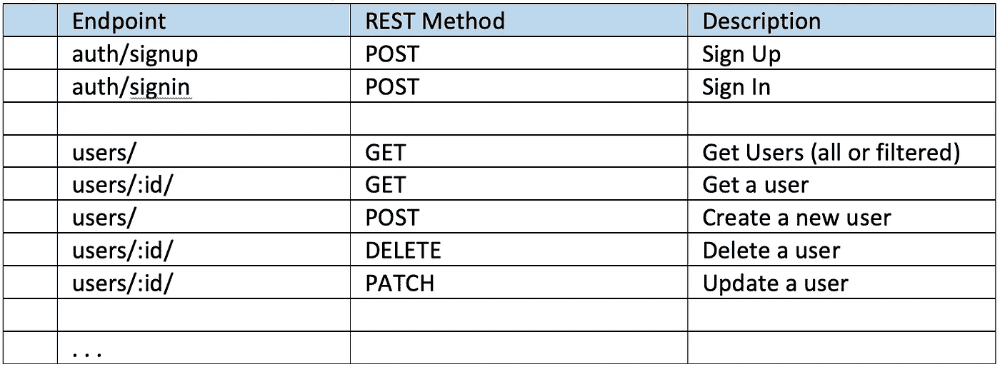
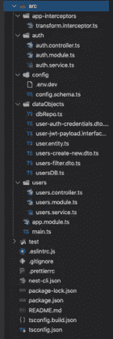

# 通过创建 REST API 来挑战您的 NestJS 技能

> 原文：<https://betterprogramming.pub/nestjs-challenge-take-the-basic-steps-and-start-developing-a-rest-api-5401b234d834>

## NestJS REST API 项目的蓝图

# 简介和先决条件

如果你认为是时候接受挑战，开始开发一个[NestJS](https://nestjs.com/)[REST](https://en.wikipedia.org/wiki/Representational_state_transfer)[API](https://en.wikipedia.org/wiki/API)了，那么这篇文章可能是有用的敲门砖。

这篇文章只是介绍了启动这样一个项目所需的基本步骤。实际上，它将引导您到这样一个点，您会认为下一阶段是使用数据库(如 MongoDB、PostgreSQL、MySQL/MariaDB、Oracle、MS SQL Server 等)为项目添加一些持久性。

用户认证，即用户访问限制，是几乎所有 REST API 后端项目的关键部分。所以，这篇文章真正要做的，是向您展示创建用户认证项目所需的基本步骤。

别想歪了。在这篇文章中，您不会得到任何关于包安装和/或创建项目或者项目模块的示例命令。这是你的挑战。然而，您的奖励将是一个带有示例代码的存储库，作为下面给出的步骤的结果。

因此，假设您已经对 [NodeJS](https://nodejs.org/en/) 和 [NestJS](https://nestjs.com/) 框架及其 [CLI](https://docs.nestjs.com/cli/overview) 足够熟悉。

此外，如果您还不熟悉 NestJS 的基本构件，如[模块](https://docs.nestjs.com/modules)、[提供者](https://docs.nestjs.com/providers)、[控制器](https://docs.nestjs.com/controllers)、[路由器](https://docs.nestjs.com/recipes/router-module)等。请花些时间去做，否则，你应该按照下面的步骤逐步去做。此外，您应该准备好处理一些与开发简单 REST API 相关的关键主题，如 [CRUD 操作](https://en.wikipedia.org/wiki/Create,_read,_update_and_delete)、 [DTO](https://en.wikipedia.org/wiki/Data_transfer_object) 、 [JSON](https://www.json.org/) 和 JSON 类对象、[认证](https://en.wikipedia.org/wiki/Authentication)和[授权](https://en.wikipedia.org/wiki/Authorization)、[密码散列](https://en.wikipedia.org/wiki/Key_derivation_function#Password_hashing)、 [JWT](https://jwt.io/) 令牌以及[护照](https://www.passportjs.org/)包。最后，你还必须处理一些其他的概念和包，例如，如何使用 decorators，数据验证和转换，如何为你的 NestJS 项目定义和使用外部定义的参数，等等。

所以，做好准备，开始遵循下面的步骤。编码快乐！

# **a .**基础知识

创造一个新的巢穴。Js 项目。NestJS CLI 将成为您的工具。

创建核心数据库实体

*   识别并开始创建主要实体(类)和/或接口。至少，定义并创建一个基本的用户实体类及其属性。例如:
*   `id: string;
    username: string;
    password: string;
    email: string;
    registrationdate: Date;
    confirmed: boolean;
    canceled: boolean;
    typeid: number;
    countryid: number;`
*   稍后，您将添加其他对象，如[数据传输对象—dto](https://en.wikipedia.org/wiki/Data_transfer_object)、回购等。
*   你可以考虑使用一个单独的文件夹(例如`dataObjects`)来存放你所有的实体和 dto。

定义您的主要 REST API 端点。例如，从一个类似的表开始:

注意:稍后，您可以在表中添加更多的端点，并采取类似的步骤。

*   考虑为 REST API 端点使用一个全局前缀(例如，`tickets`)。
*   稍后，您可以考虑添加 API 版本控制方法和/或每个模块的路由和子路由

创建主/核心模块、控制器和服务:

*   第一个基本方法是为每个端点创建一个模块。例如，对于上面的端点`/auth`和`/users`，分别创建`AuthModule`和`UsersModule`(如果没有其他特殊原因，可以删除`app.controller.ts`和`app.service.ts`——因为默认为`app.module.ts`，所以默认创建)。
*   为每个模块创建一个控制器和一个服务(例如，`UsersController`、`UsersService`和`AuthController`、`AuthService`)。
*   为每个控制器创建必要的 REST API 处理程序(用`@Get`、`@Post`、`@Delete`、`@Patch`等修饰的函数)。)
*   对于服务(与特定的控制器相匹配),创建对应于特定 REST API 处理程序的函数(函数处理程序)。

为您的项目启用 Git 版本控制，并执行您的第一次提交。

创建一个存储库，例如`DbRepo`:

*   这样的 repo 可以托管支持两者所需的所有功能:即`AuthService`和`UsersService`。它实际上将对来自控制器和服务的 API 请求提供真实的响应。
*   注 1:出于同样的目的，我们当然可以分别使用`AuthService`和`UsersServiice`。然而，这种方法会导致重用一些相似的(如果不是完全相同的)功能，此外还会在决定哪个服务应该包含其他帮助功能时遇到麻烦。如果以后我们决定为处理其他实体的其他端点添加更多的模块，那就更是如此。
*   注 2:我们也可以使用单独的`DbModule`和`DbService`(或同名:`DbRepo`)作为`DbModule`的服务。但是这种方法会让我们处于试图解决循环依赖问题的境地。(你可以在 Nest.js 的[避免循环依赖问题中看到我的一篇与此类问题相关的帖子)。因此，使用一个`solo`库作为`Provider`似乎是一个更好的方法，允许我们避免大量的](/nest-js-avoid-circular-dependency-issues-4f7577377acc)[枯燥的](https://en.wikipedia.org/wiki/Don%27t_repeat_yourself)代码。

使用日志记录。为您的类使用 NestJS 日志记录器，而不是 console.log。将其用于测试目的、调试、错误等。

使用 [Postman](https://www.postman.com/) 和/或浏览器开始执行初始测试，例如，测试主要的 REST API 端点。

提交更改。

# **B.** **增强、细化、验证和变形**

完善和增强端点的功能。例如，添加通过 id 获取用户的参数，搜索并返回用户对象，等等。

*   处理搜索和过滤—搜索用户名、搜索电子邮件等。(例如:`users?status=statusId&page=1&pageSize=10`)
*   基于带有可选参数的 DTO 添加补丁/更新
*   对于特定的端点和 REST API(例如，一些 CRUD)动作，考虑创建一些特定的 DTO，例如，使用 DTO 进行搜索/过滤
*   如果属性条目已经存在，则改进 Post/Patch(具有相同名称和/或电子邮件的用户)等。

提交。

类/实体的验证和转换

*   安装并使用[类验证器](https://www.npmjs.com/package/class-validator)和[类转换器](/class-transformer)库——这些库允许我们在 dto 中使用 decorators，并为 API 端点的请求和响应提供数据转换功能。0
*   在 dto 中配置和使用 Nest.js `ValidationPipe`。
*   为提供数据(有效负载)的传入客户端参数化请求应用验证规则—使用 NestJS 管道验证器—相应地修饰您想要的 dto
*   为可序列化的类/对象实现类转换。
*   从以下两种方法中选择一种合适的方法来实现序列化对象的转换。
*   -通过使用内置的`ClassSerializerInterceptor`(参见[序列化文档](https://docs.nestjs.com/techniques/serialization))。`@UseInterceptors(ClassSerializerInterceptor)`
*   -通过为我们的应用程序创建一个更通用的实现自定义`Transformation Interceptor`。
*   用适当的转换装饰器来装饰必要的类实体(和/或 dto)

提交更改。创建一个新的远程 git repo 并提交您的提交。

# **c .**实施外部定义的配置

使用外部。env 文件来定义一些必要的参数——为 NestJS 安装`[@nestjs/config](https://www.npmjs.com/package/@nestjs/config)`包(注意:`@nestjs/config`包内部使用众所周知的 [dotenv](https://github.com/motdotla/dotenv) 包)。

在大多数情况下，这是必要的，因为我们使用一些值以及一些可能在生产中改变的敏感信息。示例:

*   App 监听端口号、API 全局路由前缀、JWT 参数(令牌秘密、令牌到期时间，例如，以秒为单位—参见下一节— D)。数据库连接参数(类型、主机、端口、用户名、密码、数据库)等。,
*   全局使用 [ConfigModule](https://docs.nestjs.com/techniques/configuration#getting-started) ，并在 **main.ts** 和其他模块以及动态导入的模块中实现。示例:`JwtModule`
*   排除。git 中的 env 文件(将它/它们添加到。gitignore) —如有必要，将它们包括到生产部署中，例如在/dist 文件夹中
*   使用 schema validation pro-tool([Joi](https://joi.dev/)是 NestJS 建议/推广的工具)来验证从外部. env 文件获得的配置值。
*   注 1:我们也可以使用 Joi 进行 DTOs 类验证，而不是类验证器。然而，我们必须意识到 Joi 使用带有 Joi 属性装饰器的 JSON 对象作为模式验证器，因此我们必须为每个 DTO 创建这样的模式对象，与我们的 dto 分开。一个可能的解决方案——如果我们想使用 Joi 验证——是使用一些其他的助手包，这些包超出了本文的挑战范围。
*   注意 2:对于配置:或者，我们可以创建并使用我们自己的`Configuration`服务(基于`@nestjs/config/ConfigModule`)来处理来自操作系统运行时环境的环境变量(例如，通过操作系统外壳导出的`export DATABASE_USER=test`)和位于内部的环境变量。env 文件，以及在用于不同目的的不同配置集和各种功能模块中使用它(例如，当我们必须处理不同的数据库和存储库时)。此外，请注意，我们可以使用 [YAML](https://yaml.org/) 格式/语法(通过 [js-yaml](https://www.npmjs.com/package/js-yaml) )来使用定制配置文件

测试您的更改是否正常运行。

提交更改并提交您的提交。[看这个基础回购:[https://github.com/zzpzaf/nest-external-config-env](https://github.com/zzpzaf/nest-external-config-env)]

# **D.** **开始使用 JWT 实施基础认证(用户认证)。**

安装`[bcrypt](https://www.npmjs.com/package/bcrypt)`和`[UUID](https://www.npmjs.com/package/uuid)`包/库。

*   [bcrypt](https://en.wikipedia.org/wiki/Bcrypt) 是一个[密码散列](https://en.wikipedia.org/wiki/Password-hashing_function)函数，它能够散列和取消散列一个普通密码。
*   [UUID](https://en.wikipedia.org/wiki/Universally_unique_identifier) 提供允许你创建一个通用的唯一标识符(UUID ),它可以被用作唯一值，因此它们可以被用作用户实体中 ID 属性的主键。
*   注意:以后添加数据库时，如果您选择的数据库提供密码哈希和自动生成 UUID 功能，则可以删除它们。
*   为用户凭证定义一个新的 DTO，并应用一些验证规则(用户名长度、电子邮件、使用@Matches decorator 和 regex 的密码要求等)。)

提交更改并提交您的提交。

安装 [@nestjs/jwt](https://www.npmjs.com/package/@nestjs/jwt) 包，该包使您能够用签名的 [JSON Web 令牌](https://jwt.io/)来保护您的应用程序。

*   基于 JWTs 实现初始认证—对于 NestJS，这是 [@nestjs/jwt](https://www.npmjs.com/package/@nestjs/jwt) 包。(稍后，我们还将添加护照包)。
*   在现有模块的 imports 部分添加/声明`**JwtModule**`(例如在 AthModule 中),并应用一些基本配置，例如 secret 和以秒为单位的过期时间。
*   然后，您可以在另一个类中使用`**JwtService**`(来自 JwtModule)，例如在认证服务“AuthService”中创建/返回或验证 JWT。
*   定义一个`**payload**`接口或类(为了一致性和可维护性，避免错误，等等)。).
*   我们总是可以从请求体中获得有效负载对象
*   为登录流程创建一个新的令牌(JWT )(用于`/auth/signin`端点)
*   检查用户端点中的 JWT—我们可以在`AuthService`中实现验证，然而，另一个选择是在我们的`**repo**` ( `DbRepo`)中实现。
*   注意:我们可以只对一个或几个端点这样做，看看我们如何处理它。然而，为每个端点做这件事需要大量的样板代码，因此不容易维护。因此，稍后我们将使用`[Passport](https://www.passportjs.org/)`库，它允许我们实现一个`[jwt strategy](https://www.passportjs.org/packages/passport-jwt/)`并使用 Passport 提供的`AuthGuard`对象(实际上是`@nestjs/passport`)(见下文)来保护整个路由(例如端点)。

通过邮递员测试您的更改。

提交更改并提交您的提交。[看看这个回购:[https://github.com/zzpzaf/nest-external-config-env-jwt](https://github.com/zzpzaf/nest-external-config-env-jwt)

# **E.** **通过使用 Passport 库增强项目的认证(用户认证)。**

添加`[Passport](https://www.npmjs.com/package/passport)`包和助手包:`[@nestjs/passport](https://www.npmjs.com/package/@nestjs/passport)`，它提供了与 NestJS 框架/生态系统的集成，以及`[passport-jwt](https://www.npmjs.com/package/passport-jwt)`，它是 jwt 的通行证策略包(我们还必须添加`[@types/passport-jwt](https://www.npmjs.com/package/@types/passport-jwt)`作为`devDependency`)

*   在我们的`AuthModule`中声明(导入)`PassportModule`，并将 jwt 注册为默认策略。
*   创建一个`JwtStrategy`类(它应该扩展`PassportStrategy`)并定义一个 validate()函数
*   使用`UsersController`中的 [NestJS 路线保护装置](https://docs.nestjs.com/guards#putting-it-all-together)(使用带有 Passport 的`AuthGuard()`内置方法的`@UseGuards()`装饰器)或任何其他控制器或端点处理器。
*   测试并提交更改。推进你的承诺。

## **太好了！你做到了！**

# **外卖**

到目前为止，一切顺利。如果您已经完成了上面的所有步骤，那么您应该已经掌握了开始开发 NestJS REST API 以及使用和实现关键概念和包的惊人知识。如果你没有，不要担心！还有“B 计划”。这是一个[库](https://github.com/zzpzaf/nest-external-config-env-jwt-passport)，可以作为一个例子来说明如何实现一个结果代码。

请注意，包含的代码可能不是最好的，但肯定可以更好。但无论如何，这是有效的！(嗯，至少对我来说是).

项目文件夹结构如下所示。

因此，获取或克隆[示例库](https://github.com/zzpzaf/nest-external-config-env-jwt-passport)并尝试解释所有相关的模块和文件，使用上述步骤作为参考指南。以下是我的一些其他帖子，你可能会觉得对这个挑战有用:

 [## 在 NestJS 中实现外部定义的配置设置

### 使用 NestJS 环境配置快速前进

better 编程. pub](/step-ahead-fast-with-nestjs-environment-configuration-406701b3379f)  [## 您的 NestJS REST API 项目的 JWT 和护照 JWT 策略

### 一步一步详细实施

better 编程. pub](/jwt-and-passport-jwt-strategy-for-your-nestjs-rest-api-project-cafa9dd59890) 

祝你的编码之旅好运！就是这样。Thnx 阅读，敬请关注！