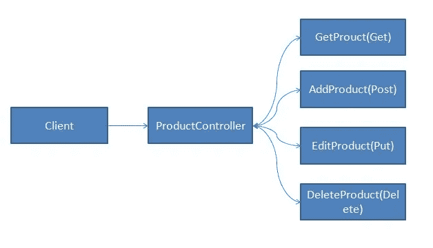
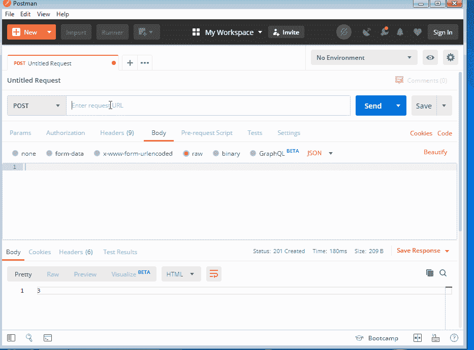

# NestJS 控制器深潜

> 原文：<https://betterprogramming.pub/nestjs-controllers-deep-dive-5c49e19d0941>

## 探索控制器；NestJS 最重要的部分


NestJS 标志

在这篇博文中，我们将探讨控制器，它是 NestJS 最重要的部分。

# 为什么我们需要控制器

控制器负责处理发送到服务器的请求，控制器公开多个端点，客户端可以在这些端点发送请求。每个端点都由一个 HTTP 方法标识，也称为 HTTP verb。

## HTTP 动词

*   GET:GET 方法是从服务器获取数据，可以是单个记录，也可以是多个记录。我们也可以传递一些参数来过滤记录。
*   POST:当我们想要在数据库中创建一些记录时，使用 POST 方法。在我们希望根据发送到服务器的信息过滤一些记录的情况下，我们也可以使用 POST 请求，例如，提供一个高级过滤器。
*   PUT:PUT 方法用于更新数据库中的记录。在`Put`方法中，我们期望我们发送的任何数据都将被更新。
*   PATCH:当我们只想修改而不是替换数据库中的所有值时，使用 PATCH 方法。
*   DELETE:****DELETE 方法在我们想从服务器上删除一些记录的时候使用。****

## ****HTTP 状态代码****

****另一件你必须知道的事情是 HTTP 状态码。您可以参考 [Mozilla 文档](https://developer.mozilla.org/en-US/docs/Web/HTTP/Status)获取状态代码列表。POST 方法返回`201`作为成功的状态码，其他方法返回`200`作为状态码。****

# ****创造我们的第一个控制器****

********

****上图显示了一个`ProductController`，它将接受来自客户端的请求，请求由一个已定义的端点/方法处理。HTTP 方法可以接收 HTTP 请求，并以 JSON、XML、文件或文本的形式返回 HTTP 响应。****

****要创建一个控制器，我们可以使用[嵌套 CLI](https://docs.nestjs.com/cli/overview) ，在我们的应用程序中，我们已经有一个可用的控制器，我们将创建一个名为`product`的新控制器，运行下面的命令来创建。****

```
**nest generate controller product -p default**
```

****`-p`标志将确保控制器是在默认应用程序中创建的，否则，您可以传递您想要创建控制器的产品名称。****

****一旦命令被执行，您将会注意到两个新文件。****

*   ****产品.控制器. ts****
*   ****产品.控制器.规格(用于单元测试)****

****我们需要在`product.controller.ts`中编写代码。如果你现在打开这个文件，你会发现下面的代码。****

```
**import { Controller } from '@nestjs/common';@Controller('product')
export class ProductController {}**
```

*   ****`@Controller` : 控制器装饰器追加在`ProductController`类之上。如果您来自. Net 或 Java 背景，那么您在创建 web APIs 时已经使用过了。它接受一个参数，您可以将请求发送到这个端点。****

# ****添加我们的第一个方法****

****让我们添加我们的第一个`Get`方法，它将返回一个产品列表。我们将创建一个虚拟的产品列表，我们将在下一篇文章中看到数据库集成。****

****打开`product.controller.ts`并添加以下代码:****

****突出显示的代码是我们为创建`Get`方法而添加的代码。****

*   ****`@Get` : 这里的 Get decorator 指定当客户端在`[https://endpoint](https://endpoint)/product`用`Get` HTTP 方法发送请求时，将调用`GetProducts`。****

****继续测试它。使用`npm run start:dev`命令启动服务器，它将在监视模式下运行我们的服务器，并在我们对代码进行任何修改时检测到变化。****

****在浏览器中输入`[http://localhost:3000/product](http://localhost:3000/product)`，可以通过浏览器触发 get 调用。****

# ****添加帖子方法****

****突出显示的代码是为`Post`方法添加的，其余代码保持不变。****

*   ****`@Post`:Post decorator 要定义方法`AddProduct`。当通过 Post 方法向`[https://endpoint](https://endpoint)/product`发出请求时，它将由客户端发起。Post 方法不能通过使用浏览器启动，我们需要一个客户端，我使用 [Postman](https://www.getpostman.com/) 进行测试。****
*   ****`@Req` : 我们可以访问 HTTP `Request`对象。您可以访问主体、头和其他请求参数。****

********

****您可以看到我们是如何提供端点的，方法是`post`，我们在主体中发送了一些数据，并收到了作为响应的`id`值。****

# ****其他装修工****

****对于上传、修补和删除，我们有`@Put`、`@Patch`和`@Delete`装饰器可用。当我们集成数据库时，我们将看到每个示例。****

```
**@Put()
EditProduct(){}@Patch()
UpdateProductPrice(){}@Delete()
DeleteProduct(){}**
```

# ****覆盖响应和标题****

****我们可能需要覆盖状态代码或者以 JSON 的形式创建响应数据，我们可以使用`@Res()`装饰器来实现，让我们修改`AddProduct`方法来使用它。****

****如果我们只想覆盖状态代码，可以使用`@HttpCode`装饰器。****

```
**@Put()
**@HttpCode(204)** EditProduct() {}**
```

****为了给响应添加定制的头，我们可以使用`@Header` decorator。****

```
**@Put()
**@Header('header-key','value')**
EditProduct() {}**
```

# ****覆盖路由名称并创建动态路由****

****我们可以为路由提供友好的名称，甚至可以为每个请求生成一个动态 URL。****

```
****@Put('editProduct')**
EditProduct() {}**
```

****进行更改后，端点将是`[https://endpoint](https://endpoint)/product/editProduct`。****

```
****@Put('editProduct/:id')**
EditProduct() {}**@Get(':id')**
GetProducts() {}**
```

****在上面的场景中，`:id`是 URL 可以接受的动态值。例如，`[https://endpoint](https://endpoint)/product/editProduct/1`，其中 1 是`:id`的值****

# ****访问路由器参数****

****我们还可以使用`@Param`装饰器访问传递给动态路由的参数。在下面的例子中，我们有一个新方法，`GetProductById`，我们通过`id`参数从数组中获取乘积。****

```
**@Get(':id')
GetProductById(@Param() param: number) {
    return this.products.find(p => p.id === +param.id);
}**
```

# ****在我们的操作中使用异步****

****有时候你可能想使用异步动作，主要是在使用`promise`或`observables`的时候。您可以通过使用下面的语法达到同样的目的。****

****在接下来的文章中，我们将会看到更多异步操作的例子。****

# ****注册控制器****

****控制器需要向 NestJS 模块注册，如果您使用 NextJS CLI，这将由 CLI 管理，您不需要手动操作。****

****如果你打开`app.module.ts`，你会看到下面的代码。****

# ****结论****

****在这篇文章中，我们学习了控制器以及为什么和如何使用它们，还学习了不同的装饰者。****