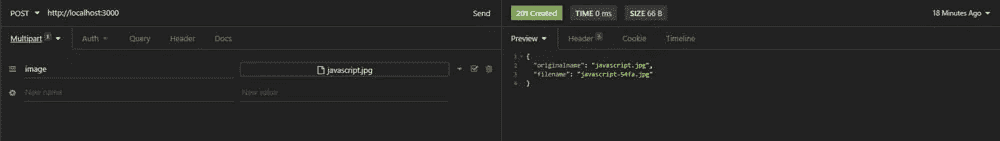
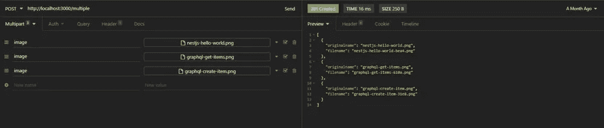
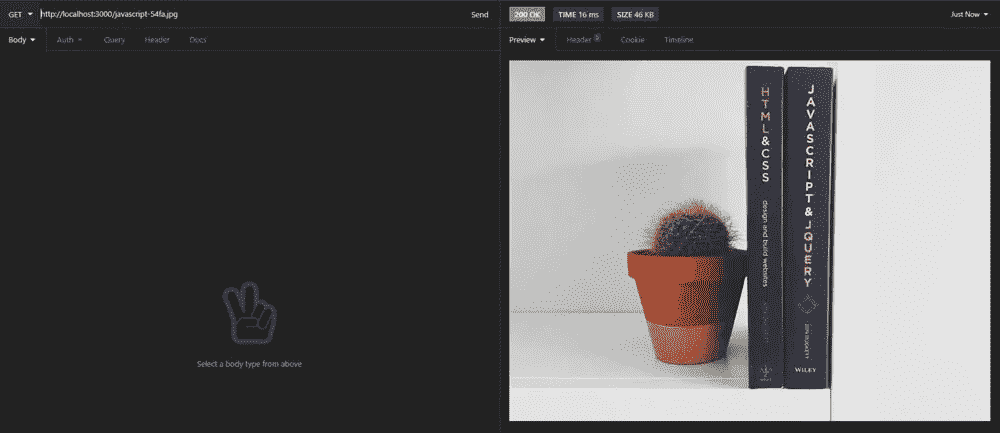

# 使用 Multer 上传 NestJS 文件

> 原文：<https://betterprogramming.pub/nestjs-file-uploading-using-multer-f3021dfed733>

## 如何开发一个简单的文件上传应用程序


JF·马丁在 [Unsplash](https://unsplash.com?utm_source=medium&utm_medium=referral) 上拍摄的照片

本指南将向您展示如何将文件上传到您的 NestJS 应用程序中，以及在这样做时您应该记住的事情。您将开发一个具有三个端点的应用程序，它将执行以下操作:

*   上传图像；
*   上传多张图片；
*   使用图像路径获取图像。

您还将添加自定义实用程序来编辑文件名并验证图像的文件上传。

所以不要再浪费时间了，让我们开始吧。

# 设置

您需要做的第一件事是创建一个保存我们的文件服务器的 NestJS 项目。为此，您需要打开终端并运行以下命令:

```
nest new nest-file-uploading && cd nest-file-uploading
```

这将创建一个名为`nest-file-uploading`的新目录，并用标准的 NestJS 配置对其进行初始化。

目录准备就绪后，您可以使用以下命令安装应用程序所需的依赖项:

```
npm install @nestjs/platform-express --save
npm install @types/express -D
```

在开始编码之前，您需要做的最后一件事是创建项目所需的文件和文件夹。这非常简单，因为应用程序只需要多一个文件。

```
mkdir src/utils
touch src/utils/file-uploading.utils.ts
```

要启动应用程序，您现在可以在终端中执行`npm run start:dev`。

# 上传文件

现在您已经完成了设置过程，您可以继续并开始实现实际的功能。让我们从在你的`AppModule`中导入`MulterModule`开始，这样你就可以在你的其他文件中使用 Multer。

在这里，您从`@nestjs/platform-express`导入`MulterModule`，并将其添加到您的 imports 语句中。您还可以定义上传时保存文件的目的地。

**注意:**这个目的地从项目的根路径开始，而不是 src 文件夹。

下一步是实现实际的上传功能，这相当简单。您只需要在普通的 post 请求处理程序中添加一个`FileInterceptor()`，然后使用`@UploadedFile()`装饰器从请求中提取文件。

`FileInterceptor`有两个参数:一个`fieldName`和一个可选的 options 对象，稍后您将使用它来检查文件类型是否正确，并在目录中给文件一个自定义名称。

一次上传多个文件差不多；您只需要使用`FilesInterceptor`并传递一个关于文件最大数量的额外参数。

这很简单。这里唯一的问题是，用户可以上传任何文件类型，而不管文件扩展名，这并不适合所有的项目，文件名只是一些随机数。

让我们通过在您的`file-upload.utils.ts`文件中实现一些实用程序来解决这个问题。

首先，让我们实现一个只允许上传图像的文件类型过滤器。

这里您创建了一个中间件函数，它检查文件类型是否是图像。如果是，它返回 true，图像将被上传。否则，您将抛出一个错误并为回调返回 false。

`editFileName` 函数具有相同的结构，但是使用原始名称、文件扩展名和四个随机数创建一个自定义文件名。

现在您已经创建了这两个中间件函数，是时候在您的`app.controller.ts`文件中使用它们了。为此，您只需要向`FileInterceptor`添加一个额外的配置对象，它看起来像这样:

最后，您将添加一个 get route，它将图像路径作为参数，并使用`sendFile`方法返回图像。

```
@Get(':imgpath')
seeUploadedFile(@Param('imgpath') image, @Res() res) {
  return res.sendFile(image, { root: './files' });
}
```

# 测试应用程序

现在您已经完成了应用程序，是时候通过向您的端点发送 HTTP 请求来测试它了。这可以使用终端中的 curl 命令或使用 HTTP 客户端软件来完成，如 [Postman](https://www.getpostman.com/) 或[失眠症](https://insomnia.rest/)。我个人用失眠，但在《邮差》里应该差不多。

使用以下命令启动服务器:

```
npm run start
```

如终端输出所示，服务器现在运行在 http://localhost:3000 上。要测试 API，现在只需要创建一个新的 HTTP 请求，并将请求主体更改为 multipart，这样就可以上传文件了。



在这里，您将目的地设置为 http://localhost:3000，并将一个图像添加到请求正文中。这可以通过单击复选框旁边的箭头并选择文件来完成。

在右边，您可以看到服务器上带有原始文件名和新文件名的响应。

**注意:**新文件名稍后用于从服务器获取图像。



这里您做同样的事情，但是在`/multiple`端点上传多个文件。



获取文件也是一个简单的过程。您只需要向 API 发送一个 get 请求，将从 post 请求中获得的文件名作为参数。

该项目的完整代码也可以在我的 GitHub 上找到。

# 结论

你一直坚持到最后！我希望这篇文章能帮助您理解 NestJS 中的文件上传。

如果您有任何问题或反馈，请告诉我。