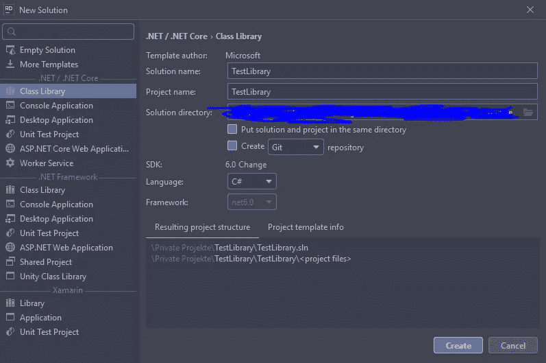
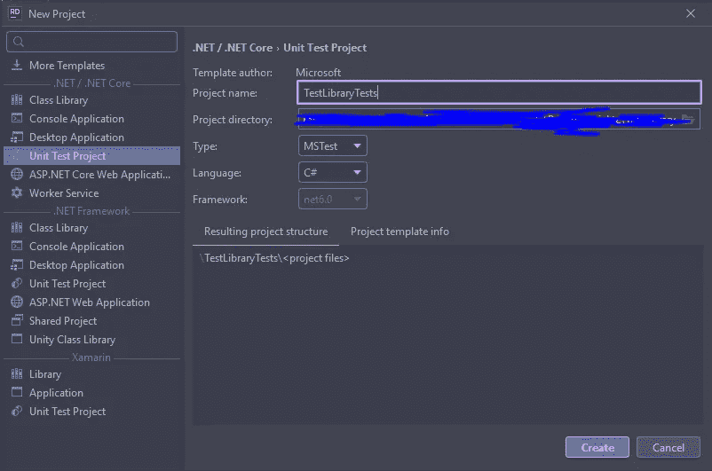
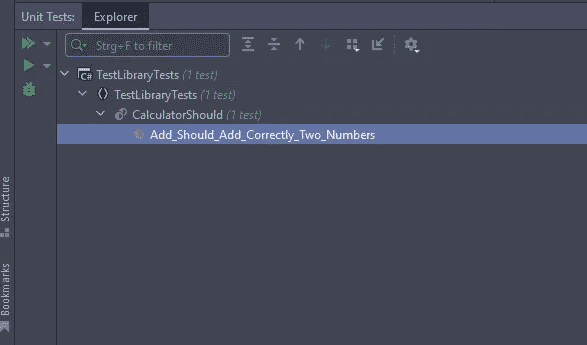
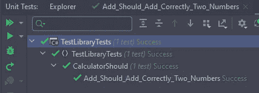
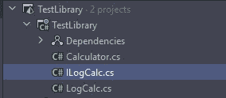

# 。网络核心 101 单元测试

> 原文：<https://betterprogramming.pub/net-core-101-unit-tests-23daff2d5281>

## 创建功能强大、可靠的应用程序


斯科特·布雷克在 [Unsplash](https://unsplash.com?utm_source=medium&utm_medium=referral) 上拍摄的照片

# 什么是单元测试？

单元测试的基本思想是由 Kent 在 Smalltalk 中介绍的。单元测试是提高软件质量的最佳工具之一，通常在特定的测试框架中编写。

简单地说，单元测试是一段代码调用另一段代码(单元)并检查输出是否与期望的结果匹配。

在最原始的定义中，一个单元是一个方法或者一个函数。今天，人们也谈到工作单位，即:

> “[……]从调用系统中的公共方法到该系统的测试产生一个明显的结果之间发生的动作的总和。”
> 
> (第一章。“单元测试的基础——单元测试的艺术”。

这意味着单个软件组件或方法被测试。应该只测试开发人员完全控制下的代码。然而，根据《单元测试的艺术:C#中的例子》一书的作者 Roy Osherove 的观点，人们不应该试图最小化被测工作单元的大小。如果你试图减少一个工作单元的大小，你是在假装对一个公共 API 的用户来说不是结果的事情。

# 其他类型的测试

除了单元测试，还有许多其他的测试。在下文中，我想讨论以下标准测试:集成、功能和验收测试。

## **集成测试**

与单元测试不同，集成测试不是自给自足的。它们通常在被测系统之外有额外的依赖项，比如数据库或文件系统。测试两个或多个软件组件的协作。集成测试也可能涉及基础设施问题。集成测试使用实际的依赖关系，而单元测试将工作单元与其依赖关系隔离开来。

## **功能测试**

功能测试被认为是高级测试。将测试用户需求的功能；因此，系统也被认为是一个黑匣子。测试整个系统的部分功能。

## **验收测试**

验收测试也被认为是高级测试。它基于用户和业务规范。测试软件是否具有预期的商业价值。最后，他们检查是否满足业务和合同要求。


来源:[介绍 C#](https://learning.oreilly.com/videos/introducing-test-driven/9781788292092/) 中的测试驱动开发，作者[Nikola ivkovi](https://learning.oreilly.com/search/?query=author%3A%22Nikola%20%C5%BDivkovi%C4%87%22&sort=relevance&highlight=true)(由 Packt 出版社出版)

上面的金字塔回答了理想情况下应该写哪些测试以及写多少。正如你所看到的，单元测试扮演了最重要的角色。这是因为它们编写起来简单快捷，执行速度最快。

以下类型的测试更耗时，但仍不可忽略。

## 自动化测试

一旦我们编写了测试来检查我们的代码，我们也可以以自动化的方式重复运行这些测试。手动测试的问题是它远不如单元测试有效。

例如，要测试一个类(对于一个网页)的逻辑，必须启动应用程序，必须潜在地登录或注册它，必须导航到页面，然后必须测试和验证实现的更改。这个过程非常耗时。

自动化测试现在可以用来提高整个过程的效率。

因此，自动化测试可以是上面显示的任何测试类型。

# (自动化)测试的优势

*   您只需编写一次，就可以随心所欲地运行它们。
*   一旦编写完成，测试可以在任何时候运行，无论是手动触发还是自动触发。
*   自动化测试有助于我们在部署之前发现错误。
*   这些测试非常可靠和有效。
*   当发布我们的代码时，自动化测试给了我们信心。
*   最重要的原因之一是，它允许我们重构，并确保功能仍然存在。

# 自动化测试的结构

当编写自动化测试时，一个典型的顺序已经被接受:安排、执行、断言。在编写单元测试时也会观察到这种结构。


第一阶段是初始设置，比如创建对象实例和测试数据。在 act 阶段，代码的执行遵循这一点。在最后一个阶段，我们希望检查结果是否符合我们的预期结果。

# 测试框架。网络核心

有很多用于编写测试的测试框架。下面，我列出了一些微软文档中相应的页面以获取更多信息。

## **xUnit**

*   它是一个免费的开源单元测试工具。网。
*   [https://docs . Microsoft . com/en-us/dot net/core/testing/unit-testing-with-dot net-testNUnit](https://docs.microsoft.com/en-us/dotnet/core/testing/unit-testing-with-dotnet-testNUnit)

## **努尼特**

*   面向所有人的单元测试框架。网络语言。
*   [https://docs . Microsoft . com/en-us/dot net/core/testing/unit-testing-with-nunit](https://docs.microsoft.com/en-us/dotnet/core/testing/unit-testing-with-nunit)

## **MSTest**

*   微软测试框架。
*   [https://docs . Microsoft . com/en-us/dot net/core/testing/unit-testing-with-ms test](https://docs.microsoft.com/en-us/dotnet/core/testing/unit-testing-with-mstest)

# 谁编写测试？

这个问题有一个简单的答案。每个软件开发人员都应该编写测试。测试软件的高质量和准确性必须是开发过程的一部分，就像技术需求咨询一样。

如果一辆汽车或一架飞机被开发出来，也是一种产品形式，它也需要被测试。软件的开发者和请求者也应该对软件提出同样的要求。

# 测试驱动开发

一旦你获得了关于结构良好的、可维护的和可靠的测试框架的知识，在某个时候，问题出现了:我们什么时候写测试？许多开发人员在软件编写之后编写测试，但是现在越来越多的人在代码产生之前编写测试。在生产代码之前编写测试的方法被称为测试优先或测试驱动开发。

# 用 C#编写单元测试的示例

让我们从创建一个新的类库项目开始。



对于我们现在想要创建的这个示例，我们制作了一个将两个数字相加的计算器。为此，我们将现有的类重命名为 calculator，并编写一个将两个数相加并返回结果的方法。

因此，在重命名该类并编写一个加法函数之后，我们现在需要将我们的测试项目添加到解决方案中。在这个例子中，我们将使用微软提供的测试框架 MSTest。



我们现在想重命名 UnitTest1 类。我们如下处理命名:要测试的类加上“应该”这同样适用于测试方法的名称。被测试方法的名字加上应该做这个或那个。

在 Arrange 中，我们首先初始化我们的关键测试数据和对象，正如你所看到的。

我们现在在 Act 阶段执行该方法并保存结果。

我们希望检查结果，看看它是否与我们在最后一步中的预期结果相匹配。

现在要运行这个测试，我们需要打开测试资源管理器。



运行测试后，您应该看到它工作了。

要使测试失败，您可以在断言中更改预期结果；然后，测试将失败。

# 什么是模仿？

细心的读者可能希望记住，单元测试不应该测试数据库、文件系统等依赖项。通过模仿，我们可以模仿一个类或接口的行为来隔离测试中的代码。我们希望确保被调用的其他代码不会导致测试中的代码失败。

# 编写模拟的示例

为了演示模仿，让我们给计算器添加日志功能。即使这不完全有用，但基本概念是可以转移的。

首先，我们想在类库中创建一个接口`ILogCalc`和一个类`LogCalc`。通常，我们在生产应用程序中的第一件事是一个由类实现的接口。这有几个原因，但我现在不想深入探讨。但是我们必须使用接口，因为它允许我们模仿。



这些现在将通过 calculator 类中的构造函数进行初始化。

通常，结构如上所示。我们有一个私有的字段变量，并通过构造函数初始化它。这个过程被称为依赖注入。

这个设置的好处是我们现在可以在测试中模拟接口。

我们现在应该在计算器测试类中得到一个关于这个设置的错误，因为我们不能在没有参数的情况下初始化计算器。但是在我们的`Calculator`测试中，我们不希望依赖其他类和方法。

要使用 mocking，我们首先需要安装一个 NuGet 包。这叫最小起订量。在我们的测试项目中安装它。

我们可以做的是创建一个界面的模型。如下所示，我们可以通过构造函数将它传递给计算器。

因为我们的`LogCalc` log 函数没有返回值，所以传递模拟对象就足够了。

然而，不管出于什么原因，如果我们的日志函数有一个返回值，比如 True 或 False，说明日志记录是否有效，那么我们仍然需要调整。

让我们看一下这个。这里，我们在接口和类中更改 log 函数的签名，并返回一个布尔值。

现在我们可以从我们的模拟中调用一个名为 setup 的函数，通过它我们可以模拟这个函数及其返回值。

在第 16 行，我们使用 setup 来模拟 log 方法。我们在这里通过`It.IsAny<String>()`说，我们接受任何字符串值，并且总是返回 true。如果您现在通过测试进行调试，您应该看到 log 方法返回 true。

# 单元测试时要考虑的事情

*   单元测试 100%的代码覆盖率被认为是不现实的，也不是我们的目标。(也许极限编程除外)
*   良好的代码覆盖率已经达到了 65–75%。
*   如果方法有多条路径，那么所有的路径都应该被测试(即使由于干净的代码这不是很好)。
*   测试迫使我们写干净的代码。否则，它就不可测试。

# TL；速度三角形定位法(dead reckoning)

*   测试对于提高软件质量和减少错误至关重要。
*   测试是良好重构的基本要求。
*   有不同的测试，例如单元测试、集成、功能和验收测试。
*   测试的基本结构是安排、操作和断言。
*   模仿用于在单元测试期间将方法从它们的依赖中释放出来。

```
**Want to Connect?**You can contact me via my social media channels ([Twitter](https://twitter.com/muench_justin),[LinkedIn](https://www.linkedin.com/in/justin-m%C3%BCnch-0b1087133/)).All drawings were created with Draw.IO.
```

# 来源

[](https://docs.microsoft.com/en-us/dotnet/core/testing/) [## 正在测试。网。网

### 本文介绍了测试的概念，并举例说明了如何使用不同种类的测试来验证…

docs.microsoft.com](https://docs.microsoft.com/en-us/dotnet/core/testing/) [](https://www.amazon.com/-/de/dp/1617290890/ref=sr_1_1?keywords=the+art+of+unit+testing+with+examples+in+c+%23&qid=1647071159&sprefix=The+Art+of+Unit+testing+%2Caps%2C197&sr=8-1) [## 单元测试的艺术:C#中的例子

### 单元测试的艺术:以 Amazon.com 的 C#为例。*符合条件的优惠可享受免费*运输。的…

www.amazon.com](https://www.amazon.com/-/de/dp/1617290890/ref=sr_1_1?keywords=the+art+of+unit+testing+with+examples+in+c+%23&qid=1647071159&sprefix=The+Art+of+Unit+testing+%2Caps%2C197&sr=8-1) [](https://www.simform.com/blog/functional-vs-integration-testing/#section1) [## 功能测试与集成测试:差异的详细指南

### “在你的代码投入使用之前对其进行测试”已经成为一种现象，并且是挽救商业声誉和保持…

www.simform.com](https://www.simform.com/blog/functional-vs-integration-testing/#section1) [](https://spin.atomicobject.com/2017/08/07/intro-mocking-moq/) [## 模拟单元测试介绍(使用 Moq)

### 很容易忽略单元测试的重要性。编写测试可能会很乏味。它们必须不断更新，因为…

spin.atomicobject.com](https://spin.atomicobject.com/2017/08/07/intro-mocking-moq/) 

单元测试完全指南。NET Core (NUnit 和 xUnit)作者 Bhrugen Patel(由 Packt 出版社出版)@[https://learning.oreilly.com/](https://learning.oreilly.com/)