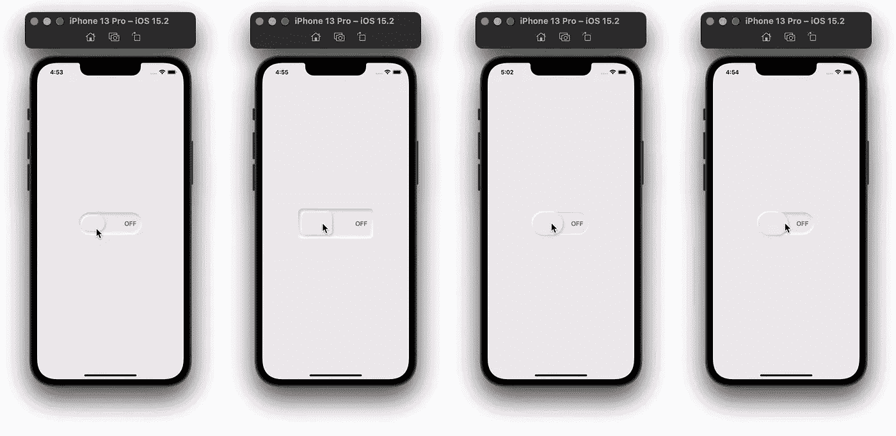
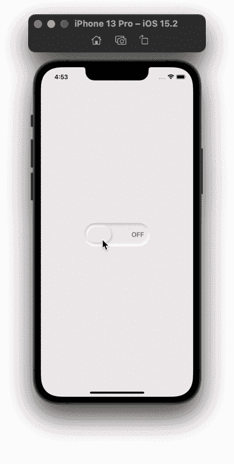
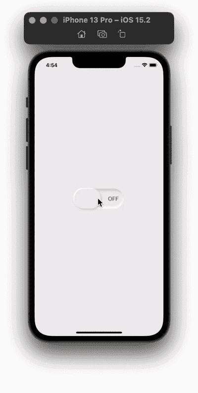
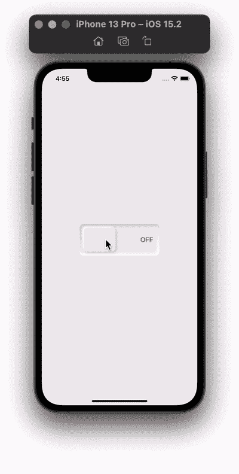
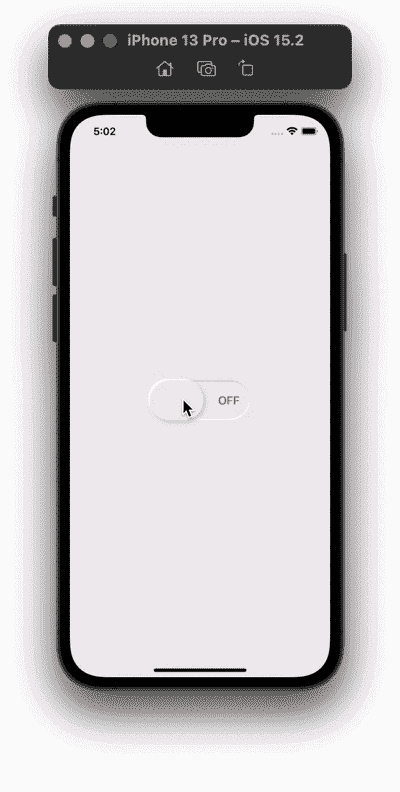
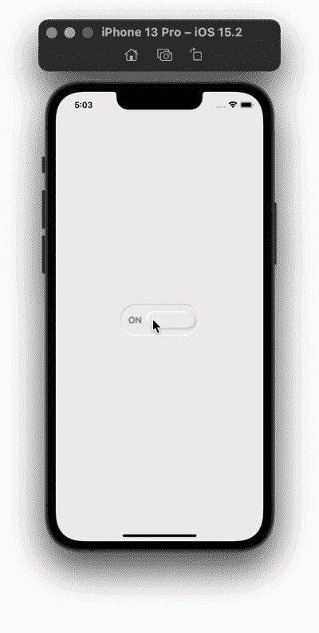

# SwiftUI 中的神经形态动画切换

> 原文：<https://betterprogramming.pub/neumorphic-animated-toggle-in-swiftui-af697ba17f5f>

## 如何创建可定制的切换视图

在之前的一篇文章中，我们使用神经形态设计原则构建了一个音频播放器，它使用了 Michal Malewicz 的文章中的调色板。

有关文章使用的颜色和整篇文章的参考，请查看下面的链接:

 [## 在 SwiftUI 中创建神经形态设计

### 打造时尚简约的音乐播放器

better 编程. pub](/creating-neuromorphic-designs-in-swiftui-290c01331738) 

在开始本教程之前，将神经形态颜色添加到资源中，并为这三种颜色创建一个结构。

# 凹面视图

为了制作一个凹形视图，我们将使用圆角矩形作为切换视图的形状，我们将尝试通过模仿阴影(颜色，半径，x，y)修改器来创建内部阴影，如下所示:

*   对于颜色:使用`.fill()`修改器
*   半径:使用模糊修改器。
*   x 和 y:使用偏移修改器。

要使圆角矩形的角变尖，请用另一个圆角矩形遮罩它。下面的代码创建了一个浅凹的视图。为了使这个视图更加可定制，为`roundedRectangle`的`cornerRadius`设置一个变量，我们将从自定义切换视图中传递 cornerRadius。

## 浅薄:

对于一个深凹的视图，添加两个圆角矩形，并使它们比我们上面创建的浅阴影偏移更多。

## 深度:

# 自定义动画切换

在这一部分，我们将完成切换视图并制作动画。从添加下面的常量变量开始，这些变量将从我们的 ContentView 传递过来:

*   `width`:切换视图的宽度。
*   `height`:切换视图的高度。
*   `toggleWidthOffset`:作为拨动开关的`roundedRectangle`的宽度。
*   定制我们所有圆角矩形的圆度。
*   `padding`:定制我们的拨动开关在凹面视图中的适合度。
*   `isToggled`:将我们的开关从开切换到关，反之亦然。
*   `switchWidth`:通过拉伸拨动开关来激活它的运动。

在 ZStack 中，添加一个凹面视图。接下来，您可以在`HStack`中添加“开”和“关”文本，或者添加符号。

对于切换开关，添加一个圆角矩形，其边框等于或小于切换开关的高度。你可以用`onAppear`来确定`switchWidth`的大小。给圆角矩形添加阴影，使其凸起。

在`.onTapGesture()`中，将`isToggled`的值改为相反的值，并将`switchWidth`动画化两次。这将使开关拉伸，然后在第二个动画结束时恢复其大小。

要从左向右移动开关，反之亦然，添加由`isToggled`值控制的`Spacer()` 。最后，将`animation( .spring)`添加到`roundedRectangle`中。

# 内容视图

确保背景色与切换视图的主色相同，以满足外观设计要求。添加带有所需值的自定义开关。以下是不同值的示例。

## 衬垫开关

## 无填充

## 近似方形的

## 浅凹视图示例

感谢阅读！