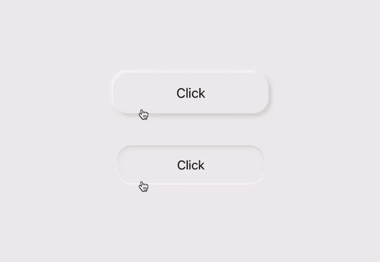
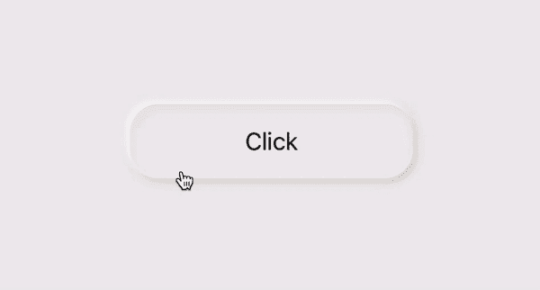

# SwiftUI 中的 Neumorphic 按钮样式

> 原文：<https://betterprogramming.pub/neumorphic-button-style-in-swiftui-f9a158bf4094>

## 如何在 ButtonStyle 中动画显示按钮状态

在上一篇文章中，我们使用神经形态设计原理构建了一个音频播放器。关于本教程中使用的颜色，请查看[这篇文章](/creating-neuromorphic-designs-in-swiftui-290c01331738)。

在开始本教程之前，将神经形态颜色添加到资源中，并为这三种颜色创建一个结构。

# 按钮的背景

从按钮的背景开始，为按钮的形状添加圆角矩形，顶部深色边缘，底部浅色边缘和深色内部阴影。

使用`stroke()`的圆角矩形为我们的边缘和阴影。

接下来，添加一个`blur()`到内部黑暗阴影，然后添加蒙版到内部阴影和边缘，以锐化它们的边缘。

向 ZStack 添加两个`shadow()`修改器来创建外部的明暗阴影。边缘和内部阴影会让我们的视野看起来凹陷，而外部阴影会让我们的视野看起来凸起。

接下来，我们只需要在按钮未被按下时显示外部阴影，反之亦然。

为此，我们可以将`opacity()`添加到所有阴影和边缘的所有颜色中。将不透明度值传递给外部阴影，并将相反的值传递给边缘和内部阴影。

这些值是从我们接下来要创建的按钮样式中发送的。检查以下代码以获得许可:

# 按钮样式

在我们的`ButtonStyle`中，获取配置文本并将上面创建的背景添加到标签中。

动画值将是不透明度、按钮的比例以及外部阴影的半径和位置。

在`.onChange()`中，检查按钮是否被按下，并更改所有状态变量的值。检查下面的代码:

# 自定义按钮

让你的视图的背景颜色和我们的新形态按钮的颜色一样。最后，将我们创建的按钮样式添加到按钮视图中，并运行应用程序。

感谢阅读！