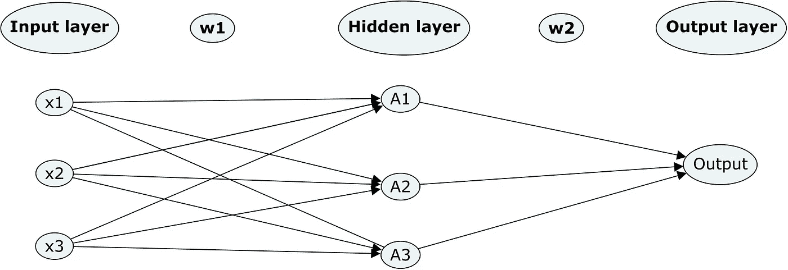
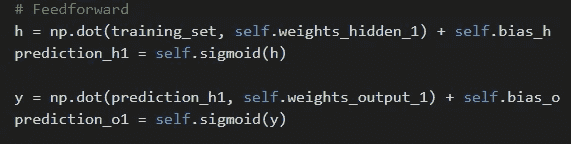
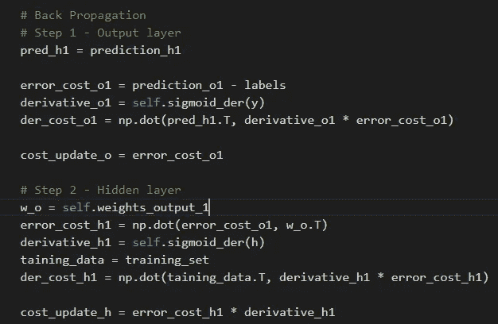
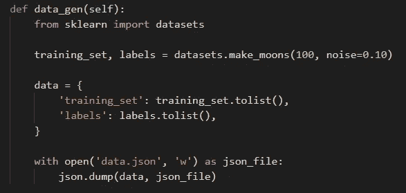
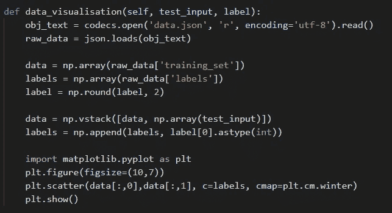
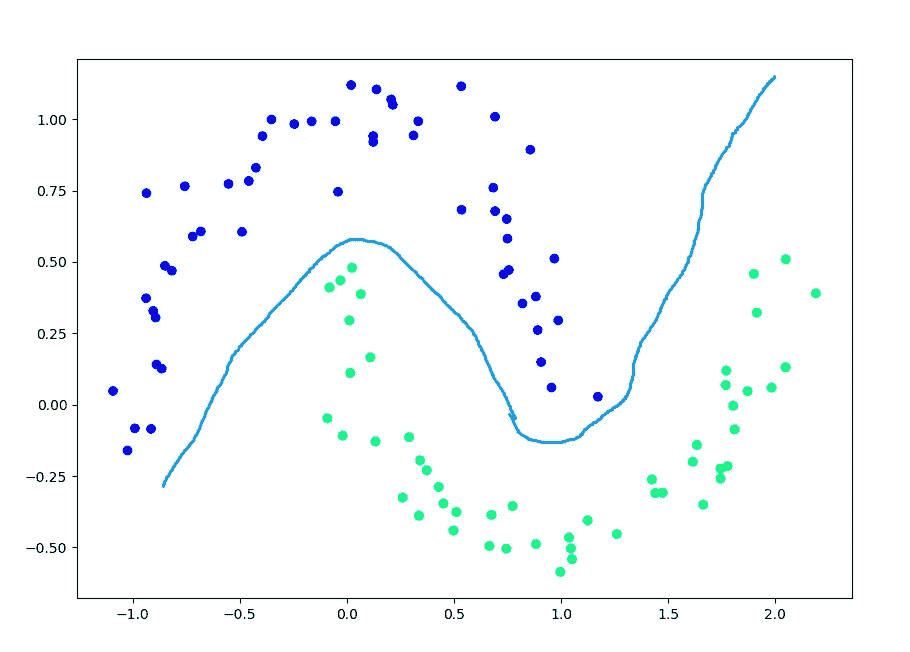
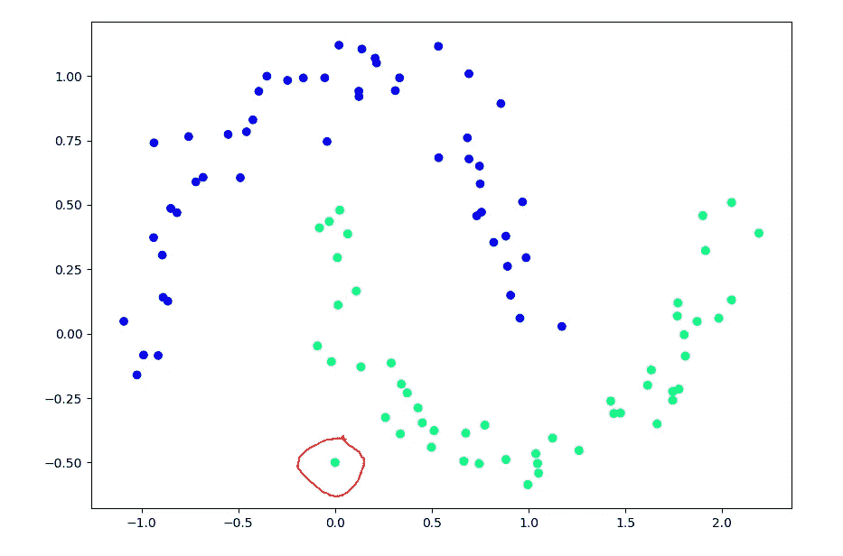
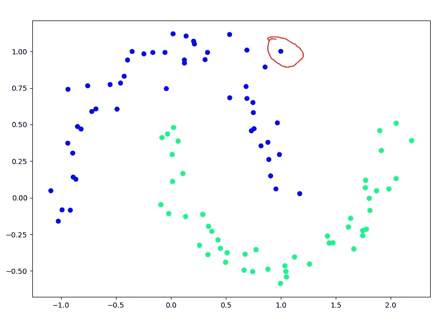

# 从零开始的神经网络:隐藏层

> 原文：<https://betterprogramming.pub/neural-network-from-scratch-hidden-layers-bb7a9e252e44>

## 当我们试图将感知器升级到多层神经网络时，看看隐藏层


[图片](https://pixabay.com/illustrations/neural-network-3637503/)由[艾哈迈德·加德](https://pixabay.com/users/ahmedgad-9403351/)在 Pixabay 上拍摄

在我关于神经网络的[第一篇](https://medium.com/better-programming/build-your-first-neural-network-from-scratch-c5d5490a3f76)和[第二篇](https://medium.com/better-programming/building-a-neural-network-from-scratch-71533fc6e8bb)文章中，我正在研究感知器，一种单层神经网络。即使我们的人工智能能够识别简单的模式，也不可能用它来识别图像上的物体。这就是为什么今天我们将讨论隐藏层，并尝试将感知器升级到多层神经网络。

# **隐藏图层**

为什么我们需要隐藏层？感知器识别简单的模式，也许如果我们增加更多的学习迭代，它们可能会学习如何识别更复杂的模式？实际上，没有。隐藏层允许输入值的额外转换，这允许解决更复杂的问题。

每个隐藏层都有输入和输出。输入和输出有自己的权重，通过激活函数和自己的导数计算。

这是具有隐藏层的神经网络的可视化表示:



从数学的角度来看，隐藏层中没有任何新的变化。您可以检查[上一篇文章](https://medium.com/better-programming/building-a-neural-network-from-scratch-71533fc6e8bb)中的所有公式。我们使用激活函数和成本函数的相同计算，然后更新权重。隐藏层的特征隐藏在反向传播部分中。

首先，我们将计算预测的输出层成本，然后我们将使用此成本来计算隐藏层的成本。让我们用代码实现它。

# **实施**

神经网络有两个主要部分:前馈和反向传播。让我们从前馈开始:



如你所见，对于隐藏层，我们将训练数据集的矩阵和突触权重相乘。然后我们使用隐藏层的输出矩阵作为输出层的输入。对于输出层，我们重复与隐藏层相同的操作。

使用反向传播，我们从输出级开始操作，然后将误差传播到隐藏层。首先，我们将计算输出图层的误差成本和导数。然后我们将使用输出层的误差成本来计算隐藏层的误差成本。



最后，我们将通过乘以每个层的学习速率和反向传播结果来更新输出层和隐藏层的权重。

# **数据和可视化**

现在来说说训练数据。我将使用`[sklearn](https://sklearn.org/)`库为输入和标签数据生成一些数据。这里的函数用使用`sklearn`来生成数据集:



如您所见，我们正在生成一个包含 100 个元素的数据集，并将其保存到 JSON 文件中，这样就不需要在每次运行代码时都生成数据。

此外，我将使用数据可视化库`[matplotlib](https://matplotlib.org/)`来创建漂亮的图形。这是我们的数据集的样子:



而这个就是打开带有训练数据集的 JSON 文件并将数据传递给 Matplotlib 库，告诉它显示图片的函数。

# **测试**

你可以看到数据点在 2D 空间的分布并不完全随机。圆点的分布是有规律的。这种模式反映在我们的`labels`数据集中。如果一个数据点被标记为`1`，那么它被涂上绿色，如果是`0`，那么它是蓝色。你可以看到有一个空间所有的点都是蓝色的，还有一个空间所有的点都是绿色的。

我们的神经网络在训练后将做的是获取一个带有点坐标的新输入，并尝试确定它是位于所有蓝色点的空间还是所有绿色点的空间。



我正在为 3000 次迭代或时期训练模型。现在它已经准备好让我们玩了！

这是我们的第一个测试案例:

```
*np.array([0.0, -0.5])*
```

我们模型的一个输出是`[0.99104346]`，这意味着神经网络认为它可能在绿点的空间中。



第二个测试案例:

```
*np.array([1.0, 1.0])*
```

在这种情况下，我们可以看到输出是`[0.0067755]`，这意味着神经网络认为它可能位于蓝点的空间中。



# **完整代码**

# **结论**

我们成功地在网络中添加了一个隐藏层，并学会了如何处理更复杂的情况。在下一篇文章中，我们将致力于提高我们网络的准确性和通用性。敬请期待！

不断学习，不断成长！