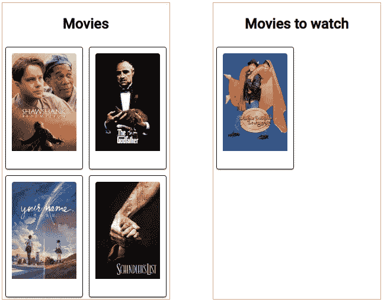
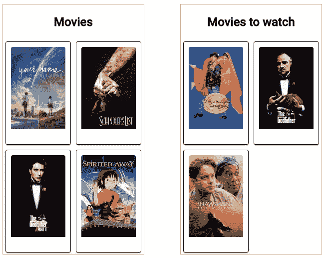
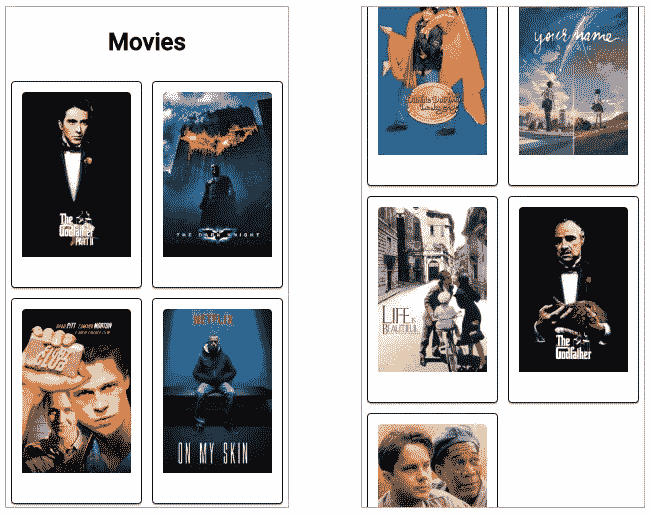

# 新的角度拖放功能— ngDragDrop

> 原文：<https://betterprogramming.pub/new-angular-drag-and-drop-feature-ngdragdrop-8bbdcaa5f737>

## 如何在 Angular 中实现 DragDropModule


ng 拖放

众所周知， [Angular 7](https://angular.io/) 推出了一些很酷的新功能。

我要解释 Angular 7 的一个特性——拖放。

在本文中，我们将构建一个从数据库获取数据并将其绑定到 UI 的应用程序。然后，它将执行多方向拖放。

开始吧！

# 源代码

源代码可以在[这里](https://github.com/SibeeshVenu/ngDragDrop)找到。

# 安装 Angular CLI

你可能已经猜到了，我们正在使用 [Angular CLI](https://cli.angular.io/) 。

如果你还没有安装 Angular CLI，我建议你现在就安装。这是一个很棒的 Angular CLI 工具，我相信你会喜欢它。

您可以通过运行以下命令来安装它:

```
npm install -g @angular/cli
```

一旦我们设置了这个项目，我们将使用 Angular CLI 命令。 [Angular CLI 文档](https://cli.angular.io/)将帮助您了解使用 CLI 可以做的所有事情。

# 生成新项目

是时候生成我们的新项目了。我们可以使用下面的命令。

```
ng new ngDragDrop
```

您现在将能够看到 CLI 为我们所做的所有努力。

现在我们已经创建了我们的应用程序，让我们运行它，看看它是否工作。

```
ng serve --open (if you need to open the browser by the app)
ng serve (if you want to manually open the browser).
You can always use 'ng s' as well
```

该命令将构建您的应用程序，并在浏览器中运行它。

随着我们的发展，我们将使用棱角分明的材料进行设计。

我们现在可以安装它，连同动画和 CDK。对于 Angular 6+版本，您也可以使用此命令完成此操作:

```
ng add @angular/material
```

# 生成并设置标题组件

我们现在有了一个应用程序—让我们创建一个 header 组件。

```
ng g c header
```

上面的命令将生成您需要使用的所有文件，它还会将这个组件添加到`app.module.ts`。

我只是为自己编辑了 header 组件的 HTML，我不会添加任何逻辑。你可以添加任何你想添加的东西。

# 设置页脚组件

通过运行以下命令创建页脚组件:

```
ng g c footer
```

您可以随意编辑它们或设置它们的样式。

```
<p>
  Copyright @SibeeshPassion 2018 - 2019 :)
</p>
```

# 设置 app-routing.module.ts

我们只打算创建一条回家的路线。

# 在 app.component.html 设置路由器出口

我们现在有了一条路线，是时候设置出口了。

```
<app-header></app-header>
<router-outlet>
</router-outlet>
<app-footer></app-footer>
```

# 设置 app.module.ts

每个 Angular app 至少会有一个`NgModule`类— `AppModule`驻留在`app.module.ts`中。

你可以在 Angular 的网站了解更多关于 [Angular 架构的信息。](https://angular.io/guide/architecture-modules)

你看到那里有一个`DragDropModule`吗？

您应该导入它以使用拖放功能——它驻留在`@angular/cdk/drag-drop`中。

您可能已经注意到，我们已经在提供商的阵列中添加了一个名为`MovieService`的服务。我们现在将创建它。

# 创建电影服务

如您所见，我没有对服务类做太多工作，也没有实现错误机制和其他东西，因为我想让它尽可能简短。

这项服务将从一个在线数据库获取电影: [TMDB](https://www.themoviedb.org/) 。在本文和知识库中，我使用我自己的。我强烈建议你创建你自己的，而不是使用这里提到的。

现在让我们设置配置文件。

# 设置配置

配置文件是一种以方便的方式安排事情的方式，您必须在您正在处理的所有项目中实现它。

# 创建电影组件

现在让我们创建一个新的组件来加载电影。

基本上，我们将在`cdkDropList` div 中使用这个电影组件。

我们的电影组件将有如下的 HTML。

我只是尽可能的简单。将来，我们可以为电影组件添加更多的属性，并在这里显示它们。

TypeScript 文件将有一个带有`@Input` decorator 的属性，这样我们可以从 home 组件输入值。

这是我的模型电影:

```
export class Movie {
    poster_path: string;
}
```

正如我所说的，它目前只有一个属性，稍后我会添加几个。

# 设置本国组件

这是主要部分；我们渲染电影和执行拖放操作的地方。

我将有一个父容器作为`<div style="display: flex;">`，这样内部 div 将被水平排列。

我将有两个内部容器:一个显示所有的电影，另一个显示我要看的电影。我可以把电影从左边的容器拖到右边，反之亦然。

让我们来设计 HTML。以下是全部电影合集。

如您所见，我为 app-movie 和 app-movie 容器分配了一些新属性。

*   `cdkDropList`基本上是一个用于拖放项目的容器。
*   `#allmovies=”cdkDropList”`是源容器的 ID。
*   `[cdkDropListConnectedTo]=”[towatch]”`这是我们连接两个应用程序电影容器的方式。记住`towatch`是另一个`cdkDropList`容器的 ID。
*   `[cdkDropListData]=”movies”`是我们将源数据分配给列表的方式。
*   `(cdkDropListDropped)=”drop($event)”`是每当有拖放事件时的回调事件。
*   在`cdkDropList`容器中，我们遍历这些值，并将电影传递给我们自己的电影组件`app-movie`。
*   我们还应该在我们的可拖动项目中添加属性`cdkDrag`，它只不过是一部电影。

让我们创建另一个容器，它将包含我要观看的电影的集合。

我们几乎使用了与第一个容器完全相同的属性，除了 id—`cdkDropListData`和`cdkDropListConnectedTo`。

最后，我们的`home.component.html`将如下:

现在我们需要通过调用我们的服务来获取一些数据。

让我们打开我们的`home.component.ts`文件。

这里我导入`CdkDragDrop, moveItemInArray, and transferArrayItem from ‘@angular/cdk/drag-drop’`。这有助于我们执行拖放操作。

在构造函数中，我们获取数据并将其赋给变量`movies`。这些是电影的一个数组。

```
private async getMovies() {
    const movies = await this.movieService.get(config.api.topRated);
    return this.formatDta(movies.json().results);
}
```

我将“要看的电影”集合设置如下，因为我已经计划好要看那部电影了。

```
moviesToWatch: Movie[] = [{
    poster_path: '/uC6TTUhPpQCmgldGyYveKRAu8JN.jpg'
  }];
```

请记住，如果两个源中至少没有一个项目，那么拖放将不起作用。因为我已经在其中放了一部电影，所以在其他收藏中显示这部电影没有任何意义。

```
formatDta(_body: Movie[]): void {
   this.movies = _body.filter(movie => movie.poster_path !== '/uC6TTUhPpQCmgldGyYveKRAu8JN.jpg');
}
```

下面是我们的下降事件。

`home.component.ts`的完整代码如下所示:

# 自定义样式

我已经在一些组件上应用了自定义样式，你可以在下面看到。

## 主页.组件. scss

## 电影.组件. scss

# 输出

完成上述所有步骤后，您将拥有一个使用 Angular 7 拖放实际服务器数据的应用程序。

让我们运行这个应用程序，看看它是如何工作的。



ngDragDrop 初始



添加后的 ngDragDrop



ngDragDrop 添加更多

# 演示

可以在 GitHub 上找到[演示。](https://sibeeshpassion.github.io/ngDragDrop/home)

# 结论

在这篇文章中，我们学习了如何:

1.  创建角度为 7°的应用程序。
2.  使用 Angular CLI。
3.  以角度生成服务。
4.  使用`HttpModule`从服务器获取数据。
5.  以角度生成分量。
6.  使用材料设计。
7.  使用 Angular 7 的拖放功能处理真实的服务器数据。

请随意使用 GitHub 库。

感谢阅读。以后我会再写一篇同样主题的帖子。