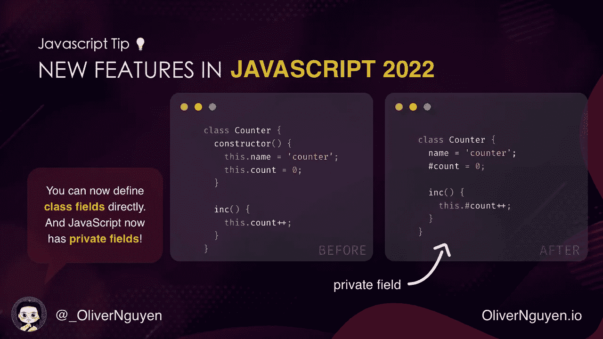
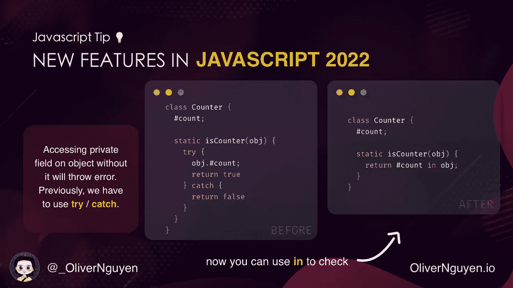
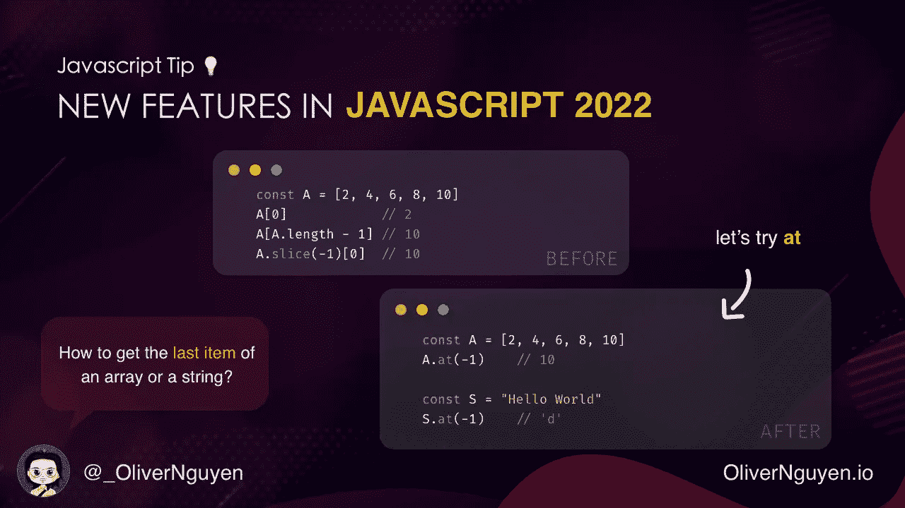
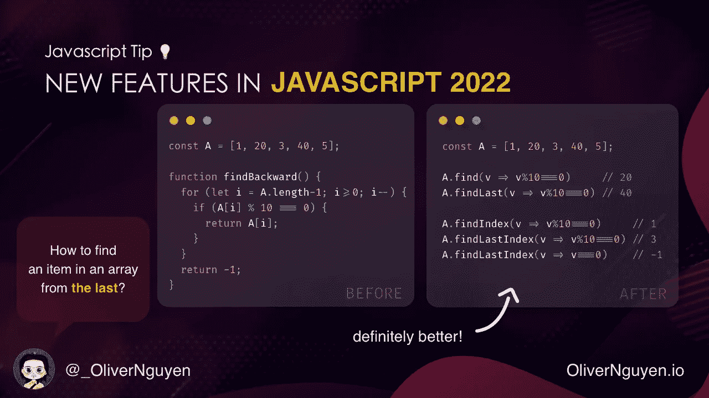
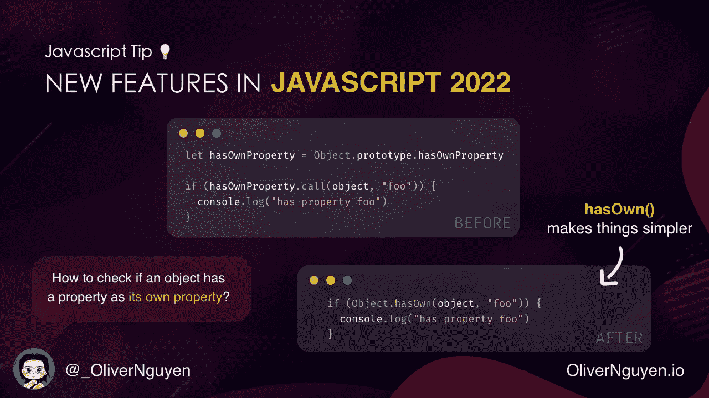
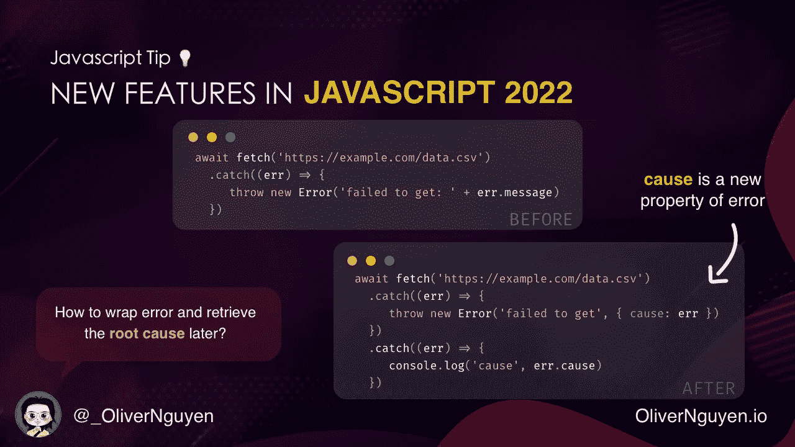
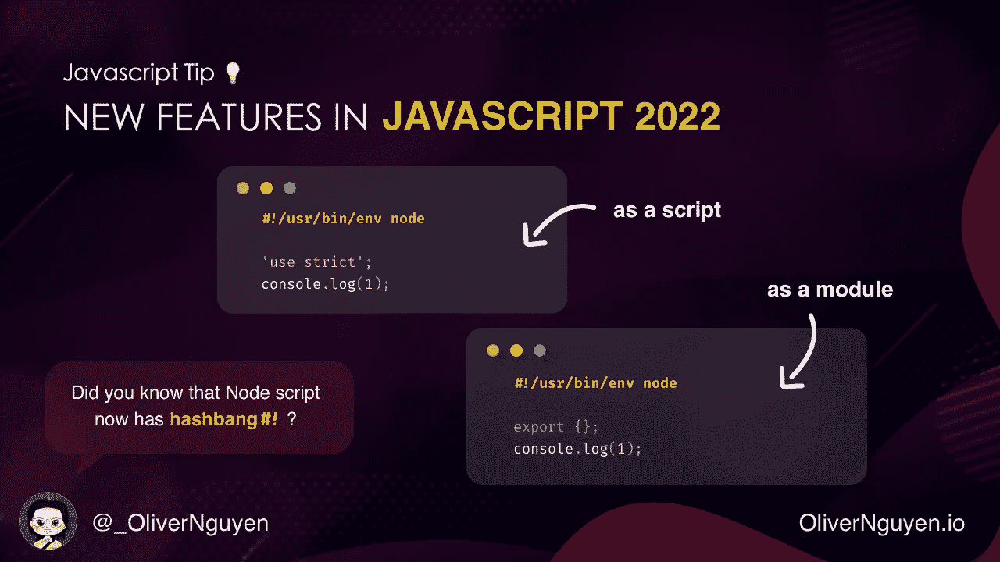

# 您可能错过的 7 个 ES2022 JavaScript 新特性

> 原文：<https://betterprogramming.pub/new-features-in-javascript-2022-b3ffadd1b261>

## 旧 JavaScript 与新 JavaScript


Gabriel Heinzer 在 [Unsplash](https://unsplash.com?utm_source=medium&utm_medium=referral) 上拍摄的照片

这些功能已经发布了一段时间。让我们检查一下！

# 1.私有字段



以前，所有类字段都必须在构造函数中定义。而且没有私有领域。所有字段都可以从外部访问。当然，有一些技巧可以让一些变量变得不可访问。但是我们不要谈论他们。

```
**class** Counter {
  **constructor**() {
    **this**.name = 'Counter';
    **this**.count = 0;
  }

  inc() {
    **this**.count++;
  }
}
```

现在我们可以简单地写:

```
**class** Counter {
  name = 'Counter';
  #count = 0;  *// private field!* inc() {
    **this**.#count++;
  }
}
```

# 2.检查使用关键字中的*访问私有字段*



私有字段会带来一些问题。当在没有私有字段的对象上访问私有字段时，将会引发错误。但是如何检查一个对象有没有呢？用`try` / `catch`！

现在有一个更好的方法:`in`关键词。

```
**class** Counter {
  name = 'Counter';
  #count = 0;**static** isCounter(obj) {
    **return** #count **in** obj;
  }
}**const** counter = **new** Counter();
Counter.isCounter(counter);   // true
```

# 3. *at()* 数组和字符串的方法



我们可以通过写`A[i]`来访问数组中位置`i`的一个项。但是如果`i`是负的，我们想从数组的末尾获取元素呢？我们可以写`A[A.length + i]`。但是不太方便。另一种方法是使用`A.slice(i)[0]`。但是效率不是很高。

为此有`at()`方法:

```
**const** A = [2, 4, 6, 8, 10]
A.at(-1)    *// 10***const** S = "Hello World"
S.at(-1)    *// 'd'*
```

# 4.用 findLast()从末尾开始查找数组中的一项



如何在数组中查找一个项？使用`find()`方法。以及如何从末端找到？使用`reverse()`和`find()`。或者编写自己的函数:

```
**const** A = [1, 20, 3, 40, 5];**function** findBackward(A, predicate) {
  **for** (**let** i = A.length-1; i>=0; i--) {
    **if** (predicate(A[i])) {
      **return** A[i];
    }
  }
  **return** -1;
}findBackward(A, x => x % 10 == 0);    *// 40**// be careful with this method!*
A.reverse().find(x => x % 10 == 0);   *// 40*
```

现在我们可以使用`findLast()`和`findLastIndex()`方法:

```
**const** A = [1, 20, 3, 40, 5];A.find(v => v%10 == 0)     // 20
A.findLast(v => v%10 == 0) // 40A.findIndex(v => v%10 == 0)     // 1
A.findLastIndex(v => v%10 == 0) // 3
A.findLastIndex(v => v == 0)    // -1
```

# 5.让我们使用 hasOwn()而不是 hasOwnProperty()



有`Object.prototype.hasOwnProperty()`方法检查对象是否有属性作为其直接属性。但是使用起来相当麻烦:

```
**let** hasOwnProperty = Object.prototype.hasOwnProperty;**if** (hasOwnProperty.call(object, 'foo')) {
  console.log('has property foo');
}
```

但是为什么不直接写:

```
object.hasOwnProperty('foo')
```

请记住，JavaScript 是一种动态语言。我们可以给任何对象添加属性。所以`hasOwnProperty()`可以被同名对象的属性所遮蔽。为了避免这种情况，我们可以使用`hasOwn()`方法:

```
**if** (Object.hasOwn(object, 'foo')) {
  console.log('has property foo');
}
```

# 6.原因是错误的一个新属性



常见的错误处理代码如下:

```
**await** fetch('[https://example.com/data.csv'](https://example.com/data.csv'))
  .catch((err) => {
     **throw** **new** Error('failed to get: ' + err.message);
  })
```

它所做的是用一个新的错误包装原来的错误。但是原来的误差丢失了。现在我们可以使用`cause`属性来存储原始错误并在以后检索它:

```
**await** fetch('[https://example.com/data.csv'](https://example.com/data.csv'))
  .catch((err) => {
     **throw** **new** Error('failed to get', { cause: err })
  })
  .catch((err) => {
     console.log('cause', err.cause)
  })
```

# 7.`#!`现在支持 Hashbang



现在支持 Hashbang。我们可以在终端中直接运行 NodeJS 脚本:

```
*#!/usr/bin/env node*'use strict';
console.log(1);
```

或者:

```
*#!/usr/bin/env node*export {};
console.log(1);
```

*我是 Oliver Nguyen，一名全栈开发人员。我分享一下编程，JavaScript，围棋。我创建了*[*one sidebar*](https://onesidebar.com)*—一个用于导航 GitHub 的浏览器扩展。关注我了解更多内容。*