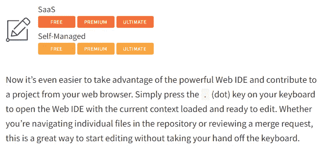
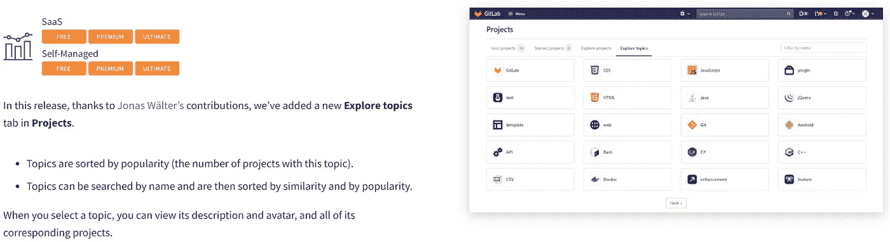
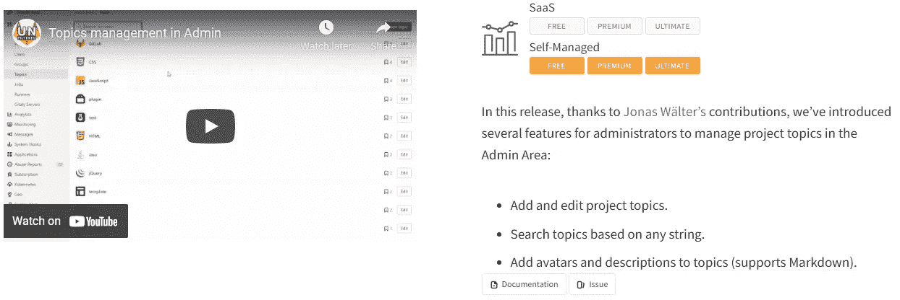
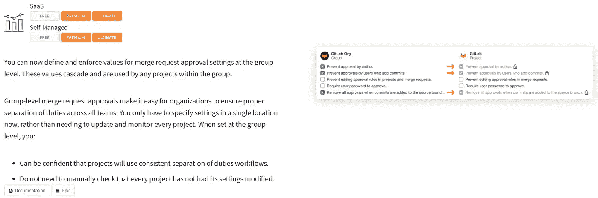
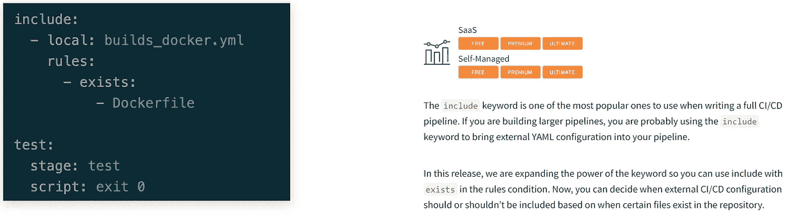
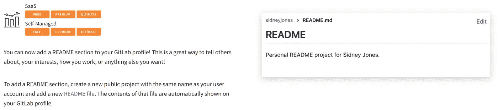
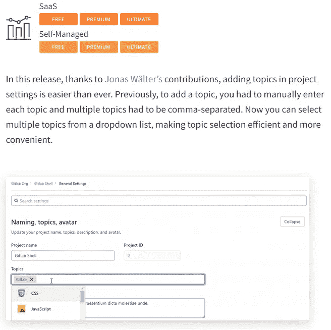
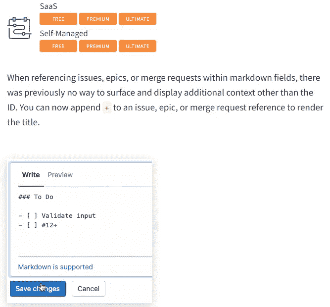
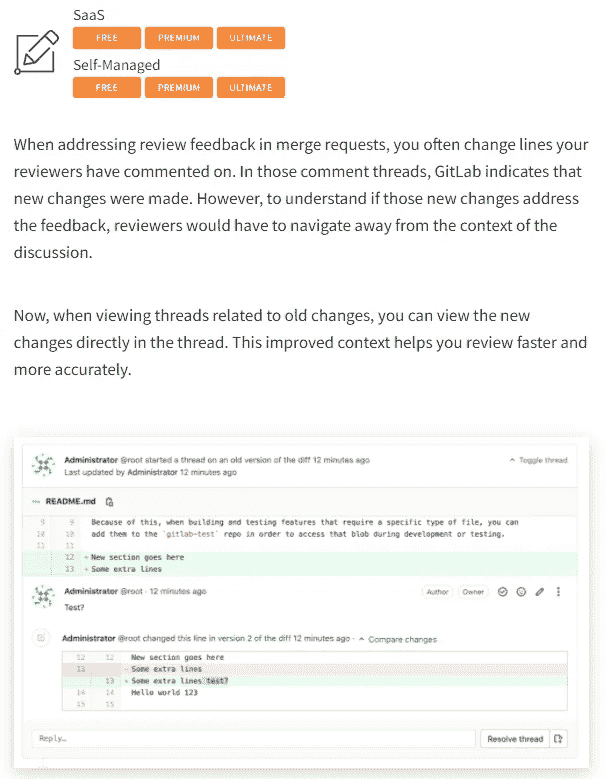
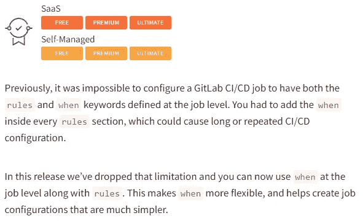

# 2021 年最后一个季度 GitLab 的新功能

> 原文：<https://betterprogramming.pub/new-features-of-gitlab-for-the-last-quarter-of-2021-32c628eeccfe>

## 在本文中，您将了解 git lab 14.4(10 月)、14.5(11 月)和 14.6(12 月)的最重要特性。

*照片由* [***埃琳娜童话***](https://www.pexels.com/@elly-fairytale?utm_content=attributionCopyText&utm_medium=referral&utm_source=pexels) *出自*[***Pexels***](https://www.pexels.com/photo/colorful-carousel-against-cathedral-on-red-square-at-new-year-night-3810971/?utm_content=attributionCopyText&utm_medium=referral&utm_source=pexels)*。*

我已经有一段时间没有评测过 [**的**最新版本了，GitLab****](https://dev.benjaminrancourt.ca/tag/gitlab) 吧？自从 GitLab 14.3 版本上的[帖子以来，2021 年的最后几个月对我来说特别忙。](https://dev.benjaminrancourt.ca/best-new-features-in-gitlab-14-2-and-14-3)

请放心，在本文中，我将向您展示标志着我对 2021 年最后三个版本的关注的特性。

你准备好回顾三个月的功能了吗？

# [10 月— 14.4 日](https://about.gitlab.com/releases/2021/10/22/gitlab-14-4-released/)

## [单键编辑当前文件](https://about.gitlab.com/releases/2021/10/22/gitlab-14-4-released/#edit-the-current-file-with-a-single-keystroke)

GitLab 上的“*单键编辑当前文件*功能截图。

我通常不知道我使用的应用程序的快捷方式，但我肯定会在 GitLab 上使用这个！每天，我需要手动编辑一个文件(我不能自动操作，它需要一个人)，所以现在更改它会更快！

# [11 月— 14.5 日](https://about.gitlab.com/releases/2021/11/22/gitlab-14-5-released/)

## [探索项目主题选项卡](https://about.gitlab.com/releases/2021/11/22/gitlab-14-5-released/#explore-project-topics-tab)

GitLab 上“*探索项目主题选项卡*”功能的屏幕截图。

你还记得给你的 GitLab 项目添加主题吗？在这个版本发布之前，我甚至不知道它除了看起来漂亮之外还有什么用。🙈

这对 [Apache Log4J 漏洞](https://cyber.gc.ca/en/alerts/active-exploitation-apache-log4j-vulnerability)很有用，我们可以通过查看`Java`主题更快地找到所有 Java 应用程序。这需要所有项目都有正确的元数据，但那是另一回事了。

## [管理区的话题管理](https://about.gitlab.com/releases/2021/11/22/gitlab-14-5-released/#topic-management-in-the-admin-area)

GitLab 上“*管理区*主题管理”功能截图。

如果我还在 Sherbrooke 大学工作的话，这肯定是一个我想探索更多的特点！我总是发现当所有项目**都有图标**和**描述**时，导航 GitLab 会更好。

## [合并申请审批的集团级设置](https://about.gitlab.com/releases/2021/11/22/gitlab-14-5-released/#group-level-settings-for-merge-request-approvals)

GitLab 上“*合并请求审批*集团级设置”功能截图。

我不喜欢 GitLab 的一点是，对于一些特性，如果你想让它们彼此一致，你必须在每个项目中改变它们。有了这个新功能，我认为这是朝着正确方向迈出的一步！希望他们很快增加级联其他设置的能力！

## [条件包含与 exists 关键字](https://about.gitlab.com/releases/2021/11/22/gitlab-14-5-released/#conditional-includes-with-exists-keyword)

GitLab 上“*条件包含 exists 关键字*”功能的屏幕截图。

看到 GitLab 团队继续改进我们创建和重用管道的方式总是很有趣。

有了这个新功能，人们可以**包括一个外部管道**并且根据他们的文件，一些作业会被自动激活。这对 lint 和基于文件扩展名的漏洞扫描很有用！

## [将个人自述添加到个人资料](https://about.gitlab.com/releases/2021/11/22/gitlab-14-5-released/#add-personal-readme-to-profile)

GitLab 上的“*将个人自述添加到个人资料*”功能截图。

现在轮到 GitLab 添加**定制我们的用户资料**的能力了！我肯定它对某些人来说很棒，但那是另一页要维护的！

我似乎无法在 GitHub 上正确维护我的 [README 项目，我想我会在 GitLab 中添加另一个之前等待！](https://github.com/benjaminrancourt/benjaminrancourt)

## [项目设置中的主题选择](https://about.gitlab.com/releases/2021/11/22/gitlab-14-5-released/#topics-selection-in-project-settings)

GitLab 上“项目设置中的*主题选择”功能截图。*

另一个关于话题的功能！现在在项目中管理主题变得更加容易。

# [12 月— 14.6 日](https://about.gitlab.com/releases/2021/12/22/gitlab-14-6-released/)

## [在 markdown](https://about.gitlab.com/releases/2021/12/22/gitlab-14-6-released/#render-the-title-of-a-referenced-issue-within-markdown) 中渲染引用问题的标题

GitLab 上“*渲染 markdown* 功能内引用问题的标题”的屏幕截图。

只需在问题或合并请求的编号后加上一个加号(例如`#12+`)，它将**自动创建一个链接**，链接的标题**为发布或合并请求的标题**。很酷，对吧？

## [查看内联变更，使一个合并请求线程过期](https://about.gitlab.com/releases/2021/12/22/gitlab-14-6-released/#view-inline-the-change-that-outdated-a-merge-request-thread)

GitLab 上“*视图内嵌使合并请求线程*过期的变更”功能的屏幕截图。

当有人处理一个线程的问题时，不再有上下文切换！

## [支持作业:当和规则同时处于 CI/CD 配置时](https://about.gitlab.com/releases/2021/12/22/gitlab-14-6-released/#support-jobwhen-and-rules-at-the-same-time-in-cicd-configuration)

GitLab 上的“*支持作业:当和规则同时出现在 CI/CD 配置*中”功能截图。

通过结合`when`和`rules`关键词，让工作更加灵活。

# 结论

这就是前三个月的最新新功能。

# 资源

 [## GitLab 14.4 发布，提供预定的 DAST 扫描和集成的错误跟踪

### Ethan 挺身而出，主动提出用 VS 代码为 GitLab 托管的项目提供远程存储库支持。这种努力…

about.gitlab.com](https://about.gitlab.com/releases/2021/10/22/gitlab-14-4-released/)  [## GitLab 14.5 随基础设施一起发布，作为代码安全扫描和组级合并请求…

### Jonas 长期以来一直是 GitLab 的贡献者，与 GitLab 团队成员一起处理复杂的团队级别的变更…

about.gitlab.com](https://about.gitlab.com/releases/2021/11/22/gitlab-14-5-released/)  [## GitLab 14.6 增加了无缝地理体验和支持。SAST 的网络 6

### Kev 研究了 14.6 里程碑，发现并修复了平台上的十几个用户体验问题。当……

about.gitlab.com](https://about.gitlab.com/releases/2021/12/22/gitlab-14-6-released/) 

*原载于*[*www . Benjamin rancourt . ca*](https://www.benjaminrancourt.ca/new-features-of-gitlab-for-the-last-quarter-of-2021)