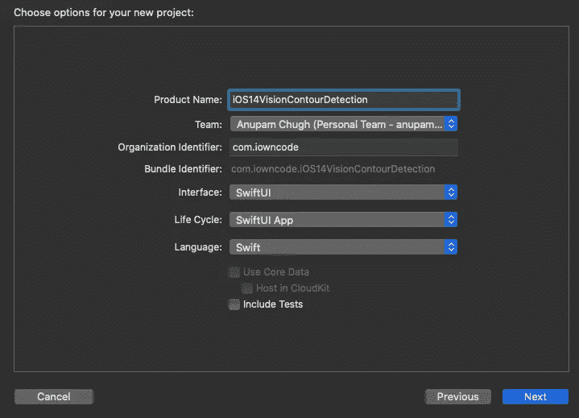
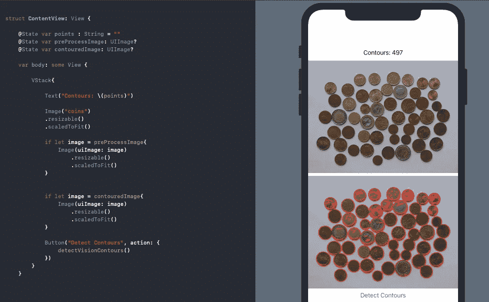
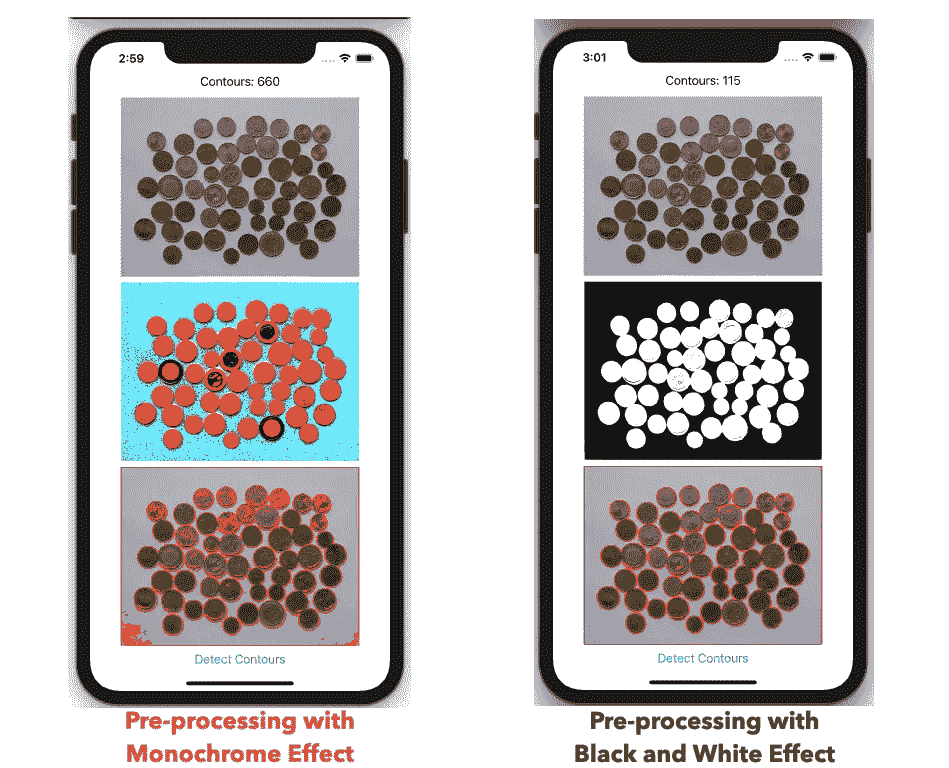

# SwiftUI +视觉轮廓请求 iOS 中的硬币检测

> 原文：<https://betterprogramming.pub/new-in-ios-14-vision-contour-detection-68fd5849816e>

## WWDC20

## 苹果公司通过一系列新的视觉要求来推进其计算机视觉野心


照片由 [Rahul Bhosale](https://unsplash.com/@rahul_design?utm_source=unsplash&utm_medium=referral&utm_content=creditCopyText) 在 [Unsplash](https://unsplash.com/@rahul_design?utm_source=unsplash&utm_medium=referral&utm_content=creditCopyText) 拍摄

苹果的 WWDC 2020(纯数码)活动轰轰烈烈地开始了。SwiftUI、ARKit、PencilKit、Create ML 和 Core ML 带来了许多新的惊喜。但是对我来说最突出的是计算机视觉。

苹果的视觉框架得到了一系列令人兴奋的新 API 的支持，这些 API 以一种相当简单的方式执行一些复杂而关键的计算机视觉算法。

从 iOS 14 开始，视觉框架现在支持手和身体姿势估计、光流、轨迹检测和轮廓检测。

我们将在以后的某个时间对每一项进行深入研究，现在，让我们更深入地研究一个特别有趣的附加功能——轮廓检测视觉要求。

# 我们的目标

*   理解视觉的轮廓检测要求。
*   在 iOS 14 SwiftUI 应用程序中运行它，以检测硬币的轮廓。
*   在将图像传递给视觉请求之前，利用核心图像过滤器对图像进行预处理，从而简化轮廓。我们将设法掩盖图像，以减少纹理噪声。

# 视觉轮廓检测

轮廓检测检测图像中边缘的轮廓。本质上，它连接了所有具有相同颜色或强度的连续点。

该计算机视觉任务对于形状分析、边缘检测是有用的，并且在需要在图像中找到相似类型的对象的情况下是有帮助的。

硬币检测和分割是 OpenCV 中一个相当常见的用例，现在通过使用 Vision 的新`VNDetectContoursRequest`，我们可以在我们的 iOS 应用程序中轻松执行相同的操作(无需第三方库)。

为了处理图像或帧，视觉框架需要一个`VNRequest`，它被传递到图像请求处理器或序列请求处理器。我们得到的回报是一个`VNObservation`类。

您可以根据正在运行的请求类型使用各自的`VNObservation`子类。在我们的例子中，我们将使用`VNContoursObservation`，它提供了从图像中检测到的所有轮廓。

我们可以从`VNContoursObservation`中检查以下属性:

*   `[normalizedPath](https://developer.apple.com/documentation/vision/vncontoursobservation/3548363-normalizedpath)` —返回归一化坐标中检测轮廓的路径。我们必须把它转换成 UIKit 坐标，我们很快就会看到。
*   `contourCount` —视觉请求返回的检测轮廓数。
*   `topLevelContours`——一组不包含在任何轮廓内的`VNContours`。
*   `contour(at:)` —使用此功能，我们可以通过传递其索引或`IndexPath`来访问子轮廓。
*   `confidence` —总体的信心水平`VNContoursObservation`。

> 注意:当您需要从最终观察中修改/移除子轮廓时，使用`topLevelContours`和访问子轮廓非常方便。

现在我们已经对视觉轮廓检测请求有了一个概念，让我们来探索它在 iOS 14 应用程序中是如何工作的。

# 入门指南

首先，你至少需要 Xcode 12 beta。就这些，因为您可以在 SwiftUI 预览中直接运行视觉图像请求。

在 Xcode 向导中创建新的 SwiftUI 应用程序，注意新的`SwiftUI App`生命周期:



完成项目设置后，您将看到以下代码:

```
@main
struct iOS14VisionContourDetection: App {
    var body: some Scene {
        WindowGroup {
            ContentView()
        }
    }
}
```

> 注意:从 iOS 14 开始，`SceneDelegate`已经被弃用，取而代之的是 SwiftUI `App`协议，特别是对于基于 SwiftUI 的应用。`struct`顶部的`@main`注释表示它是应用程序的起点。

# 使用视觉轮廓请求检测硬币

为了执行我们的视觉请求，让我们快速设置一个 SwiftUI 视图，如下所示:

在上面的代码中，我们使用了随 SwiftUI for iOS 14 发布的`if let`语法。忽略`preprocessImage`状态；现在，让我们直接跳到`detectVisionContours`函数，该函数将在视觉请求完成时更新`outputImage`状态:

在上面的代码中，我们在`VNDetectContoursRequest`上设置了`contrastAdjustment`(用于增强图像)和`detectDarkOnLight`(用于更好的轮廓检测，因为我们的图像具有浅色背景)属性。

在使用输入图像(存在于资产文件夹中)运行`VNImageRequestHandler`时，我们取回了`VNContoursObservation`。

最后，我们将绘制`normalizedPoints`作为输入图像的覆盖图。

# 在图像上绘制轮廓

`drawContours`功能的代码如下所示:

上述函数返回的`UIImage`被设置为`contouredImage` SwiftUI 状态，随后我们的视图得到更新:



考虑到我们是在模拟器上运行的，结果相当不错，但如果我们在装有 iOS 14 的设备上运行，并且可以访问神经引擎，结果肯定会更好。

但是，仍然有太多的轮廓(主要是由于硬币的纹理)是我们喜欢的。我们可以通过预处理图像来简化(或者说减少)它们。

# 使用核心图像预处理视觉图像请求

[核心图像](https://developer.apple.com/documentation/coreimage)是苹果的图像处理和分析框架。虽然它对于简单的人脸和条形码检测任务工作良好，但对于复杂的计算机视觉用例来说，它是不可扩展的。

该框架实际上拥有超过 200 个图像过滤器，在摄影应用程序中以及在机器学习模型训练中进行数据扩充时非常方便。

但更重要的是，Core Image 是一个方便的工具，可用于预处理图像，然后将这些图像提供给视觉框架进行分析。

现在，如果你看过 [WWDC 2020 计算机视觉 API](https://developer.apple.com/videos/play/wwdc2020/10673)视频，你会看到苹果公司利用 Core Image 的单色过滤器进行预处理，同时展示他们的打孔卡轮廓检测示例。

在我们的例子中，对于硬币遮罩，单色效果不会给出好的结果。特别是对于颜色强度相似但不同于背景的硬币，使用黑白颜色滤镜来遮罩硬币是一个更好的选择。



对于上述每一种预处理类型，我们还设置了一个高斯滤波器来平滑图像。请注意单色预处理滤镜实际上是如何为我们提供更多轮廓的。

因此，在进行预处理时，注意你正在处理的图像的种类是很重要的。

预处理后得到的`outputImage`馈入视觉图像请求。在这个 [GitHub 库](https://github.com/anupamchugh/iOS14-Resources/tree/master/iOS14VisionContourDetection)中可以找到创建和应用核心图像过滤器的代码块，以及完整的源代码。

# 分析轮廓

通过使用`VNGeometryUtils`类，我们可以观察轮廓的直径、边界圆、面积周长和纵横比等属性。简单地传递轮廓，如下所示:

```
VNGeometryUtils.boundingCircle(for: VNContour)
```

这可以在确定图像中可用的不同种类的形状方面开辟新的计算机视觉可能性。

此外，通过调用`VNContour`上的`polygonApproximation(withEpsilon:)`方法，我们可以通过过滤掉边缘周围的小噪声部分来进一步简化我们的轮廓。

# 结论

计算机视觉在苹果的混合现实未来中发挥着巨大的作用。作为 ARKit 框架的一部分，手和身体姿势 API 的引入将为构建智能计算机视觉应用程序开辟新的机会。

WWDC 2020 有很多令人兴奋的东西。我对手机上机器学习的新可能性感到兴奋。敬请关注更多更新，感谢您的阅读。