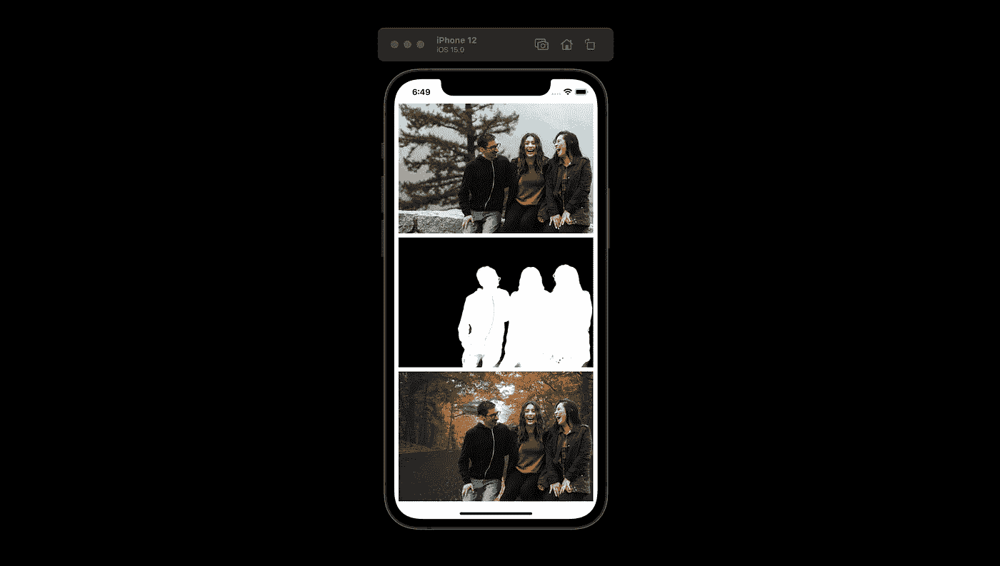
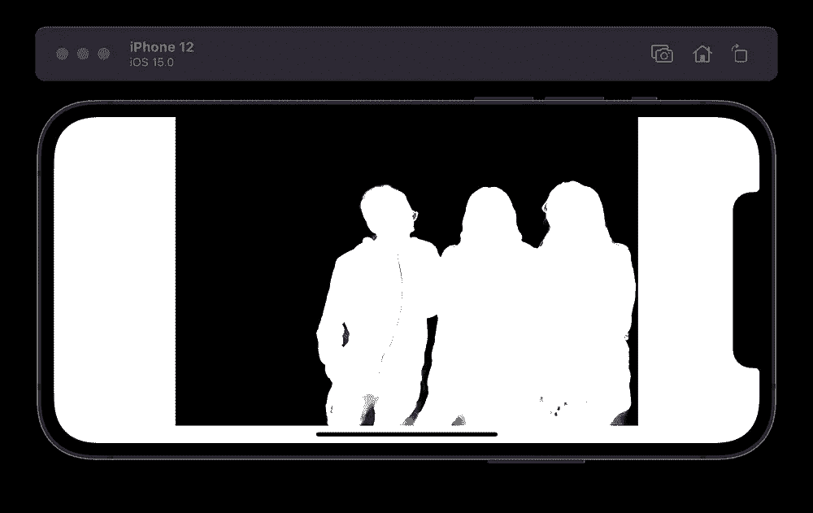
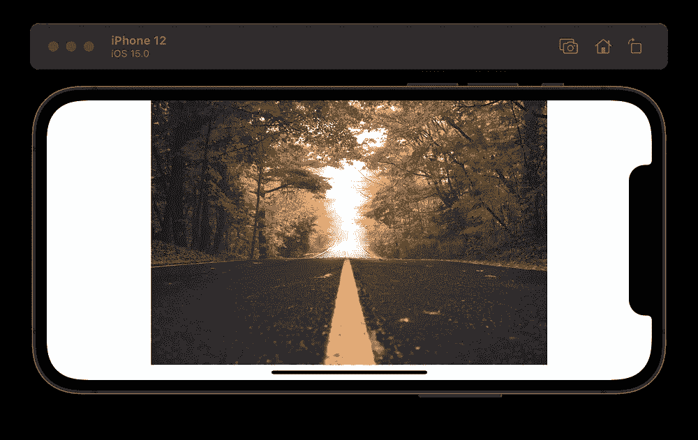
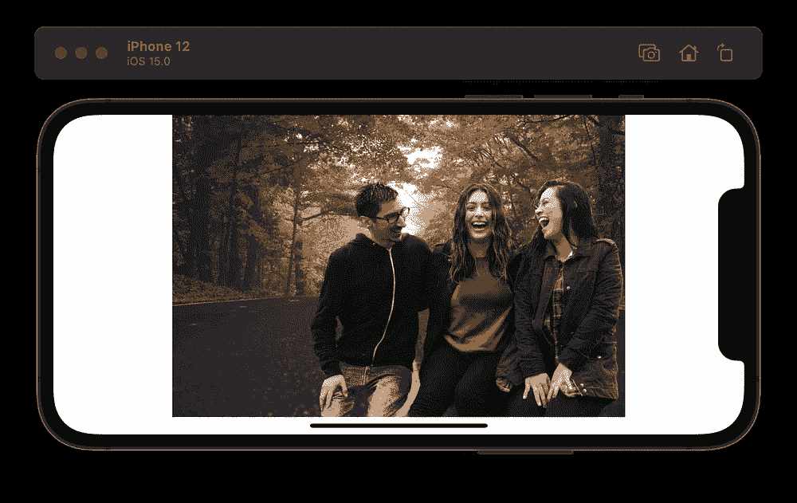
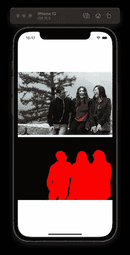

# iOS 15 新增:视觉人物分割

> 原文：<https://betterprogramming.pub/new-in-ios-15-vision-person-segmentation-5c031a2f3822>

## 在图像和视频中将人与背景分开



作者截屏。

Vision 是苹果的框架，为复杂的计算机视觉挑战提供开箱即用的解决方案。它还通过在分类期间处理图像的预处理来抽象核心 ML 请求。

在 iOS 14 中，我们获得了半打[新的视觉功能](https://heartbeat.fritz.ai/whats-new-in-the-vision-framework-in-ios-14-73d22a942ba5)，包括轮廓检测、光流、轨迹检测、离线视频处理以及手和身体姿势估计。

在 WWDC 2021 上，苹果宣布了两个新的视觉要求:人和文档分割。

在这篇文章中，我将重点关注 iOS 15 引入的新的[人物细分愿景请求](https://developer.apple.com/documentation/vision/vngeneratepersonsegmentationrequest)。

# Vision 人员细分请求

语义分割是一种用于对图像中的每个像素进行分类的技术。它通常用于从背景中分离前景对象。

视频通话中的自动驾驶和虚拟背景是两个流行的用例，您可能已经观察到某种形式的语义分段。

[DeepLabV3](https://developer.apple.com/machine-learning/models/) 是一个流行的机器学习模型，用于执行图像分割。如果你想走 ML 的核心道路，看看这个教程[告诉你如何修改图像中的背景。](/coreml-image-segmentation-background-remove-ca11e6f6a083)

回到 Vision 框架，新的`[VNGeneratePersonSegmentationRequest](https://developer.apple.com/documentation/vision/vngeneratepersonsegmentationrequest)`类有助于人物分割，并为帧中的人物返回分割遮罩。

下面是设置它的方法:

```
let request = VNGeneratePersonSegmentationRequest()
request.qualityLevel = .accurate
request.outputPixelFormat = kCVPixelFormatType_OneComponent8
```

这三个质量级别是`accurate`、`balanced`和`fast` —在视频处理任务中推荐使用后一种。

在下一节中，我们将了解如何在 SwiftUI 应用程序中对图像执行人物分割。随后，我们将看到如何使用新的核心图像过滤器做同样的事情。

# 设置我们的 SwiftUI 视图

这是一个简单的 SwiftUI 界面，包含三个垂直堆栈的图像:

`task`是全新的 SwiftUI 修改器，用于执行异步操作。在其中，我们调用了我们的`runVisionRequest`方法。

# 运行愿景请求

以下方法运行 Vision 人员细分请求，并返回屏蔽的输出结果:

以下是原始图像和遮罩图像的外观:



[奥马尔·洛佩兹](https://unsplash.com/@omarlopez1?utm_source=unsplash&utm_medium=referral&utm_content=creditCopyText)在 [Unsplash](https://unsplash.com/s/photos/friends-laughing?utm_source=unsplash&utm_medium=referral&utm_content=creditCopyText) 上的原始照片

虽然上面的分割蒙版使用了`accurate`质量水平，但下面看看`fast`和`balanced`的结果:


作者截屏

为了添加新的背景，我们将分割蒙版传递给`maskInputImage`函数。

这个函数使用一个`CoreImage`混合滤镜来裁剪掉原始图像上的蒙版图像，然后将其与一个新的背景图像混合。

它返回以下结果:



帕特里克·托马索在 [Unsplash](https://unsplash.com/s/photos/background?utm_source=unsplash&utm_medium=referral&utm_content=creditCopyText) 上拍摄的背景照片

# 运行核心图像过滤器

Core Image 是苹果的图像处理框架，广泛用于简单的计算机视觉任务。

在 iOS 15 中，Core Image 获得了以下新过滤器:

```
CIFilter.personSegmentation()
```

我们可以通过以下方式将其应用于我们之前的 SwiftUI 视图:

这是它在模拟器上的样子:



屏幕上显示程序运行的图片

为了将上面的分割混合到新的背景中，你需要将红色转换成白色，这样[混合滤镜](https://developer.apple.com/library/archive/documentation/GraphicsImaging/Reference/CoreImageFilterReference/index.html#//apple_ref/doc/filter/ci/CIBlendWithMask)才能正常工作。

# 结论

这概括了视觉的新的人细分的要求。在实时视频播放器上看到结果会很有趣。

您可以从 [GitHub 资源库](https://github.com/iosdevie/iOS15-Resources/tree/main/iOS15VisionPersonSegmentation)下载完整的源代码。

我们还可以运行顺序视觉请求。例如，你可以将上面的人物分割与面部姿态请求结合起来，构建创造性的人工智能应用程序。

[Philipp Gehrke](https://medium.com/u/144ed0020011?source=post_page-----5c031a2f3822--------------------------------) 展示如何实现[视觉身体姿态估计](/ios-14-vision-body-pose-detection-count-squat-reps-in-a-workout-c88991f7cad4)。这可能是开始整合上述人物分割请求并更准确地检测人物姿态的一个好地方。

这一次到此为止。感谢阅读。

# 参考

*   [WWDC 第 21 届](https://developer.apple.com/videos/play/wwdc2021/10040/)