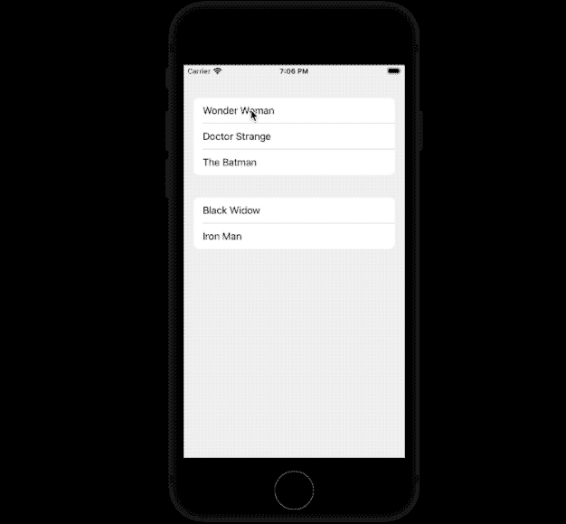

# iOS 16 中的新功能—自动调整 UICollectionView 单元格的大小

> 原文：<https://betterprogramming.pub/new-in-ios-16-self-resizing-uicollectionview-cells-f02fbb7b45b1>

## 在 iOS 16 中使用复合布局和不同的数据源构建可扩展的 UICollectionView

由 [Markus Spiske](https://unsplash.com/@markusspiske?utm_source=medium&utm_medium=referral) 在 [Unsplash](https://unsplash.com?utm_source=medium&utm_medium=referral) 上拍摄的照片

创建动态表格视图或集合视图单元格是一个挑战，大多数 iOS 开发人员都曾在某个时候遇到过这个问题。从使用`estimatedRowHeight`到创建定制的`UICollectionViewLayout`——为`UICollectionViewCell`设置动态大小需要实现一堆方法——尽管引入了组合布局，但我总是求助于菜谱代码

令人高兴的是，在 2022 年 WWDC 奥运会上，苹果公司对其 UIKit 框架进行了重大改进。在 iOS 16 中，表格视图和集合视图单元格现在可以通过默认启用的`selfSizingInvalidation`属性根据内容自动调整大小。

要手动/编程调整单元格的大小，我们可以调用`invalidateIntrinsicContentSize()`。如果你想在没有动画的情况下调整单元格的大小——调用`UIView.performWithoutAnimation`函数中的`invalidateIntrinsicContentSize()`。

现在我们已经了解了这个不错的升级，让我们来构建我们的现代收藏视图 iOS 应用程序。

在接下来的几节中，我们将使用 iOS 16 功能构建一个可扩展的收藏视图，而不依赖于重新加载项目或创建自定义单元格。

对于门外汉来说，在 iOS 15 中，不同的数据源引入了一种新的方法来就地更新单元格，而无需替换现有的单元格。这是通过`[reconfigureItems](https://developer.apple.com/documentation/uikit/nsdiffabledatasourcesnapshot/3804468-reconfigureitems)`功能实现的。

# 积木

*   使用复合布局创建收藏视图
*   添加虚拟数据。在我们的例子中，我们将通过不同的数据源向集合视图提供一系列电影(带有描述细节)。
*   选择时展开和折叠集合视图单元格。对于我们的用例，我们将显示和隐藏电影细节。

让我们开始吧。

# 设置我们的数据模型

我们将数据保存在一个`Movie`类中，如下所示:

为了简化这个例子，我们将电影`name`设置为唯一标识符。`showDetails`标志将用于展开和折叠集合视图。

上面代码中的`Section`是一个隐式符合`Hashable`的 enum。它包含两个值——表示集合视图中的两个部分。

# 设置我们的收藏视图

下面是设置您的`UICollectionView`布局和配置的代码:

抛开`//1`和`//2`(这意味着配置不同的数据源)，其余的代码配置我们的集合视图。

首先，`List`布局是在 iOS 14 中引入的，建立在组合布局之上，以提供类似于 TableView 的设计体验。在上面的代码中，我们利用它来设置我们的配置风格，然后传递给组合布局——最终传递给`UICollectionView`初始化器。

现在来看看我们的`dataSource`。

# 配置不同的数据源

下面是我们的`makeDataSource()`函数的代码:

上面的代码中发生了很多事情，如果构建现代集合视图对您来说是新的，这里有一些您应该关注的推论:

*   `UICollectionView.CellRegistration` struct 是 iOS 14 推出的。当在`dequeueConfiguredReusableCell`内部传递时，它隐式地处理单元注册。所以，和使用标识符注册细胞说再见吧。
*   `UICollectionViewListCell`是带来类似`UITableView`的单元格样式的具体类。我们已经在该单元格上调用了`defaultContentConfiguration`函数。获取该配置后，我们基于布尔标志逻辑设置单元标签文本和描述。
*   `UICollectionViewDiffableDataSource`内的`cellProvider`闭合类似于`to collectionView(_:cellForItemAt:)`

现在，我们已经配置了数据源，下面是我们的虚拟数据:

# 重新配置集合视图项目

要创建一个可扩展的集合视图单元格，我们只需反转`didSelectItem`委托方法中的`showDetails`值:

其余的逻辑不言自明。

# 输出

这是最后一个应用程序:

另一个例子可能是—在集合视图单元格中添加一个文本字段，并查看它如何随着类型自动扩展。

你可以在这个 [GitHub 库](https://github.com/anupamchugh/ios16ExpandableCollectionView)上找到完整的源代码。

感谢阅读。