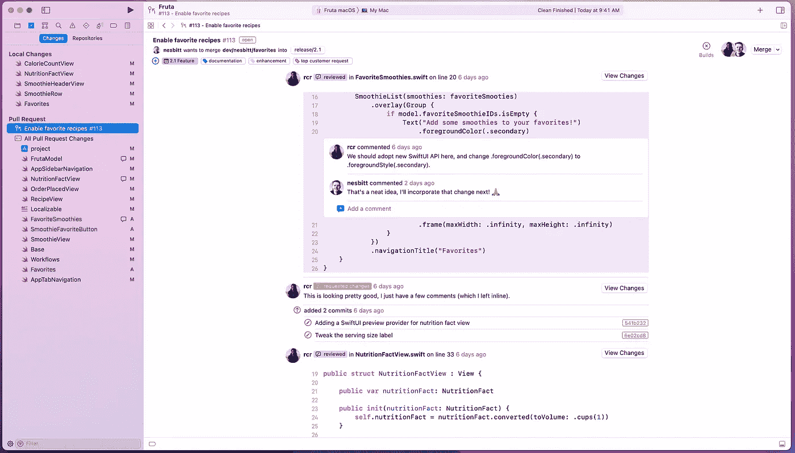
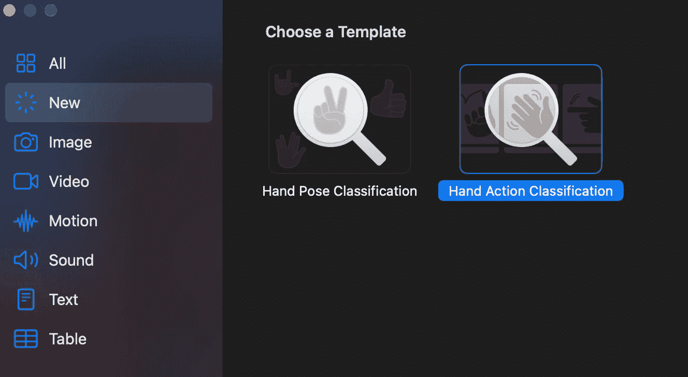

# 对于 iOS 开发者来说，WWDC 2021 有什么新内容？

> 原文：<https://betterprogramming.pub/new-in-wwdc-2021-ios15-swiftui-developers-74428e93f817>

## 从平台联盟活动看 iOS 15 框架更新


[自由股票](https://unsplash.com/@freestocks?utm_source=medium&utm_medium=referral)在 [Unsplash](https://unsplash.com?utm_source=medium&utm_medium=referral) 上的照片

苹果的 WWDC 2021 周终于开始了。对于新手来说，主题演讲特别关注以消费者为中心的软件更新。所以我不会涉及 iOS 15、iPadOS、macOS 12、watchOS 8 等的技术特性。，在本文中。

相反，我将对[平台国情咨文](https://developer.apple.com/videos/play/wwdc2021/102/)活动做一个快速总结。SOTU 会议遵循基调，更加面向开发者。

希望了解最新 API 变化和框架改进并希望更深入地研究工具的 iOS 工程师总是更期待国情咨文而不是主题演讲。

# Xcode 13 赠送我们一个 CI/CD 和**代码** **审核流程**

苹果的开发 IDE Xcode 13 可能是今年最大的更新。

我们现在有了 Xcode Cloud(Xcode Cloud )( T11 ),这是一项由苹果公司开发并托管在云基础设施上的以隐私为中心的持续集成和部署服务。

因此，您不再需要依赖第三方服务来设置工作流程和连接 App Store Connect。Xcode Cloud 在 IDE 本身内为您抽象了整个部署和代码签名过程。

除此之外，Xcode Cloud 通过在 gallery 视图中生成所有工作流 XCTests 的模拟器截图，使单元测试变得更加有趣。此外，随着 Mac 上 TestFlight 的引入，您可以通过跟踪问题所在的确切行来快速诊断应用程序崩溃。

最后，Xcode 还在您的编辑器中引入了内联代码审查，允许用户添加注释和创建拉请求，从而改善团队协作和交流。



国情咨文活动截屏

# Swift 中的并发性

自从 async/await 被添加到 Swift 5.5 的那一天起，该功能就一直受到 iOS 开发者的高度期待。

而我们今年仍然没有再次获得苹果 Combine 框架的新更新(未来的窗帘？)，令人高兴的是，苹果给了我们一个很好的 async/await 概述，并发的力量有助于轻松运行多个任务。

具体来说，SOTU 会议展示了如何用 async/await 结构替换嵌套的完成处理程序，以及如何使用`Actors`来消除`DispatchQueue`的危险。它还展示了在主线程上运行 UI 操作的`@MainActor`。

看看 async/await 如何与 SwiftUI 和 CoreData 一起工作会很有趣。我们已经有一个[即将到来的会议](https://developer.apple.com/videos/play/wwdc2021/10017/)了。

# SwiftUI 3.0 中的新功能

SwiftUI，苹果的声明式框架，提供了在我们今天的应用中构建用户界面的最快和最简单的方法。

在 iOS 15 中，SwiftUI 现在带来了缺失的控件，并增加了更多的定制。以下是亮点:

*   `[refreshable](https://developer.apple.com/documentation/swiftui/texteditor/refreshable(action:)?changes=latest_minor)` —处理 Swift 列表中拉刷新事件的回调
*   `[swipeAction](https://developer.apple.com/documentation/swiftui/texteditor/swipeactions(edge:allowsfullswipe:content:)?changes=latest_minor)` —向 SwiftUI 列表行添加自定义按钮操作的修饰符
*   `[searchable](https://developer.apple.com/documentation/swiftui/texteditor/searchable(_:text:placement:)-8z59a?changes=latest_minor)` —向列表添加搜索字段的修饰符。我们还得到了一个搜索字段建议修饰符。
*   `accessibilityRepresentation` —在自定义 SwiftUI 控件中添加标准辅助功能控件
*   `[materials](https://developer.apple.com/documentation/swiftui/material)` —向 SwiftUI 视图添加背景元素并对其进行定制的结构类型
*   `[AttributedString](https://developer.apple.com/documentation/foundation/attributedstring)`中的降价支持
*   Enum 驱动的`[ListStyle](https://developer.apple.com/documentation/swiftui/liststyle?changes=latest_minor)`
*   用于`TextField`响应器的新`[focus](https://developer.apple.com/documentation/swiftui/link/focused(_:)?changes=latest_minor)` API
*   `[AsyncImage](https://developer.apple.com/documentation/SwiftUI/AsyncImage)`从 URL 异步加载 SwiftUI 图像。

随着小部件出现在 iPadOS 15 的主屏幕上，用 SwiftUI 编写的 WidgetKit 为其`[WidgetFamily](https://developer.apple.com/documentation/widgetkit/widgetfamily/systemextralarge?changes=latest_minor)`带来了新的超大尺寸。

# iPad 上的 Swift Playgrounds 允许您编写、构建和发布 SwiftUI 应用程序

Swift Playgrounds 已经存在了一段时间，并提供了一个开始学习编码的好方法。

Swift Playgrounds 4 现在引入了编写 SwiftUI 应用程序、查看实时预览以及将应用程序直接发送给测试用户或应用程序商店的功能。

还有一个新的包格式，可以轻松地将您的 Xcode 项目转移到 iPadOS 上的 Swift Playgrounds。


来自 SOTU 活动的屏幕截图

# 机器学习和增强现实

iOS 13 中引入了 RealityKit 来简化复杂的 AR 效果。

在 iOS 15 中，RealityKit 2 通过自定义着色器、角色控制和新的动画播放 API 带来了巨大的升级。

但是突出的特性是对象捕获 API。本质上，它可以让你通过使用`[PhotogrammetrySession](https://developer.apple.com/documentation/realitykit/photogrammetrysession?changes=latest_minor)`从一堆 2D 图像中构建 3D 虚拟物体，快速将现实世界的场景转换为 AR 模型。请务必使用对象捕获 API 查看布鲁诺·罗查的[实践指南](/creating-3d-models-from-photographs-using-realitykit-in-swift-e48d4c7db695)。

另一方面，Vision 框架引入了两个新的要求:

*   一个[人物分割](https://developer.apple.com/documentation/vision/vngeneratepersonsegmentationrequest?changes=latest_minor)请求，也可以让你跟踪头部姿态。
*   [文档分割](https://developer.apple.com/documentation/vision/vndetectdocumentsegmentationrequest?changes=latest_minor)请求在图像中找到矩形文档。

苹果的无代码拖放训练工具 Create ML 为我们带来了两种新的用于模型训练的分类器。它们是手部动作和手部姿态分类。



创建 ML 应用 Xcode 13 的屏幕截图—作者

# 焦点模式的增强用户通知 API

iOS 15 引入了新的对焦模式。这意味着用户会收到基于他们选择的特定时间或他们当前活动(睡觉、工作、聚会)的通知。

为了确保用户体验不会受到影响，并且通知能够准确传递，您可能想要查看[用户通知](https://developer.apple.com/documentation/usernotifications?changes=latest_minor)中的更改。

首先，我们现在有了一个`UNNotificationInterruptionLevel`枚举，可以让您设置通知的类型:`active`、`passive`、`critical`、`time-sensitive`。

关键通知将绕过静默模式。但是，您需要在授权中明确定义这一点。

# 隐私 API:屏幕时间、位置和共享播放

隐私总是苹果活动中的焦点，今年也不例外。iOS 15 引入了大量改进和新的 Swift 框架。

例如，位置权限现在将让用户每次都可以选择手动允许。苹果为此推出了 SwiftUI 专属`[LocationButton](https://developer.apple.com/documentation/corelocationui/locationbutton?changes=latest_minor)`，你也可以定制。每当用户点击时，该按钮获取当前位置:

```
LocationButton(.currentLocation) { .... }
```

对于 UIKit 爱好者来说，`[CLLocationButton](https://developer.apple.com/documentation/corelocationui/cllocationbutton?changes=latest_minor)`做同样的任务。

Screen Time API 公开了三个 Swift 框架:

*   `[ManagedSettings](https://developer.apple.com/documentation/managedsettings)` —授予或限制对特定应用功能的访问权限。这与`[ManagedSettingsUI](https://developer.apple.com/documentation/managedsettingsui)`一起定制受保护的视图。
*   `[FamilyControls](https://developer.apple.com/documentation/familycontrols)` —允许用户选择授权应用/网站，并防止家庭共享设备上的儿童删除或意外购买
*   `[DeviceActivity](https://developer.apple.com/documentation/deviceactivity)`提供一种保护隐私的方式来监控应用程序网站的事件

在 iOS 15 中，FaceTime 还引入了 SharePlay 功能，可以在视频通话中收听、观看和共享屏幕，如 Zoom。令我们高兴的是，苹果通过[小组活动](https://developer.apple.com/documentation/GroupActivities)框架公开了 SharePlay。

Group Activities 为您抽象了对等会话同步过程，从而减少了样板代码。SOTU 的活动展示了一个很酷的演示，用户可以加入定制的基于 AVPlayer 或 PencilKit 的应用程序并与之互动。它所需要的只是配置`[GroupSessionMessenger](https://developer.apple.com/documentation/groupactivities/groupsessionmessenger)` API。

# 结论

这篇文章到此结束，而事件才刚刚开始。本周安排了大量的 WWDC 会议，我们将详细了解每个框架。

暂时就这样了。感谢阅读。

*为了深入了解 SwiftUI iOS 15 的新功能，* [*来看看这个*](/whats-new-in-swiftui3-ios15-fa0e0d62235b) *。*