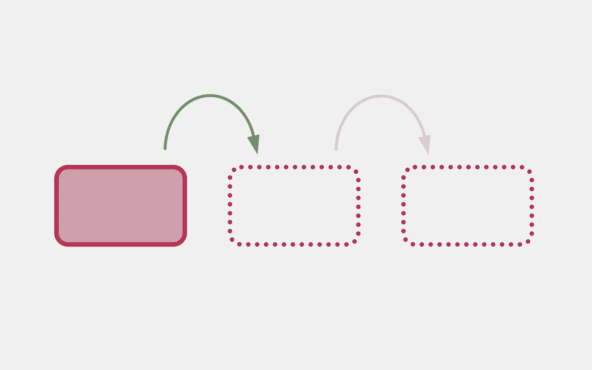

# 看看新的“异步 Swift 算法”包

> 原文：<https://betterprogramming.pub/new-package-look-at-swift-async-algorithms-3f1a25e8efd9>

## 苹果发布了一个异步 swift 算法包，介绍了使用异步序列的有用方法



大约一个月前，苹果发布了第一个版本的[异步 swift 算法](https://github.com/apple/swift-async-algorithms)包。它提供了与不久前引入的异步序列一起使用的工具和算法。这个包专注于实现已经众所周知的工具，如`zip`以及及时处理的新特性(wow)。它还提供了创建和管理异步序列的更复杂的方法。

> 💥该模块的最新版本是`0.0.1`，这意味着它仍在开发中。所以，有些方法还不可用，有些可能会改变或出现。大多数情况下，这篇文章是为了了解新的特性，可能的话，规划你的代码，记住这些特性将来会出现

# 装置

新包通过 Swift PM 分发。要将其添加到您的项目中，您需要将其作为一个依赖项添加到 Xcode 项目`File > Add Packages`中。

或者将其添加到您的`Package.swift`文件中:

```
.package(url: "https://github.com/apple/swift-async-algorithms"),
```

不要忘记将依赖项添加到可执行文件中:

```
.target(name: "<target>", dependencies: [
    .product(name: "AsyncAlgorithms", package: "swift-async-algorithms"),
]),
```

添加`import AsyncAlgorithms`后，该模块将在您的项目中可用。

> 💥正如我提到的，该模块仍在开发中。因此，您需要安装 [Swift 主干开发工具链](https://www.swift.org/download/#trunk-development-main)来访问所有功能。不过，其中一些马上就有了！

# 创建异步序列

为了测试新模块提供的所有漂亮的功能，我们首先需要创建一个异步序列。该软件包引入了新的方法来做到这一点。

## 属性`async`

该模块为`Sequence`协议增加了如下扩展。

```
extension Sequence {
  public var async: AsyncLazySequence<Self> { get }
}
```

其中`AsyncLazySequence`符合`AsyncSequence`。

```
public struct AsyncLazySequence<Base: Sequence>: AsyncSequence {
}

extension AsyncLazySequence: Sendable where Base: Sendable {
	...
}
extension AsyncLazySequence.Iterator: Sendable where Base.Iterator: Sendable {
}
```

> 💡例如，使用`async`属性，我们可以将任何现有的序列转换成`AsyncSequence`，以便在一些异步 API 中使用它们。

```
let numbers = [1, 2, 3, 4].async
let characters = "Hello, world".async
let items = [1: "one", 2: "two", 3: "three"].async
```

然而，以这种方式创建`AsyncSequence`并没有真正带来好处，因为所有的元素都已经在这里了，并且可以立即使用。创建`AsyncSequence`还有更有用的方法。

## 异步信道和异步增长信道

如果你知道其他语言中的`Future`或`Promise`是什么，那么`AsyncChannel`你一定会很熟悉。除了它提供了一种传输值的序列**的方式。**

> ❗Channel's 元素必须符合`Sendable`协议，这基本上意味着跨并发域使用公共 API 是安全的。
> 
> 所有基本类型自动符合它。对于自定义类型，您需要在使用前添加一致性。

这里有一个关于`AsyncChannel`用法的非常简单的例子。

```
let channel = AsyncChannel<String>()
Task {
    for word in ["Hello", "from", "async", "channel"] {
      await channel.send(word)
    }
    await channel.finish()
}

for await message in channel {
    print(message)
}
```

输出:

```
Hello
from
async
channel
```

注意`await`关键字与 send 和 finish 一起使用。这是因为通道**实际上双向同步**。这意味着`send`等待消费，反之亦然。

> 💡`await channel.send()`等待，直到发送的值以任何方式被使用。这样，为通道产生价值的一方不会产生比接收方能够消耗的更多的价值

`AsyncThrowingStream`几乎相同，除了它提供了`fail(_ error: Error)`方法，可用于向通道的消费者抛出异常。

```
let channel = AsyncThrowingChannel<String, Error>()

...

for try await message in channel {
    print(message)
}
```

## 并转换回来

该模块为三种主要类型添加了初始化器:`Array`、`Dictionary`和`Set`，它们允许您通过在 init 期间获取所有元素来将异步序列转换为常规序列。

```
let table = await Dictionary(uniqueKeysWithValues: zip(keys, values))
let allItems = await Set(items.prefix(10))
let allMessages = await Array(channel)
```

# 操纵异步序列

该模块还提供了组合异步序列的新方法。这些函数非常简单。

*   `chain(_ s1: AsyncSequence, _ s2: AsyncSequence)`

将两个或三个异步序列按顺序链接在一起，其中结果中的元素按顺序从第一个异步序列的元素开始，然后是第二个异步序列的元素(依此类推)，或者直到出现错误。序列必须具有相同的`Element`类型。

> 💥苹果注意到它可以用于两个**或者更多的**序列。不过，现在只有两三个论点可用。

*   `joined()`或`joined(separator: AsyncSequence)`

将异步序列的异步序列串联在一起，其中结果按顺序从第一个异步序列的元素开始，然后是第二个异步序列的元素(依此类推)，或者直到出现错误。类似于`chain()`，除了要连接的异步序列的数量事先未知。也可以指定分隔符。

*   `combineLatest(_ base1: AsyncSequence, _ base2: AsyncSequence)`

组合两个*或更多*序列，生成序列中可用的最新值的元组。

*   `merge(_ base1: AsyncSequence, _ base2: AsyncSequence)`

将序列合并成一个新序列。结果是来自两个序列的结果的组合。序列必须具有相同的`Element`类型。

> 💡考虑到没有定义哪个序列元素出现得更快，元素的顺序可以是任意的

*   `zip(_ base1: AsyncSequence, _ base2: AsyncSequence)`

与普通的`zip`相同，但为`AsyncSequence`。与`combineLatest`不同，它会等到第二个值可用，而不使用最后一个值。

# 与时间相关的函数

听起来很棒，但是 Swift 不够强大，无法将`await`放在时间本身之前。当事件发生的速度可能比预期的消耗速度快时，有一些方法可以处理这种情况。这些功能允许将`AsyncSequences`与时间联系起来。它们可以适用于任何`AsyncSequence`。

对于列出的两种方法，都可以指定自定义时钟。默认是`ContinuousClock`

## 去抖

```
public func debounce<C: Clock>(
    for interval: C.Instant.Duration, 
    tolerance: C.Instant.Duration? = nil, 
    clock: C
  ) -> AsyncDebounceSequence<Self, C>
```

去抖算法在事件之间经过特定持续时间后产生元素。如果有许多事件发生，去抖将等到从最后一个事件起至少经过`interval`时间后才发出值。

```
seq.debounce(for: .seconds(1))
```

在这种情况下，它将一个潜在的快速异步事件序列转换为一个等待 1 秒钟的窗口**而没有事件**过去的序列，然后发出一个值。

## 喉咙

节流算法产生元素，使得它们之间至少经过了特定的间隔。如果值是由 base `AsyncSequence`产生的，那么节流器不会恢复它的下一个迭代器，直到周期过去或者除非遇到一个终止事件。与`debounce`类似，可以指定自定义时钟。

```
seq.throttle(for: .seconds(1))
```

在这种情况下，throttle 会将一个潜在的快速异步事件序列转换为一个在发出值之前等待 1 秒钟的窗口。

> 💡注意，去抖等待一个没有事件的窗口**，而节流只是等待一个窗口。**

# **最终注释**

**坦率地说，观看 Swift 如何展现新功能以及如何开发这些新功能非常有趣。一定要查看参考资料中提到的项目 GitHub，查看模块的源代码。**

**如果您对相对较新的 swift 并发功能没有信心，请查看我的 Swift 异步/等待快速指南。**

**[](http://alexdremov.me/quick-guide-to-async-await-in-swift/) [## Swift 异步等待快速指南| Alex Dremov

### Alex dre mov iniOS & Swift——您需要了解的关于 Swift 异步新功能的一切。异步等待，主要演员…

alexdremov.me](http://alexdremov.me/quick-guide-to-async-await-in-swift/) 

```
**Want to Connect?**This post was originally published on [alexdremov.me](https://alexdremov.me/swift-async-algorithms-module/)
```

# 参考

[](https://github.com/apple/swift-async-algorithms) [## GitHub-apple/Swift-Async-Algorithms:Swift 的异步算法

### Swift Async Algorithms 是一个异步序列和高级算法的开源包，涉及…

github.com](https://github.com/apple/swift-async-algorithms)**