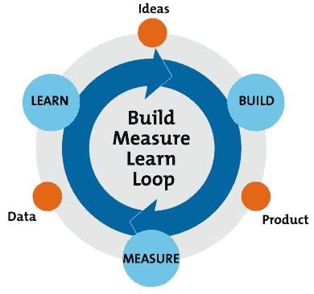
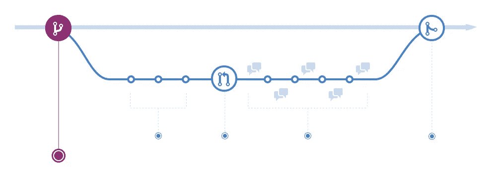

# 新项目？就硬编码吧

> 原文：<https://betterprogramming.pub/new-project-just-hardcode-it-bac72e1a231e>

## 花太多时间构建无人问津的配置？写一个你永远不会用到的扩展点怎么样？就硬编码吧

图片来自 [Pixabay](https://pixabay.com/?utm_source=link-attribution&utm_medium=referral&utm_campaign=image&utm_content=1839406) 的[像素](https://pixabay.com/users/Pexels-2286921/?utm_source=link-attribution&utm_medium=referral&utm_campaign=image&utm_content=1839406)

如果你关注我的写作，你会知道我有两个坚定的信念:

*   上市时间是成功的关键
*   价值迭代高于一切

然而，公司仍然在发布之前围绕着未来检验他们的软件。我不知道你怎么想，但对我来说，这听起来像瀑布开发。我以为我们已经过去了？

你有没有遇到过这样的情况，你的团队承诺在一定的时间内完成一个项目，但是你却因为一个配置比预期的要复杂一点而放弃了？然后发现您的客户甚至没有使用这种配置？

这让你很沮丧，因为你花了那么多时间想出了一套没人用的健壮的配置。这让你的客户很沮丧，因为你因为他们不想要的配置而推迟获得他们的软件。

# 那么我们该如何改变呢？

硬编码。除非你明确承诺构建一个配置，否则就硬编码吧。重视迭代。快速将产品送到消费者手中。让他们看看自己喜欢什么，不喜欢什么。

你会惊讶地发现，有多少人在没有他们认为**T5 需要的配置的情况下也很开心。**

让我们看一个例子。你的团队负责构建一个三明治订购应用程序。该应用程序向用户提供了一个配料列表，用户可以在点击提交之前进行选择。在他们提交订单后，它会被送到厨师那里，然后厨师会处理订单并通过自行车把它送到你的手中。很 2019。

图片来自 [Pixabay](https://pixabay.com/?utm_source=link-attribution&utm_medium=referral&utm_campaign=image&utm_content=3402507) 的 [Kai Pilger](https://pixabay.com/users/KaiPilger-5841200/?utm_source=link-attribution&utm_medium=referral&utm_campaign=image&utm_content=3402507)

但是你的团队中有人想引入一个“通常”的概念。用户登录，为他们一直点的三明治设置配料，然后点击保存。现在他们有了一键订购选项。

还有人建议为厨师添加配置，以便在配料缺货时进行标记。似乎是必要的，这样你就不会有订单缺少配料，所以你把它添加到组合中。

另一个人提出你需要一个优先会员。人们可以付费成为专业会员，这样他们点的三明治就会自动排在队伍的最前面。付出更多，等待更少。

不久之后，您将拥有一系列功能和配置，如果您全部构建，这些功能和配置可以轻松地让您的上市时间增加一倍或三倍。你现在做什么？延迟发布？

号码

尽可能硬编码。省略不必要的功能。在构建所有功能之前，进行一些用户测试。

## 构建、测量、学习

在《精益创业一书中，作者谈到了构建、衡量和学习的原则。简而言之，它是一个反馈回路，帮助你迭代和改进你的产品。

图表改编自 Ries，e .(2011)[精益创业](https://www.amazon.com/Lean-Startup-Innovation-Successful-Businesses-ebook/dp/B004J4XGN6/)，《纽约:皇冠商务》。

造些小东西。衡量客户的反馈。从他们的需求中学习。然后再次开始循环。建立一个你刚刚学到的需求。衡量你是否满足了需求。了解如何改进它。

在我们的三明治应用程序中，我们需要做的只是显示一份配料清单，然后付款。它在屏幕上向厨师显示订单。厨师标记订单完成。骑自行车的人递送订单。迭代 1 完成。

给你的顾客看。获得他们的反馈。事实证明，他们真的需要标记缺货成分的能力。了解优先级在哪里。去造吧。

也许他们从来没有提出过“平常”这个概念。你为自己节省了本可以创新的时间。通过省略或硬编码本来可以配置的特性，我们允许自己把时间花在构建客户真正想要的东西上。

# 人们真的会这样做吗？

是啊！许多公司正在通过生产我们真正需要的产品和服务来改变世界。事实上，如果你看一看 [GitHub 流](https://guides.github.com/introduction/flow/)，你可以看到这是他们遵循的模式。

来自 [GitHub](https://guides.github.com/introduction/flow/) 的 GitHub 流量

GitHub 流程建议您在将一个新特性合并到 master 之前，将它部署到 production *中。因此，在考虑它是金牌产品甚至是完整的产品之前，把它展示给你的客户群是主要的想法。这样做可以让您验证您的客户是否会使用该功能。*

你把你的客户乐于使用的软件叫做什么？市场成功。

这是很多创业公司遵循的策略。如果你沿着这条路走下去，你不会孤单，也不会开辟新的天地。你将加入成千上万的其他公司的快乐客户俱乐部，因为你将很快得到他们想要的软件。

# 行动呼吁

不要想多了。软件不一定要硬。最好的建筑师会用简单的方法解决复杂的问题。他们是怎么做到的？硬编码它。他们不会用不必要的配置把水弄脏。

他们以最快的速度解决问题，以获得曝光率。他们从顾客的反馈中衡量他们的成功。他们了解需求和必要的新功能。

我不是说你需要扔掉你目前正在做的一切，而是考虑更加敏捷，让你的客户在过程的早期接触到想法。别让你拖你的后腿。价值迭代。重视简单。重视市场成功。