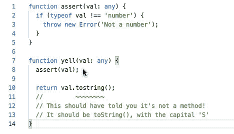
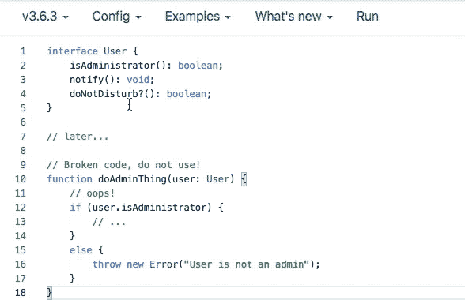

# 您应该了解的新 TypeScript 特性

> 原文：<https://betterprogramming.pub/new-typescript-features-you-should-check-out-f31d2fbf4bc9>

## TypeScript 3.7.2 中的新增功能

照片由 [Joseph Chan](https://unsplash.com/@yulokchan?utm_source=medium&utm_medium=referral) 在 [Unsplash](https://unsplash.com?utm_source=medium&utm_medium=referral) 上拍摄

恭喜你！ [TypeScript 发布了新版本，3.7.2](https://www.npmjs.com/package/typescript) 。近几年来，TypeScript 已经成为开发人员最流行的语言之一。TypeScript 获得了超过 50K 颗星，并且总是关注用户可能面临的问题。我一直是等待新版本的 TypeScript 的忠实粉丝之一。

好吧抱歉。我太多嘴了。让我们看看有什么新功能出来了！

# 阅读前

我写了一篇关于*[即将推出的新 JavaScript 特性](https://medium.com/javascript-in-plain-english/upcoming-new-javascript-features-you-should-know-if-you-use-javascript-everyday-8208b477b7a2)的文章，你可能想和这篇文章一起看看，以获得更多乐趣。因为 TypeScript 团队参与了 TC39，所以这次更新中的特性与新的潜在 JavaScript 特性高度相关。*

# *可选链接*

*该死的。TypeScript 比 ECMAScript 早发布了这个特性！可选链接是一个非常方便的特性，可以减少代码行数，使代码更加整洁。*

> *“可选链接允许我们编写代码，如果遇到`*null*`或`*undefined*`，我们可以立即停止运行一些表达式。”—类型脚本发行说明*

*这个看起来不是很有用吗？但是有些事情你需要记住。可选链条并不是酒店每个房间的万能钥匙。这并不总是取代`&&`操作符。例外情况如下:*

*注意在上面的例子中`city?.popularity`和`city && city.popularity`的工作方式不同。因为可选链接只检查`null`和`undefined`，而`&&`操作符检查`falsy`。因此，您应该小心不要滥用可选链接。*

***~~编辑~~** 这也是一个比较`&&`和`?.`区别的好例子*

*要点源代码来自[波格丹一世波伦斯基](https://medium.com/u/777e34597fe0?source=post_page-----f31d2fbf4bc9--------------------------------)，谢谢！*

*第一个`if`语句将起作用，因为`str`不是`null`或`undefined`。`str?.indexOf()`等于`(str !== null && str !== undefined) && str.indexOf()`。然而，第二个`if`不会被执行，因为空字符串`''`是假的。所以，`str && str.indexOf()`不会向`if`语句返回 true。*

*另一件要注意的事情是，可选链接仅限于属性访问、调用和元素访问。*

> *“可选链的‘短路’行为仅限于‘普通’和可选的属性访问、调用、元素访问——它不会从这些表达式中进一步扩展。—类型脚本发行说明*

*因为`math`是可选值，所以它可能是`undefined`。TypeScript 总是抱怨`undefined`。*

> **`*undefined*`是万恶之源。”—类型脚本 strictNullChecks 文档**

**解决方法是`math?.score!`。**

# **无效合并**

**如果可选链接是关于检查`null`和`undefined`的，那么无效链接 *g* 是关于默认值的。**

**`??`操作符作为`||`分配默认值，避免使用`0`、`NaN`和`“”`等虚假值。**

**Nullish 合并非常简单，但是当您将它与可选链接一起使用时，它会使您的代码看起来更优雅，因为 TypeScript 希望这个特性与可选链接一起发布。**

# **断言函数**

**假设有一个函数检查参数是否是数字类型。如果参数不是 Number，函数会抛出一个错误。另一个函数`yell`调用`assert`来检查变量的类型，如下所示。**

**在这种情况下，TypeScript 是宽松的，因此很容易出现人为错误。**

> **不幸的是，在 TypeScript 中，这些检查永远无法正确编码。对于松散类型的代码，这意味着 TypeScript 检查得更少，而对于稍微保守的代码，这通常会迫使用户使用类型断言。”—类型脚本发行说明**

**为了避免这种情况，发布的版本为我们提供了几个选项。**

1.  **`asserts {{parameter}}`**
2.  **`asserts {{parameter}} is {{Type}}`**

**这两个选项的概念是相同的。这个想法来自 Node.js 中的 assert function。如果`assert`返回，那么传递给函数中的`{{parameter}}`参数的任何内容都必须为真。一旦它返回 true，就意味着`{{parameter}}`在其范围内将永远是 true。**

**要让 TypeScript 更努力，可以像下面这样使用`asserts`作为返回类型。**

****

**`"asserts val is Number”`工作原理如下**

****

**“断言类型化”是这样工作的**

# **未调用的函数检查**

**这个功能不是我们可以手动使用的。不过，这是 TypeScript 的内部改进，意义重大。有时错误是由人的手指造成的。例如，我们错误地忘记调用一个函数。在这个新发布的 TypeScript 中，它可以检查没有被调用的函数，如果有错误，就抛出一个错误。**

****

**现在，TypeScript 可以检查未被调用的函数**

**但是，这是很有条件的。**

1.  **选项`strickNullChecks`必须是`checked`才能检查`required`类型的非调用函数。**
2.  **如果函数是`optional`类型，TypeScript 不认为是错误。**
3.  **如果这个函数后来在`if`语句的主体中被调用，TypeScript 不会认为这是一个错误。**

****

**对于未调用的函数检查，strickNullChecks 必须为 on**

**这一点非常重要。您必须确保分配`strictNullChecks`选项`true`来打开未调用功能检查功能。而且更糟糕的是这个特性只检查`required`类型属性。下面的代码不会显示任何错误。或者如果函数稍后在`if`语句的主体中被调用，也不会被发出。**

**由于这个特性并不完美，TypeScript 建议开发人员用不同的方法来检查它是函数还是值。**

> **如果您打算在不调用函数的情况下测试它，您可以更正它的定义以包含`undefined` / `null`，或者使用`!!`编写类似于`if (!!user.isAdministrator)`的代码以表明强制是有意的—类型脚本发行说明**

# **结论**

**我已经给你介绍了四个特性，但还有更多。就我个人而言，我认为这次更新对 TypeScript 来说是有意义的，因为他们深入参与了 TC39，每年都会确定 JavaScript 的新特性并将其添加到 ECMAScript 的下一版本中。**

**有些功能看起来很酷，有些看起来很复杂。然而，我们不应该认为这次更新的新功能可以完全取代现有的功能。正如微软 TypeScript 项目经理 Daniel Rosenwasser 提到的注意事项，我希望你在`npm install`之前查看发布说明。**

**感谢您的阅读！我真的很喜欢写这篇文章，因为我是等待更新的书呆子之一！如果你愿意，[点击这个 TypeScript 3.7 的文档](https://www.typescriptlang.org/docs/handbook/release-notes/typescript-3-7.html)获取完整的信息。**

# **资源**

*   **[打字稿 3.7](https://www.typescriptlang.org/docs/handbook/release-notes/typescript-3-7.html)**
*   **[打字稿发布说明](https://devblogs.microsoft.com/typescript/announcing-typescript-3-7-beta/)**
*   **[TypeScript 中的 strictNullChecks](https://basarat.gitbooks.io/typescript/docs/options/strictNullChecks.html)**