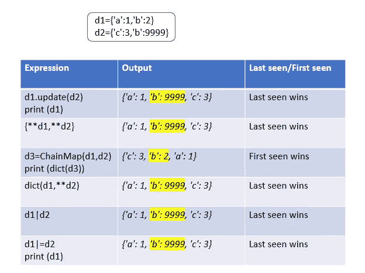

# Python 3.9 中合并字典的新联合运算符

> 原文：<https://betterprogramming.pub/new-union-operators-to-merge-dictionaries-in-python-3-9-8c7dbbd1080c>

## 合并(|)和更新(|=)运算符


[Toa Heftiba](https://unsplash.com/@heftiba?utm_source=medium&utm_medium=referral) 在 [Unsplash](https://unsplash.com?utm_source=medium&utm_medium=referral) 上拍摄的照片

# 使用 Union 运算符在 Python 3.9 中合并字典

在 Python 3.9 中，内置的`dict`类中增加了 merge `|`和 update `|=`操作符。

让我们探索一下 Python 3.9 前后合并字典的不同方式。

# Python 3.9 之前合并字典的不同方式

## 1 .字典.更新()

> `d1.update(d2)`用来自`d2`的键/值对更新字典`d1`，覆盖现有的键。返回`None`。- [python 文档](https://docs.python.org/3/library/stdtypes.html#dict.update)


```
d1={**'a'**:1,**'b'**:2}
d2={**'c'**:3,**'b'**:9999}
d1.update(d2)
print (d1)
*#Output:{'a': 1, 'b': 9999, 'c': 3}*
```

**限制**

`d1.update(d2)`会修改原来的字典`d1`。如果不需要修改原始字典，创建字典`d1`的副本，然后更新它。

```
d1={**'a'**:1,**'b'**:2}
d2={**'c'**:3,**'b'**:9999}
**from** copy **import** copy
d3=copy(d1)
d3.update(d2)
print (d3)
*#Output:{'a': 1, 'b': 9999, 'c': 3}*
```

## 2.字典解包{**d1，**d2}

`d3={**d1,**d2}`

> 双星号`**`表示字典解包。
> 
> 它将把字典`d1`和`d2`的内容扩展为键值对的集合，并更新字典`d3`。在`d1`和`d2`中常见的键将包含来自`d2`的值。- [python 文档](https://docs.python.org/3/reference/expressions.html#dictionary-displays)


```
d1={**'a'**:1,**'b'**:2}
d2={**'c'**:3,**'b'**:9999}
d3={**d1,**d2}
print (d3)
*#Output:{'a': 1, 'b': 9999, 'c': 3}*
```

**限制**

`{**d1, **d2}`忽略映射的类型，总是返回一个`dict`。

## 3.收藏。链式地图

> `ChainMap`**:**`ChainMap`将多个字典或其他映射组合在一起，创建一个可更新的视图。- [python 文档](https://docs.python.org/3/library/collections.html#collections.ChainMap)

`collections.ChainMap(*maps)`

返回类型为`collections.ChainMap`。我们可以使用`dict()`构造函数转换成`dict`。


```
d1={**'a'**:1,**'b'**:2}
d2={**'c'**:3,**'b'**:9999}
**from** collections **import** ChainMap
**from** collections **import** ChainMap
d3=ChainMap(d1,d2)
print (d3)
*#Output:ChainMap({'a': 1, 'b': 2}, {'c': 3, 'b': 9999})* print (dict(d3))
*#Output:{'c': 3, 'b': 2, 'a': 1}*
```

**限制**

1.  它还忽略映射的类型，并总是返回一个`dict`。
2.  `ChainMap` s 包装它们的底层`dict` s，因此写入`ChainMap`将修改原始的`dict`。

在上面提到的例子中，如果我们修改了`ChainMap`对象，`d1`也会被修改。`d3=ChainMap(d1,d2)`

```
d3[**'a'**]=555555
print (d1)
*#Output:{'a': 555555, 'b': 2}*
```

## 4.字典(d1，**d2)

`d3` = `dict(d1,**d2)`

`d3`将包含来自`d1`和`d2`的键值对。在`d1`和`d2`中常见的键将包含来自`d2`的值。


```
d1={'a':1,'b':2}
d2={'c':3,'b':9999}
from collections import ChainMap
d3=dict(d1,**d2)
print (d3)
*#Output:{'a': 1, 'b': 9999, 'c': 3}*
```

**限制**

d `3=dict(d1,**d2)`只有在`d2`完全用字符串键入时才能工作。

如果`int`作为`d2`中的一个键被给定，它将升起`TypeError`。

```
d1={**'a'**:1,**'b'**:2}
d2={**'a'**:99,1:3}
d3=dict(d1,**d2)
print (d3)
*#Output:TypeError: keywords must be strings*
```

# Python 3.9 中引入的新方法

## 字典联盟

引用[规格 584](https://www.python.org/dev/peps/pep-0584/#specification) ，

> “Dict union 将返回一个新的`dict`，它由左操作数和右操作数合并而成，每个操作数都必须是一个`dict`(或一个`dict`子类的实例)。如果一个键出现在两个操作数中，则最后看到的值(即右边操作数的值)获胜。


```
d1={**'a'**:1,**'b'**:2}
d2={**'c'**:3,**'b'**:9999}
d3=d1|d2
print (d3)
*#Output:{'a': 1, 'b': 9999, 'c': 3}*
```

**字典联合的增强赋值版本**

`d1|=d2`将`d1`修改到位。它还接受任何实现`Mapping`协议的东西(更具体地说，任何带有键和`__getitem__`方法的东西)或键值对的可迭代对象。

```
d1={**'a'**:1,**'b'**:2}
d2={**'c'**:3,**'b'**:9999}
d1|=d2
print (d1)
*#Output:{'a': 1, 'b': 9999, 'c': 3}*
```

键值对的可迭代对象也可以作为右操作数。

```
d1={**'a'**:1,**'b'**:2}
d2=[(**'c'**,3),(**'b'**,9999)]
d1|=d2
print (d1)
*#Output:{'a': 1, 'b': 9999, 'c': 3}*
```

但是在 dict union 中，它只接受`dict`或`dict`的实例。

```
d1={**'a'**:1,**'b'**:2}
d2=[(**'c'**,3),(**'b'**,9999)]
print (d1|d2)
*#Output:TypeError: unsupported operand type(s) for |: 'dict' and 'list'*
```

**限制**

1.Dict 并集是不可交换的。

`d1|d2 !=d2|d1`

```
d1={**'a'**:1,**'b'**:2}
d2={**'c'**:3,**'b'**:9999}
d3=d1|d2
print (d3)
*#Output: {'a': 1, 'b': 9999, 'c': 3}* d4={**'a'**:1,**'b'**:2}
d5={**'c'**:3,**'b'**:9999}
d6=d5|d4
print (d6)
*#Output:{'c': 3, 'b': 2, 'a': 1}* print (d3==d6)
*#Output:False*
```

2.重复的字典联合是低效的。

`d1` | `d2` | `d3` | `d4` | `d5`创建和销毁三个临时映射。

3.字典联合是有损耗的。

Dict union 可能会丢失数据。重复的键意味着值将会消失。如果一个键出现在两个操作数中，最后看到的值(即右边操作数的值)胜出。没有其他形式的联盟是有损失的。

# 外卖食品



作者图片

`d1.update(d2)`和`d1|=d2`都就地修改`d1`。

# 资源

[Python 3.9 的新特性](https://docs.python.org/3/whatsnew/3.9.html)

[PEP-584 将联合运算符添加到字典](https://www.python.org/dev/peps/pep-0584/)

*关注此空间，了解更多关于 Python 和数据科学的文章。如果你喜欢看我的更多教程，就关注我的* [***中***](https://medium.com/@IndhumathyChelliah)[***LinkedIn***](https://www.linkedin.com/in/indhumathy-chelliah/)*[***推特***](https://twitter.com/IndhuChelliah) ***。****

*感谢阅读！*