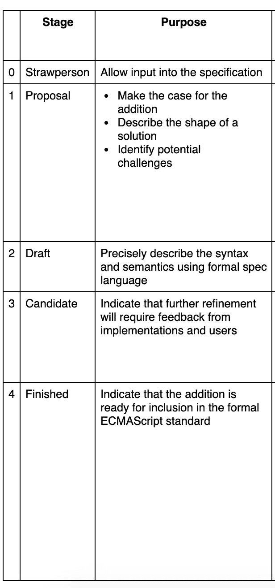

# 即将推出的新 JavaScript 特性— 2019 年、2020 年及以后

> 原文：<https://betterprogramming.pub/new-upcoming-javascript-features-2019-2020-and-beyond-5c426f31ec97>

## 对 JavaScript 语言未来的一瞥

JavaScript 正在发展。每天都有新的语言思想和功能被讨论和提出。TC39 委员会负责 ECMAScript (JavaScript)语言的规范和开发。

TC39 根据共识运作，并在其认为合适的情况下自行决定修改规范。但是，对规范进行更改的一般过程如下。

每个新的语言特性都有四个阶段，每个阶段代表该特性离实现还有多远。第三阶段的特性通常*很快就会实现*——但这并不意味着它们总是会实现！

TC39 流程—[https://tc39.es/process-document/](https://tc39.es/process-document/)

让我们来看看目前正在讨论的最有前景和最令人兴奋的第三阶段功能。

请记住:这些功能中没有一个是最终版本，所有功能都可能会更改。好的一面是，如果一个新的特性要正式实现，我们将已经跟上速度，并且知道如何实现和为什么实现。

 [## 2020 年编程趋势预测

### 预测 2020 年将出现什么编程技术

medium.com](https://medium.com/better-programming/2020-programming-trend-predictions-a5d6b70bec26) 

# 可选链接

当在树状结构中寻找属性值时，通常需要检查中间节点是否存在:

检查用户是否有地址和街道地址

假设我们正在迭代一个数组:

数据循环

如果数据变量是`null`或者`undefined`会怎么样？

我们会得到一个类似`type error: cannot read property ‘data’ of undefined.`的错误，这通常发生在我们通过 API 获取数据，并且在请求完成之前循环数据的时候。

解决方案是通过检查数组长度来检查我们的数据是否存在并且不为空:

"道具检查"

它可以工作，但是很笨重。怎样才能改进上面的代码？你可能听说过诸如 TypeScript 或 Swift 之类的语言有称为 *optionals* 的特性。

# 救援的可选链接

可选的链接操作符允许开发人员处理许多这样的情况，而不用重复它们自己和/或在临时变量中分配中间结果。可选的链接运算符如下所示:

就是这样！一个简单的问号来检查用户是否拥有`address`属性。如果他们有`address`属性，则访问`street`属性。

还记得数据获取的例子吗？我们可以用一个简单的问号来改进代码:

检查数据是否存在，如果存在，映射数据。

可选链接的调用变体对于处理具有可选方法的接口很有用:

可选的链接操作符拼写为`?.`，它可能出现在三个位置:

如果您发现此功能有用，请在此阅读完整规格[。任何人都可以参加讨论。](https://github.com/tc39/proposal-optional-chaining)

 [## tc39/建议-可选-链接

### 现阶段:克劳德·帕切(@claudepache)加布里埃尔·伊森伯格(@the_gisenberg)达斯汀·萨维里(@dustinsavery)看的时候…

github.com](https://github.com/tc39/proposal-optional-chaining) 

# 零融合算子

我知道，多傻的名字啊！不要担心，这听起来很可怕，但事实并非如此。

当执行属性访问时，如果该属性访问的结果是`null`或`undefined`，通常希望提供一个默认值。目前，在 JavaScript 中表达这种意图的典型方式是使用`||`操作符:

这对于常见的`null`和`undefined`值的情况很有效，但是有几个假值可能会产生令人惊讶的结果。

空值合并操作符更擅长处理这些问题，并作为对空值(如`null`或`undefined`)的相等检查

# 句法

如果`??`运算符左侧的表达式计算结果为 undefined 或 null，则返回其右侧的表达式:

以下是 Nullish 合并运算符的一些要点。

1.  只有在需要时才计算`??`的右参数(“短路”)。
2.  `??`的优先级低于`||`。
3.  `??`不能立即包含或被包含在`&&`或`||`操作中。
4.  如果左参数为`null`或`undefined`，则选择右参数。

点击阅读完整规格[。此处](https://tc39.es/proposal-nullish-coalescing/)跳入公众讨论[。](https://github.com/tc39/proposal-nullish-coalescing/issues?q=is%3Aissue+is%3Aopen+sort%3Aupdated-desc)

 [## 零融合算子

### 这个文档指定了零化合并操作符？？。见讲解者的介绍。主要设计…

tc39.es](https://tc39.es/proposal-nullish-coalescing/) 

# BigInt:JavaScript 中的任意精度整数

如果你足够了解 JavaScript，你可能知道 JavaScript 不擅长处理数字。BigInt 是为 JavaScript 改进整数的一种尝试。

`BigInt`是一个新的原语，它提供了一种表示大于 253 的整数的方法，253 是 Javascript 可以用`Number`原语可靠表示的最大数字:

通过将`n`追加到整数的末尾或者通过调用构造函数来创建`BigInt`:

点击查看 BigInt 提案的深度右侧[。如果你懂数学，请反馈给委员会。](https://github.com/tc39/proposal-bigint)

 [## tc39/proposal-bigint

### JavaScript 中的任意精度整数。通过在…上创建帐户，为 tc39/proposal-bigint 开发做出贡献

github.com](https://github.com/tc39/proposal-bigint) 

# 静态类特征

这个提议在先前的[类字段](http://github.com/tc39/proposal-class-fields)和[私有方法](https://github.com/tc39/proposal-private-methods)提议的基础上，为 JavaScript 类增加了三个特性:

*   静态公共字段
*   静态私有方法
*   静态私有字段

希望在类体中声明静态属性会更干净，更好地满足程序员对类用途的期望。

# 私有字段

要使字段私有，只需给它们一个以`#`开头的名称:

# 私有方法和字段

要使方法、getter/setter 或字段私有，也要给它们一个以`#`开头的名称:

注意，这个提议只提供了在字段声明中预先声明的私有字段和方法*。*私有字段不能像普通属性那样通过分配来创建。

也不能在对象文本中声明私有字段或方法。例如，如果您基于对象文本实现您的类，或者向原型添加单独的方法，或者使用类框架，则您不能使用私有方法、字段或访问器。

还有更多的建议，我敦促你们看一看。每个人都有发言权和投票权，你的声音对于塑造 JavaScript 语言的未来至关重要。

点击查看提案的完整列表[。](https://github.com/tc39/proposals)

 [## tc39/提案

### 跟踪 ECMAScript 提案。在 GitHub 上创建一个帐户，为 tc39/建议书的开发做出贡献。

github.com](https://github.com/tc39/proposals) 

如果你想让你的 JavaScript 游戏更上一层楼，我建议你抓住“ [*你不知道的 JS*](https://www.amazon.com/gp/product/B07FK9VBD7/ref=as_li_ss_tl?ie=UTF8&keywords=you%20don't%20know%20js&qid=1565034043&ref_=sr_1_8&s=gateway&sr=8-8&linkCode=ll2&tag=thegeniusde07-20&linkId=a47ad7fb54700cdd883f11d015ac1dcb&language=en_US) ”系列丛书。我发现它很容易理解，也很有用。

感谢阅读，保持敬畏。