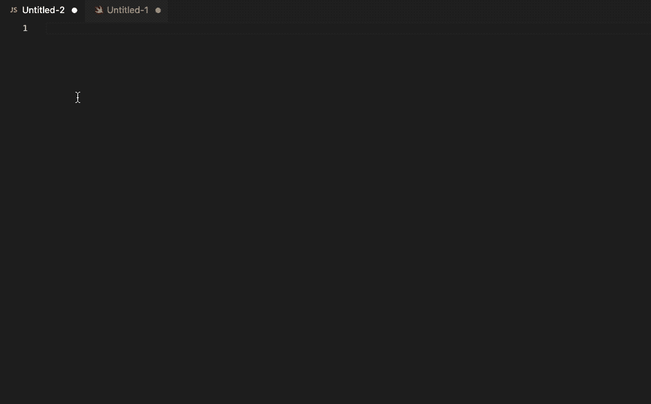
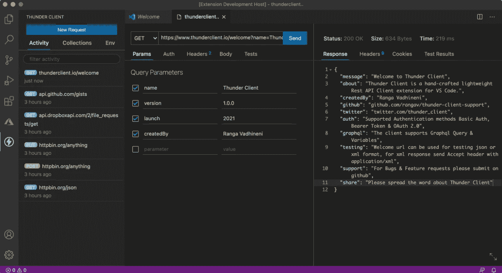
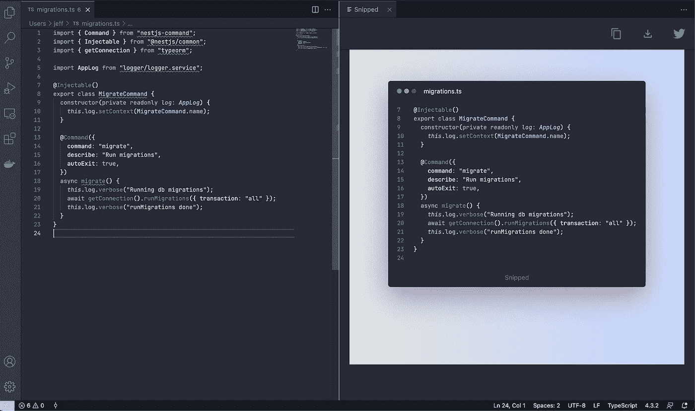
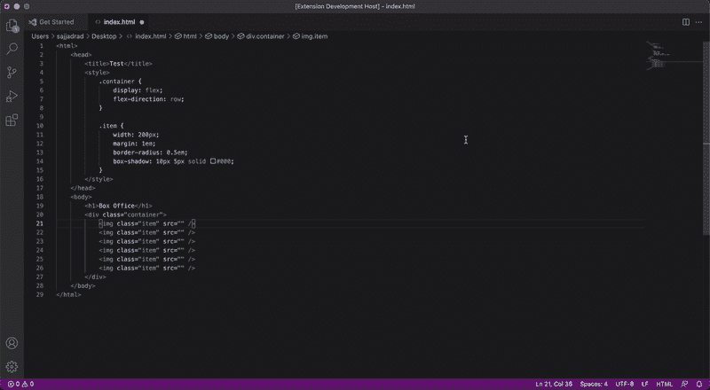
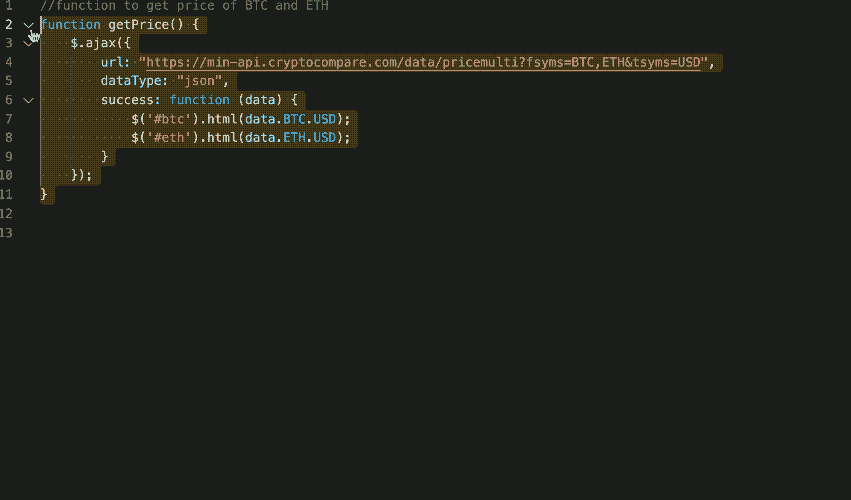
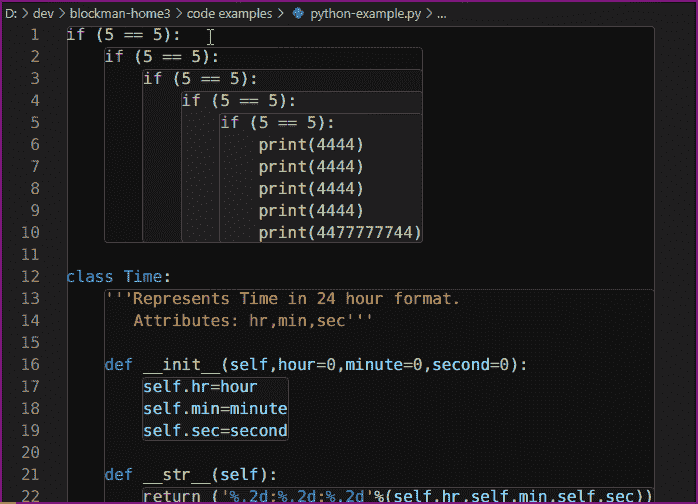
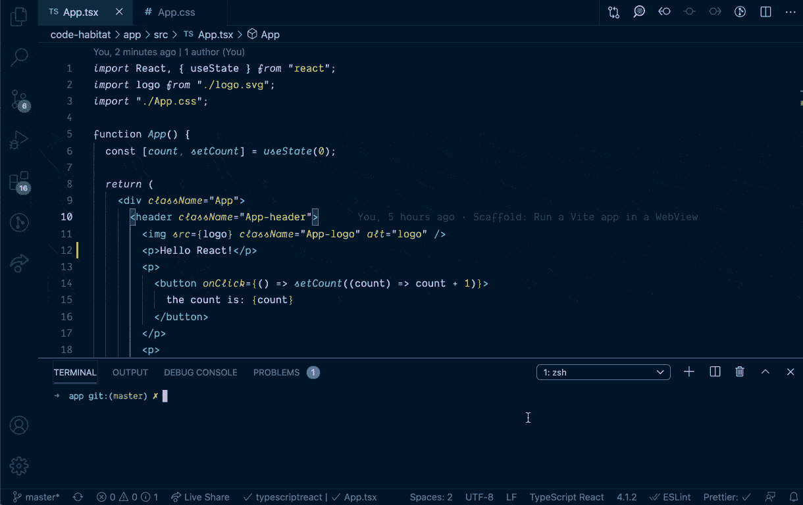

# 2021 年推出 7 款有前途的 VS 代码扩展

> 原文：<https://betterprogramming.pub/new-vs-code-extensions-released-2021-ee34a0b3a03f>

## 过去一年中发布的一些最酷的扩展

截图自[堆栈溢出 2021 年开发者调查](https://insights.stackoverflow.com/survey/2021#worked-with-vs-want-to-work-with-new-collab-tools-worked-want)

Visual Studio 代码无疑是当今最受欢迎的源代码编辑器工具。最近结束的 2021 年栈溢出开发者调查只是重申了微软的 VS 代码日益增长的优势。

这种流行很大程度上是由于它们丰富的扩展库，这使得即插即用第三方 API 变得容易。您还可以创建自己的 [API 扩展](https://code.visualstudio.com/api)，并在 Visual Studio marketplace 上发布它们。

在 2021 年期间，大量新的 VS 代码扩展受到了开发人员的欢迎。我们将浏览一些引起我注意的照片。我希望它有助于提高您的生产力和扩展开发人员的工作流程。

# 1.GitHub 副驾驶

我们必须从 GitHub Copilot 开始——GitHub 和 OpenAI 的 [Codex](https://openai.com/blog/openai-codex/) 创建的流行的人工智能程序员工具，以帮助根据您提供的上下文自动生成代码。

使用 VS 代码或 Jetbrains 的开发人员会很高兴，因为 Copilot 扩展可以为大多数编程语言提供完整的代码块。需要更多吗？你可以从你的 IDE 中与 Copilot 聊天。

首先，你需要下载[GitHub Copilot VS Code extension](https://marketplace.visualstudio.com/items?itemName=GitHub.copilot)，链接他们的 GitHub 帐户，并确保他们已经授权(如果你还没有注册 Copilot，你需要加入等待列表)。

我用 GitHub Copilot 测试了一些流行的 JavaScript 和 Swift 代码片段，结果不错。你可以开始编写一个函数，或者只是添加一个你想要实现的注释 Copilot 会提供一个很好的配方代码。

作者图片

用户可以使用`Option + ]`和`Option + [`在代码建议之间切换，或者使用 Tab 接受完整的代码。

Copilot 带来的可能性是无限的。我设法快速创建函数来检查回文字符串、验证电子邮件、密码以及从 URL 获取 JSON。

尝试询问“比特币和以太坊的当前价格”，Copilot 会几乎实时地生成想要的功能。Copilot 最大的优点是它锁定了几乎所有的代码片段和代码扩展。

# 2.迅雷客户端

API 测试是开发人员日常工作流程的重要组成部分。Postman 是 goto 工具之一，在将 API 端点集成到应用程序中之前，人们可以使用它来测试和验证 API 端点。

然而，通常在使用 VS 代码时，API 测试会导致上下文切换(或者说是应用程序切换)。很高兴， [Thunder Client](https://marketplace.visualstudio.com/items?itemName=rangav.vscode-thunder-client) 通过提供一个轻量级的易用、干净、简单的 Rest API 客户端扩展工具来拯救我们。

Thunder Client 允许您在编辑器中快速测试代码库的 API 端点，从而最大限度地减少切换标签。让我们执行无脚本测试使它成为 Postman 的一个非常有吸引力的替代方案(尽管是一个精简版)。

截图自 [thunderclient.io](https://www.thunderclient.io/)

# 3.剪

我们都喜欢在社交媒体上分享日常工作流程中的代码片段。不是吗？通常，人们会将代码片段复制粘贴到 carbon.now.sh 中，然后导出截图。

很高兴 [Snipped](https://marketplace.visualstudio.com/items?itemName=JeffersonLicet.snipped&ssr=false#overview) 从 VS 代码编辑器中自动为我们完成这项任务。

告别 Twitter 中的复制粘贴代码，因为现在你可以直接在剪贴板中存储代码选择的截图。

[来源](https://marketplace.visualstudio.com/items?itemName=JeffersonLicet.snipped&ssr=false#overview)

# 4.洛林空间

如果你想快速原型化一个包含虚拟内容的 web 应用， [Lorem.space](https://marketplace.visualstudio.com/items?itemName=Manasky.lorem-space) 是理想的 VS 代码扩展。

Lorem.space 是一个随机图像占位符生成器 API，提供不同的类别供选择。

因此，按下`CMD + Shift + P`，从下拉列表中选择 Lorem.space，选择合适的类别(披萨、汉堡、脸或家具)，输入所需的宽度和高度，`lorem.space`将为您生成图像占位符 URL。

[来源](https://marketplace.visualstudio.com/items?itemName=Manasky.lorem-space)

# 5.用于 JavaScript 和类型脚本的 AI 文档编写器

软件开发人员倾向于对编写文档有不同的看法。一些人喜欢它，而另一些人认为它是一种开销。

由 Mintlify 开发的前景看好的 VS 代码扩展， [AI 文档作者](https://marketplace.visualstudio.com/items?itemName=mintlify.document)通过让工具来处理文档，努力使编写文档变得有趣。

只需在 mac 上突出显示代码并按下`Command + .`即可生成该功能的文档。我在 GitHub Copilot 生成的函数上测试了它，结果还不错。

作者图片

看看在函数中选择空格是如何生成截然不同的文档的。

需要谷歌你的代码库吗？Mintlify 搜索引擎是同一团队的另一个 VS 代码扩展。它让您通过用自然语言编写搜索查询来查找代码片段。此外，您可以询问代码的特定部分是做什么的。在撰写本文时，该扩展还处于私有测试阶段。

# 6.布洛克曼

曾经想要突出代码的范围吗？这当然有助于更容易地关注当前的代码块。更重要的是，当你教一个同伴不同的控制流时。

不要担心， [Blockman](https://marketplace.visualstudio.com/items?itemName=leodevbro.blockman) ，一个 VS 代码扩展正如它的名字所暗示的那样:阻止你的代码。Blockman 可以让你改变颜色和深度，切换焦点和做更多的定制。

突出显示盒子中嵌套的代码块非常容易。看看它是如何像一个带有缩进的魔咒一样工作的:

[信号源](https://marketplace.visualstudio.com/items?itemName=leodevbro.blockman)

# 7.活帧

[Live Frame](https://marketplace.visualstudio.com/items?itemName=jevakallio.vscode-live-frame) 是另一个 VS 代码扩展，它允许我们在编辑器中运行和预览 web 应用程序的变化，从而最小化上下文切换。告别 VS 代码和你的浏览器之间的无数切换。

除了有助于提高工作效率，Live Frame 扩展还有助于录制或展示交互式演示教程。

[来源](https://marketplace.visualstudio.com/items?itemName=jevakallio.vscode-live-frame)

目前就这些。感谢阅读。