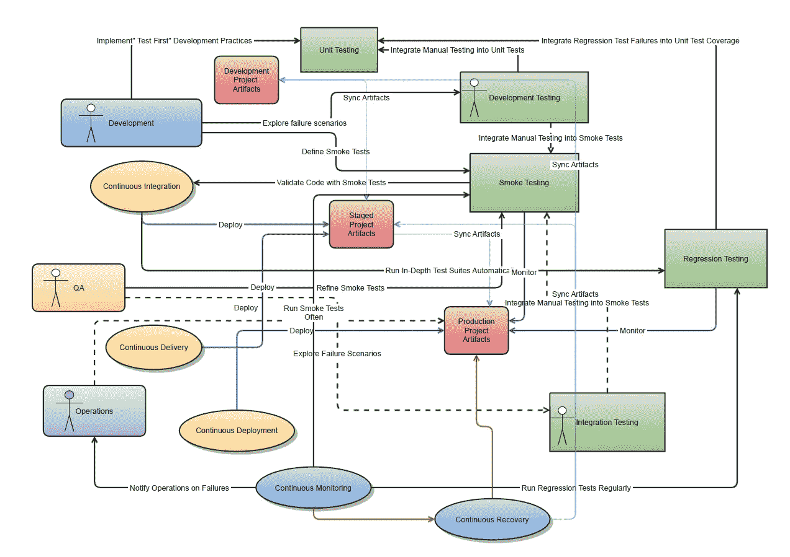
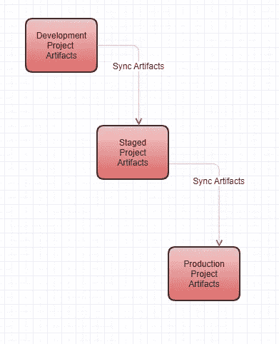
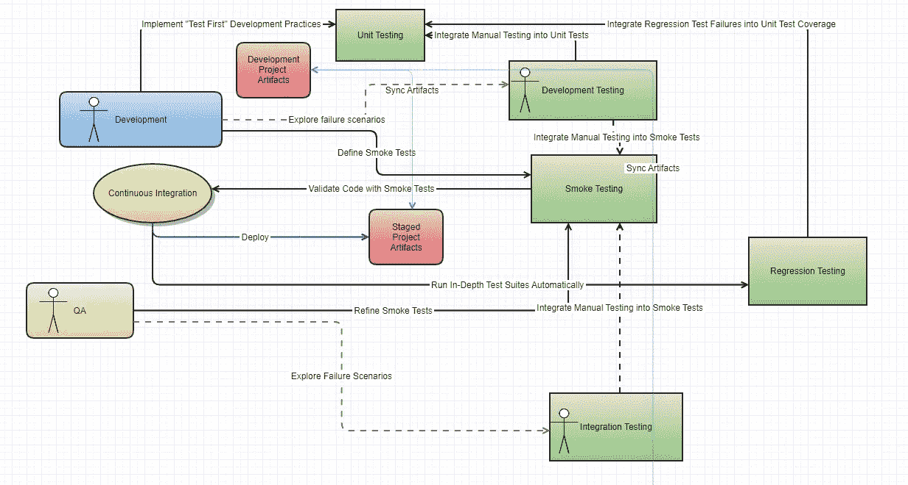
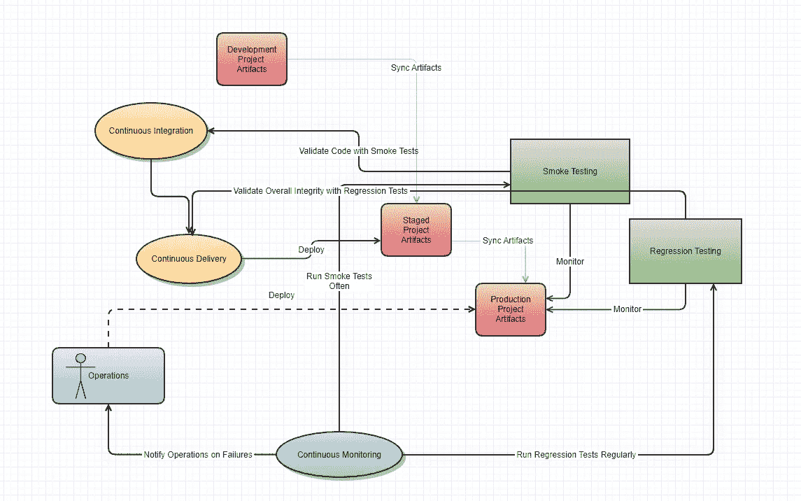
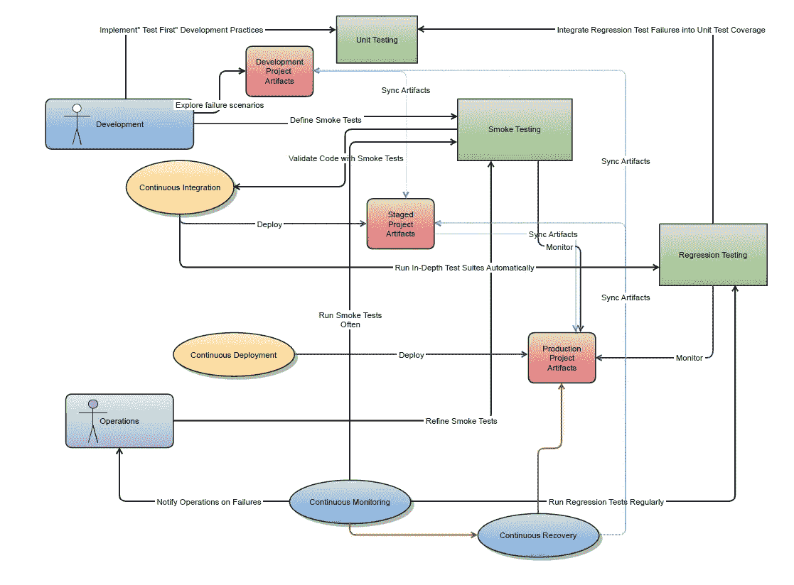

# 新年决心:DevOps 转型

> 原文：<https://betterprogramming.pub/new-years-resolution-a-devops-transformation-aea0e25b4147>

## 让我们今年转变我们的部署流程

史蒂夫·哈拉马在 [Unsplash](https://unsplash.com/s/photos/circle?utm_source=unsplash&utm_medium=referral&utm_content=creditCopyText) 上拍摄的照片

# 为什么是 DevOps？

DevOps 是一种文化转变，将开发和运营结合到一个团队中。自动化框架是成功实施 DevOps 转型的关键支柱。本文详细介绍了在您的堆栈上实现 DevOps 的实际步骤。

问问你自己:

*   我的开发人员是自动还是手动测试他们的特性？
*   我的团队会自动集成他们的功能吗？
*   我们手工交付工件到生产吗？
*   在提升之前，我们是否证明代码自动工作？
*   我们是否不断地证明代码在相同的测试中也能工作？
*   我们是否自动将工作特征发布到生产中？
*   我们能自动恢复生产错误吗？

所有这些阶段都代表了 DevOps 的成熟度。本文为您提供了一种分解 DevOps 自动化组件的方法，并计划让 2021 年成为您的团队实现 DevOps 的新水平的一年。

下图展示了角色、自动化组件和测试类型，用于识别要自动化的阶段和确保成功的策略。

DevOps 基础架构的自动化组件

上图中的黄色圆圈表示核心自动化开发过程。

*   测试优先开发
*   连续累计
*   连续交货
*   持续部署

蓝色圆圈表示核心自动化操作流程。

*   连续监视
*   持续恢复

DevOps 的理想是让一个团队通过支持各种箭头指示的所有交互来拥有整个流。

在本文中，我概述了 DevOps 在 2021 年走向成熟的三个阶段。

# 第一步。自动化开发和集成测试

## 面向开发自动化的测试优先单元测试

当开发人员构建一个新特性时，单元测试和回归测试是自动化的两个目标。

如果你从未读过或尝试过测试优先，那就从 [Ron Jeffries 的优秀参考文献](http://www.extremeprogramming.org/rules/testfirst.html)开始吧。作为一名开发人员，通过首先编写底层功能的测试，然后使测试成功，来集中精力证明您打算实现的代码是有效的。当您在应用程序中组装组件时，复制该过程。通过这样做，您逐渐构建了一组覆盖单元级代码的回归测试。

## 烟雾测试和持续集成

一旦开发人员构建了特性，他们就准备好集成工件了。这就是团队实施冒烟测试的地方。为了理解冒烟测试，问问你自己，“在发布过程中什么会出错？”

工件部署的瀑布

发布过程的每一步都涉及到将工件同步到更广阔的环境中。从开发到阶段，发布会影响其他开发人员，因此我们需要确保新环境中没有任何问题。从舞台环境到生产，发布会影响我们的客户，所以我们需要额外的证据来证明没有任何问题。

人工集成的标志是人工执行烟雾测试任务。例如:

*   点击一个 web 应用程序并检查它是否正确呈现
*   确保运行执行后数据库管道是最新的
*   调用 web API 并确保结果与期望值相匹配

要将您的集成从手工过程转换为持续集成，可以从每次您在环境之间升级工件时自动化冒烟测试开始。

另外，我特意选择了 *sync* 这个词，而不是 *copy* 。在自动化中，动词很重要，而*同步*意味着只有已经改变的工件才会被复制。总是通过只发布变更来最小化意外变更的风险。

## 将自动化测试构建到持续集成中

持续集成中自动化测试的反馈循环对于尽早捕捉缺陷至关重要。在开发中解决的缺陷比在生产中发现的缺陷要便宜得多。

从集成和开发测试中创建冒烟和回归测试

手动部署总是有一个重要的 QA 角色，执行手动测试来发现问题和验证功能。

当您将您的团队发展成自动化的 DevOps 团队时，QA 的角色是通过在代码中实现冒烟和回归测试，而不是作为点击或手动查询，来发展手动集成测试。

# 第二步。持续交付和监控

当您通过自动化 QA 和回归测试解决了质量问题，您就为连续交付和监控做好了准备。正如冒烟和回归测试对于持续集成至关重要一样，持续监控对于持续交付也是必不可少的。

在连续交付中利用冒烟和回归测试

operations actor 拥有经过测试的“准备部署”的工件，并且可以手动发布它们，但是如果没有持续的监控，这里的流程就不是 DevOps。

连续监控是从步骤 1 中的烟雾测试和回归组件中自然产生的。我们有快速冒烟测试，因为这些测试需要运行以将工件传递到阶段。此外，回归测试分阶段运行，并验证了更深层次的功能。然后，我们可以在开发和运营中重用相同的代码——这就是 DevOps 的深层价值点。

# 第三步。持续部署和恢复

至此，您已经实现了成为 DevOps 团队的新年愿望，并准备好开始完整的 DevOps 生命周期:持续部署和恢复。

成熟开发团队的生命周期

如何实现连续恢复将取决于您的堆栈。对于数据库，以下是一些标准方法:

*   [Flyway](https://flywaydb.org/) :详细的变更跟踪和细粒度的恢复
*   [数据库快照](https://docs.aws.amazon.com/AmazonRDS/latest/UserGuide/USER_CreateSnapshot.html):缺点是经常需要一些停机时间来恢复
*   [时间旅行:](https://docs.snowflake.com/en/user-guide/data-time-travel.html)一些像雪花这样的数据库允许时间旅行，所以你可以实现定制的回滚过程

对于 web 和服务应用程序，部署框架提供了丰富的无缝恢复方法:

*   [金丝雀](https://martinfowler.com/bliki/CanaryRelease.html?ref=wellarchitected)
*   [绿色/蓝色](https://aws.amazon.com/quickstart/architecture/blue-green-deployment/)

连续恢复是连续部署的先决条件，因为在自动化部署之前，如果出现问题，您需要自动化回滚。

# 结论

如果您有独立的开发和运营团队，2021 年可能是将您的组织转变为 DevOps 团队的一年。要获得灵感，请观看 AWS 上的[devo PS 简介](https://www.youtube.com/watch?v=wugkTArXBYo)来理解这个概念。

同样，DevOps 适用于任何开发产品的团队。DevOps 团队可以是一组拥有生产分析系统的数据科学家，也可以是一个构建消费者网站的网络团队。从根本上说，这是一种敏捷和持续交付的文化。