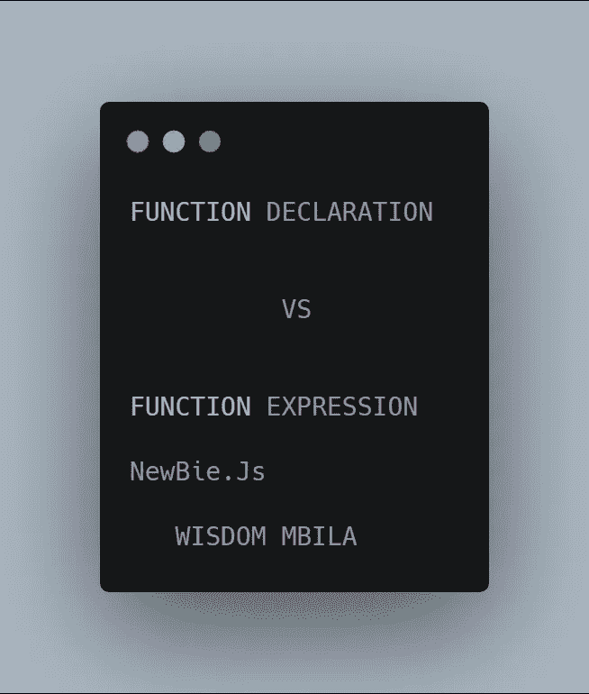
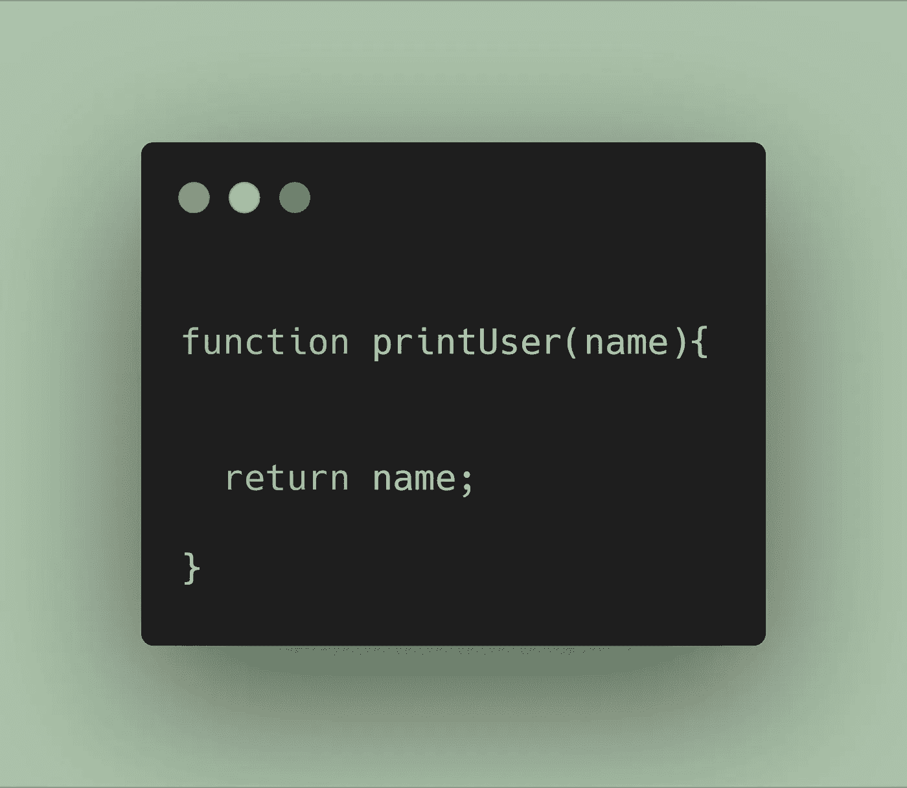
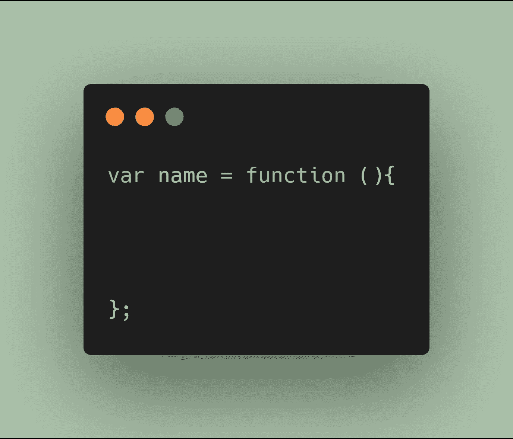
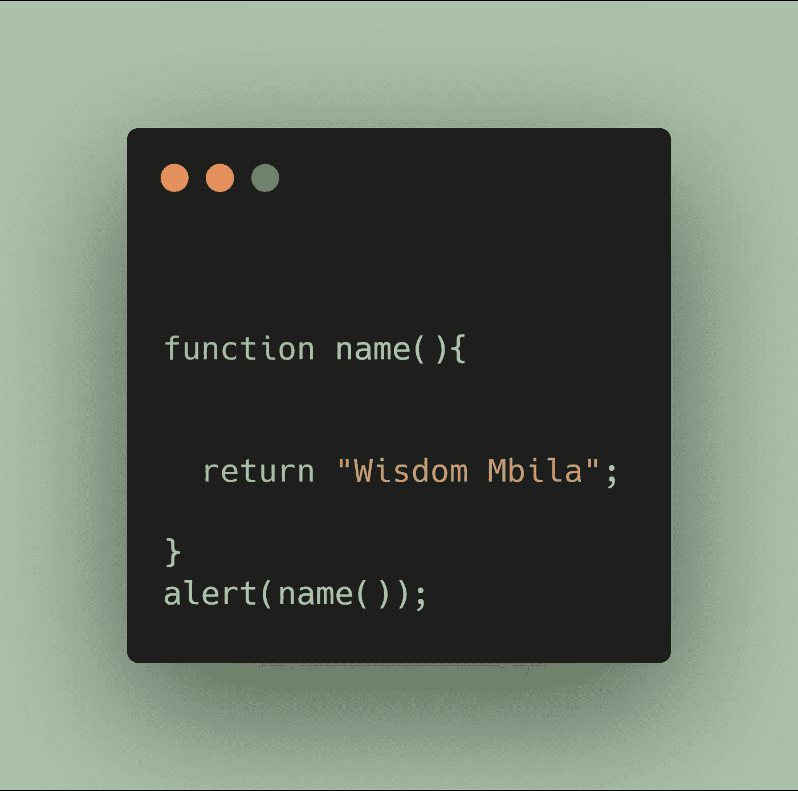

# Newbie.js:函数声明与函数表达式

> 原文：<https://betterprogramming.pub/newbie-js-function-declaration-vs-function-expression-a3ae67573270>

## 解释差异以及何时使用它们

用 [https://carbon.now.sh](https://carbon.now.sh/) 创建

编写代码块的 JavaScript 开发范围给新手 JS 开发者带来了很多困惑，包括一些中级开发者关于函数声明类型/函数表达式的使用。

在本文中，我们将讨论:

1.  什么是函数声明/表达式？
2.  函数声明与表达式。
3.  何时使用它们。

# 什么是函数声明？

函数是一组共同执行任务的语句。

函数声明告诉 JavaScript 引擎函数的名称、返回类型和参数。当一个函数被声明时，它可以在类或开发范围内的任何时候被调用。

声明一个*函数*，必须以`function name()`开头，就像变量声明必须以`Var`开头一样。

# **什么是函数表达式？**

JavaScript 函数也可以使用*表达式*来定义。

正如我们在 JavaScript 中所知道的，表达式是语句中计算值的一部分。

当一个函数表达式被保存在一个*变量* ( `Var`、`let`、`const`)中后，该变量就可以作为一个函数使用了。

存储在变量中的函数不需要函数名。它们总是使用变量名来调用。

[https://youtu.be/bwsSnoBW8wA](https://youtu.be/bwsSnoBW8wA)

# **函数声明与函数表达式**

它们实际上非常相似。你如何称呼他们是完全一样的。区别在于浏览器如何将它们加载到执行上下文中。

1.  声明:函数声明在任何代码执行之前加载。
2.  表达式:函数表达式只有在解释器到达那一行代码时才加载。
3.  声明:类似于`var`语句，函数声明被提升到其他代码的顶部。
4.  表达式:函数表达式没有被提升，这允许它们从定义局部变量的作用域中保留一个副本。

# 何时使用它们

使用函数声明，很少有(如果有的话)情况下不能使用赋给变量的函数表达式。

但是，如果您必须使用函数声明，如果您将它们放在它们所属的作用域的顶部，将会最小化混乱。我绝不会将函数声明放在`if`语句中。

函数表达式变得比函数声明更有用有几种不同的方式:

*   作为结束。
*   作为其他函数的参数。
*   作为立即调用的函数表达式(IIFE)。

# 资源

*   [中等](https://medium.com/@mandeep1012/function-declarations-vs-function-expressions-b43646042052)
*   [堆栈溢出](https://stackoverflow.com/questions/1013385/what-is-the-difference-between-a-function-expression-vs-declaration-in-javascrip)
*   [JavaScriptWeBlog](https://javascriptweblog.wordpress.com/2010/07/06/function-declarations-vs-function-expressions/)