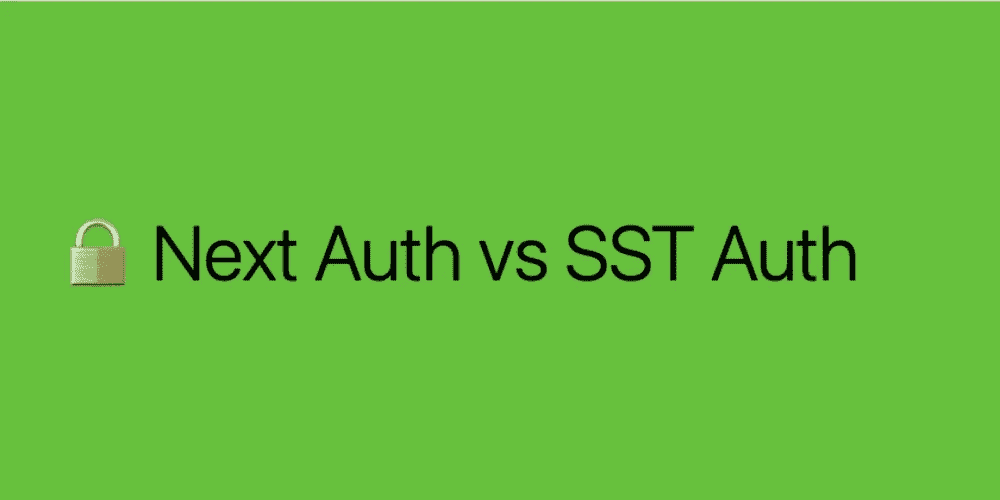

# NextAuth.js 与无服务器堆栈身份验证—并列比较

> 原文：<https://betterprogramming.pub/next-auth-vs-sst-auth-d5675b6c5b7b>

## 比较实施、部署等的容易程度



作者图片

在上一篇文章中，我描述了如何使用 [SST Auth](https://sidoine.org/oauth-with-serverless-using-sst/) 构造为您的应用程序实现 OAuth 认证工作流。

[Next.js](https://nextjs.org/) ，React 生产框架，也提供了一个名为 [NextAuth.js](https://next-auth.js.org/) 的组件，可以用来实现这样的认证系统。让我们来比较两种解决方案！

# 什么是 SST Auth？

SST 是一个最初设计用来构建后端无服务器应用的框架。我已经写了几篇关于这个解决方案的文章(例如，这里的[这里的](https://sidoine.org/sst-the-most-underrated-serverless-framework-you-need-to-discover/)和[这里的](https://sidoine.org/sst-the-most-underrated-serverless-framework-you-need-to-discover/))。它还提供了部署 web 应用程序的特性(例如，通过 [StaticSite](https://docs.sst.dev/constructs/StaticSite) 构造)，所以它被宣传为构建全栈无服务器应用程序的工具。

[Auth](https://docs.sst.dev/auth) 模块是 SST 团队构建的一组专用组件，用于在您的应用程序内部实现一个身份验证系统。它与 React 应用程序这样的 web 应用程序配合得很好。

# 什么是 NextAuth.js？

[Next.js](https://nextjs.org/) 可能是目前最著名的基于 React 的框架，在过去几年中获得了很多关注。如今的版本 13 是真正的全栈框架解决方案，支持服务器端渲染选项和 API 层。可以查一下，比如 [Theo Browne video: Next.js 是后端框架](https://www.youtube.com/watch?v=W4UhNo3HAMw)很好的介绍了后端部分。

[NextAuth.js](https://next-auth.js.org/) 是一个独立的库(不受 Vercel 支持)，它的座右铭是:“对 Next.js 进行身份验证”，它提供了一个内置的解决方案来实现基于 OAuth 协议的 Next.js 的身份验证系统。

你知道演员。现在，是时候进行比较了。让我们战斗吧😇。


# 第一轮:支持的适配器/提供商！

如今，认证不仅仅是电子邮件密码凭证。更多的是像谷歌、脸书或 GitHub 这样的社交登录。对应用程序开发人员来说更安全(不再需要存储密码！)和应用程序最终用户(无需记住新密码！).让我们检查一下我们的两个选择支持什么。

首先，SST Auth 今天(2022 年 11 月)[支持开箱即用的七个适配器](https://docs.sst.dev/auth#adapters) : Google、GitHub、Twitch、脸书、Magic Link、OAuth 和 OIDC。最后两个是通用适配器，可用于支持 [OAuth2](https://oauth.net/2/) 或 [OIDC](https://openid.net/connect/) 的任何应用。最后，如果没有适合您的需求，可以选择构建一个定制适配器[。例如，在这篇](https://docs.sst.dev/auth#custom-adapters)[上一篇文章](https://sidoine.org/oauth-with-serverless-using-sst/)中，我构建了一个自定义适配器来支持 SmugMug，它依赖于 OAuth 1.0a 协议。

NextAuth.js 支持超过 [20 个提供者](https://next-auth.js.org/providers/)开箱即用:经典的如谷歌、脸书和 GitHub 都在这里，但是比 SST Auth 有更多的选择。还有一个 [email](https://next-auth.js.org/configuration/providers/email) 提供者(可以比作 SST Auth 上的 Magic Link one)或者一个[自定义提供者](https://next-auth.js.org/configuration/providers/oauth#using-a-custom-provider)。最后，如果您需要通过用户名、密码或其他任意凭证(例如 YubiKey)登录，那么[凭证](https://next-auth.js.org/configuration/providers/credentials)提供程序是理想的选择。

与 SST Auth 相比，使用 NextAuth.js 有更多现成的选项。但是如果需要的话，这两种解决方案都可以为您提供定制。

# 第 2 轮:易于实施

认证是一个[严肃的](https://cheatsheetseries.owasp.org/cheatsheets/Authentication_Cheat_Sheet.html)课题，你不会想依赖一个你 100%不信任的系统。这就是为什么理解如何实现解决方案以及理解和调整它有多容易是很重要的。

让我们来看看 SST Auth:

*   首先需要在基础设施栈中添加`Auth`构造(通常是`stacks/MyStack.ts`文件)

```
import { Auth } from "@serverless-stack/resources";

const auth = new Auth(stack, "auth", {
  authenticator: {
    handler: "functions/auth.handler",
  },
});

auth.attach(stack, {
  api: myApi,
  prefix: "/auth", // optional
});ty
```

*   然后您可以在`src/functions/auth.ts`中构建一个新的无服务器函数，它将负责所有的认证调用(例如，OAuth2 的`authorize`和`callback`端点):

```
import { AuthHandler, GoogleAdapter } from "@serverless-stack/node/auth";

export const handler = AuthHandler({
  providers: {
    google: GoogleAdapter({
      mode: "oidc",
      clientID: "XXXX",
      onSuccess: async (tokenset) => {
        return {
          statusCode: 200,
          body: JSON.stringify(tokenset.claims()),
        };
      },
    }),
  },
});
```

这个示例案例(来自[认证文档](https://docs.sst.dev/auth#add-a-handler))正在创建一个基于 Google SignIn 的认证系统。它将公开两个端点:

*   `/auth/google/authorize`
*   `/auth/google/callback`
*   最后，由您的前端应用程序(例如 React)将用户重定向到`autorize`后端端点(这将启动 OAuth2 流)。

现在让我们放大一下 NextAuth.js:

*   首先，您需要在 Next.js 项目中安装 NextAuth.js:

```
yarn add next-auth
```

*   然后，您必须在设计的`pages/api/`文件夹中的下一个项目中创建一个新的 API。因此，创建一个名为`pages/api/auth/[...nextauth].js`的文件，内容如下:

```
import NextAuth from "next-auth"
import GoogleProvider from "next-auth/providers/google"
export const authOptions = {
  // Configure one or more authentication providers
  providers: [
    GoogleProvider({
      clientId: process.env.GOOGLE_ID,
      clientSecret: process.env.GOOGLE_SECRET,
    }),
  ],
}
export default NextAuth(authOptions)
```

这个 API 代理端点完全等同于为 SST 创建的`auth.ts`。NextAuth.js 将负责为`authorize`和`callback`创建多个端点来支持 OAuth2。

*   那么建议在应用程序的顶层实现`SessionProvider`(在`pages/_app.jsx`):

```
import { SessionProvider } from "next-auth/react"
export default function App({
  Component,
  pageProps: { session, ...pageProps },
}) {
  return (
    <SessionProvider session={session}>
      <Component {...pageProps} />
    </SessionProvider>
  )
}
```

*   最后，使用 NextAuth.js 提供的专用方法允许最终用户登录或注销:

```
import { useSession, signIn, signOut } from "next-auth/react"
export default function Component() {
  const { data: session } = useSession()
  if (session) {
    return (
      <>
        Signed in as {session.user.email} <br />
        <button onClick={() => signOut()}>Sign out</button>
      </>
    )
  }
  return (
    <>
      Not signed in <br />
      <button onClick={() => signIn()}>Sign in</button>
    </>
  )
}
```

本文不会深入讨论实现，但是每个解决方案都提供了一个会话系统来检索前端和后端的用户数据。也有可能阻止未经认证的用户访问。

总结这一点，两种解决方案都足够简单，可供前端开发人员使用，并且不需要大量代码。提供的文档也非常完整。打平了！

# 第三轮:存储用户相关信息！

一旦实现了身份验证，您可能需要存储一些与每个用户相关的信息。例如，profile 部分需要持久化，或者任何与您的精确业务案例相关的信息。同样，这两种解决方案都有一个解决方案。

对于 SST Auth，依赖于一个独特的 SST 构造[表](https://docs.sst.dev/constructs/Table)是相当自然的，它依赖于 AWS DynamoDB。通过实现每个适配器中可用的`onSuccess`方法，可以将用户数据存储在 DynamoDB:

```
export const handler = AuthHandler({
  providers: {
    smugmug: SmugMugAdapter({
      clientId: process.env.SMUGMUG_CLIENT_ID!,
      clientSecret: process.env.SMUGMUG_CLIENT_SECRET!,
      onSuccess: async (user: SmugMugUser) => {
        const ddb = new DynamoDBClient({});
        await ddb.send(
          new PutItemCommand({
            TableName: Table.users.tableName,
            Item: marshall(user),
          })
        );

        return Session.parameter({
          redirect: process.env.IS_LOCAL
            ? "http://127.0.0.1:3000"
            : ViteStaticSite.site.url,
          type: "user",
          properties: {
            userID: user.userId,
          },
        });
      },
    }),
  },
});
```

*示例取自* [*OAuth，无服务器使用 SST*](https://sidoine.org/oauth-with-serverless-using-sst/)

使用 NextAuthjs，可以实现一个[适配器](https://next-auth.js.org/adapters/overview)

**注意** : NextAuthjs 适配器不同于 SST Auth 适配器！

有十多个选项，包括 DynamoDB、Firebase、Prisma、FaunaDB……让我们在这里放大 DynamoDB 适配器:

*   安装相应的适配器:

```
yarn add next-auth @next-auth/dynamodb-adapter
```

*   在`pages/api/auth/[...nextauth].js`中编辑您现有的 API:

```
import { DynamoDB } from "@aws-sdk/client-dynamodb"
import { DynamoDBDocument } from "@aws-sdk/lib-dynamodb"
import NextAuth from "next-auth";
import Providers from "next-auth/providers";
import { DynamoDBAdapter } from "@next-auth/dynamodb-adapter"

const config: DynamoDBClientConfig = {
  credentials: {
    accessKeyId: process.env.NEXT_AUTH_AWS_ACCESS_KEY as string,
    secretAccessKey: process.env.NEXT_AUTH_AWS_SECRET_KEY as string,
  },
  region: process.env.NEXT_AUTH_AWS_REGION,
};

const client = DynamoDBDocument.from(new DynamoDB(config), {
  marshallOptions: {
    convertEmptyValues: true,
    removeUndefinedValues: true,
    convertClassInstanceToMap: true,
  },
})

export default NextAuth({
  providers: [
    Providers.Google({
      clientId: process.env.GOOGLE_ID,
      clientSecret: process.env.GOOGLE_SECRET,
    }),
  ],
  adapter: DynamoDBAdapter(
    client
  ),
});
```

在这里您将获得关于适配器[的更多信息。注意，在使用 DynamoDB 表之前，您需要创建它(NextAuth.js 不处理资源的创建)。](https://next-auth.js.org/adapters/dynamodb)

两种解决方案都实现了存储与用户相关的信息的选项。SST 依赖于构造，NextAuth 依赖于适配器。SST 是一个更加集成的解决方案，因为它将处理资源创建(代码内置的基础设施)。又没有明显的赢家了！

# 第 4 轮:部署选项！

现在是时候发布您的应用程序了！每个解决方案的流程有多简单？让我们找到它！

SST Auth 是 SST 的一部分。这个无服务器框架是为 AWS 设计的。因此，如果您依赖于这个特定的云提供商，这将是最好的，但它有一个专用的 CLI 命令来推送您的应用程序。正如[所记录的](https://docs.sst.dev/quick-start#4-deploy-to-prod)，这个命令将把你的应用程序发送到天堂云:

```
yarn deploy --stage prod
```

> 建议为生产环境使用特定的阶段，因为 SST 被设计为使用多个实例:当您在应用程序上开发时，您使用的是具有强大的 [Live Lambda 开发](https://docs.sst.dev/live-lambda-development)模式的独特阶段(如 dev)。

关于 NextAuth.js，您必须部署一个 Next.js 应用程序。这里的捷径是在 Next.js 的创建者 [Vercel](https://vercel.com/) 上部署你的应用程序。它有一个慷慨的免费层，开箱即用:用 GitHub 自动部署，预览部署，等等。但是 Next.js 应用程序也可以部署在许多其他提供者中。对于您自己的受管节点服务器到无服务器的部署，选择正确的部署取决于您！完整列表见 [Next.js 文档页面](https://nextjs.org/docs/deployment)。

> 让我们提一下，使用 SST 部署 Next.js 应用程序是可能的😅。
> 这个设置依赖于 [serverless-next.js](https://github.com/serverless-nextjs/serverless-next.js) 项目，它隐藏在一个名为 [NextJsSite](https://docs.sst.dev/constructs/NextjsSite) 的构造后面。当您想要在 AWS 环境上发布应用程序时，它可能是一个非常有效的解决方案(我在当前公司的生产工作负载中使用它)。

总结本节，SST 的设计在部署中更受限制(仅 AWS)。对于 Next.js，经典的方式是依赖于 Vercel，但也有其他选择(包括 AWS 上的 SST 本身)。

# 结论

比较不同类别的工具是不公平的！但是我认为有时比较特定的特性(这里是身份验证)是有用的，因为两个解决方案中的实现非常相似。

当您需要构建一个必须依赖多个 AWS 服务的应用程序时，SST 是一个非常好的选择；可以将基础设施定义为代码，然后使用一个[队列](https://docs.sst.dev/constructs/Queue)、一个[桶](https://docs.sst.dev/constructs/Bucket)和一个[数据库](https://docs.sst.dev/constructs/RDS)，仅举几个例子。这是这里最具扩展性的解决方案。在这里阅读我对 SST 的介绍: [SST 是你需要发现的最被低估的无服务器框架](https://sidoine.org/sst-the-most-underrated-serverless-framework-you-need-to-discover/)

NextAuth.js 只是一个库，使用这个解决方案可以更快地在现有的 Next.js 应用程序中添加身份验证层。这是这里集成程度最高的解决方案。

我建议在这里试用这两种解决方案，并在 [Twitter](https://twitter.com/_julbrs) 上给我你的反馈(如果你读它的时候它还在运行！).

*原载于*【https://sidoine.org】