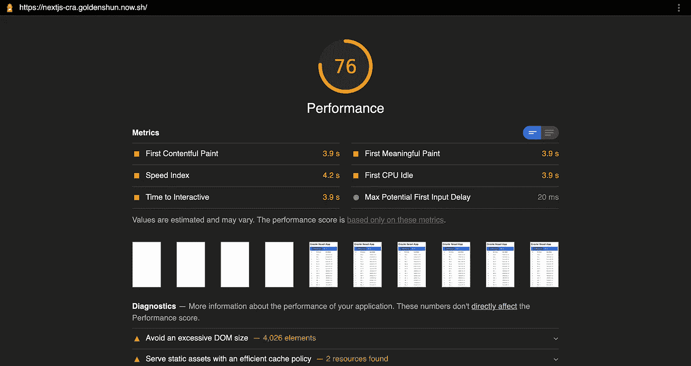
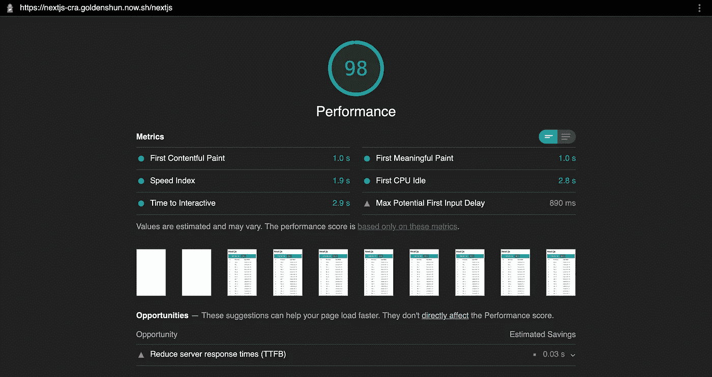

# Next.js for React:为什么你现在应该尝试一下

> 原文：<https://betterprogramming.pub/next-js-for-react-why-you-should-give-it-a-try-right-now-e3b1886e4f20>

## 我们生活在服务器端渲染的时代。Next.js 在这方面很棒。这里有几个你应该去看看的理由。


图片由 [Kolleen Gladden](https://unsplash.com/@rockthechaos) 在 [Unsplash](https://unsplash.com/photos/ij5_qCBpIVY) 上拍摄

React.js 和其他前端库和框架早已成为现代 web 开发的规范——事实上，随着 React Native 等技术的出现，React 甚至扩展到了移动应用的开发。

当然，开发仍在继续，甚至有更新的技术可用，包括新的框架和库，旨在使我们的工作与原来的更好。例如，对于 [React.js](https://reactjs.org/) ，有框架 Gatsby 和 Next.js，我们现在将讨论后者。

# Next.js 是什么——它的目的是什么？

Next.js 是一个 React.js 框架，用于各种目的。Next.js 最初设计用于在服务器端呈现 React 应用程序，现在允许您生成静态页面并在应用程序中使用 AMP。它可以很容易地连接到 Node.js 以了解其生产状态。

Next.js 和我们知道的 React.js 非常相似。当然，您以不同的方式建立了下一个项目，但是最终您编写了 React 代码。Next 会为我们完成剩下的工作。

由于这种简单性和可以让任何 React 项目稍微好一点的强大功能，我认为没有理由忽视 Next.js。

# 开始使用 Next

*   为您的下一个项目创建一个空文件夹。在其内部，键入:
    `yarn init -y
    yarn add react react-dom next
    mkdir pages`
*   在`pages`文件夹中，我们将创建下一个应用程序的所有页面。到目前为止，你的项目文件夹应该是这样的:
    ├──`package.json`
    ├──`pages`
    │└──`index.js`
    └──`yarn.lock`
*   现在，我们需要调整我们的`packages.json`文件，就像这样:

```
“scripts”: {
  “dev”: “next”,
  “build”: “next build”,
  “start”: “next start”,
  “export”: “next build && next export”
}
```

正如您应该能够看到的，现在我们可以运行`yarn run dev`来启动我们的开发服务器。

为了构建生产版本，我们可以运行`yarn run build`和`yarn start`来运行我们的生产服务器。

但是我们也可以用 Next 用`yarn run export`创建一个静态网站。在本文的后面，我们将会看到这一点。

# 更好的性能

当比较服务器端呈现(SSR)和客户端呈现(CSR)时，通常首先给出支持 SSR 的论点，客户端呈现是 React.js 的标准。而且说白了:是的，很多情况下，SSR 页面都比客户端快。

这也是相对符合逻辑的，但要理解它，我们需要看看是什么使这两种方法不同。

## 企业社会责任模式

1.  服务器用 HTML 样板文件响应来自浏览器的请求。
2.  这个 HTML 中的少数几样东西之一是包含的 JavaScript 文件。
3.  这个 JavaScript 文件包含 React.js 和我们编写的 React 代码。
4.  在浏览器识别出 HTML 中的链接后，它还必须加载并处理 JavaScript 文件。
5.  浏览器现在运行 React 和我们的 React 代码。我们网站的渲染就是这样开始的。
6.  渲染生成实际的 HTML 代码，用内容填充我们最终的网站。浏览器必须在渲染后显示这一点。

## SSR 的模式

1.  服务器用我们需要在网站上显示的完整 HTML 代码来响应浏览器的请求。
2.  呈现并显示 HTML 代码。页面已经可见。
3.  之后(或同时)，浏览器加载 JavaScript 文件(与 CSR 变体相比，该文件较小)。
4.  浏览器执行 React 和我们的 React 代码，这些代码只包含组件背后的逻辑。
5.  现在，页面不仅是可见的，而且是可交互的。

我觉得应该明确，CSR 对于同样的结果，需要付出更多的努力。

## 但是现在让我们来看一个实际的比较

为了进行比较，我使用了两个实际上完全相同的现有 web 应用程序。
一个完全用 Next.js 实现(即用 SSR)，一个用 React.js 实现(即用 CSR)。

**注意:**这两个 web 应用程序是专门为比较 SSR 和 CSR 而开发的，因此是性能差异的极端例子——然而它们是演示的理想选择。

## 首先，React.js 版本:



对[https://nextjs-cra.goldenshun.now.sh/](https://nextjs-cra.goldenshun.now.sh/)的 Chrome 审计

## 其次，对 Next.js 进行同样的审计:



Chrome 审计:[https://nextjs-cra.goldenshun.now.sh/nextjs](https://nextjs-cra.goldenshun.now.sh/nextjs)

## 有什么值得注意的

在带有 React 的客户端版本中，可见网站的更长时间是明显可见的。这本身并不令人惊讶，但特别是在这个例子中，不同的油漆之间的差异，正如他们在审计中所称的那样，是显著的。

然而，不同的是网站互动的持续时间。在这里，Next.js 并没有领先太多。然而，如果你考虑到网站之前已经呈现给用户，Next.js 显然提供了更好的用户体验。所以这个例子中最明显的赢家是 Next.js。

# AMP 构建页面

*AMP* 代表*加速移动网页*，是为加速移动设备上的网站而制造的。

它提供了自己的 HTML 标签。此外，只支持文档头部区域的 CSS。

通过这项技术，移动设备上网站的加载和渲染时间应该会减少。虽然一开始将你的 web 应用程序切换到 AMP 可能看起来很复杂，但 Next.js 提供了我们需要的一切——并从我们手中拿走了很多工作。

## 让我们来看一个代码示例:

```
export const config = { amp: true }export default function Index(props) {
  return <p>Welcome to the AMP only Index page!!</p>
}
```

当你检查网站的来源时，你应该会看到一些差异，如果我们没有激活 AMP，这些差异就不会存在。

```
<body class="amp-mode-mouse" style="opacity: 1; visibility: visible; animation: none;">
  <!-- __NEXT_DATA__ -->
  <p>Welcome to the AMP only Index page!!</p>
</body>
```

在当前设置`{ amp: true }`的情况下，AMP 页面始终会发送给用户。

但是我们也可以建立 AMP 的混合使用:

```
import { useAmp } from ‘next/amp’export const config = { amp: ‘hybrid’ }export default function Index(props) {
  const isAmp = useAmp()
  return <p>{isAmp ? ‘AMP’ : ‘normal’}</p>
}
```

现在，我们可以在 URL 中的`/?amp=1`下访问该页面的 AMP 版本。

在 AMP 路线下，`AMP`应该显示给用户。如果只是查普通版，应该会看到`normal`。那是因为当我们看到 AMP 版本时，`isAmp`将会是`true`。

> "`useAmp()`是一个钩子，用于知道是否有任何组件(不仅仅是页面)被用于 AMP。"
> 
> — Next.js [文档](https://nextjs.org/learn/excel/amp/hybrid-amp)

# Easy Node.js 实现

我们需要为 Node.js 应用程序创建一个可运行的文件。姑且称之为`server.js`。所以我们的设置现在看起来像这样:

├──`package.json`
├──`pages`
│└──`home.js`
├──`server.js`
└──`yarn.lock`

对于整个应用程序的 Node.js 端，我们将使用 Express.js。如您所见，我们在`pages`文件夹中只有一个文件，`home.js`。像在 Next.js 中一样，这当然应该可以在`/home`下访问。在这个文件中，我们只显示这是一个 Next.js 页面的消息:

```
export default () => (
  <p>Next.js site</p>
)
```

如果我们已经设置了`unequal production` ，那么我们仍然处于 Next.js 开发模式，在这里我们可以进行实时修改:
`const dev = process.env.NODE_ENV !== "production"`

如果我们已经将其设置为`production`，在我们可以从我们的节点应用程序(`server.js`)使用我们的 Next.js 应用程序之前，我们需要运行纱线构建:
`const dev = process.env.NODE_ENV === "production"`

最后，当然，您应该总是设置生产模式，并因此再次执行构建过程。一旦你完成了这些，你就可以像往常一样用 Node.js 运行`server.js`和`node server.js`。

如果你现在给`localhost:8080`打电话，你应该会看到我们 Express.js app 的回应。如果调用`localhost:8080/home`，Next.js 会照常处理请求，并且会渲染输出`pages`文件夹中的`home.js`文件。

# 创建静态页面

当我们通常谈论 SSR 时，我们指的是我们有一个活动的后端，它理论上可以根据每个请求在服务器上完整地呈现页面，然后将其作为服务器端呈现发送给用户。

实际上，在 Next.js 中，每次我们使用 Next.js 提供的`getServerSideProps`函数时，页面都会呈现在服务器上。

有了它，在呈现页面并将其发送给用户之前，我们可以在后端获取一个 API，并将从中获取的数据嵌入到我们的前端，而最终用户不会注意到 API 调用。
点击阅读更多关于`getServerSideProps` [的内容。](https://nextjs.org/docs/basic-features/pages#server-side-rendering)

只有在这种情况下，随着每个请求在服务器上重新呈现页面才是合理的——否则，我们会浪费处理能力。

此外，即使我们想部署下一个应用程序，我们也需要一个合适的后端来集成我们的应用程序。

但是如果我们的网站是静态的，我们想把它上传到一个简单的网络空间呢？

然后，我们可以将 Next.js 应用程序完全呈现为静态文件。这意味着我们获得了所有页面所需的 HTML 文件——功能中包含的 JavaScript 文件，当然还有所有的 CSS 文件。它是这样工作的:

*   如上面的设置所示，我们需要在我们的`package.json`中为此创建一个脚本:`"export": "next build && next export"`。
*   现在，我们可以运行`yarn run export`，我们的 Next.js 应用程序的生产版本就创建好了。然后直接转换成静态页面。
*   因此，我们将看到一个`out`目录，包含我们的整个静态应用程序。在目录中，我们应用程序的每个页面都将有一个 HTML 站点。
    ├──`out`│├──`404.html`t11】│└──`home.html`├──`package.json`t13】├──`pages`
    │└──`home.js`
    ├──`server.js`
    └──`yarn.lock`

最后，我们只需将文件夹的内容上传到我们的网络空间，就大功告成了。