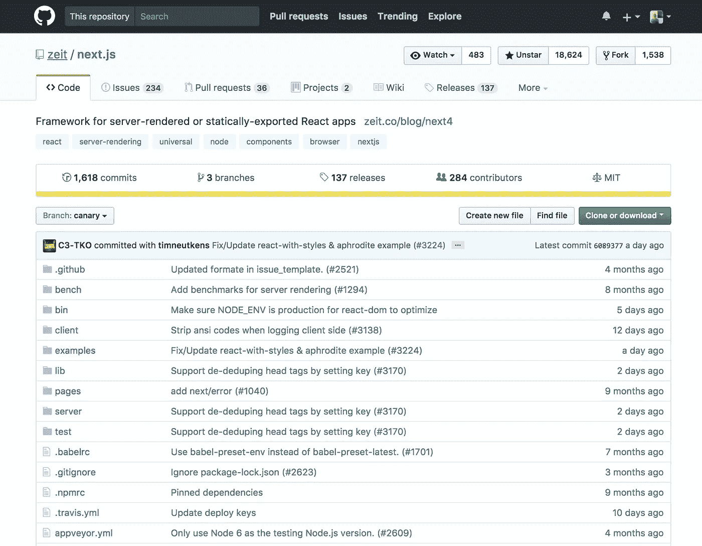
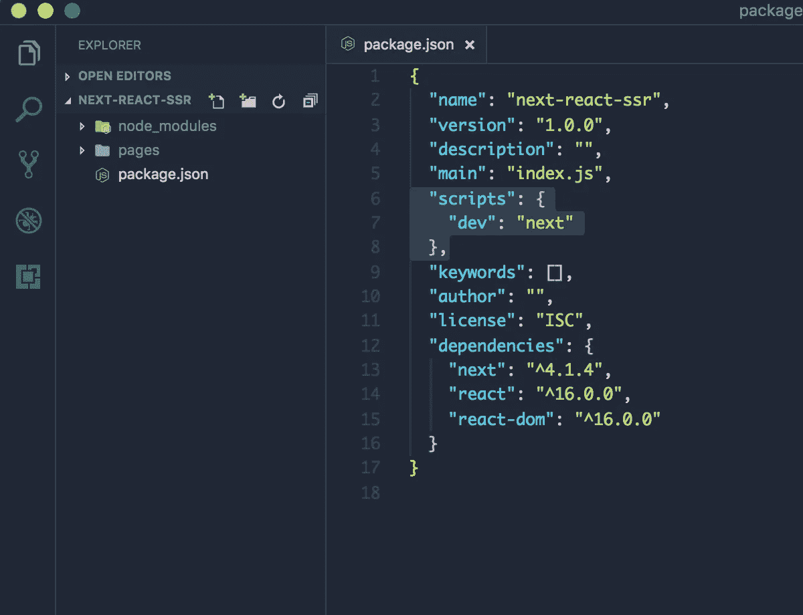
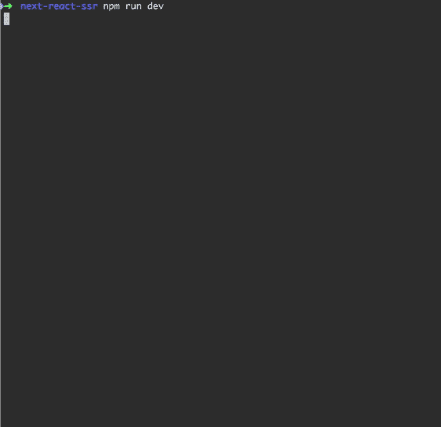
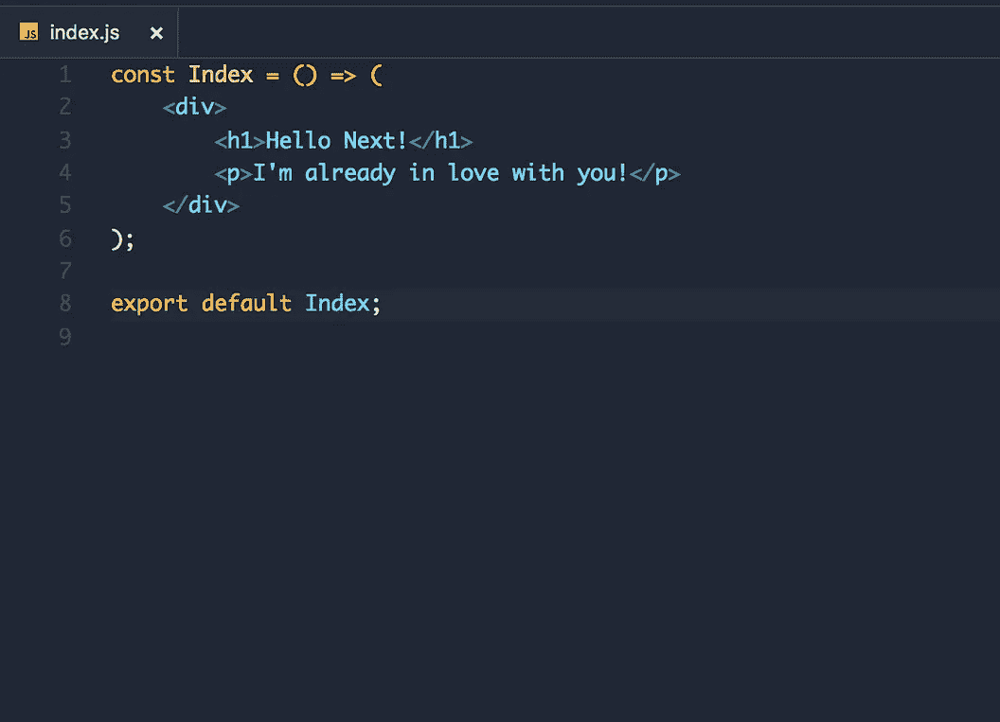
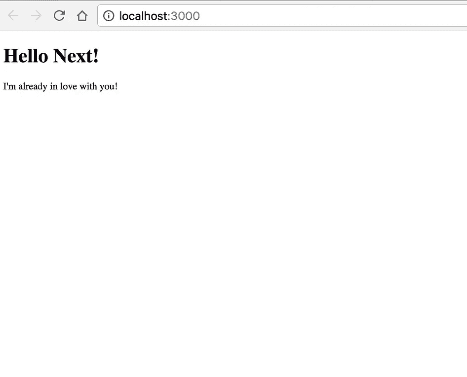
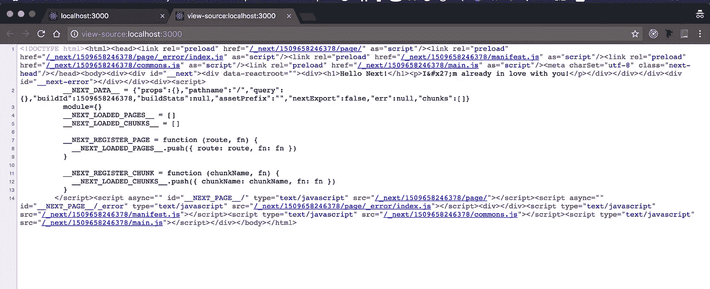

# Next.js — React 服务器端渲染完成正确

> 原文：<https://betterprogramming.pub/next-js-react-server-side-rendering-done-right-f9700078a3b6>

## 我们正式进入了服务器端渲染 react 应用的时代


Pathum Danthanarayana 在 [Unsplash](https://unsplash.com/search/photos/apps?utm_source=unsplash&utm_medium=referral&utm_content=creditCopyText) 上拍摄的照片

> js 是一个用于服务器渲染的 React 应用程序的极简框架。

# 背景

[*next . js 2016 年 10 月 25 日被开源*](http://bit.ly/2icjPnC) *。Next 后面的公司叫*[*ZEIT*](https://github.com/zeit)*。*

[***next . js***](https://github.com/zeit/next.js/)***有一个组织做后盾，这个组织很稳定，在开源界也很活跃。Next 不会在几个月内消失，很可能会一直存在。***


所以，我们正式进入了服务器端渲染 react 应用的时代。这引发了很多问题，比如:

*   我为什么要关心？我已经知道如何制作高质量的 React 应用程序。

问得好。答案是，我们应该始终对新概念和学习新事物保持开放的态度。记住，做一名开发者意味着终身做一名学生。Next 可以改善你作为开发者的生活。

如果每次新技术出现时我们都问“我为什么要关心”，我们将会被 90 年代的开发工具所困。

当 jQuery 问世时——由于其易用性而成为一场革命——你可能会问“为什么要在乎呢？”继续使用普通的 Javascript。但是必须承认，它改进了几乎每一个代码库，让我们所有人的生活稍微轻松了一点。

最终，创新将会胜出——为什么不做一个早期采用者呢？

# **接下来如何改善你的生活**

*   **易用性**。忘记设置 webpack，react 路由器，react 和 react-dom。这一切都包括在开箱即用！
*   **开箱代码拆分**。
*   **首页加载的性能**。
*   改进的 **SEO** 。
*   Javascript 无所不包！(这个我们都听过，咳咳 MongoDB 和流星)。Meteor 是伟大的——我甚至有一个关于 Meteor 和 MongoDB 的生产项目，但接下来是下一个(双关语)进化步骤。Next 做对了很多事情(最重要的是——它的简单性)。

[好奇好处？这里有一篇全面深入的文章解释了细节。](https://www.codementor.io/tgreco/5-of-the-many-things-to-love-about-zeit-s-next-js-bpszu99g1)


# **客户端渲染和服务器端渲染有什么区别？**

**客户端渲染。**通常在使用 React 时，你的浏览器会下载一个极小的 HTML 页面，内容由 JavaScript 填充。

使用**服务器端呈现**，在服务器上生成*初始内容，因此您的浏览器可以下载已经有 HTML 内容的页面。对内容的更新仍然在浏览器中处理。*

## 服务器端呈现的缺点

*   服务器端渲染在许多情况下可以提高性能，但在其他情况下会降低性能。
*   SSR 对您的服务器来说是更多的工作，所以您的 HTTP 响应将需要更长的时间才能返回。如果您的服务器负载过重，时间会更长。
*   您的 HTML 将会变大，下载时间也会变长。对于大多数应用程序来说，这应该可以忽略不计，但是如果您的 React 组件包含很长的列表或表格，这可能会成为一个因素。SSR 通常会提高应用程序的性能，但并不总是如此。
*   使用 SSR 将增加应用程序的复杂性，这意味着在其他特性和改进上花费的时间更少。

# **服务器端渲染什么时候好？**

*   你需要在谷歌、DuckDuckGo、必应、雅虎或百度上搜索引擎优化。
*   您已经有了一个工作的 React 应用程序，需要尽可能好的性能，并且愿意为额外的服务器资源付费。

# **服务器端渲染什么时候不好？**

*   你的 React 应用还没有完成:先让它工作起来。这不适用于 Next——从头开始编写一个 Next 应用程序完全没问题！
*   Google 上的 SEO 已经足够好了。确保谷歌正在抓取你的内容。)
*   服务器资源稀缺，可能是因为预算低或无法扩展。

# 服务器端渲染的替代方案是什么？

1.  **照常渲染客户端。**依靠 Googlebot 的 JavaScript 抓取功能进行 SEO，并专注于应用程序的其他领域进行性能改进。你的搜索引擎优化将在百度、必应和雅虎上遭受损失。
2.  prerender 是一项服务，它将存储页面的缓存版本。这有助于 SEO 和性能，同时保持代码简单。我没有亲自尝试过这项服务，所以我不能保证它的质量。你可能会发现这个极简的预渲染指南很有用！

一篇非常[有用的文章，关于服务器端的好处以及何时使用，何时不使用！](https://www.andrewhfarmer.com/server-side-render/)

# 准备好给 Next 和服务器端渲染一个机会了吗？一堆人已经有了！



# 开始使用 Next

我们像任何其他节点项目一样开始 Next.js 项目。您需要做的就是将 Next 作为 npm 模块安装。将这个命令 TK 粘贴到终端中。

```
npm install --save next react react-dom
```

成功启动我们的节点项目后，安装 **react** 、 **react-dom** 和**接下来—** 用您的文本编辑器/IDE **打开项目。**添加下一个脚本(见第 7 行)



# 惊讶吧——运行`dev`脚本！



就是这样！我们成功安装了 Next。看到开始有多简单了吗？

我们有 React、webpack、热模块加载、路由、服务器端渲染、预取，以及许多开箱即用、设置起来更麻烦的功能！

好吧，你可能会问为什么 Next 会给我们显示一个 *404* 页面？

嗯，那是因为我们还没有做页面！

让我们在`pages/index.js`中创建第一个组件。



注意我们为什么不需要导入 React 以及 Next 是如何选择路由的？尝试添加另一段——我们也有热模块重装！

***漂亮。***

如果您查看我们应用程序的源代码，您应该会看到以下内容:



这是下一步发挥它的魔力。我们的 React 应用程序是服务器端渲染的。

酷！这更像是对**什么是服务器端渲染、它为什么有用、**和**如何开始下一步的介绍。**

浏览这个伟大的下一个教程，释放它所有强大的功能。

如果你想让你的 JavaScript 能力更上一层楼，我推荐阅读“ [*你不知道的 JS*](https://amzn.to/2LSDpG6?source=post_page---------------------------) ”系列丛书。

感谢你的阅读，我希望你和我一样学到了很多！❤