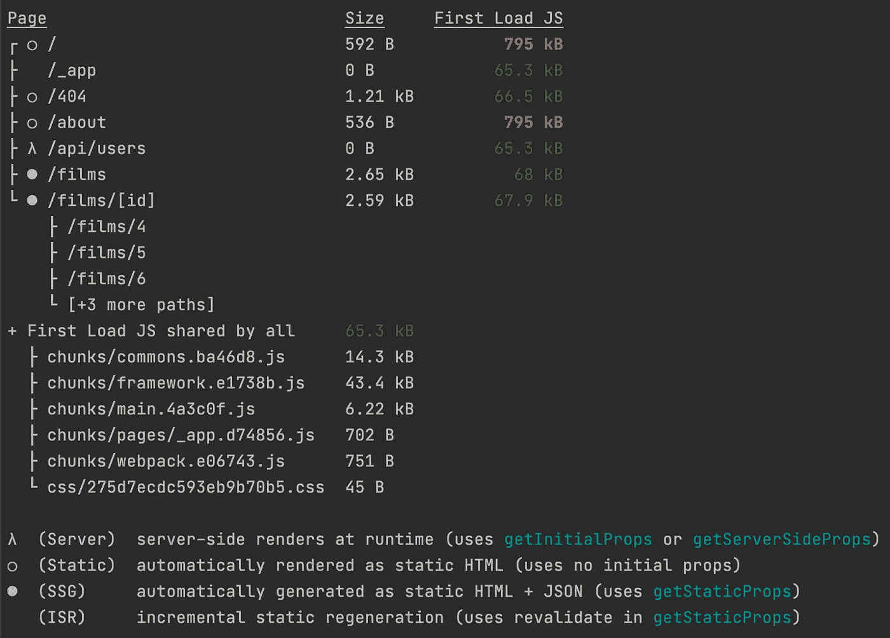
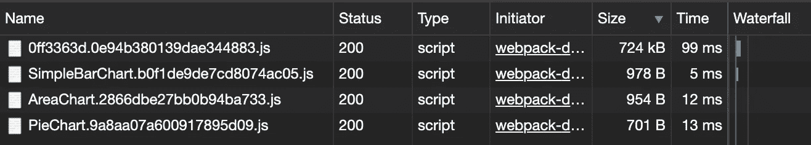
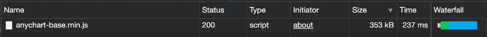

# Next.js:使用第三方库时减小包的大小

> 原文：<https://betterprogramming.pub/next-js-reducing-bundle-size-when-using-third-party-libraries-db5407252d59>

## 如何使用 Next.js 改进包大小的示例


照片由[迪昂布莱克](https://unsplash.com/@deonblack?utm_source=unsplash&utm_medium=referral&utm_content=creditCopyText)在 [Unsplash](https://unsplash.com/?utm_source=unsplash&utm_medium=referral&utm_content=creditCopyText) 拍摄

我在一家名为 [Parallax](https://www.getparallax.com/) 的初创公司工作，我们正在用 Next.js 构建一个资源规划和项目会计应用程序。我最近注意到，在终端中运行`next build`命令后，一些页面会有一个很大的“First Load JS”。

本文概述的方法可以用于任何第三方库，以减小 Next.js 包的文件大小。我将使用 [AnyChart](https://www.anychart.com/) 库作为例子——更具体地说，是 [AnyChart-React](https://github.com/AnyChart/AnyChart-React) 库。

下面你会注意到在“第一次加载 JS”栏中的`index`和`about`页面是 795 kB。在我给这些页面添加任何图表之前，它们都是 70.8 kB。



Next.js 构建输出

根据[文档](https://nextjs.org/docs/api-reference/cli#build)，“第一批货物涂上绿色、黄色或红色。以高性能应用的绿色为目标。”文件还提到了“尺寸”和“第一次加载 JS”栏的含义:

> “大小—导航到页面客户端时下载的资产数量。每个路由的大小仅包括其依赖关系。
> 
> 第一次加载 JS —从服务器访问页面时下载的资产数量。所有人共享的 JS 数量显示为一个单独的指标。"

为了减小包的大小，我们可以做的第一件事是在 Next.js 中使用[动态导入](https://nextjs.org/docs/advanced-features/dynamic-import)，为此，我们为我们希望在应用程序中使用的每种图表类型创建一个组件。基本上，我们是在 AnyChart 图表周围创建一个包装器。当我们需要为自己的图表组件创建动态导入时，这样做很有帮助。此外，如果我们想要更改到不同的图表库，我们只需更新那些图表组件。

下面是一个名为`SimpleBarChart`的图表示例。为了让它变得动态，我们可以使用 ES2020 `dynamic import()`。看看下面这个名为`SimpleBarChartDynamic`的例子，看看如何设置它:

现在，我们不再直接使用图表组件，而是简单地使用动态组件:

```
// Before - Using the component directly
<**SimpleBarChart** title="Bar Chart" chartId="barId" />// After - Using the dynamic component
<**SimpleBarChartDynamic** title="Bar Chart" chartId="barId" />
```

从下面的信息中，您可能会注意到我为一个小于 1 kB 的`SimpleBarChart`、`AreaChart`和`PieChart`创建了一个动态导入。另一个 724 kB 的文件是由 Next.js 创建的 AnyChart 库块。通过这样做，我们优化了 Next.js 的初始 JavaScript 加载，现在网站将首先加载页面上的所有初始组件，然后延迟加载不太重要的组件。



AnyChart 块(724 kB)带其他图表(< 1kB) loaded

Also, Next.js allows you to build static and server-side apps. There is a chance you might get an error ( 【 ) if the third-party library requires the 【 object. Using the approach above will solve that issue because we used 【 . This way, we can ensure that the third-party library only runs inside the context of the browser and not in the Node.js server.

We can take it one step further by not bundling in the npm package version but instead using the CDN version of the library. Looking at the AnyChart chunk above, it loads in at 724 kB when bundled into Next.js, but the CDN version loads in at 353 kB (which will save us 371 kB).



AnyChart CDN version loaded (353 kB)

If we use the CDN version, we still need Next.js to use the npm package version to build properly. But during the build process, we need to have AnyChart ignored and not be bundled into the app. To accomplish this, we need to use the 【 file and the [webpack Externals](https://webpack.js.org/configuration/externals/) 选项)。

> "外部配置选项提供了一种从输出包中排除依赖性的方法."— [webpack 文档](https://webpack.js.org/configuration/externals/)

在 Next.js 中，我们可以创建一个`next.config.js`文件来为我们做额外的事情。下面，你可以看到我们可以访问 webpack 和`config`对象。我们将通过扩展当前的外部函数来更新外部函数，然后添加我们的自定义函数，这样我们就可以在运行`next build`时将`anychart`库从捆绑到我们的应用程序中排除:

此时，AnyChart 库不再在我们的 Next.js 应用中，我们需要添加 CDN 版本。让我们创建一个`AnyChartScript`组件，根据我们如何/在哪里使用它，如果需要的话，我们只需要更新一个文件来改变版本:

现在有两个地方我们可以添加这个。我们可以添加`AnyChartScript`的第一个地方是 Next.js [自定义文档](https://nextjs.org/docs/advanced-features/custom-document)的`Head`。这将在应用程序加载时加载库:

Next.js 自定义文档

另一个选择是只在有图表的页面上加载库。下面举个`AboutRoute`的例子。我们可以将`AnyChartScript`添加到 [Next.js](https://nextjs.org/docs/api-reference/next/head) `[Head](https://nextjs.org/docs/api-reference/next/head)` [内置组件](https://nextjs.org/docs/api-reference/next/head)中，这样`AboutPage`组件中的图表就可以正常工作了。这种方法是最灵活的，允许您在需要时加载库:

“关于”页面的 Next.js 路径

# 用 AnyChart 和 AnyChart-React 键入脚本

由于 [AnyChart-React](https://github.com/AnyChart/AnyChart-React) 库没有 [TypeScript 声明文件](https://www.typescriptlang.org/docs/handbook/declaration-files/introduction.html)，您可以创建一个`anychart-react.d.ts`文件并添加以下内容以使 TypeScript 忽略该库:

```
declare module 'anychart-react';
```

对于 [AnyChart](https://www.anychart.com/) 库本身，您需要做的就是将下面的`import`添加到您的文件中:

```
import 'anychart';
```

# 结论

在我的[Next.js/AnyChart 分部](https://github.com/codeBelt/my-next.js-starter/tree/anychart)或[示例网站](https://my-next-js-starter-l88xn44qz.vercel.app/)上查看示例代码，看看它是如何运行的。另外，如果你觉得这篇文章有用，请告诉我。

如果你喜欢这篇文章，请分享它，关注我，阅读我的其他[文章](https://medium.com/@robertsavian)和/或用我下面的推荐链接注册 Medium。谢谢！

[](https://medium.com/@robertsavian/membership) [## 通过我的推荐链接加入 Medium—Robert S(代码带)

### 作为一个媒体会员，你的会员费的一部分会给你阅读的作家，你可以完全接触到每一个故事…

medium.com](https://medium.com/@robertsavian/membership)