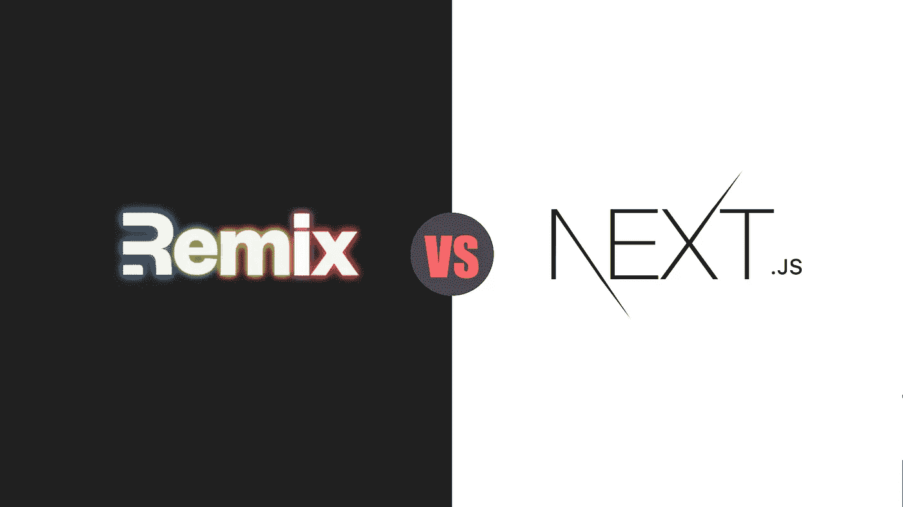
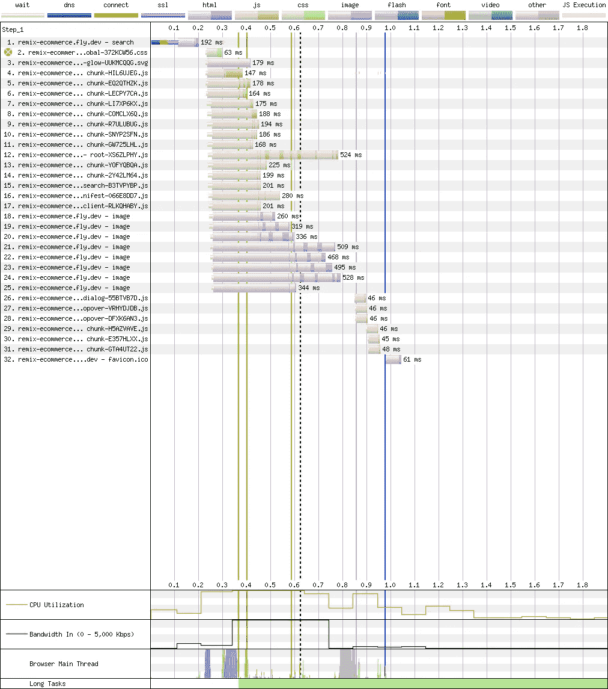

# Next.js vs. Remix:分析关键方面和差异

> 原文：<https://betterprogramming.pub/next-js-vs-remix-analyzing-key-aspects-and-differences-8674beaba695>

## 通过比较 Remix 和 Next.js 的最新版本，知道哪一个适合你



作者图片

React 基于网络的生态系统看起来一天比一天好。2021 年底，Next.js 推出了它的 great 12 版本。它包含了许多功能和优化。然而，过了一会儿，我们看到了 Remix 是如何推出其最新版本的。Remix 团队改变了策略，决定免费开源。

那么 2022 年开始一个项目的时候，我们应该挑哪一个呢？这是一个很难做出的选择，并且对您的 web 应用程序有很大的影响。每个框架都有自己的观点，并将决定你如何思考和构建你的组件。

在这篇文章中，我们将分析什么是每一个的关键方面，最后，你将能够决定这些是否适合你。有些方面可能是交易的破坏者或决定性因素。这完全取决于您的使用案例和个人偏好。

在这个选择的悖论中，只要知道这两个都是很好的框架，并且它们中的任何一个都不会出错，就可以放心了。

# 建筑和哲学

Next.js 框架构建在 NodeJs 之上。它与 React 生态系统紧密相连，几乎是 React 生态系统的延伸。它试图尽早接受它的最新功能。Vercel 团队与 React 团队紧密合作，以实现这一目标。它们主要提供构建在 React 组件之上的抽象，比如:`next/dynamic`、`next/head`、`next/link`、…

他们的最新版本已经支持:

*   **React 服务器端组件**:无状态组件，呈现在服务器上，流式传输到客户端。
*   **HTML 服务器端流**:逐步将 HTML 传送到浏览器。

您可以在配置文件中启用这两种功能:

```
*// next.config.js*
module.exports = {
  experimental: {
    **concurrentFeatures**:true**,
    serverComponents**:true**,**
  },
}
```

混音版的方法明显不同。他们更加脱离 React 生态系统，更热衷于等待稳定的 React 特性。它建立在`Web Fetch Api`(而不是节点)之上，这使得应用程序可以在任何地方运行。它关注于尽可能多地利用服务器。这有两个好处:加载数据时更快的带宽和提供渐进增强体验的能力。

另一个显著的不同是，Remix 试图尽可能多地依赖浏览器的原生 Web 标准功能。那是什么意思？即使禁用了 JavaScript，他们的页面也能 100%正常运行。当 JavaScript 可用时，整个体验得到了增强。

他们的内置表单功能就是一个明显的例子。他们依赖于基本的`Form`浏览器功能。表单动作总是在服务器上发布和执行。这是验证/重定向/数据库逻辑发生的地方。

当 JavaScript 可用时，一个`xhr`请求将会发生，否则，一个传统的`HTTP Post`将会出现。

我们唯一需要做的就是在根页面中导出一个`action`函数，并使用它们内置的表单 API 抽象。

# **数据加载**

## Next.js

在 Next.js 中，您可以精确地配置如何从 web 应用程序加载数据。您可以选择在运行时或构建时只在服务器和客户端加载数据。

Next.js 加载 API 的摘要:

*   运行时服务器端+客户端:`getInitialProps`。
*   仅在构建时服务器端:`getStaticProps`。
*   仅在运行时的服务器端`getServerSideProps`或`React Server Components`。
*   客户端

为什么有这么多种方法？这使得开发者处于主动地位。Next.js 框架的主要目标是 SEO，并声称在服务器上加载所有内容可能会损害应用程序的性能。

这个框架包括了流行的特性静态的。它有一些进一步的改进。如果您需要那些 SSG 页面定期更新，您可以在`getStaticProps`方法中使用`stale-while-revalidate`策略。这将创造出一个具有增量的静态的网。你需要一个支持这个功能的 CDN。

ISR 的实际例子:

## 再搅拌

混音版本则完全不同。从他们的角度来看，数据应该总是首先加载到服务器端。因为它是基于`fetch API`的，我们可以通过使用 Cloud Flare Workers 之类的服务在边缘执行代码。

这是怎么回事？在每个根页面上，我们可以定义一个将在服务器中执行的命名函数`loader`，然后通过服务器和客户机中的 react hook API 获得数据。与此行为等价的 Next.js 是`getInitialProps/getServerSideProps`。在 Next.js 实现中，您可能会面临大量的道具训练。

让我们来看一个混音的例子:

这意味着页面布局可以完全在服务器中处理，并并行发送到客户机。一旦全部下载完毕，用户将不会体验到任何加载微调。唯一需要注意的是在同一台服务器上获取数据的时间代价。



remix.run 的标题

# 按指定路线发送

谈到路由，两个框架有一些相似之处。它们依赖于基于文件系统的路由系统。它正在成为 SSR 框架的标准。它使路由页面可预测，并允许一些优化。

它们支持嵌套路由和动态路由段。在 Next.js 中，路线必须放在`pages`目录中。

*   `pages/index.js` → `/`
*   `pages/blog/index.js` → `/blog`
*   `pages/blog/first-post.js` → `/blog/first-post`
*   `pages/[username]/settings.js` → `/:username/settings` ( `/foo/settings`)

在 Remix 中，这些需要放在`app/routes`目录中:

*   `app/routes/blog.js` → `/blog`
*   `app/routes/blog/first-post.js` → `/blog/first-post`
*   `app/routes/invoices/$id/activity.js` → `/invoices/123/activity`

他们的引擎不同。Remix 框架构建在 React 路由器之上，该路由器在 GitHub 中有`45k starts`。Remix 允许你创建嵌套布局。它通过使用 React 路由器 v6 的`Outlet`特性来实现。您可以以简洁的方式创建组合页面，并通过缓存和数据加载节省时间。

您可以选择退出嵌套布局 URL 行为。怎么会？只是通过使用`.`符号而不是创建文件夹。它会将每个`.`与 URL 中的一个`/`进行交换。非嵌套布局是 Next.js 呈现其路线的方式。

```
// **nested layout:** it will render blog.js + new.js
app/routes/blog/new.js → /blog/new// **unnested layout:** will just render blog.new.js
app/routes/blog.new.js → /blog/new
```

在我看来，Remix 在这方面占了上风，Next.js 必须迎头赶上。

# 附加功能

Next.js 提供了大量的特性。他们最近推出了`Next.js Live`。它支持实时协作，这可能会极大地提高团队的生产力。

他们还推出了中间件功能。它使开发人员能够根据配置编写代码。它将 JavaScript 带到了边缘，离用户更近，从而使页面更快。它结合了缓存的优点和动态执行的能力。中间件逻辑可以通过页面解耦功能(如来自组件的授权)来确定范围。

Next.js 框架支持将任何 React 页面转换成 AMP 页面。如果你想创建一个新闻网页，这是很有用的。

# 包裹

我们已经看到了 Next.js 和 Remix 的对比。它们都有令人惊叹的特性，提供了出色的体验，并且有一个很棒的社区。他们都以闪电般的 Rust 和 Go 编译器提供了出色的开发体验。

但是…在做出任何决定之前，请注意 Next.js 附带了一定级别的供应商锁定。要运行它的最大峰值和所有特性，您需要使用 Vercel 平台。在另一个供应商那里释放其全部潜力可能太费时间了。

有些情况下选择 Next.js 是显而易见的:当你有静态站点或者需要使用 AMP。当你需要一个没有 JavaScript 的响应网站时，你应该使用 Remix。

除此之外，就涉及到个人喜好了。目前，我倾向于混音，因为我喜欢它的简单和路由。然而，在未来，我们将能够使用像 React 服务器组件这样的功能。

感谢阅读。如果你喜欢你所读的，也可以看看这些相关的文章:

[](/6-killer-features-from-remix-3d7e01b0789e) [## 混音版的 6 个黑仔特色

### 改变游戏规则的全栈 JavaScript 框架的主要亮点

better 编程. pub](/6-killer-features-from-remix-3d7e01b0789e) [](/5-new-killer-features-of-next-js-12-dfd1d766b539) [## Next.js 12 的 5 个新黑仔功能

### 改变游戏规则的版本的主要亮点

better 编程. pub](/5-new-killer-features-of-next-js-12-dfd1d766b539)