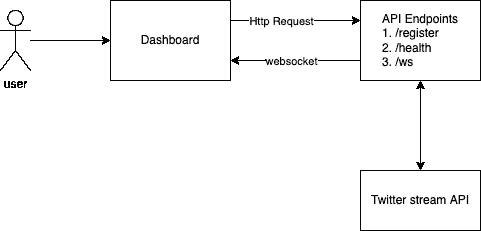
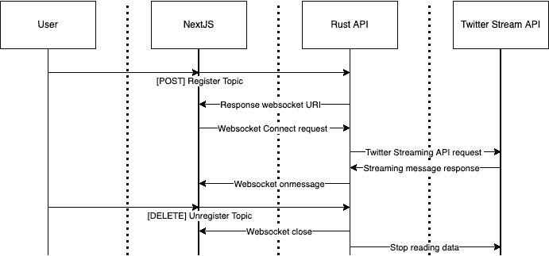
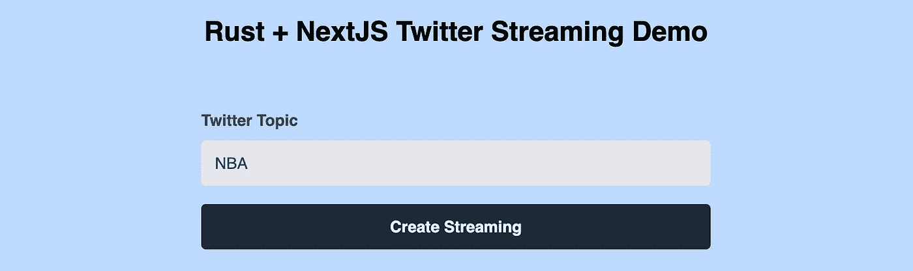
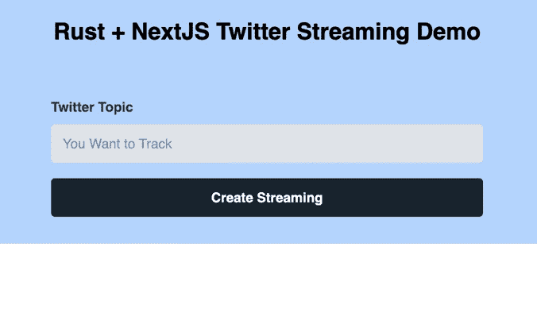

# 使用 Websocket 的 NextJS + Rust Twitter 流

> 原文：<https://betterprogramming.pub/nextjs-rust-twitter-streaming-with-websocket-708dd0f33bb6>

## 周末建设和学习

由[莫妮卡·MG](https://unsplash.com/@monaleesa?utm_source=medium&utm_medium=referral)在 [Unsplash](https://unsplash.com?utm_source=medium&utm_medium=referral) 拍摄的照片

上一次，我们用 Rust 构建了一个速度限制管道，并讨论了基于用例的性能调优。

 [## 生锈时的速度限制—性能至关重要

### 这个周末让我们用 Rust 重建速度极限。

better 编程. pub](/velocity-limit-with-rust-performance-matters-9345763ec2d6) 

> 对于这个长周末，让我们构建一个仪表板组件，允许用户提交他们希望用 Twitter 流跟踪的特定主题。

让我们看看整体逻辑架构图。

逻辑流程-文件示例-按作者

如我们所见，我们需要构建两个主要组件:

1.  `Dashboard`，我们将在 ReactJS 之上使用 NextJS 框架。
2.  对于服务层，我们将使用 Rust。
3.  客户机和服务器之间的通信将是 HTTP RESTful POST 和 DELETE，消息将使用 WebSocket。

从演示和简单的角度来看，我将使用一个简单的 hashmap，而不是 DB 级别的实现。然而，这可以很容易地扩展到更复杂的用例，我将把它留给您的创造力和想象力。:)

# API 服务层构建

基于逻辑流程图，让我们将其分解为序列图，以了解我们需要构建什么 API 端点。

序列图—按作者

最终，有两个主要的功能端点:

1.  注册端点以处理流的主题注册，并断开与流的连接[POST，DELETE]。
2.  Websocket 端点来触发 WebSocket 服务，让前端应用程序连接，并发送 Twitter 流 API passthought 消息/数据。

## 数据模型

数据模型—按作者

## 注册端点[POST，DELETE]

1.  Register endpoint 向前端返回一个 UUID，它将用于为前端构建一个 WebSocket URI 来监听消息。
2.  注销端点有两个主要任务，关闭套接字并从运行时 hashmap 中删除用户。

注册端点—按作者

## WebSocket 端点

Warp 框架有其内置的 WebSocket 支持，一旦它连接了套接字，您就可以执行以下操作:

1.  将传入的 WebSocket 连接拆分为发送方和接收方(对于这个用例，我们只使用发送方)。

Websocket 拆分—按作者

2.将传入的 WebSocket 连接客户端保存到运行时 hashmap 中，并触发 Twitter 流功能。

插入 hashmap &触发流—按作者

3.Twitter 流媒体。TwitterStream 库跟踪传入的主题，并将其发送到 WebSocket 发送器，发送到连接的 web 前端。

流式传输和发送—按作者

截至目前，API 层已经按预期构建完成。让我们转到前端部分。

# 仪表板构建

等一下，我以为你是个后端的家伙。你现在建前端？”:)

我从一名网站管理员开始了我的 IT 生涯，一步一步地深入到前端、移动、后端和数据开发，然后是管理。

是的，当然，我构建/编码前端！几年前，我曾经开发了很多前端和移动应用程序。

前端世界变化很大，有不同的库、框架等。但是，基础仍然是 JavaScript 和标记语言 HTML。

我们将在 ReactJS 库的基础上使用 NextJS web 开发框架来完成这个仪表板构建。

> 为什么选择 NextJS？

抱歉，我不想争论 JavaScript 框架和 libs 哪个最好。

前端世界有很多，比如 AngularJS，VueJS，ReactJS 等。都是很好的框架或者库。

然而，根据您的项目/用例，您的团队结构、技能组合和需求可能会基于优点和 CONS 有不同的考虑。

*正如我常说的，没有最好的解决方案或工具。唯一最好的解决方案或工具是服务于你的项目、用例、上下文和需求的。*

我选择 NextJS 作为前端构建工具的原因如下:

1.  服务器端渲染，可以让我的页面加载得更快，因为我们只根据我们选择的主题显示即将到来的 tweet 流。
2.  它位于反应库的顶部。我在以前的工作中既有 ReactJS 又有 AngularJS 的经验，对我来说，很容易上手。
3.  API 中间件。您可以构建您的 API 中间件层来与外部 API 通信，以完成所需的集成和用例。

仪表板的用户界面如下所示:

按作者排列的用户界面布局

除了基本的 HTML 标签和渲染，让我们按照上面的顺序流程图:

1.  UI 触发 HTTP Post 请求->返回 WebSocket URI。

作者的 NextJS 注册实现

2.连接 Websocket 并监听消息。

Index.js 关于作者的消息实现

由于 NextJS 是 ReactJS 之上的一个框架，它允许我们将一个页面解构为一系列组件。

这些组件中有许多经常在页面之间重用。在这个用例中，我们有 TopicForm 和 TwitterCard 每一个都有其渲染细节和功能上下文。

TwitterCard 负责显示来自 Websocket 服务器的消息 tweets。

作者的 TwitterCard 组件

# 把它们放在一起

作者 Gif 截图

# 最后的话

我们了解到:

1.  如何用 Rust 实现 WebSocket 服务？
2.  如何使用 NextJS 连接监听 WebSocket？
3.  如何连接 Twitter 流 API，并通过通道将消息传递给 Rust WebSocket？
4.  为 NextJS UI 组件构建组件。

感谢您的阅读。