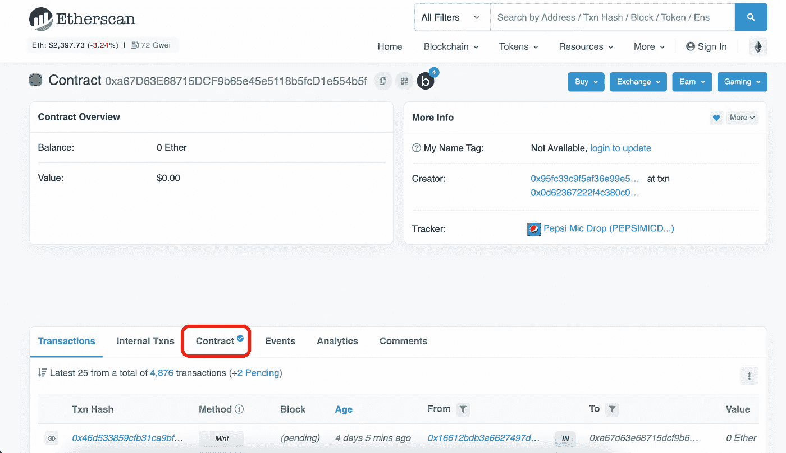

# 百事 NFT 智能合同分析

> 原文：<https://betterprogramming.pub/nft-beginner-tutorial-pepsi-nft-smart-contract-explained-962721b7361a>

## 解码智能合同 01


百事可乐的 NFT 系列

百事可乐于 2021 年 12 月放弃了它的创世纪 NFT 系列([来源](https://micdrop.pepsi.com/))，直到今天这个项目的交易量为 23000 亿瑞士法郎(560 万美元)。我仔细研究了百事 NFT 公司的合同，了解他们是如何实施这个项目的。在本教程中，我将逐行解释智能合约。

# 目标受众是谁？

如果你刚到 NFT，想学习如何自己开发一个 NFT 智能合同，这篇文章很适合你。如果你对 NFT 背后的技术是如何工作的感到好奇，这篇文章也会有所帮助。

# 先决条件

如果你了解 ERC-721 并有编码经验，你可以跳过这一节。

*   **稳健**:到目前为止，大部分 NFT 合约都使用[稳健](https://docs.soliditylang.org/en/latest/)。你不需要知道固体来理解这个概念。但是，如果您想自己实现一个 NFT 契约，一些编码经验将会非常有帮助。要学习扎实，我强烈推荐阅读[公文](https://docs.soliditylang.org/en/latest/)。
*   **ERC-721** :百事 NFT 建立在由 Open Zeppelin 实施的 ERC-721 智能合同的基础上。简而言之，ERC-721 标准提供了 NFT 的基本功能，包括转账、支票账户余额、造币等。这篇文章给出了一个很好的概述: [ERC-721 不可替代令牌标准](https://ethereum.org/en/developers/docs/standards/tokens/erc-721/)。

# 放弃

和很多人一样，我也是这个行业的新手。我试图再次检查内容的正确性，但可能会出现错误。如果你发现了什么，请告诉我，我将非常感谢你的帮助和更新本教程。

# 智能合约在哪里？

许多项目会将他们的合同开源，人们可以在做出任何(投资)决定之前接受教育。透明也是我在区块链行业最喜欢的特性之一。

百事可乐在官方网站上公布了其 NFT 合同地址。你可以简单地复制那个地址，然后在[以太扫描](https://etherscan.io/)中搜索，这是查看以太坊区块链信息的必去之地。然后，您将看到以下页面:



图 1 以太扫描合同页面截图

点击`Contract`按钮，您将看到 14 个文件。但是，我们只需要第一个文件，`PepsiMicDrop.sol`。这份文件包含百事 NFT 合同。其余的是 ERC-721 合同的开放齐柏林，我们不会涵盖。

为了方便你，我把代码放在 GitHub 上，你可以在这里找到[。我推荐你和这篇文章并排开放代码。](https://gist.github.com/sicongzhao/81886ca422e46bffe4e668100c42b945)

# 合同中的 NFT

在深入研究代码之前，让我们首先了解智能契约是如何定义 NFT 的。在引擎盖下，一辆 NFT 有两条信息: **(1) Id (2) URI** 。

根据 ERC-721 标准，每个 NFT 都是唯一的。怎么会？该契约为每个 NFT 分配一个唯一的 Id，从而实现了唯一性。在基于 ERC-721 的合同中，你不会发现两个不同的具有相同 Id 的 NFT。

那么，图像在哪里(也可以是视频、文档等)？这就是 URI 发挥作用的地方。URI 代表统一资源标识符。可以把它想象成一个 URL，通过它可以获得与 NFT 相关的所有元数据。元数据可以是图像 URL、描述、属性等。当前最流行的 NFT 市场 OpenSea 有它的[元数据标准](https://docs.opensea.io/docs/metadata-standards)。您可以找到完整的元数据列表。

现在，你可能会问:**URI 和 Id 能确保 NFT 的独特性吗？**

理想情况下，基于 ERC-721 的 NFT 将有其独特的图像或元数据，这就是它们不可替代的原因。但是，您可以将同一个 URI 分配给不同的 Id，从而创建两个表面上看起来相同的 NFT。然而，这不是 ERC-721 的目的。还有另一个标准，ERC-1155，它支持半可替换的 NFT。你可以在这里了解更多[。](https://eips.ethereum.org/EIPS/eip-1155)

此外，您可能会想:**为什么元数据不存储在契约中？**因为在区块链上存储数据非常昂贵，尤其是图像或视频。但是，您仍然可以在链上存储元数据，并支付高昂的电费。一些项目使用 SVG 格式的图像，这大大减少了数据量，从而减少了燃气费。然而，这超出了本教程的范围。如果您想了解更多关于基于 SVG 的 NFT，请告诉我。

# 合同结构

这份合同乍看起来可能很复杂，但它组织得很好。图 2 显示了这个契约的结构。让我们看一下每个组件。


图 2 百事 NFT 合同的结构

*   **SPDX 许可证标识符**是注释后的第一行。它指明了其他人如何使用此代码。(第 48 行)
*   **Solidity 版本**让编译器正确翻译代码，然后 EVM 可以理解。(第 49 行)
*   **导入 ERC-721 合同**然后百事 NFT 合同将使用 ERC-721 合同作为其蓝图。
*   PepsiMicDrop 是我们将在下一节进一步讨论的 NFT 合同。它有三个子部分: **(1)状态变量(2)构造器(3)函数**。
*   **状态变量**是其值永久存储在合同存储器中的变量。
*   **构造函数**是一个特殊函数，仅在创建合同时执行。您可以运行合同初始化代码。
*   **功能**不言自明。大多数函数用于设置或获取状态值。

# 百事可乐滴合同

让我们看看合同。我将通过它的功能来解释契约，每个功能都与一些函数和状态变量相关。

## **(1)施工员**

构造函数接受两个输入:

*   “百事麦克风下降”是 NFT 的令牌名称
*   “百事可乐”是象征符号。

该赋值发生在 ERC721 契约代码中，契约在第 51 行导入该代码。这就是为什么你找不到任何与这个构造函数体相关的东西。这是继承的美妙之处，我们不需要重做。

在构造函数内部，我们可以看到两个状态变量获得了新值，`reserveMicDropsId`和`micDropsId`。为什么需要它们？在这次 NFT 投放中，百事可乐保留了前 50 个 NFT，所以公开的 NFT 从 id 51 开始。

等等，NFT 不是一个形象吗？为什么这里他们用数字来表示 NFT？如果你有这些问题，我和你在一起。为了理解这一点，我们需要了解什么是 NFT。

## **(2)薄荷**

现在我们来谈谈薄荷。

**第 1 部分— Merkle 校样**

mint 函数有两个输入，proof 和 leaf。它们用于第 3 行到第 7 行的 Merkle 校样。本质上，它检查用户是否有资格铸造 NFT。有一个概念叫做**白名单。有时你必须进入这个白名单，以便以后能够创建非功能性过滤。这部分我就不解释了，因为有人做的很棒。请看[这篇文章](https://medium.com/@ItsCuzzo/using-merkle-trees-for-nft-whitelists-523b58ada3f9)，对 Merkle 证明进行了全面的讲解。**

**第 2 部分—先决条件**

下一部分，第 8 到 11 行，定义了 mint 的 4 个先决条件。让我们逐一查看。

(1)在 NFT 开始出售之前，状态变量`saleStarted`被设置为假。所以它不会通过 8 号检测线。当销售开始时，合同所有者可以调用函数`startSale()`来更改`saleStarted`的值。

```
require(saleStarted == true, "The sale is paused");
```

(2)该检查确保用户地址不是 0x0。0x0 是以太坊起源地址，没有用户会用。我也不确定为什么这个检查是必要的。如果你明白了，请告诉我。

```
require(msg.sender != address(0x0), "Public address is not correct");
```

(3)在百事顺风车上，每个地址只能铸造一个 NFT。`alreadyMinted` 是映射类型中的一个状态变量，就像一个字典，它跟踪所有生成 NFT 的地址。

```
require(alreadyMinted[msg.sender] == false, "Address already used");
```

(4)供应量有限，最多 1983 年。这将检查是否所有的 NFT 都已被声明。`micDropsId`是我们上面讨论的唯一令牌 id。

```
require(micDropsId <= maxMint, "Mint limit reached");
```

很简单，对吧？我们差不多完成了，挂在那里。

**第 3 部分——实际造币厂。**

这是造币厂实际发生的地方。好消息是我们不需要实现它，因为 ERC-721 已经这样做了。

```
_safeMint(msg.sender, micDropsId++);
```

对于 mint，我们用用户的钱包地址和唯一的令牌 id 调用函数`_safemint()`，就这样。在底层，有一个状态变量(像字典一样)跟踪每个令牌的所有权。通过调用`_safemint()` 函数，我们更新这个状态变量，分配或改变相应令牌的所有权。

这里需要注意的是，状态变量`micDropId`代表令牌 id，它在每次造币后递增 1。

**第 4 部分—更新铸造地址**

如第 2 部分所述，每个地址只能铸造一个 NFT。

```
alreadyMinted[msg.sender] = true;
```

这条线确保任何成功铸造 NFT 的人都会被记录下来。

**第五部分——返回**

在铸造之后，令牌 id 被返回到前端。

## (3)更新 URI

我们需要讨论的最后一部分是更新 URI 的函数。

众所周知，每个 NFT 都有自己的 URI。这是用来改变基础 URI 的函数。

URI 是 NFT 各 URI 之间的共同部分。默认情况下，URI 为`baseURI/tokenId`。我们之所以设置 baseURI，是因为这样可以节省油费。想象一下，如果你为每个极其昂贵的 NFT 设置 URI。

您可以通过覆盖 ERC-721 合同中定义的功能`**tokenURI**` 来更改如何组合`baseURI`和`tokenId`。例如，如果 URI 就是这样格式化的，你可以做类似`baseURI/tokenId + ‘.json’` 的事情。

你可能会好奇，什么是`**public**`****`**onlyOwner**`。这些是函数修饰符，它们定义了函数运行的条件。`public` 意为‘契约内外’，通达一切。部署完成后，我们通过网站(更确切地说是 JavaScript)与契约进行交互，这就是 public 的意思。`onlyOwner` 表示只有合同业主可以调用该功能。当然，我们只希望合同所有者能够更改令牌 URI。****

## ****(4)其他部分****

****未覆盖的部分只是获取或设置状态变量的函数，我相信你不需要我的帮助。****

# ****结束了****

****原来如此。感谢阅读这篇文章。希望对你有帮助。****

```
****Want to Connect?**Please feel free to reach out ([my LinkedIn](https://www.linkedin.com/in/zhaosicong/)) if you have any questions, feedback, or even just a random chat.**
```

## ****其他教程:****

*   ****[分析自主艺术 NFT 智能合约](https://medium.com/@luo9137/analyzing-autonomous-art-nft-smart-contract-aa4547b31eb3)****
*   ****[分析巴基斯坦的“合并”智能合同](https://medium.com/@luo9137/analyzing-paks-merge-smart-contract-7e437b66077c)****